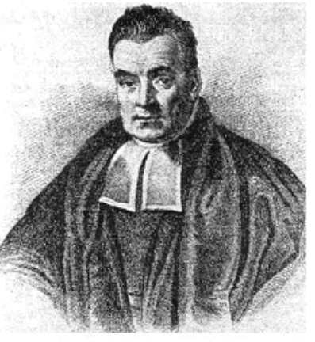
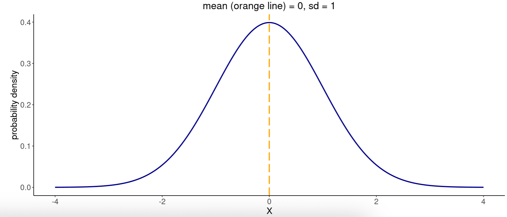
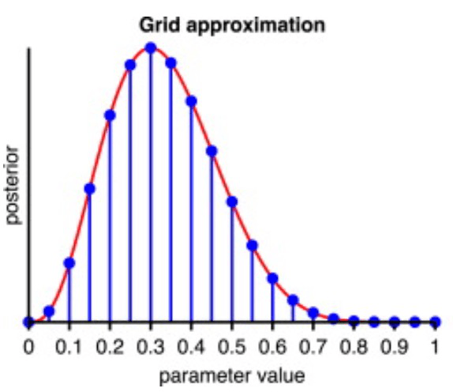
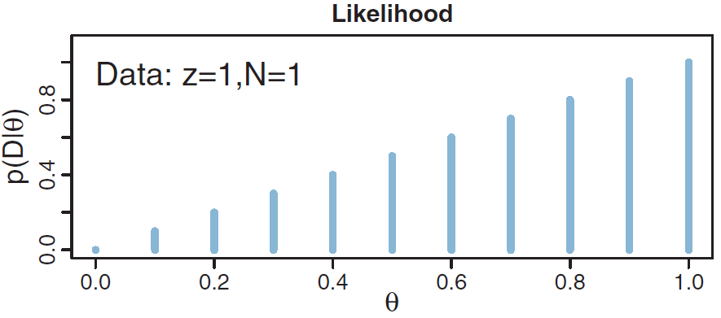
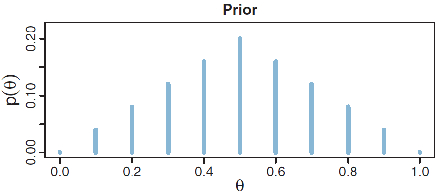
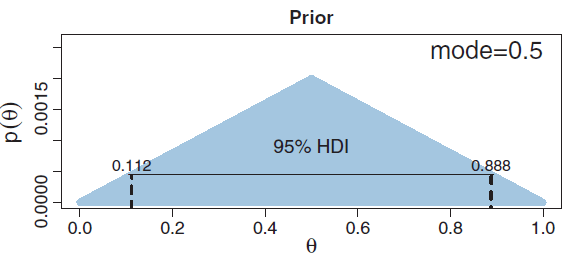
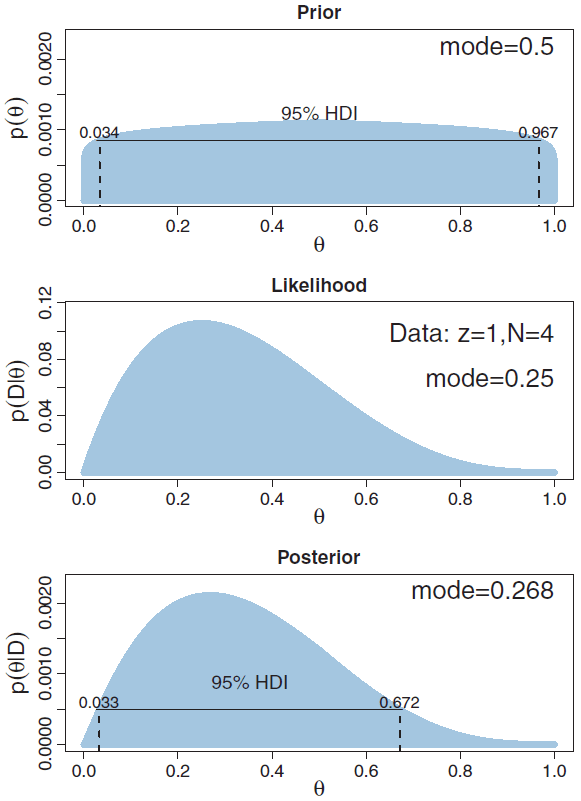
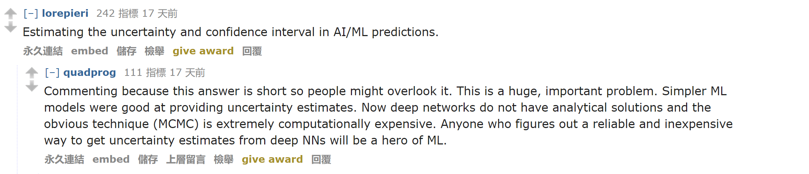
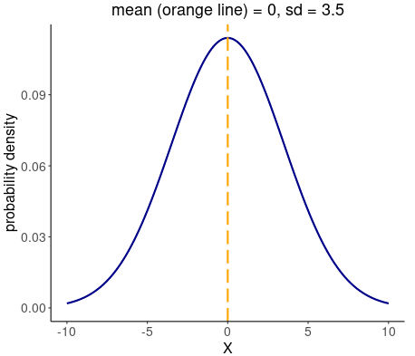

# 第3章 极大似然估计与贝叶斯估计

> [!abstract] 本章导览
> 本章对比两种参数估计范式：**极大似然估计（MLE）** 与 **贝叶斯估计**。先建立**似然函数**概念，推导 MLE（点估计）；再用贝叶斯法则得到**后验分布**，并用**网格近似（Grid Approximation）** 求解抛硬币问题；探讨**样本量**与**先验**对后验的影响；最后辨析**频率学派**与**贝叶斯学派**的根本区别，并列出贝叶斯推理的 4 种求解方法。

---

## 1. 历史与两大学派

> [!info] 统计学两大学派
> - **贝叶斯学派（Bayesian）**：源自 Thomas Bayes（1701–1761）。1763 年由好友 Richard Price 整理发表首篇用贝叶斯定理估计参数的论文；1774 年 Laplace 扩展完善。
> - **频率学派（Frequentist）**：由 Ronald Fisher（1890–1962）发展提倡，20 世纪成为主流。



> [!note] 贝叶斯为何 21 世纪才成主流？
> - 贝叶斯推理**计算困难**，早期计算机算力有限；
> - 20 世纪末 **MCMC 近似方法**被提出，且算力提升；
> - 机器学习学者发展了**变分推理（variational inference）** 近似方法。

---

## 2. 似然函数（Likelihood Function）

> [!important] 定义
> $$L(\theta)=p(D\mid\theta)$$
> 表示在参数 $\theta$ 下观测到数据 $D$ 的可能性（概率密度或概率质量）。

> [!example] 高斯例子
> 设 $p(D\mid\theta)$ 服从 $N(0,1)$，数据 $D=\{-1,0,4\}$，记 $N(0,1)$ 密度为 $g(x)$。假设数据**独立同分布（IID）**：
> $$L(\theta=(0,1))=g(-1)\times g(0)\times g(4)=1.3\times10^{-4}$$



> [!warning] 易错点
> **似然函数不是概率分布，而是参数 $\theta$ 的函数**。同一个表达式：
> - 固定 $\theta$、把数据 $y$ 当变量 → 是 $y$ 的概率分布（积分为 1）；
> - 固定数据 $y$、把 $\theta$ 当变量 → 是 $\theta$ 的**似然函数**（积分**不**为 1）。

---

## 3. 极大似然估计（Maximum Likelihood Estimation, MLE）

> [!important] 核心思想
> 选择使观测数据出现概率（似然）最大的参数值：
> $$\hat\theta=\arg\max_\theta p(D\mid\theta)$$

为便于求解，常取对数（连乘变连加，不改变极值点）：

$$\hat\theta=\arg\max_\theta \log p(D\mid\theta)=\arg\min_\theta\Big(-\sum_i \log p(x_i\mid\theta)\Big)$$

- $\log p(D\mid\theta)$ 称为**对数似然函数（Log Likelihood, $LL(\theta)$）**。
- **MLE 是一种「点估计」（point estimation）**——只给出一个 $\theta$ 值。


### 实例：抛硬币的 MLE

用 $y=1$ 表正面、$y=0$ 表反面，参数 $\theta$ 为正面偏向性，得**伯努利分布**：

$$p(y\mid\theta)=\theta^{y}(1-\theta)^{1-y}$$

抛 $N$ 次，正面 $z=\sum_i y_i$ 次，各次独立，则似然：

$$p(\{y_i\}\mid\theta)=\prod_i \theta^{y_i}(1-\theta)^{1-y_i}=\theta^{z}(1-\theta)^{N-z}$$

对数似然 $LL(\theta)=z\log\theta+(N-z)\log(1-\theta)$，求导置零：

$$LL'(\theta)=\frac{z}{\theta}-\frac{N-z}{1-\theta}=0\ \Rightarrow\ \boxed{\hat\theta=\frac{z}{N}}$$

又 $LL''(\theta)=-\dfrac{z}{\theta^2}-\dfrac{N-z}{(1-\theta)^2}<0$，确为极大值。

> [!summary] 直观结论
> 抛硬币的 MLE 就是**正面频率 $z/N$**，符合直觉。

---

## 4. 贝叶斯推理：从似然到后验

> [!note] 建模视角
> - 模型（似然）输出 $p(\text{数据}\mid\text{参数})=p(D\mid\theta)$；
> - 我们真正想要的是 $p(\text{参数}\mid\text{数据})=p(\theta\mid D)$；
> - 用贝叶斯定理转换：

$$p(\theta\mid D)=\frac{p(D\mid\theta)\,p(\theta)}{p(D)}$$

> [!important] 四要素（对 $\theta$ 而言）
> - $p(\theta)$ **先验（prior）**、$p(\theta\mid D)$ **后验（posterior）**、$p(D\mid\theta)$ **似然（likelihood）**、$p(D)$ **证据（evidence）/ 边缘似然**。
> - 注意：$\theta$ 是变量、$D$ 是给定的。「先验」「后验」中的「先/后」都是相对于**看到数据**而言。

---

## 5. 网格近似（Grid Approximation）

> [!note] 思路
> 难点在分母 $p(D)=\int p(D\mid\theta)p(\theta)\,d\theta$ 的积分。**网格近似用「求和」近似「积分」**，把连续 $\theta\in[0,1]$ 离散为有限网格点：
> $$p(\theta\mid D)\approx\frac{p(D\mid\theta)p(\theta)}{\sum_{\theta^*}p(D\mid\theta^*)p(\theta^*)}$$



### 抛硬币的网格近似流程

**① 指定先验**：取 $\theta\in\{0,0.1,\dots,1.0\}$，认为 $\theta=0.5$ 最可能，设三角形先验后**归一化** $p(\theta_i)=P(\theta_i)/\sum_i P(\theta_i)$。


**② 计算似然**：设抛 1 次得正面（$N=1,z=1$），则 $L(\theta)=\theta$。



**③ 计算后验**：先求证据 $p(D)=\sum_{\theta^*}p(D\mid\theta^*)p(\theta^*)=0.5$，再逐点算后验，例如 $p(\theta=0.5\mid D)=\dfrac{0.5\times0.2}{0.5}=0.2$。



> [!summary] 后验 = 先验与似然的折中
> 
> - 后验与先验较接近——因为**数据只有 1 次**，信息量少；
> - 似然把后验「向右半边」拉——体现了数据的影响；
> - **后验是先验与似然之间的折中**。

> [!example] 网格近似伪代码
> ```python
> def bern_grid(theta, p_theta, z, N):
>     # 遍历所有 θ，计算 θ^z (1-θ)^(N-z)
>     p_D_given_theta = likelihood(theta, z, N)
>     # 计算 p(D|θ)p(θ) 并求和，得到证据 p(D)
>     p_D = evidence(p_theta, p_D_given_theta)
>     # 计算后验 p(D|θ)p(θ) / p(D)
>     p_theta_given_D = posterior(p_D_given_theta, p_theta, p_D)
>     return p_theta_given_D
> ```

---

## 6. 样本量与先验对后验的影响

> [!note] 样本量的影响
> 把 $\theta$ 网格加密到 1000 个点对比：
> - $N=4, z=1$：数据少，后验仍较「宽」，受先验主导；
> - $N=40, z=10$：数据多，后验变「窄」并向似然（$z/N=0.25$）集中。



> [!important] 两条规律
> 1. **数据越多，后验越集中**（不确定性越小），且越向似然靠拢、先验影响越弱。
> 2. **先验越强（信息量大），对后验影响越大**；数据充足时先验影响会被「冲淡」。



---

## 7. MLE vs. 贝叶斯估计

> [!note] 核心区别
> | | 极大似然估计（MLE） | 贝叶斯估计 |
> | --- | --- | --- |
> | 输出 | 单个 $\theta$ 值（**点估计**） | $\theta$ 的**整个概率分布**（后验） |
> | 不确定性 | 无法直接体现 | 后验分布直接刻画不确定性 |
> | 是否用先验 | 否 | 是 |
> | 学派归属 | 可作频率学派的估计量 | 贝叶斯学派 |



---

## 8. 贝叶斯推理的难点与 4 种解法 ⭐

> [!warning] 难点
> 实际中 $\theta$ 通常连续，难点在于计算证据 $p(D)=\int p(D\mid\theta)p(\theta)\,d\theta$ 这个积分。

> [!important] 四种求解方法
> 1. **网格近似（grid approximation）**：将 $\theta$ 用离散值近似（本章）。
> 2. **准确数学分析**：构造合适的先验形式（共轭先验）→ [[第4章_贝叶斯推理方法-准确数学分析_笔记]]。
> 3. **MCMC 近似（Markov Chain Monte Carlo）**：采样大量 $\theta$ 值 → [[第5章_MCMC_笔记]]。
> 4. **变分近似（variational approximation）**：用 $q(\theta)$ 近似后验 $p(\theta\mid D)$，转化为优化问题。

---

## 9. 频率学派 vs. 贝叶斯学派

> [!note] 频率学派（Frequentist）
> - **概率 = 多次试验中相对频率的极限**；推理基于**重复试验**。
> - 假设每次实验的数据集采样自「真实概率分布」。
> - 用**估计量** $\hat\theta=\pi(D)$ 的**抽样分布（sampling distribution）** $p(\hat\theta=\pi(D^{(s)}))$ 表示参数不确定性。



> [!warning] 常见误区
> 很多资料把「极大似然估计 = 频率学派」**这是错误的**。MLE 只是频率学派方法的一种**近似（相当于只抽样 1 次）**，最常用的估计量。

> [!note] 贝叶斯学派（Bayesian）
> - **概率 = 对事件发生的信念程度（degree of belief）**。
> - 先假设**先验概率**，再依据数据更新。
> - 把**参数视为随机变量**，用其概率分布建模不确定性，靠贝叶斯法则求后验 $p(\theta\mid D)$。

---

## 10. 本章小结

> [!summary] 知识脉络
> - **似然函数** $L(\theta)=p(D\mid\theta)$：是 $\theta$ 的函数，非概率分布。
> - **MLE**：$\hat\theta=\arg\max_\theta p(D\mid\theta)$，点估计；抛硬币结果为 $z/N$。
> - **贝叶斯估计**：求后验 $p(\theta\mid D)\propto p(D\mid\theta)p(\theta)$，给出整个分布。
> - **网格近似**：用求和近似积分；后验是先验与似然的折中。
> - **影响规律**：数据越多后验越集中、先验影响越弱。
> - **两学派**：频率（频率极限+抽样分布）vs. 贝叶斯（信念+后验分布）。

> [!question] 自测
> 1. 为什么似然函数不是概率分布？
> 2. 推导抛硬币的 MLE，结果是什么？
> 3. 网格近似如何回避证据 $p(D)$ 的积分？
> 4. 列出贝叶斯推理的 4 种求解方法。
> 5. 为什么说「MLE = 频率学派」是错误的？

---

**相关章节**：[[第2章_概率论回顾_笔记]] · [[第4章_贝叶斯推理方法-准确数学分析_笔记]]
