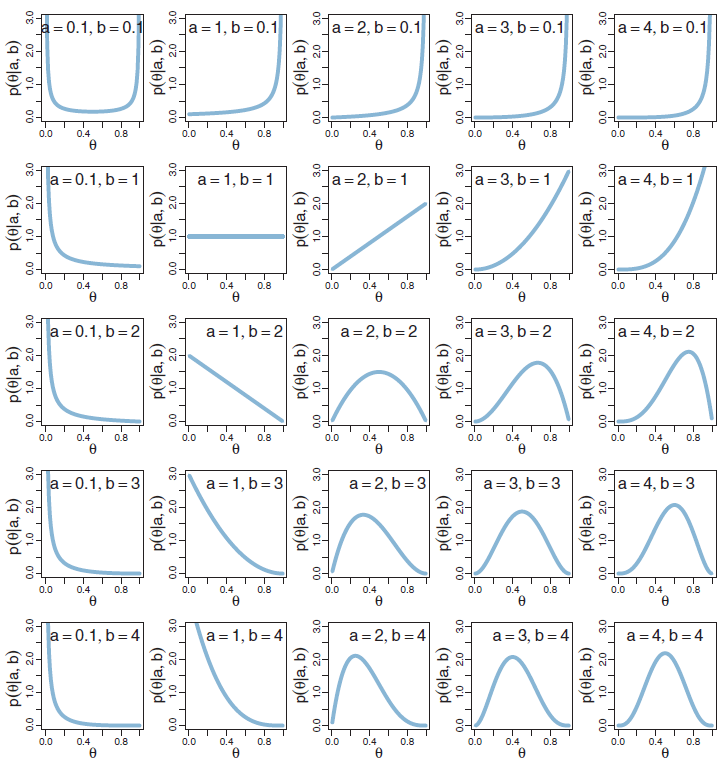
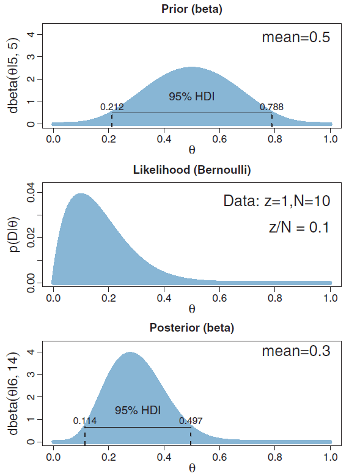
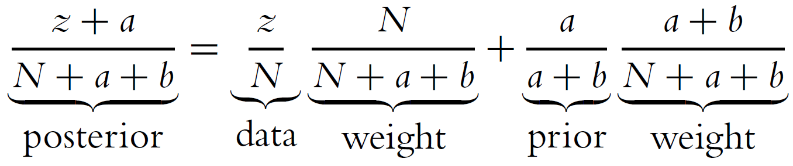
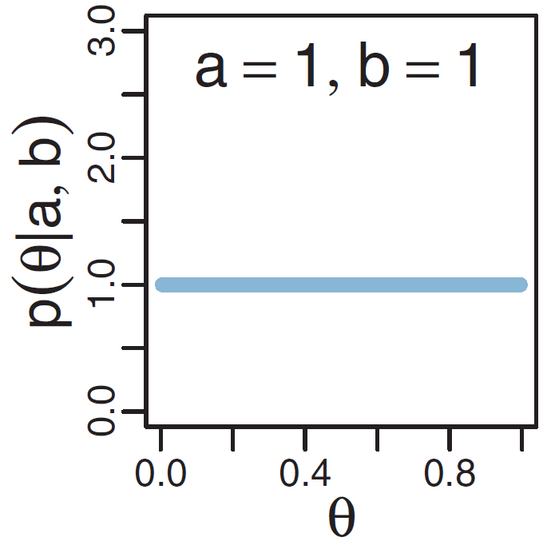
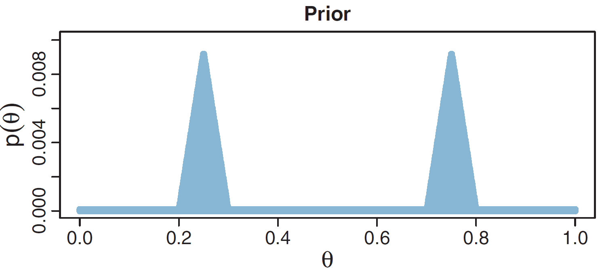
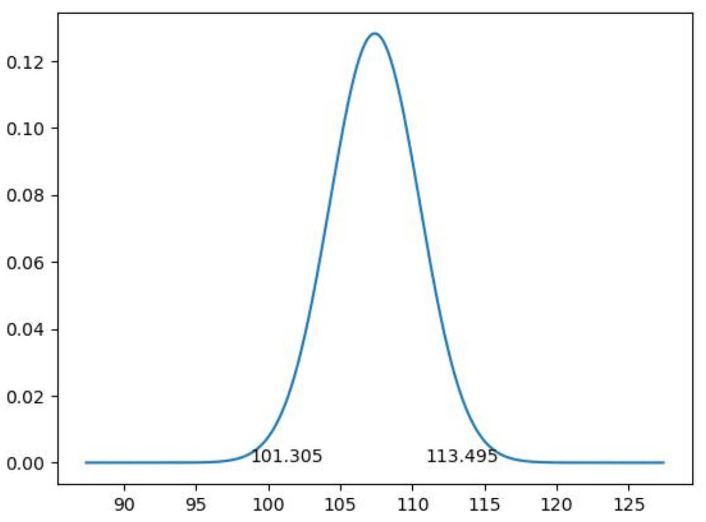
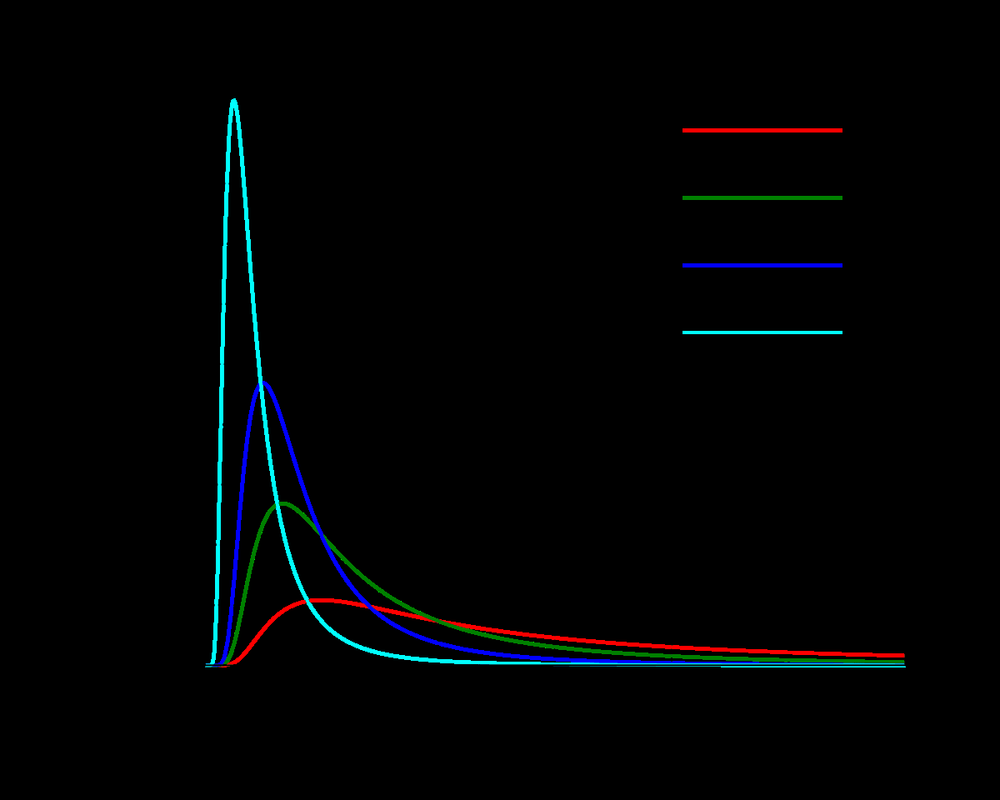

# 第4章 贝叶斯推理方法：准确数学分析

> [!abstract] 本章导览
> 上一章用**网格近似**（求和近似积分）求后验，本章追求**准确**解析地算出后验。核心武器是 **[[共轭先验]]（Conjugate Prior）**：精心选择先验形式，使后验与先验**同族**，从而免去证据 $p(D)$ 的积分。两条主线：
> 1. **伯努利似然 + Beta 先验 → Beta 后验**；
> 2. **高斯似然 + 高斯/反向 Gamma 先验 → 同族后验**。
> 并讨论 **MAP（极大后验估计）** 与 **后验预测（posterior prediction）**。

---

## 1. 网格近似 vs. 准确数学分析

$$p(\theta\mid D)=\frac{p(D\mid\theta)p(\theta)}{\int p(D\mid\theta)p(\theta)\,d\theta}\approx\frac{p(D\mid\theta)p(\theta)}{\sum_{\theta^*}p(D\mid\theta^*)p(\theta^*)}$$

- **网格近似**：用「求和」近似「积分」（[[第3章_极大似然估计与贝叶斯估计_笔记]]）。
- **准确数学分析**：想办法**解析地精确算出**后验。

> [!note] 伯努利分布 vs. 二项分布
> 抛 $N$ 次、正面 $z$ 次：
> - **伯努利（关心序列）**：$p(D\mid\theta)=\prod_i\theta^{y_i}(1-\theta)^{1-y_i}=\theta^{z}(1-\theta)^{N-z}$。
> - **二项（关心次数）**：$p(z\mid N,\theta)=\binom{N}{z}\theta^{z}(1-\theta)^{N-z}$，多了组合数系数。

---

## 2. 先验设计的三条思路

要让后验可解析，先验 $p(\theta)$ 需满足：

> [!important] 先验设计三原则
> 1. **形式与似然一致**：使先验 × 似然后仍是同族形式，便于推导（→ 共轭）。
> 2. **使证据 $p(D)$ 易求**。
> 3. **有足够表达力**表达先验知识（曲线形状多样）。

伯努利似然形如 $\theta^{z}(1-\theta)^{N-z}$，故希望先验形如 $\theta^{a}(1-\theta)^{b}$——这正是 **Beta 分布**。

---

## 3. Beta 分布（先验的最佳搭档）

> [!note] 定义
> $$p(\theta\mid a,b)=\frac{1}{B(a,b)}\theta^{a-1}(1-\theta)^{b-1},\quad \theta\in[0,1],\ a,b>0$$
> 其中 $B(a,b)$ 是 **Beta 函数**，作为归一化常数使积分为 1，**与 $\theta$ 无关**。

> [!tip] 形状参数（Shape Parameters）a, b 的直觉
> - $a$ 变大 → 主体右移（集中在 $\theta$ 大的区域）；
> - $b$ 变大 → 主体左移；
> - $a,b$ 同时变大 → 曲线变窄（更集中）。

> [!note] Beta 分布的关键量
> - **均值**：$\mu=\dfrac{a}{a+b}$
> - **众数**：$\omega=\dfrac{a-1}{a+b-2}$（要求 $a>1, b>1$）
> - **集中度（concentration）**：$\kappa=a+b$，$\kappa$ 越大越集中。
> - 反解：$a=\omega(\kappa-2)+1,\quad b=(1-\omega)(\kappa-2)+1$。

---

## 4. 求解后验：伯努利 + Beta（核心推导）⭐

似然 $p(\{y_i\}\mid\theta)=\theta^{z}(1-\theta)^{N-z}$，先验 $p(\theta)=\mathrm{beta}(\theta\mid a,b)$。

> [!important] 「正比于」简化推导
> 省去与 $\theta$ 无关的常数，只追踪 $\theta$ 项：
> $$p(\theta\mid D)\propto p(D\mid\theta)\,p(\theta)\propto\theta^{z}(1-\theta)^{N-z}\cdot\theta^{a-1}(1-\theta)^{b-1}=\theta^{(z+a)-1}(1-\theta)^{(N-z+b)-1}$$
> 对照 Beta 形式即得：
> $$\boxed{p(\theta\mid D)=\mathrm{beta}(\theta\mid z+a,\ N-z+b)}$$

确定「未归一化值」后，归一化常数可**倒推**为 $B(z+a, N-z+b)$。

> [!note] 共轭先验（Conjugate Prior）
> 当由似然 $p(y\mid\theta)$ 与先验 $p(\theta)$ 得到的后验 $p(\theta\mid y)$ **与先验同族（同形式）**时，称该先验是该似然的**共轭先验**。
> - **Beta 是伯努利/二项似然的共轭先验**。
> - 好处：无需算证据积分，后验参数「拿来即用」。

---

## 5. 后验是先验与似然的折中

> [!example] 例：beta(5,5) 先验 + 数据 z=1, N=10
> - 先验 beta(5,5)：均值=众数=0.5；
> - 似然众数=$z/N$=0.1；
> - 后验 beta(6,14)：均值=0.3，众数≈0.28——**落在 0.5 与 0.1 之间**。

后验均值 $=\dfrac{z+a}{N+a+b}$，可理解为**加权平均**：

> [!important] 「伪计数」直觉（非常重要）
> - **先验**好比「已经抛了 $a+b$ 次，其中 $a$ 次正面」；
> - **似然**是「抛了 $N$ 次，其中 $z$ 次正面」；
> - **后验**按权重组合：总权重 $N+a+b$，先验占 $a+b$，数据占 $N$。
>
> 因此：$N>(a+b)$ 时后验主要由**数据**决定；$N<(a+b)$ 时主要由**先验**决定。

---

## 6. 如何指定 Beta 先验的参数

> [!tip] 用「众数 + 集中度」设定参数（最直观）
> 1. 按你相信的概率值设**众数** $\omega$；
> 2. 按你的**确信程度**设**集中度** $\kappa=a+b$；
> 3. 计算 $a=\omega(\kappa-2)+1,\ b=(1-\omega)(\kappa-2)+1$。
> 一般取 $a\ge 1,\ b\ge 1$。

> [!example] 三个例子（Beta 能表达的先验）
> - **均匀硬币、很确定**：beta(100,100)，$\omega=0.5$、$\kappa=200$（相当于 200 次抛掷的把握）。即使数据 N=20,z=17，后验众数仍≈0.532，被强先验「拉回」0.5。
> - **篮球罚球**：先验 beta(18.25, 6.75)，$\omega=0.75$，95% HDI=[0.558, 0.892]（大部分人命中率 50%–90%）。数据 N=20,z=17（命中率 0.85）→ 后验众数 0.797，介于先验 0.75 与似然 0.85 之间。
> - **完全无知**：beta(1,1) = $[0,1]$ 上**均匀分布**，即「不确定的先验（vague & noncommittal prior）」。外星探测例子中数据 N=20,z=17 → 后验众数=0.85，与似然一致（先验不提供信息）。

> [!warning] Beta 表达力的局限
> Beta 分布**没有双峰形式**。例如「硬币来自 A 厂（均值 25%）或 B 厂（均值 75%）」需要**双峰先验**，Beta 无法表达。此时无法解析求后验，须改用**网格近似 / MCMC**。

---

## 7. 极大后验估计（Maximum a Posteriori, MAP）

> [!important] MLE vs. MAP
> $$\hat\theta_{\text{MLE}}=\arg\max_\theta p(D\mid\theta)$$
> $$\hat\theta_{\text{MAP}}=\arg\max_\theta p(\theta\mid D)=\arg\max_\theta p(D\mid\theta)p(\theta)=\arg\max_\theta\big[\log p(D\mid\theta)+\log p(\theta)\big]$$
> **$\log p(\theta)$ 相当于对 MLE 加的「正则项」**——先验起到正则化作用。

伯努利 + Beta 先验下求导可得：

$$\hat\theta_{\text{MAP}}=\frac{z+a-1}{N+a+b-2}$$

> [!note] 三种估计对比
> | 方法 | 结果 | 形态 |
> | --- | --- | --- |
> | **MLE** | $\hat\theta_{\text{MLE}}=\dfrac{z}{N}$ | 点估计 $\delta(\theta-\hat\theta_{\text{MLE}})$ |
> | **MAP** | $\hat\theta_{\text{MAP}}=\dfrac{z+a-1}{N+a+b-2}$ | 点估计 $\delta(\theta-\hat\theta_{\text{MAP}})$ |
> | **贝叶斯** | $\mathrm{beta}(\theta\mid z+a,\ N-z+b)$ | 完整后验分布 |
>
> （$\delta$ 为狄拉克函数 Dirac delta。）

---

## 8. 后验预测（Posterior Prediction）

> [!note] 定义
> 用后验分布预测新样本 $\tilde y$ 的可能性，**对参数积分（求期望）**：
> $$p(\tilde y\mid D)=\int p(\tilde y\mid\theta)\,p(\theta\mid D)\,d\theta$$

**点估计预测**：把后验近似为 $\delta(\theta-\hat\theta)$，则 $p(\tilde y\mid D)\approx p(\tilde y\mid\hat\theta)$——**直接用似然**，得 $p(\tilde y\mid D)=\hat\theta^{\tilde y}(1-\hat\theta)^{1-\tilde y}$。

**贝叶斯预测**（伯努利 + Beta）：

$$p(\tilde y=1\mid D)=\int\theta\,\mathrm{beta}(\theta\mid z+a, N-z+b)\,d\theta=E[\theta]=\frac{z+a}{N+a+b}$$

> [!summary] 关键区别
> - **点估计预测**只用一个 $\hat\theta$，本质是「直接用似然」；
> - **贝叶斯预测**对整个后验积分，$\tilde\theta=\dfrac{z+a}{N+a+b}$ 恰为**后验均值**，预测结果是一个把参数不确定性也纳入考虑的概率分布 $\mathrm{Bern}(\tilde y\mid\tilde\theta)$。

---

## 9. 连续数据：高斯似然的贝叶斯推理

> [!example] 案例：「聪明药」是否提高 IQ？
> 63 人服药后的 IQ 数据。人类 IQ 均值 100、标准差 15。假设数据服从高斯 $p(D\mid\theta)=N(\mathrm{IQ}\mid\mu,\sigma^2)$，估计 $\mu,\sigma^2$ 与正常值比较。

高斯似然（$N$ 个独立样本）：

$$p(D\mid\mu,\sigma^2)=\prod_i p(x_i\mid\mu,\sigma^2)=\Big(\tfrac{1}{\sqrt{2\pi\sigma^2}}\Big)^{N}\exp\!\Big(-\frac{1}{2\sigma^2}\sum_i(x_i-\mu)^2\Big)$$

> [!note] 多参数估计的两种策略
> 1. **逐个估计**：固定其他参数（如设 $\sigma^2$=数据方差），单独估 $\mu$ 的 $p(\mu\mid D)$（本章主线）。
> 2. **联合估计**：直接求 $p(\mu,\sigma^2\mid D)$（阅读材料，见 Normal-Gamma）。

### 9.1 已知 $\sigma^2$，估计 $\mu$ → 高斯共轭先验

似然关于 $\mu$ 形如 $\exp[-\tfrac{1}{c}(\mu-d)^2]$，与高斯密度同形 ⟹ 取**高斯先验** $\mu\sim N(\mu_0,\sigma_0^2)$。

> [!tip] 推导技巧：只追踪「未归一化值」+「配平方」
> 把先验×似然中的指数项整理成关于 $\mu$ 的二次式，**配方**（complete the square）即识别出后验为高斯：

$$p(\mu\mid D)=N(\mu\mid\hat\mu,\hat\sigma^2)$$
$$\hat\sigma^2=\frac{\sigma^2\sigma_0^2}{\sigma^2+N\sigma_0^2},\qquad \hat\mu=\frac{\sigma^2}{\sigma^2+N\sigma_0^2}\mu_0+\frac{N\sigma_0^2}{\sigma^2+N\sigma_0^2}\bar{x}$$

> [!important] 结论
> **高斯是高斯似然（关于均值）的共轭先验**。$\hat\mu$ 又是先验均值 $\mu_0$ 与样本均值 $\bar x$ 的**加权平均**。

> [!example] 聪明药结果（估计 μ）
> 取 $\mu_0=100,\sigma_0^2=225$，$\sigma^2=637$ → $\hat\sigma^2=9.68$，$\hat\mu=107.4$。
> 后验 $N(107.4, 9.68)$，95% HDI=[101.3, 113.5]。均值 107.4 > 100，**药似乎提高了 IQ**；但 HDI 下界 101.3 很接近 100，**效果不算明显**。

### 9.2 已知 $\mu$，估计 $\sigma^2$ → 反向 Gamma 共轭先验

似然关于 $\sigma^2$ 形如 $(\sigma^2)^{-a}\exp[-b/\sigma^2]$，与**反向 Gamma 分布**同形：

$$\mathrm{IG}(x\mid a,b)=\frac{b^{a}}{\Gamma(a)}x^{-(a+1)}e^{-b/x},\quad x,a,b>0,\ \text{众数}=\frac{b}{a+1}$$

取先验 $p(\sigma^2)=\mathrm{IG}(\sigma^2\mid a_0,b_0)$，简化推导得：

$$p(\sigma^2\mid D)=\mathrm{IG}(\sigma^2\mid \hat a,\hat b),\quad \hat a=a_0+\frac{N}{2},\ \hat b=b_0+\frac{1}{2}\sum_i(x_i-\mu)^2$$

> [!important] 结论
> **反向 Gamma 是高斯似然（关于方差）的共轭先验**。

> [!example] 聪明药结果（估计 σ²）
> 取 $\mu=107.84$，弱先验 $a_0=b_0=0$ → $\hat a=31.5,\hat b=22071.2$，后验 $\mathrm{IG}(31.5, 22071.2)$，众数=$\tfrac{\hat b}{\hat a+1}=679.1$（标准差≈26.1 > 15）。
> 提示「聪明药」**可能有副作用**：让一些人 IQ 升、一些人降，离散度增大。

### 9.3 高斯的 MLE/MAP/贝叶斯对比

> [!note] 估计 μ 的三种结果
> | 方法 | 结果 |
> | --- | --- |
> | MLE | $\hat\mu_{\text{MLE}}=\bar x$ |
> | MAP | $\hat\mu_{\text{MAP}}=\alpha\mu_0+(1-\alpha)\bar x$ |
> | 贝叶斯 | $N(\mu\mid\hat\mu,\hat\sigma^2)$，$\hat\sigma^2=\dfrac{\sigma^2\sigma_0^2}{\sigma^2+N\sigma_0^2}$ |

---

## 10. 拓展：联合估计与其他共轭（阅读材料）

> [!note] 精度（precision）与 Gamma 先验
> 高斯可用**精度** $\lambda=\sigma^{-2}$ 参数化：$p(x)=\sqrt{\tfrac{\lambda}{2\pi}}\exp[-\tfrac{\lambda}{2}(x-\mu)^2]$；$\lambda$ 越大越集中。
> - **Gamma 分布** $\mathrm{Gamma}(x\mid s,r)=\tfrac{r^s}{\Gamma(s)}x^{s-1}e^{-rx}$（$s$=形状，$r$=率/反向尺度）是**精度**的共轭先验。
> - 同时估计 $\mu,\lambda$ 时用 **Normal-Gamma 先验** $p(\mu,\lambda)=p(\mu\mid\lambda)p(\lambda)$，得 Normal-Gamma 后验。

> [!tip] 实用工具
> The Distribution Zoo：<https://ben18785.shinyapps.io/distribution-zoo/> 交互式查看各分布形状与参数。

---

## 11. 本章小结

> [!summary] 共轭先验速查表
> | 似然 | 参数 | 共轭先验 | 后验 |
> | --- | --- | --- | --- |
> | 伯努利/二项 | $\theta$ | Beta$(a,b)$ | Beta$(z{+}a,\ N{-}z{+}b)$ |
> | 高斯（已知 σ²） | $\mu$ | 高斯 $N(\mu_0,\sigma_0^2)$ | 高斯 $N(\hat\mu,\hat\sigma^2)$ |
> | 高斯（已知 μ） | $\sigma^2$ | 反向 Gamma | 反向 Gamma |
> | 高斯（精度） | $\lambda$ | Gamma | Gamma |

> [!summary] 方法论
> - **共轭先验**让后验解析可得，省去证据积分；
> - 推导技巧：「**正比于**」省常数 + 识别同族 / 高斯「**配平方**」；
> - 后验 = 先验与似然的**加权折中**（伪计数直觉）；
> - **MAP** 是加了先验正则项的 MLE；**后验预测**对参数积分；
> - 先验表达力有限（如 Beta 无双峰）时，回退到网格 / [[MCMC]]。

> [!question] 自测
> 1. 什么是共轭先验？为什么它能简化贝叶斯推理？
> 2. 推导伯努利 + Beta 的后验，结果是什么？
> 3. 用「伪计数」解释后验均值 $\dfrac{z+a}{N+a+b}$。
> 4. MAP 与 MLE 的关系是什么？先验起什么作用？
> 5. 点估计预测与贝叶斯后验预测有何本质区别？
> 6. 高斯似然中，μ 和 σ² 的共轭先验分别是什么？

---

**相关章节**：[[第3章_极大似然估计与贝叶斯估计_笔记]] · [[第5章_MCMC_笔记]]
