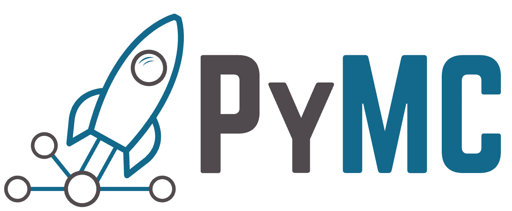
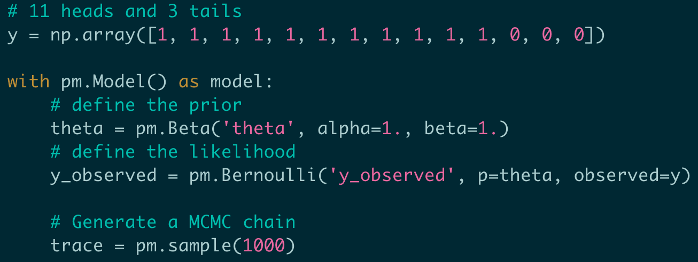

# 第5-2章 PyMC 介绍

> [!abstract] 本章导览
> 手写 MCMC 繁琐易错。**PyMC** 是一个**概率编程（probabilistic programming）** 库：你只需用「**图模型 / 流程图**」声明先验与似然，PyMC 便能**自动推导未归一化目标 $P(\theta)$** 并调用 MCMC（如 Metropolis）/ 变分推理求后验。本章以抛硬币为例打通「数学模型 → 流程图 → PyMC 代码」。

---

## 1. PyMC 简介

> [!note] 什么是 PyMC
> - 开源项目，用于**贝叶斯统计建模**和**概率机器学习**，聚焦 **MCMC** 与**变分推理（variational inference）** 算法。
> - 已应用于天文学、流行病学、分子生物学、晶体学、化学、生态学、心理学等众多领域。



---

## 2. 安装与使用

> [!example] 安装（推荐 conda-forge）
> ```bash
> conda create -c conda-forge -n pymc_env "pymc>=5"
> conda activate pymc_env
> ```
> 使用：
> ```python
> import pymc as pm
> ```

---

## 3. PyMC 与 MCMC 的关系

> [!important] 核心洞察
> 回顾 Metropolis-Hastings 算法：算法里**唯一与具体问题相关的，只是如何计算 $P(\theta)$**（未归一化目标），其余（提议、接受/拒绝、循环）都是「Metropolis 算法自己的事」。
> 因此概率编程库**只需能「自动求解」$P(\theta)=p(D\mid\theta)p(\theta)$ 的表达式**，就能复用通用 MCMC 求后验。

---

## 4. 图模型 / 流程图（Graphical Model）

以抛硬币为例：

$$\theta\sim \mathrm{Beta}(\theta\mid a_0, b_0)\quad(\text{先验}),\qquad y\sim \mathrm{Bern}(y\mid\theta)\quad(\text{似然})$$

> [!note] 流程图的读法：自下而上
> **先有数据 $y$ → 再有似然函数 → 再有参数 $\theta$ → 再有先验**。流程图自底向上刻画了「数据由谁生成、参数服从什么先验」的依赖链。

> [!important] 流程图的两大价值
> 1. **清晰展示参数与数据的依赖关系**；
> 2. **一个箭头 ≈ 一行 PyMC 代码**，直接指导实现。
>
> 对应关系：
> ```python
> theta = pm.Beta('theta', alpha=1., beta=1.)        # 先验 θ ~ Beta(1,1)
> y = pm.Bernoulli('y', p=theta, observed=y_observed) # 似然 y ~ Bern(θ)，绑定观测数据
> ```
> PyMC 据此**自动构造 $P(\theta)$**，再用 Metropolis 等 MCMC 求后验。

---

## 5. 代码实现



> [!example] 抛硬币推断的典型 PyMC 流程
> ```python
> import pymc as pm
>
> with pm.Model() as model:
>     # 1) 先验：θ ~ Beta(1,1)（即均匀先验）
>     theta = pm.Beta('theta', alpha=1., beta=1.)
>     # 2) 似然：观测数据 y ~ Bernoulli(θ)
>     y = pm.Bernoulli('y', p=theta, observed=y_observed)
>     # 3) 采样后验（自动选择/指定 MCMC 采样器）
>     idata = pm.sample(5000)
>
> # 4) 查看后验：均值、HDI、轨迹图等
> import arviz as az
> az.summary(idata)
> az.plot_trace(idata)
> ```

> [!tip] 关键要点
> - `with pm.Model() as model:` 上下文中声明的随机变量自动注册进模型；
> - **`observed=` 标记似然节点**（绑定真实数据），无 `observed` 的是待推断参数；
> - `pm.sample()` 负责预热（burn-in）、多链采样、收敛诊断；
> - 配合 **ArviZ** 做后验分析（[[第2章_概率论回顾_笔记#最高密度区间（Highest Density Interval, HDI）|最高密度区间]] HDI、轨迹图、有效样本数量 ESS）。

---

## 6. 本章小结

> [!summary] 要点
> - **概率编程**把贝叶斯建模拆成「声明模型」与「通用推断」两步；用户只描述先验+似然（图模型），推断交给库。
> - PyMC 自动推导未归一化目标 $P(\theta)$，调用 MCMC / 变分推理。
> - **流程图 ↔ 代码**一一对应：先验节点 = `pm.Beta(...)`，似然节点 = `pm.Bernoulli(..., observed=...)`。

> [!question] 自测
> 1. 为什么概率编程库只需会算 $P(\theta)$ 就能复用通用 MCMC？
> 2. 流程图应如何阅读？先验/似然/参数/数据的依赖顺序是什么？
> 3. PyMC 中如何区分「待推断参数」与「观测数据」？

---

**相关章节**：[[第5章_MCMC_笔记]] · [[第6章_层级模型_笔记]]
