# 第5章 贝叶斯推理方法：马尔科夫链蒙特卡洛（MCMC）近似

> [!abstract] 本章导览
> 网格近似在高维爆炸、共轭先验表达力受限——本章引入最通用的求后验方法：**MCMC（Markov Chain Monte Carlo）**。核心是**通过从后验采样大量 $\theta$ 来近似后验**，且**只需后验的比值**（无需算证据 $p(D)$）。从「岛屿游玩」直觉出发讲 **Metropolis 算法**，推广到 **Metropolis-Hastings**、**Random Walk Metropolis**，再到多维与 **吉布斯采样（Gibbs Sampling）**，并讨论**自相关 / 有效样本数量 / 预热期**等诊断。

---

## 1. 为什么需要 MCMC？

> [!note] 前两种方法的局限
> | 方法 | 局限 |
> | --- | --- |
> | **网格近似** | 参数多时计算量爆炸：每参数切 1000 份、6 个参数 → $1000^6$ 种组合 |
> | **准确数学分析** | 共轭先验表达力有限，且不一定存在共轭先验 |

> [!important] MCMC 的核心思想与优势
> - **思想**：从后验 $p(\theta\mid D)$ 采样大量 $\theta$，用样本的分布近似后验。
> - **关键**：$p(\theta\mid D)$ 未知，但**未归一化的** $P(\theta\mid D)=p(D\mid\theta)p(\theta)$ 已知，且**比值** $\dfrac{p(\theta_a\mid D)}{p(\theta_b\mid D)}=\dfrac{P(\theta_a\mid D)}{P(\theta_b\mid D)}$ 可算。
> - **优势**：先验可任意指定；**无需计算 $p(D)$ 的积分**。MCMC 被评为 20 世纪十大算法之一。

---

## 2. 抽样（Sampling）基础

- 从分布抽样：选离散点，点的选中可能性由概率密度定义；大量采样后用离散分布近似原分布。记 $x\sim p(x)$。
- 计算机生成均匀分布：生成随机数并归一化到 $[0,1]$。
- **拒绝采样（Rejection Sampling）**（阅读材料）：用包络分布提议、按比例接受/拒绝。

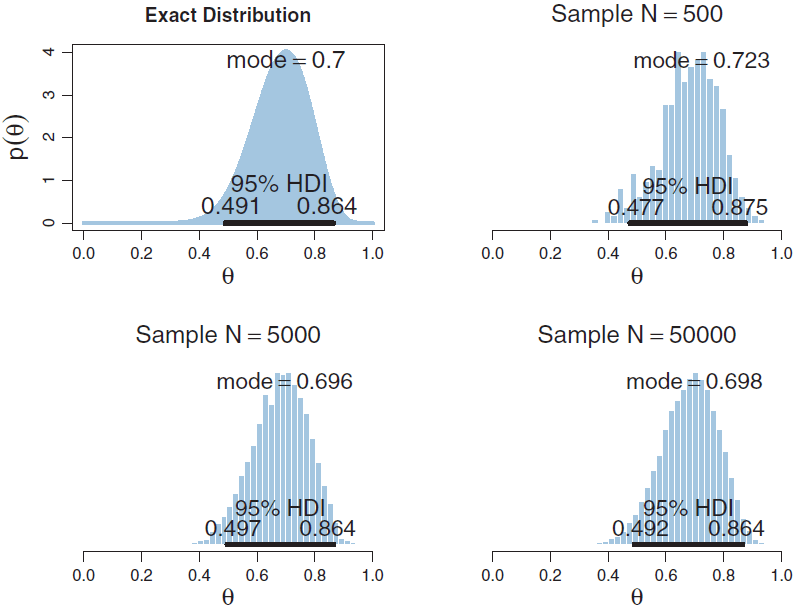

---

## 3. Metropolis 算法的直觉：岛屿游玩

> [!example] 岛屿游玩类比
> 某人游玩一串岛屿，目标是**在每个岛停留的总时间与岛屿面积成正比**。他不知道所有岛的面积，**只能打听当前岛与相邻岛的面积比值**。
> - 「在某岛玩一天」= 「采样一个该 $\theta$ 的样本」；
> - 「不知所有面积」= 「不能算后验 $p(\theta\mid D)$」；
> - 「相邻岛面积比值」= 「能算后验的比值（因 $p(D\mid\theta)p(\theta)$ 可算）」。

> [!important] 游玩策略（简化 Metropolis）
> 1. 抛硬币（50/50）决定**提议岛**：左邻或右邻；
> 2. 若提议岛面积 ≥ 当前岛 → **接受**（前往）；
> 3. 若提议岛面积 < 当前岛 → 以概率 $p=\dfrac{\text{提议岛面积}}{\text{当前岛面积}}$ 接受，否则留在原岛。

大量模拟后，**各岛停留天数比例 ∝ 各岛面积**——即采样比例收敛到目标分布。

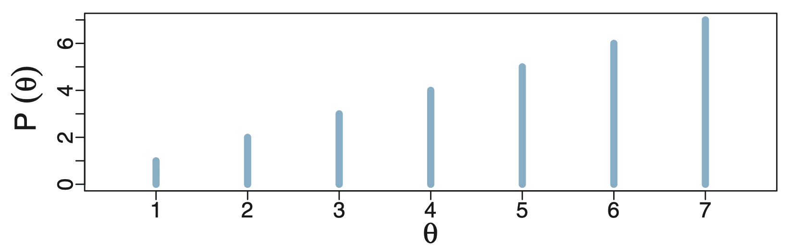

### 算法化表述（离散一维）

> [!note] 接受概率
> 当前 $\theta_{\text{current}}$，提议 $\theta_{\text{proposed}}$（左右各 50%），接受概率：
> $$p_{\text{move}}=\min\!\left(\frac{P(\theta_{\text{proposed}})}{P(\theta_{\text{current}})},\ 1\right)$$
> 从 $U(0,1)$ 抽 $u$，$u\le p_{\text{move}}$ 则移动，否则停留。其中 $P(\theta)$ 是**未归一化**目标分布。

> [!note] 为什么收敛（细致平衡的直觉）
> $$\frac{p(\theta_t\to\theta_{t+1})}{p(\theta_{t+1}\to\theta_t)}=\frac{0.5\min(P(\theta_{t+1})/P(\theta_t),1)}{0.5\min(P(\theta_t)/P(\theta_{t+1}),1)}=\frac{P(\theta_{t+1})}{P(\theta_t)}$$
> 转移概率之比恰等于目标分布之比 ⟹ 平稳分布就是目标分布。

---

## 4. 完整 Metropolis 算法

> [!note] 从简化版到一般版
> 简化版有 3 个限制：① $\theta$ 离散；② 一维；③ 只提议左右。一般版：① $\theta$ 连续；② 任意维；③ 提议分布可提议任意值。

> [!important] Metropolis 算法
> ```
> 初始化 θ₀，满足 P(θ₀) ≠ 0
> for t = 1,2,3,... do
>     θ = θ^(t-1)
>     采样 θ* ~ q(θ*|θ)          # 提议分布
>     计算 α = P(θ*) / P(θ)
>     计算 A = min(1, α)
>     采样 u ~ U(0,1)
>     if u ≤ A: 接受, θ_t = θ*
>     else:     拒绝, θ_t = θ
> ```
> 由于 $p(\theta\mid D)=\dfrac{p(D\mid\theta)p(\theta)}{p(D)}$，比值中分母 $p(D)$ **约掉**：
> $$\alpha=\frac{p(\theta^*\mid D)}{p(\theta\mid D)}=\frac{p(D\mid\theta^*)p(\theta^*)}{p(D\mid\theta)p(\theta)}$$
> **要求**：① 能从提议分布 $q$ 采样；② 能算目标分布的比值。Metropolis 要求提议分布**对称**：$q(\theta^*\mid\theta)=q(\theta\mid\theta^*)$。

> [!note] Metropolis-Hastings：去掉对称性要求
> 当提议分布**不对称**时，接受率需补偿提议偏差：
> $$\alpha=\frac{P(\theta^*)\,q(\theta\mid\theta^*)}{P(\theta)\,q(\theta^*\mid\theta)}$$
> 它是 MCMC 的一般框架，Metropolis 是其对称特例。

---

## 5. 提议分布与 Random Walk Metropolis

> [!note] 提议分布 $q(\theta^*\mid\theta)$ 的要求
> $q$ 的**支撑集（support，密度非零的点集）必须覆盖目标分布的支撑集**。两类常见提议：
> 1. **独立采样器（independence sampler）**：$q(\theta^*\mid\theta)=q(\theta^*)$，不依赖当前值；需 $q$ 与目标接近，否则拒绝率高。
> 2. **Random Walk Metropolis (RWM)**：以当前位置为中心的正态 $q(\theta^*\mid\theta)=N(\theta^*\mid\theta,\sigma^2)$，对称（与岛屿策略类似）。

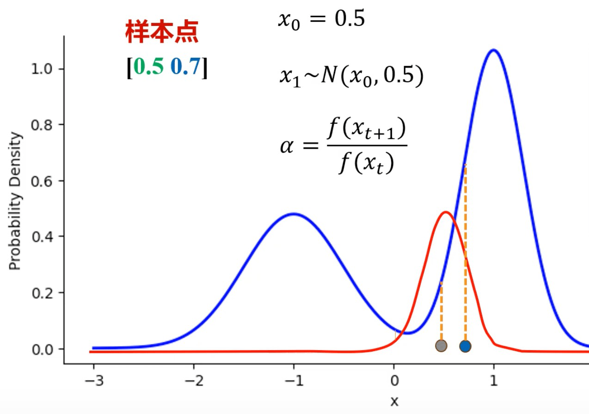

### RWM 用于抛硬币

似然 $p(D\mid\theta)=\theta^z(1-\theta)^{N-z}$，先验 $\mathrm{beta}(\theta\mid a,b)$，目标 $P(\theta)\propto p(D\mid\theta)p(\theta)$。提议 $\theta^*=\theta+\sigma\epsilon,\ \epsilon\sim N(0,1)$。

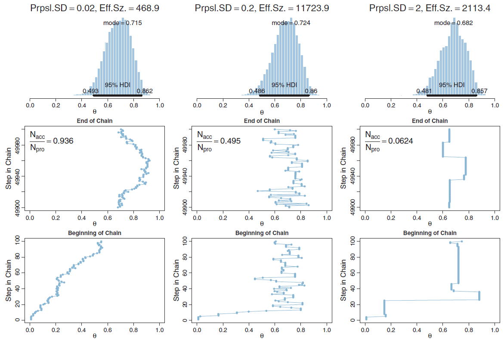

> [!success] MCMC vs. 准确分析
> 先验 beta(1,1)、数据 N=20,z=14 → 解析后验 beta(15,7)，众数=0.7。MCMC 采样 50000 步得到的直方图与解析后验高度吻合。

---

## 6. 采样质量诊断

### 6.1 自相关（Autocorrelation）与有效样本数量（ESS）

> [!note] 自相关
> 采样链「聚集（clumpy）」意味着相邻样本相关性高、独立信息少。用**自相关函数 ACF(k)**（链与自身平移 $k$ 步的相关系数）衡量。Lag 越小自相关通常越高。

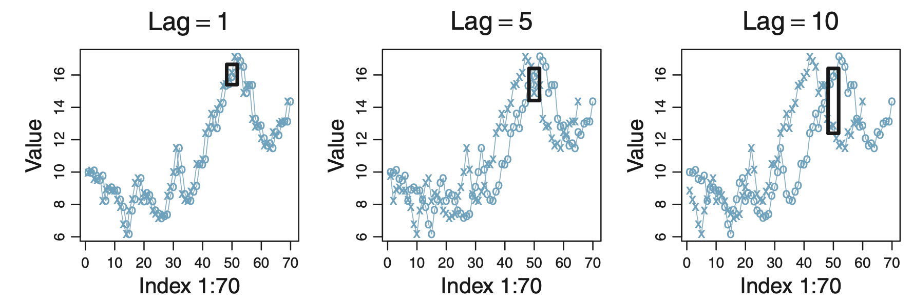

> [!important] 有效样本数量（Effective Sample Size, ESS）
> ESS 衡量样本中**独立信息量**：聚集度越高，相邻样本越相关，ESS 越小。基于自相关计算，实践中累加 $k$ **直到 ACF(k) < 0.05**。

### 6.2 提议分布的 σ 怎么选

> [!warning] σ 的权衡（金发女孩问题）
> - **σ 太小**：每步移动幅度小，遍历慢，需很久（例 ESS 仅 468）；
> - **σ 太大**：提议常被拒绝、接受率低，也需很久（例 ESS 仅 2113）；
> - **实践经验**：多试几个 σ，**选接受率约 50% 的 σ**。

---

## 7. 多维参数：以抛 2 个硬币为例

设 $\theta_j$ 为第 $j$ 枚硬币正面概率，$N_j,z_j$ 为抛掷/正面次数，两硬币独立。

> [!note] 似然与后验
> 似然 $p(D\mid\theta_1,\theta_2)=\theta_1^{z_1}(1-\theta_1)^{N_1-z_1}\theta_2^{z_2}(1-\theta_2)^{N_2-z_2}$。

**准确数学分析**（各取 Beta 共轭先验）：后验**因子分解**为两个独立 Beta：

$$p(\theta_1,\theta_2\mid D)=\mathrm{beta}(\theta_1\mid z_1+a_1, N_1-z_1+b_1)\,\mathrm{beta}(\theta_2\mid z_2+a_2, N_2-z_2+b_2)$$

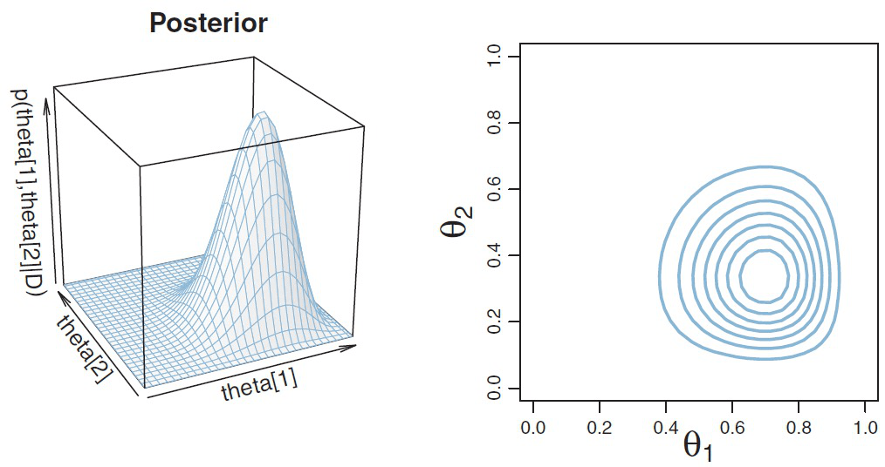

**Metropolis 用于多维**：用**二元正态**提议分布（各维独立、同 σ）$q=\prod_j N(\theta_j^*\mid\theta_j,\sigma^2)$，整体接受/拒绝。

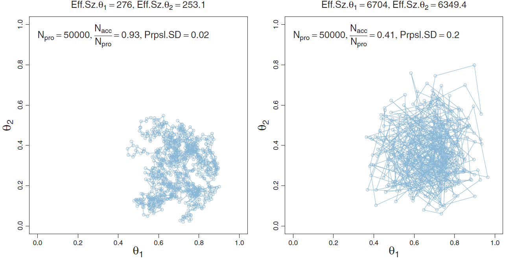

> [!warning] 多维 Metropolis 的问题
> 各维用相同 σ：① 不同维最优 σ 不同，统一 σ 会导致某些维接受率过高/过低，效率低；② 即使 σ 合适，仍有很多提议被拒绝。

---

## 8. 吉布斯采样（Gibbs Sampling）

> [!note] 核心思想
> 吉布斯采样是**特殊的 Metropolis-Hastings**。同样在参数空间随机行走（马尔科夫链），但**每步只更新一个参数，其余固定**，通过**条件概率分布** $p(\theta_i\mid\theta_{\neg i}, D)$ 采样。

> [!important] 循环更新（以 3 参数为例）
> $$\theta_1^{t+1}\sim p(\theta_1\mid\theta_2^{t},\theta_3^{t},D)$$
> $$\theta_2^{t+1}\sim p(\theta_2\mid\theta_1^{t+1},\theta_3^{t},D)$$
> $$\theta_3^{t+1}\sim p(\theta_3\mid\theta_1^{t+1},\theta_2^{t+1},D)$$
> 注意：更新后一个参数时，**立即使用已更新的其他参数值**。

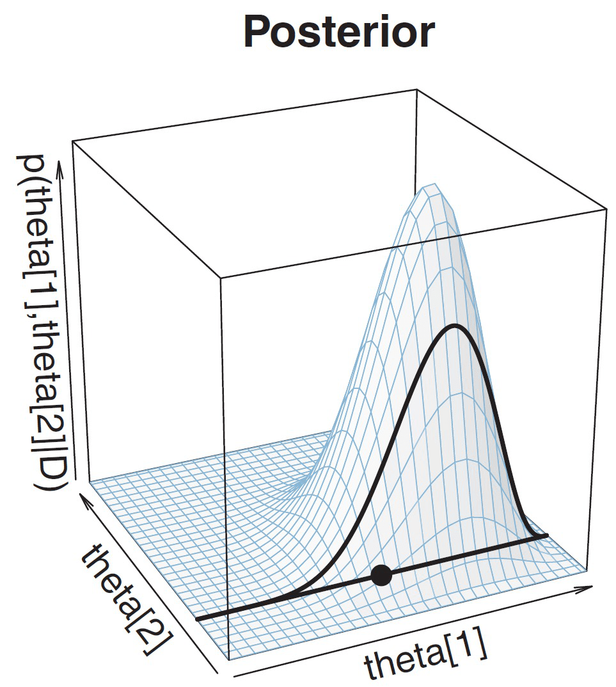

> [!success] 接受率 100%（关键性质）
> 把提议分布取为条件分布 $q(\boldsymbol\theta^*\mid\boldsymbol\theta)=p(\theta_i^*\mid\boldsymbol\theta_{\neg i})$ 代入 MH 接受率，化简后 $\alpha=1$：
> $$\alpha=\frac{p(\theta_i^*\mid\theta_{\neg i})\,p(\theta_i\mid\theta_{\neg i})}{p(\theta_i\mid\theta_{\neg i})\,p(\theta_i^*\mid\theta_{\neg i})}=1$$
> **吉布斯采样永不拒绝**。

> [!example] 抛 2 硬币的条件分布
> 由联合后验积分掉 $\theta_2$：$p(\theta_1\mid\theta_2,D)=\mathrm{beta}(\theta_1\mid z_1+a_1, N_1-z_1+b_1)$——条件分布就是单个 Beta，可直接采样。

> [!note] 吉布斯 vs. Metropolis
> **吉布斯优势**：接受率 100%；某些问题联合后验难采样但条件分布易采样。
> **吉布斯局限**：某些问题条件分布也难算/难采样；对某些形状（强相关）的分布状态转移很慢、聚集度高。

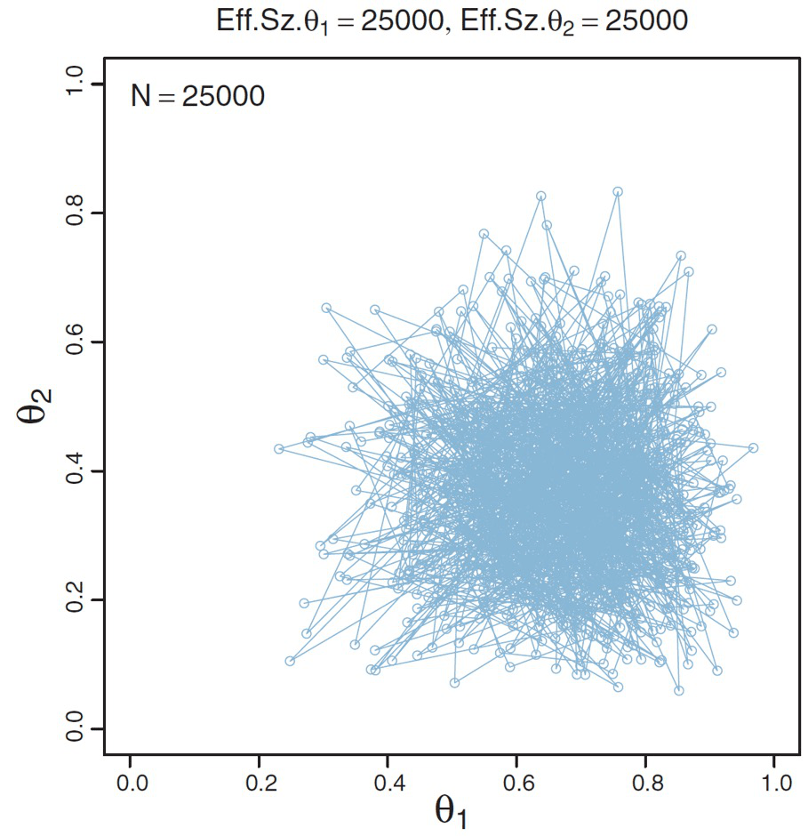

> [!tip] 跨课程关联：贝叶斯网络中的 Gibbs 采样
> 在 [[第11周星期五-贝叶斯4_笔记|《人工智能原理》采样近似推理]] 中，Gibbs 采样被用于**贝叶斯网络**的近似推理：每步按变量的**马尔科夫覆盖（Markov blanket）**重采样，与本章「固定其余参数、按条件分布逐个采样」本质相同。该课程还把它与直接采样 / 拒绝采样 / 似然加权放在一起作演进对比——一个面向离散网络推断、一个面向连续参数后验，可互为补充。

---

## 9. 实用诊断与后处理

> [!important] 预热期（Burn-in Period）
> 从不同初始值出发，早期采样的 $\theta$ 轨迹差异大、**尚未收敛**到正确区域。这段早期未收敛阶段称为**预热期**，**一般丢弃**预热期的样本。

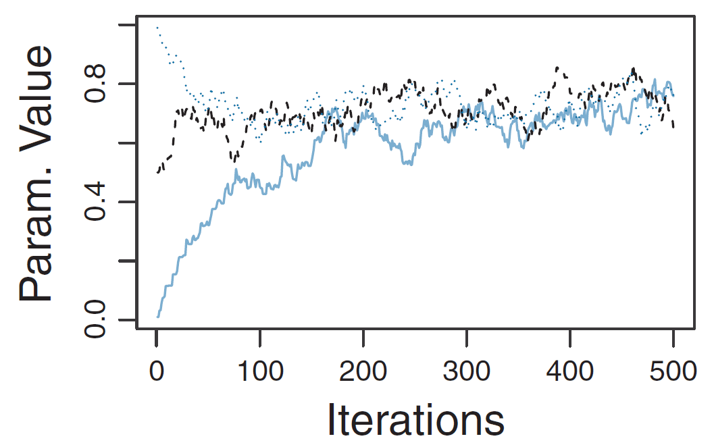

> [!tip] 比较两个参数的差异
> 用 $\theta_1-\theta_2$ 的直方图比较（$\theta_1,\theta_2$ 来自同一组样本 $\sim p(\theta_1,\theta_2\mid D)$）。例：95% HDI=[-0.069, 0.665]，**包含 0**，故**不能断定** $\theta_1$ 与 $\theta_2$ 不同。

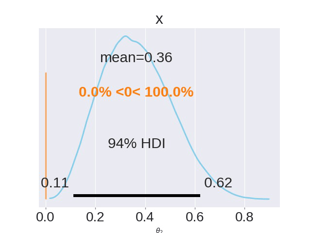

---

## 10. 本章小结

> [!summary] 算法谱系
> - **蒙特卡洛模拟**：用采样近似分布（以赌城 Monte Carlo 命名）。
> - **马尔科夫链**：下一状态只依赖当前状态。
> - **MCMC** = 基于马尔科夫链的蒙特卡洛；**Metropolis**（对称提议）⊂ **Metropolis-Hastings**（一般），**Gibbs**（条件分布提议、接受率 100%）是 MH 特例。

> [!summary] 贝叶斯推理 4 种方法（完整）
> 1. **准确数学分析**（共轭先验）→ [[第4章_贝叶斯推理方法-准确数学分析_笔记]]
> 2. **网格近似** → [[第3章_极大似然估计与贝叶斯估计_笔记]]
> 3. **MCMC 近似**（本章）
> 4. **变分近似**：用 $q(\theta)$ 近似后验，转为优化问题

> [!question] 自测
> 1. MCMC 为什么不需要计算证据 $p(D)$？
> 2. 写出 Metropolis 接受率，它与 Metropolis-Hastings 的区别是什么？
> 3. 提议分布 σ 太大/太小分别有什么问题？如何选？
> 4. 什么是有效样本数量（ESS）？它与自相关的关系？
> 5. 吉布斯采样为什么接受率是 100%？它相比 Metropolis 的优劣？
> 6. 什么是预热期？为什么要丢弃？

---

**相关章节**：[[第4章_贝叶斯推理方法-准确数学分析_笔记]] · [[第5-2章_PyMC介绍_笔记]] · [[第6章_层级模型_笔记]]
