# 第6章 层级模型（Hierarchical Models）

> [!abstract] 本章导览
> **层级模型**指模型含多个参数、且**某些参数依赖于其他参数**。典型场景：多枚硬币产自同一工厂，每枚硬币偏向性 $\theta_j$ 依赖于工厂整体偏向性 $\omega$。本章从「一硬币一工厂」推进到「多硬币一工厂」，再到把集中度 $\kappa$ 也作为参数估计，引入 **Gamma 分布**作超参数先验，用 PyMC 实现，最后讲层级模型最重要的现象——**收缩（Shrinkage）**。

---

## 1. 什么是层级模型

> [!note] 定义
> 模型包含多个参数，且**部分参数依赖于其他参数**，形成「层级」结构。
> - 例：同一工厂的硬币，正面偏向性 $\theta$ 依赖于**工厂偏向性（factory bias）** $\omega$，而 $\omega$ 本身也需估计。

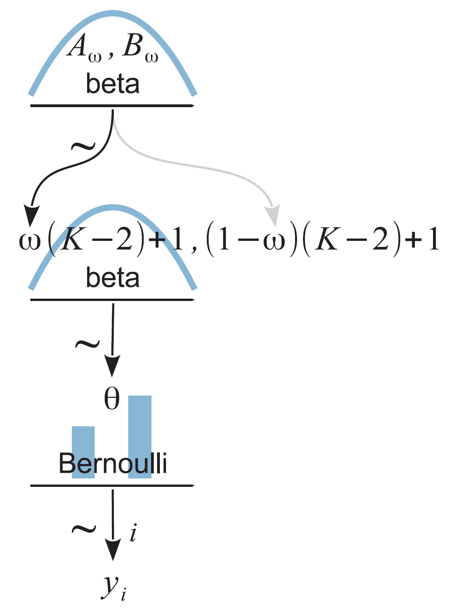

> [!example] 更多实例
> - 足球运动员点球成功率，依赖于其**位置**（前锋/后卫）的普遍成功率；
> - 医生心脏手术成功率，依赖于其所在**医院**的普遍成功率。

> [!important] 层级建模的两大好处
> 1. **更符合实际问题的结构**；
> 2. **所有数据能共同作用于所有参数**：硬币 1 的数据会通过 $\omega$ 间接影响 $\theta_2$。若数据多的硬币 1 可「纠正」数据少的硬币 2。不分层则只能各自孤立估计。

---

## 2. 一个硬币产自一个工厂

目标是联合后验 $p(\theta,\omega\mid D)$。由贝叶斯公式：

$$p(\theta,\omega\mid D)=\frac{p(D\mid\theta,\omega)\,p(\theta,\omega)}{p(D)}$$

> [!tip] 用条件独立性 + 依赖链化简
> 由图结构 $\omega\to\theta\to D$：
> - **$\omega\perp D\mid\theta$** ⟹ $p(D\mid\theta,\omega)=p(D\mid\theta)$；
> - 依赖关系 ⟹ $p(\theta,\omega)=p(\theta\mid\omega)p(\omega)$。
>
> 于是层级模型的**核心分解**：
> $$\boxed{p(\theta,\omega\mid D)=\frac{p(D\mid\theta)\,p(\theta\mid\omega)\,p(\omega)}{p(D)}}$$

### 各部分设定

> [!note] 似然、先验
> - **似然**：$p(D\mid\theta)=\theta^z(1-\theta)^{N-z}$（抛 $N$ 次、$z$ 次正面）。
> - **$\theta$ 的先验（依赖 $\omega$）**：用众数参数化的 Beta
>   $$p(\theta\mid\omega)=\mathrm{beta}\big(\theta\mid \omega(\kappa-2)+1,\ (1-\omega)(\kappa-2)+1\big)$$
>   先令 $\kappa=K$ 为常数（集中度，控制 $\theta$ 对 $\omega$ 的依赖强度）。
> - **$\omega$ 的先验（超先验）**：$p(\omega)=\mathrm{beta}(\omega\mid A_\omega, B_\omega)$，$A_\omega,B_\omega$ 为常数。

> [!example] 数值实验（$\kappa=100$，先验 ω~beta(2,2)，数据 9 正 3 反）
> 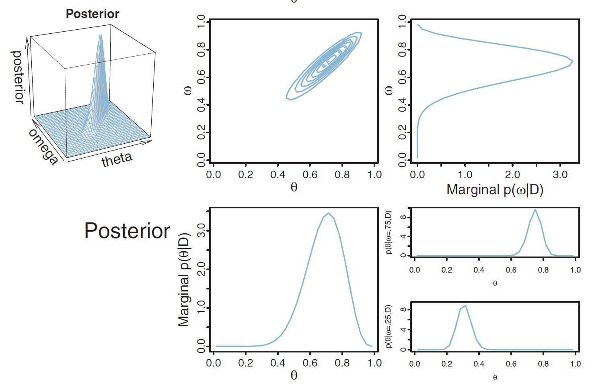
> - $p(\theta\mid\omega)$ 与 $p(\theta\mid\omega,D)$ 差不多——因为 $\kappa=100$ 使 $\theta\mid\omega$ 很确定（强依赖）；
> - $p(\omega)$ 与 $p(\omega\mid D)$ 差别大——因为 $\omega$ 先验 $\kappa=4$ 很不确定，被数据更新；
> - $p(\omega\mid D)$ 与 $p(\theta\mid D)$ 峰值都在 0.7 左右，接近似然。

> [!warning] 超参数 $\kappa$ 与 $A_\omega,B_\omega$ 的影响（务必理解）
> 对比两组超参数（似然固定）：
> - **第 1 组** $A_\omega=2,B_\omega=2,K=100$：$\omega$ 不确定但 $\theta\mid\omega$ 很确定 → $p(\theta\mid\omega,D)$ 接近**先验**，$p(\omega\mid D)$ 峰值 0.75；
> - **第 2 组** $A_\omega=20,B_\omega=20,K=6$：$\omega$ 很确定但 $\theta\mid\omega$ 不确定 → $p(\theta\mid\omega,D)$ 接近**似然**，$p(\omega\mid D)$ 峰值 0.5。
>
> 即：**哪一层更"确定"（集中度大），后验就更被那一层的先验主导。**

---

## 3. 多个硬币产自一个工厂

设硬币 $j$ 偏向性 $\theta_j$，工厂偏向性 $\omega$。目标后验 $p(\{\theta_j\},\omega\mid D)$。

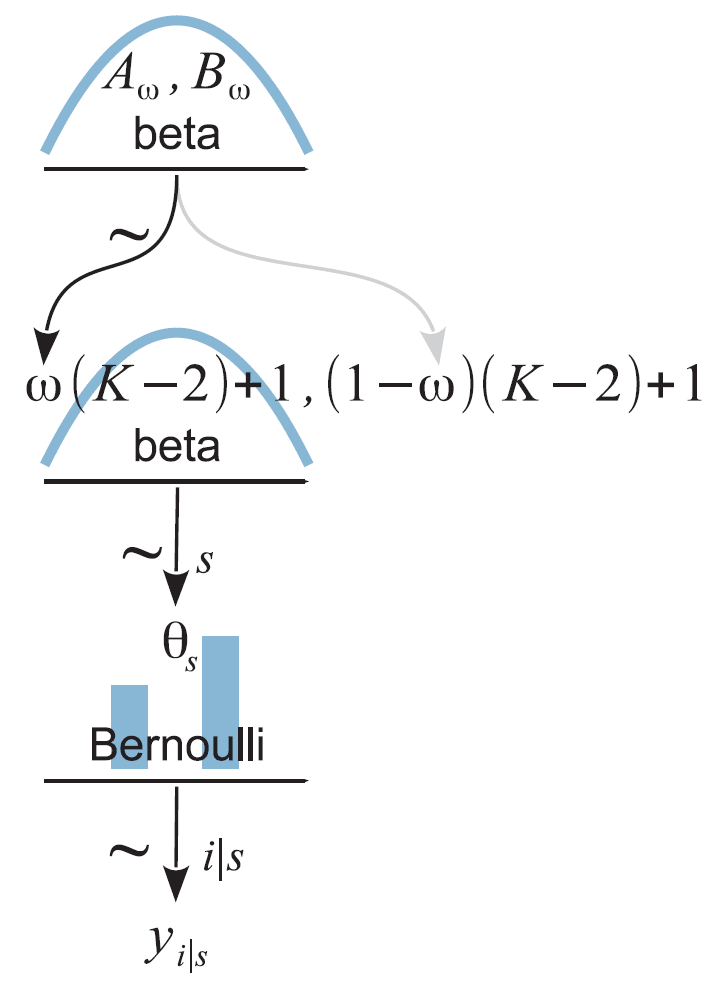

> [!important] 因子分解（以 2 硬币为例）
> 给定 $\omega$ 时 $\theta_1,\theta_2$ **条件独立**，各硬币结果也独立：
> $$p(\theta_1,\theta_2,\omega\mid D)\propto p(y_1\mid\theta_1)\,p(y_2\mid\theta_2)\,p(\theta_1\mid\omega)\,p(\theta_2\mid\omega)\,p(\omega)$$

> [!example] 数据 D1=3/15, D2=4/5（$A_\omega{=}B_\omega{=}2,K{=}5$）
> 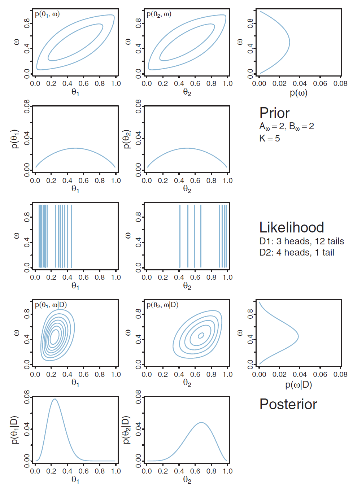
> - $p(\omega\mid D)$ 峰值≈0.4，是两硬币数据与先验的妥协，受数据多的 $\theta_1$ 影响更大；
> - $p(\theta_1\mid D)$ 峰值≈0.25，偏向硬币 1 数据（3/15）；
> - $p(\theta_2\mid D)$ 峰值≈0.65，偏向硬币 2 数据（4/5），但因数据少更受 $\omega$ 牵引——**硬币 1 的数据通过 $\omega$ 影响了 $\theta_2$**。

> [!note] 加大 K（K=75）的效果
> $K$ 越大，$\theta$ 与 $\omega$ 依赖越强：$\omega$ 更受各硬币数据影响；数据少的 $\theta_2$ 几乎完全偏向 $\omega$。

---

## 4. 把集中度 κ 也作为参数估计

> [!note] κ 的先验要求
> 1. $\kappa-2$ 需非负（因 Beta 先验一般取 $a\ge1,b\ge1$）；
> 2. 需像 Beta 一样能表达多种形状（平坦、集中等）。
> **常用选择：Gamma 分布。**

### Gamma 分布

$$\mathrm{Gamma}(x\mid s,r)=\frac{r^s}{\Gamma(s)}x^{s-1}e^{-rx},\quad x\ge0,\ s,r>0$$

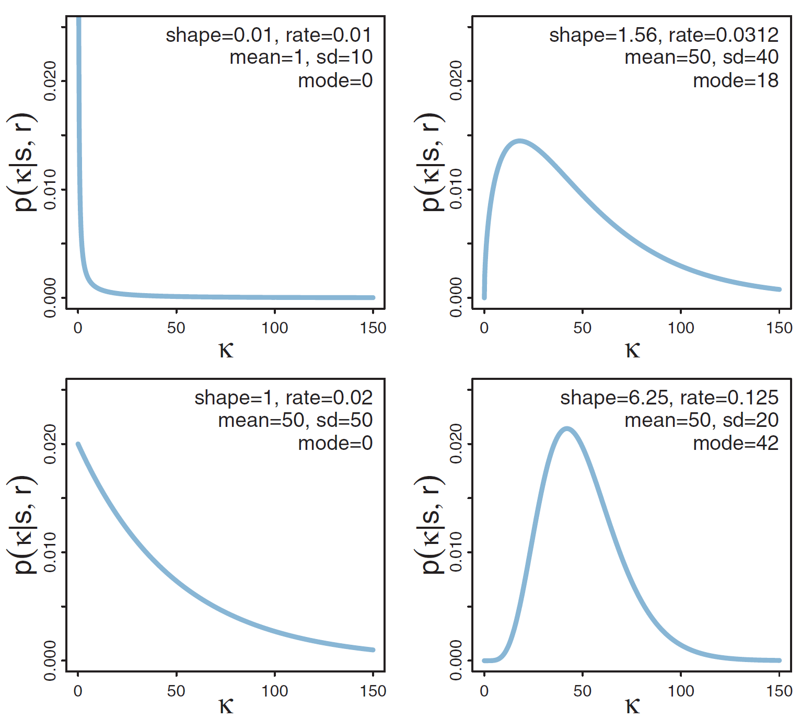

> [!note] Gamma 分布的关键量
> - $s$=**形状参数（shape）**，$r$=**率参数（rate）/ 反向尺度**；
> - 均值 $\mu=\dfrac{s}{r}$；峰值（众数）$\omega=\dfrac{s-1}{r}$（$s\ge1$，否则峰值为 0）；标准差 $\sigma=\dfrac{\sqrt s}{r}$；
> - 可由均值/众数反解 $s,r$。
> - Gamma 是很多似然的共轭先验：正态分布**精度**（方差倒数）、指数分布、泊松分布等。

### 三硬币 + 估计 ω, κ 的完整模型

$$p(\theta_1,\theta_2,\theta_3,\omega,\kappa\mid D)\propto\prod_{i=1}^{3}p(D_i\mid\theta_i)\prod_{i=1}^{3}p(\theta_i\mid\omega,\kappa)\,p(\omega)\,p(\kappa)$$

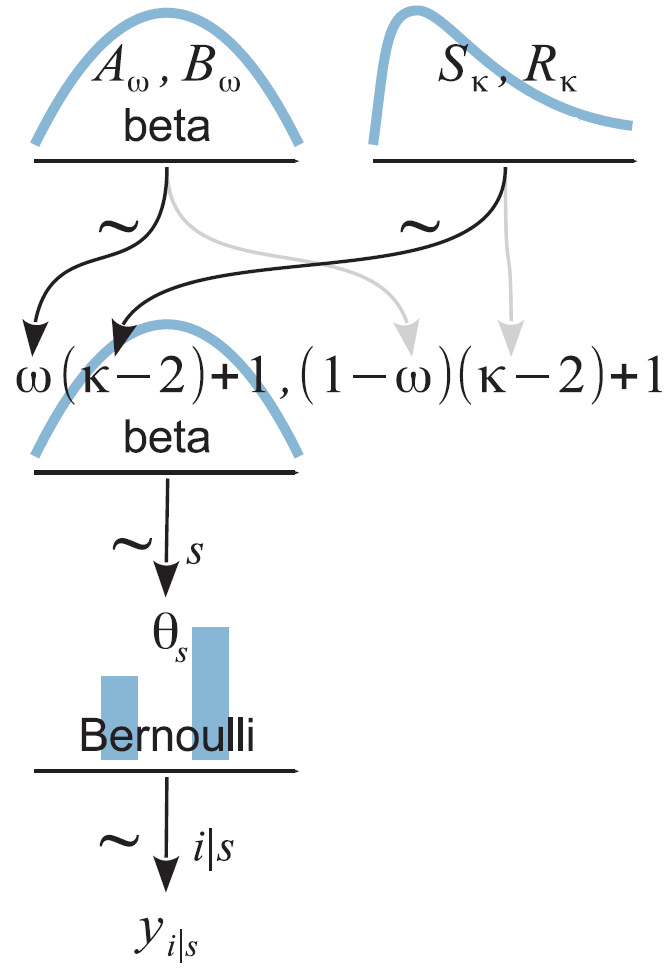

> [!example] 运行结果观察
> 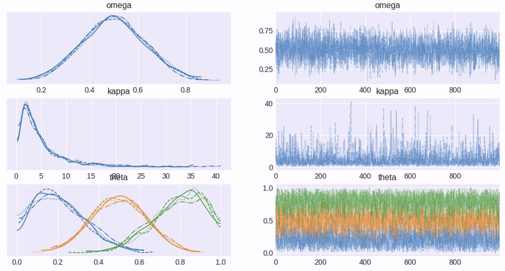
> 数据越「一致」（如三硬币都 5/10），$p(\kappa\mid D)$ 峰值越大（说明硬币间确实相似，依赖更强）；$p(\theta\mid D)$ 主要仍由各自数据决定。

---

## 5. 完整案例：触摸疗法（Therapeutic Touch）

> [!example] 实验设计
> 触摸疗法医师号称能感知人体能量场。让医师蒙眼，用手感知另一人的手在自己左手还是右手附近。**28 名医师，每人测 10 次。**

> [!note] 建模映射
> - 一名医师感知一次对/错 = 一枚硬币抛一次正/反；
> - 28 名医师 = 28 枚硬币（各抛 10 次）；医师不分组 = 同一工厂 → **「多硬币一工厂」模型**；
> - $\omega$ = 这组医师整体正确率。

> [!note] 先验（采用不确定先验）
> - $p(\omega)\sim\mathrm{beta}(1,1)$（均匀）；
> - $p(\kappa)\sim\mathrm{gamma}(0.01, 0.01)$（弱先验；虽 0 点密度趋于无穷但尾巴也无穷长，需靠后验公式判断其对结果影响很小，类似 Beta 中取极小 $a,b$）。

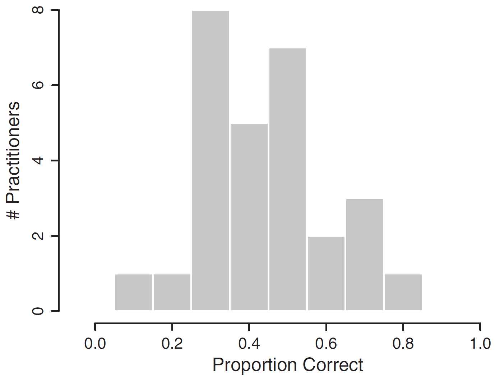

> [!success] 结果与结论
> 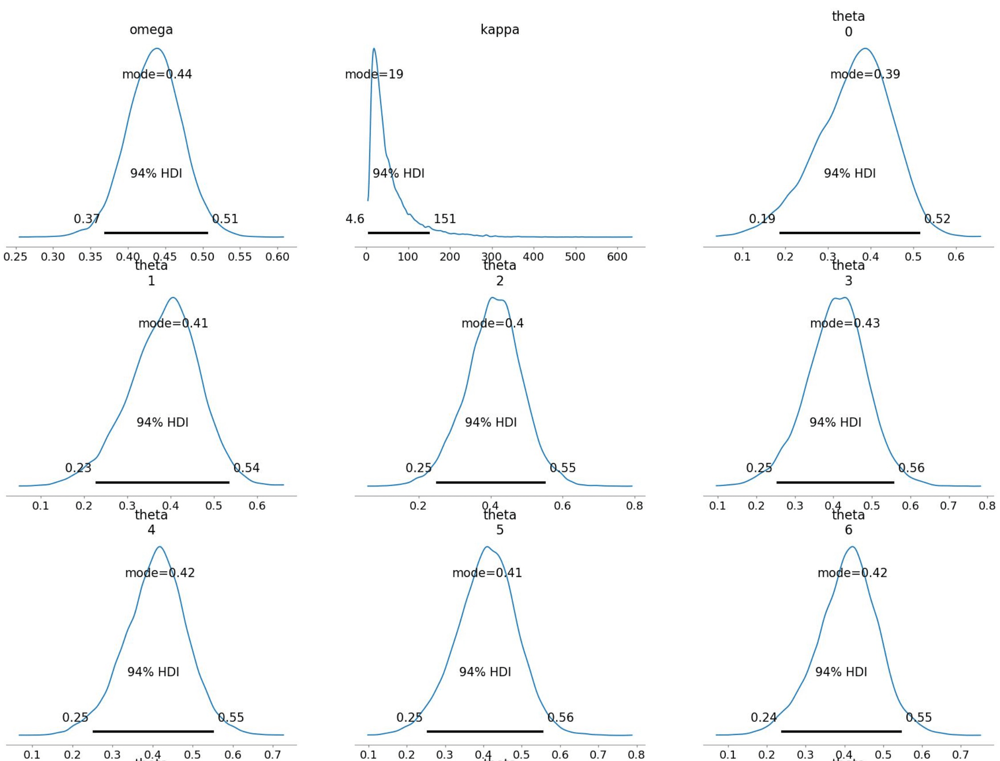
> - $\omega$ 接近 0.5，且 **95% HDI 包含 0.5** ⟹ **不能说感知能量场与"随机猜"有差异**；
> - $\kappa$ 峰值≈19（较大）⟹ $\theta$ 强依赖 $\omega$，各医师 $\theta$ 其实彼此接近。
> - 即便最差者 $\theta$（1/10 正确）后验峰值仍达 0.386，最好者（8/10）后验峰值 0.49——**两者 95% HDI 都包含 0.5**；两者之差的 HDI 包含 0，**无法断言任何人异于随机猜**。

---

## 6. 收缩（Shrinkage）⭐

> [!important] 现象
> 数据正确率分别是 $\theta_1$ 的 1/10、$\theta_{14}$ 的 8/10，但后验峰值却分别是 **0.386 与 0.49**——**相比数据的巨大差异，参数估计值的差异被大幅缩小**，这就是**收缩（Shrinkage）**。

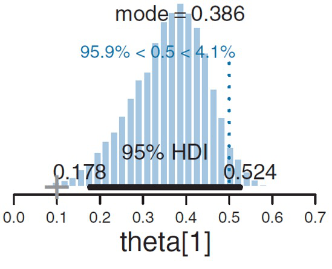

> [!note] 收缩的本质
> - **低层参数的估计值会向高层参数的估计值靠拢**；
> - 收缩**由层级结构造成**（低层受高层影响），**并非贝叶斯估计本身造成**；
> - 高层参数受**所有**数据影响，故每个低层参数也**间接受所有数据影响**——这正是层级模型「共享信息 / 借力（borrowing strength）」的体现。

> [!warning] 收缩不一定减小差异
> - 高层参数分布**单峰**时：收缩使低层参数差异**变小**；
> - 高层参数分布**多峰**时：不同低层参数可能被**不同的峰**吸引，收缩反而可能使差异**变大**。

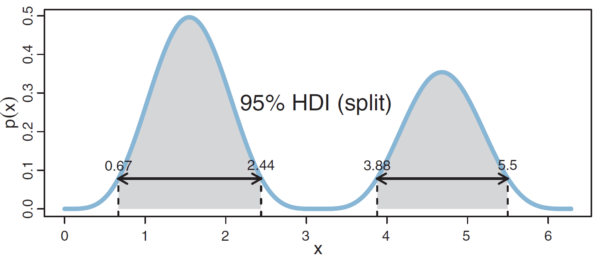

---

## 7. 本章小结

> [!summary] 知识脉络
> - **层级模型**：参数间有依赖（$\omega\to\theta\to D$），核心分解 $p(\theta,\omega\mid D)\propto p(D\mid\theta)p(\theta\mid\omega)p(\omega)$。
> - **化简靠条件独立**：$\omega\perp D\mid\theta$。
> - **集中度 $\kappa$** 控制层间依赖强度；估计 $\kappa$ 时用 **Gamma 先验**。
> - **数据共享**：所有数据通过高层参数作用于所有低层参数。
> - **收缩**：低层估计向高层靠拢，是层级结构的自然结果；单峰高层 → 差异变小。

> [!question] 自测
> 1. 写出一硬币一工厂的后验分解式，说明每步用了什么独立性。
> 2. 超参数 $\kappa$ 大小如何影响 $\theta$ 与 $\omega$ 的相互作用？
> 3. 为什么估计 $\kappa$ 常用 Gamma 分布作先验？
> 4. 什么是收缩？它由什么造成？为什么说"并非贝叶斯估计造成"？
> 5. 收缩一定会减小低层参数间的差异吗？

---

**相关章节**：[[第5章_MCMC_笔记]] · [[第5-2章_PyMC介绍_笔记]] · [[第7章_广义线性模型-回归_笔记]]
