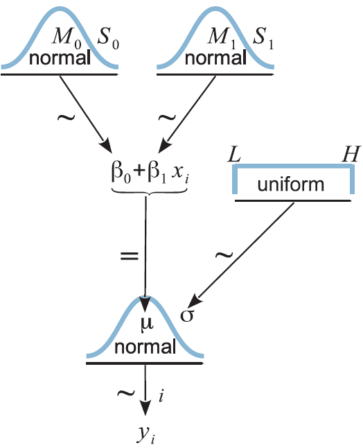
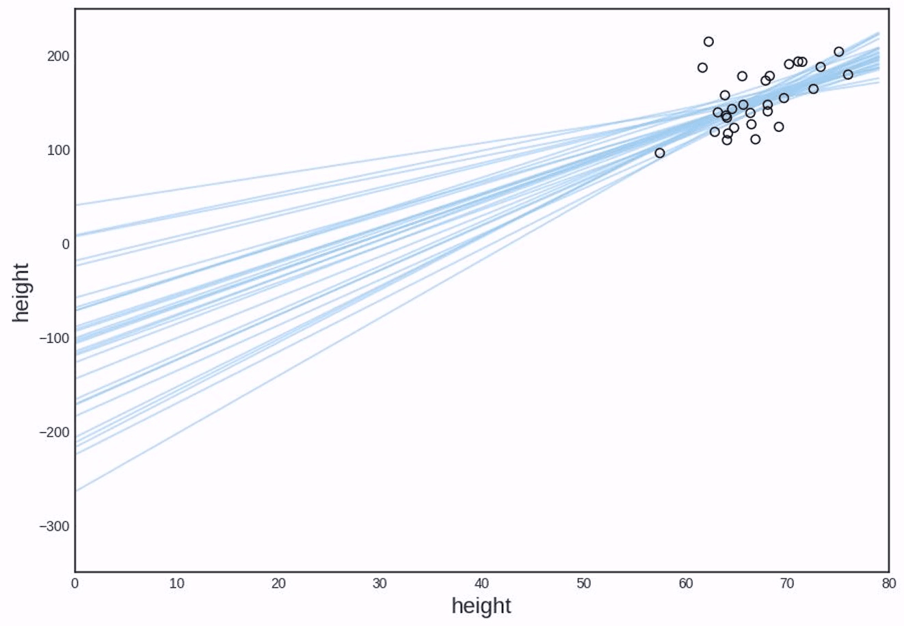
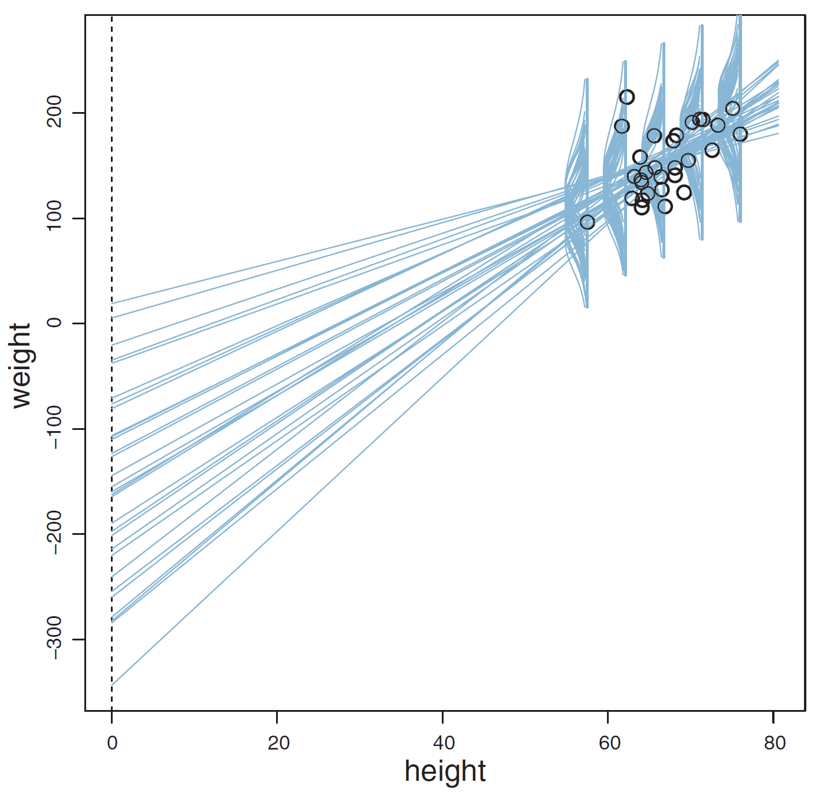
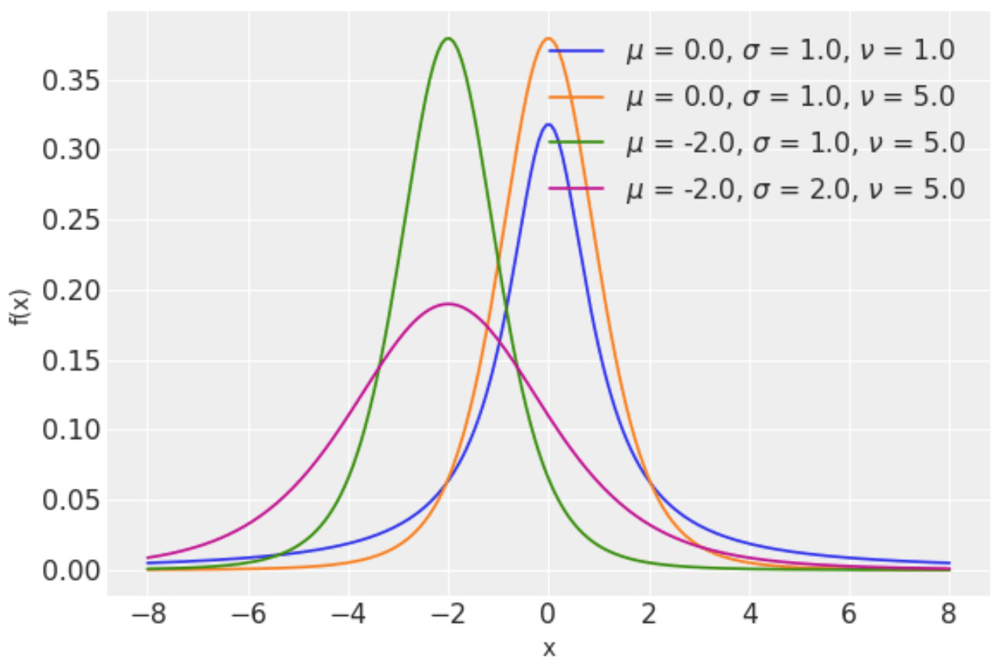
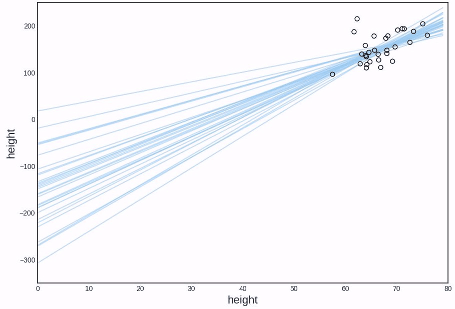
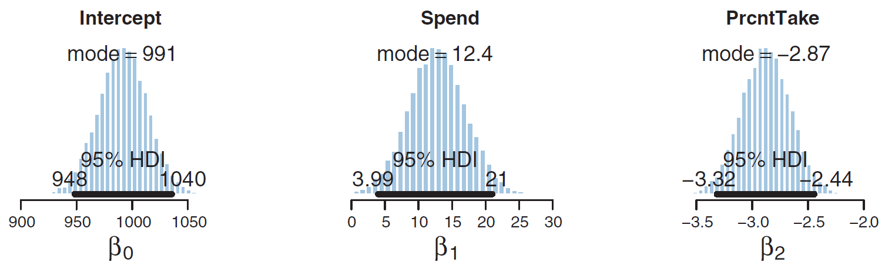
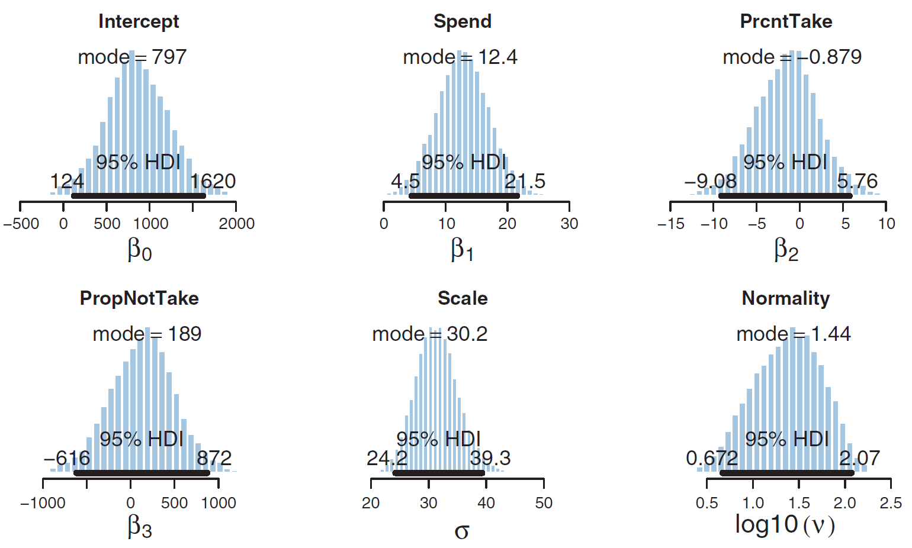
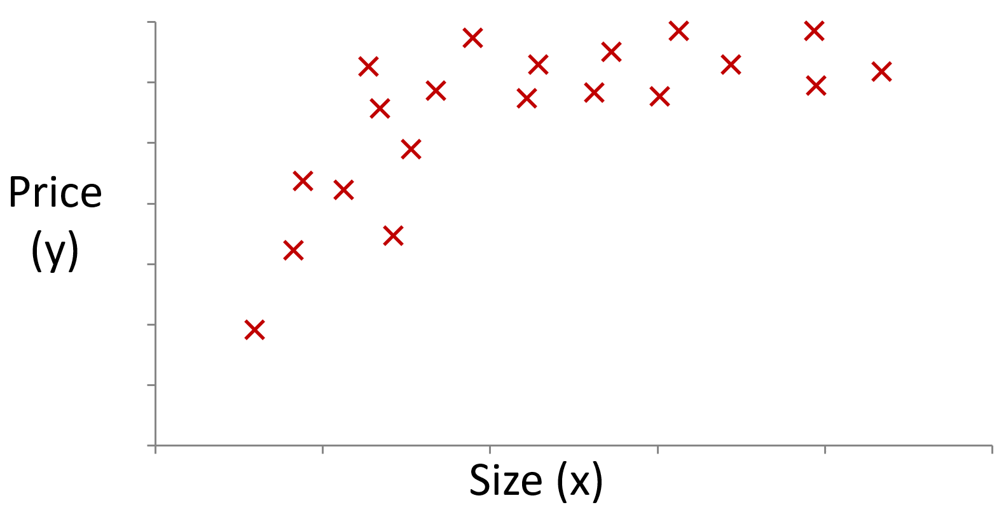
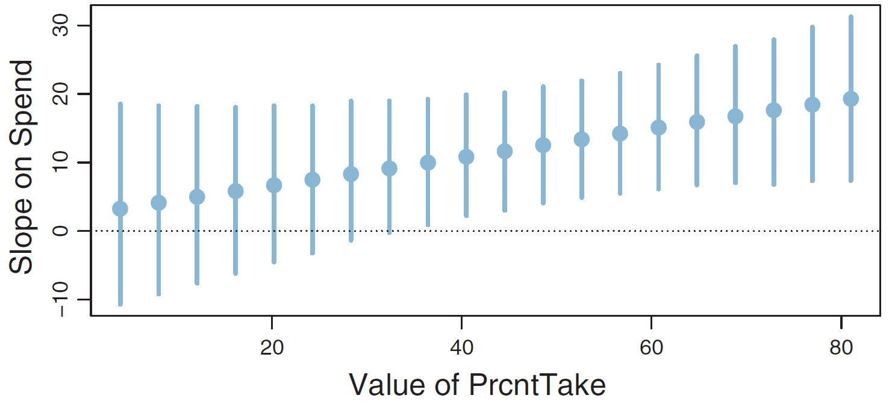
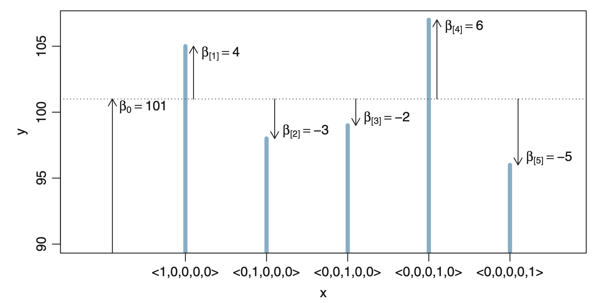

# 第7章 广义线性模型（GLM）：回归

> [!abstract] 本章导览
> 本章把贝叶斯框架用到**回归**。先建立 **广义线性模型（Generalized Linear Model, GLM）** 的统一范式：**自变量线性组合 → 反向链接函数 → 噪声分布**。然后展开：贝叶斯**简单线性回归** → **数据标准化**解决斜率/截距相关 → 用**学生 t 分布**实现**鲁棒回归** → **多重线性回归**与**冗余自变量**陷阱 → MLE/MAP 与传统回归的联系 → **非线性 / 交互项 / 类别自变量**。

---

## 1. 基本概念

> [!note] 自变量 vs. 因变量
> - **自变量（predictor / independent variable）**：用来预测的量（身高、平时成绩、浏览记录）。
> - **因变量（predicted / dependent variable）**：被预测的量（体重、高考成绩、是否购买）。

> [!note] 度量值 vs. 类别值 → 回归 vs. 分类
> - **度量值（metric）**：身高、体重、温度、响应时间……
> - **类别值（nominal）**：硬币正反、骰子点数、买/不买……
> - **因变量是度量值 → 回归（regression）**；**因变量是类别值 → 分类（classification）**。自变量两类都可。

---

## 2. 广义线性模型（GLM）统一范式 ⭐

### 2.1 自变量的线性组合

$$\mathrm{lin}(x)=\beta_0+\beta_1 x_1+\cdots+\beta_K x_K=\beta_0+\sum_k\beta_k x_k$$

> [!example] 房价例子
> 用面积 $x_1$、房间数 $x_2$、楼层 $x_3$、楼龄 $x_4$ 预测房价：$y=80+2x_1+10x_2+1.5x_3-2x_4$。

**传统线性回归**：最小化损失函数（点估计）

$$\min_{\beta}\ \frac{1}{2N}\sum_i\Big(\beta_0+\sum_k\beta_k x_k^{i}-y^{i}\Big)^2$$

### 2.2 反向链接函数（Inverse Link Function）

> [!important] 从线性组合到因变量集中趋势
> $$\mu=f(\mathrm{lin}(x))$$
> - $f$（lin → y）称**反向链接函数**，作用是**映射到合适的值域**；其逆 $f^{-1}$ 称**链接函数**。
> - $\mu$ **不是数据样本，而是因变量的集中趋势（常为均值）**，故 $f$ 又叫**均值函数（mean function）**。
> - **回归**：$f$ 取**恒等函数** $f(\mathrm{lin}(x))=\mathrm{lin}(x)$；
> - **二分类**：$f$ 取**逻辑函数** $f(\mathrm{lin}(x))=\dfrac{1}{1+e^{-\mathrm{lin}(x)}}$。

### 2.3 从集中趋势到含噪声数据

> [!important] GLM 完整形式
> $$\mu=f(\mathrm{lin}(x)),\qquad y\sim \mathrm{pdf}(\mu,\ [\text{其他参数}])$$
> 噪声分布 pdf 由因变量类型决定：
> - 度量值、取值 $(-\infty,+\infty)$ → **正态**：$y\sim\mathrm{normal}(\mu,\sigma)$；
> - 二分类别值 → **伯努利**：$y\sim\mathrm{bern}(\mu)$。
>
> 自变量类型：度量值 / 类别值；因变量类型：度量值 / 类别值 / 顺序值 / 计数值。

*GLM 三段式范式：**自变量线性组合 → 反向链接函数映射到合适值域得到集中趋势 μ → 用概率分布建模噪声**。回归取恒等链接 + 正态分布，二分类取 logistic 链接 + 伯努利分布。*

---

## 3. 简单线性回归（Simple Linear Regression）

$$\mu=\beta_1 x+\beta_0,\qquad y\sim\mathrm{normal}(\mu,\sigma)$$

> [!note] 贝叶斯模型设定（以身高预测体重）
> - **似然**：$p(y\mid\beta_0,\beta_1,\sigma)=\mathrm{normal}(y\mid\mu,\sigma)$，$\mu=\beta_1 x+\beta_0$；
> - **先验**：$\beta_0\sim N(\mu_0,\sigma_0)$，$\beta_1\sim N(\mu_1,\sigma_1)$，$\sigma\sim\mathrm{uniform}(a_0,b_0)$；
> - **注意：$\mu$ 不是参数**（它是 $\beta$ 的确定性函数），参数是 $\beta_0,\beta_1,\sigma$。

**MCMC 估计**：未归一化目标

$$P(\beta_0,\beta_1,\sigma)=p(D\mid\beta_0,\beta_1,\sigma)\,p(\beta_0)\,p(\beta_1)\,p(\sigma),\quad p(D\mid\cdot)=\prod_i N(y^{i}\mid\mu,\sigma)$$

> [!note] 结果观察
> - $\beta_1$ 峰值 4：身高每长 1 英寸，体重增约 4 磅；
> - $\sigma$ 峰值 27：噪声相当大；
> - **虽然 $\beta_0,\beta_1$ 先验独立，但后验相关性非常高**（见下节）。

---

## 4. 数据标准化（Data Standardization）⭐

> [!warning] 斜率与截距为何强相关
> 所有拟合直线都经过「数据集中区域」。当数据**离原点很远**时，斜率稍变，截距就要大幅补偿 → **截距确定时斜率可变范围很小** → 二者强相关。强相关会让吉布斯采样等**状态转移很慢、MCMC 低效**。

> [!important] 解决：标准化让数据集中区域靠近原点
> $$z_x=\frac{x-\mu_x}{\sigma_x},\qquad z_y=\frac{y-\mu_y}{\sigma_y}$$
> 标准化后均值 0、标准差 1。在 $z$ 空间回归：$\hat z_y=\zeta_1 z_x+\zeta_0,\ z_y\sim\mathrm{normal}(\hat z_y,\sigma)$。

> [!note] 还原到原始尺度
> 由 $\dfrac{\hat y-\mu_y}{\sigma_y}=\zeta_1\dfrac{x-\mu_x}{\sigma_x}+\zeta_0$ 化简得 $\hat y=\beta_1 x+\beta_0$：
> $$\beta_1=\zeta_1\frac{\sigma_y}{\sigma_x},\qquad \beta_0=\zeta_0\sigma_y+\mu_y-\zeta_1\mu_x\frac{\sigma_y}{\sigma_x}$$

---

## 5. 后验预测（Posterior Prediction）

> [!note] 解析积分算不出 → 用 MCMC 样本近似
> $$p(\tilde y\mid D)=\iiint p(\tilde y\mid\beta_0,\beta_1,\sigma)\,p(\beta_0,\beta_1,\sigma\mid D)\,d\beta_0 d\beta_1 d\sigma$$
> **近似步骤**（新数据 $x'=70$）：
> 1. 对 MCMC 链中每组 $(\beta_0^{i},\beta_1^{i},\sigma^{i})$，采样 $\tilde y^{(i)}\sim N(\beta_0^{i}+\beta_1^{i}\cdot 70,\ \sigma^{i})$；
> 2. 2 万组参数 → 2 万个 $\tilde y$；
> 3. 用这些样本的直方图近似后验预测分布。
>
> 对比**传统回归**只给点预测：$\hat y=\beta_0+\beta_1 x'=-118+4\times70=162$。

---

## 6. 鲁棒线性回归（Robust Linear Regression）⭐

> [!warning] 正态分布对异常值（outlier）敏感
> 正态尾巴薄，单个异常值会迫使 $\mu$ 偏移、$\sigma$ 被迫调大。**解决：换一个"尾巴更厚"的分布**。

### 学生 t-分布（Student's t-distribution）

$$p(x\mid\mu,\sigma^2,\nu)=\frac{\Gamma\!\big(\frac{\nu+1}{2}\big)}{\Gamma\!\big(\frac{\nu}{2}\big)}\frac{1}{\sqrt{\pi\nu\sigma^2}}\Big(1+\frac{(x-\mu)^2}{\nu\sigma^2}\Big)^{-\frac{\nu+1}{2}}$$

> [!note] 正态性参数 ν（normality）
> - $\nu\ge1$；$\nu$ 越小尾巴越长；$\nu\to\infty$ 退化为正态。
> - 厚尾使**异常值在 $\sigma$ 较小时也有较大概率** → 对异常值**鲁棒（robust）**。
> - "Student" 是 William Gosset 的笔名。

### 模型与 ν 的先验

$$\hat y=\beta_1 x+\beta_0,\qquad y\sim\mathrm{student\_t}(\hat y,\sigma,\nu)$$

> [!tip] ν 的先验设计
> 要求 ① $\nu\ge1$；② 一般 $\nu>30$ 时 t 已近似正态，故希望「>30」与「<30」概率相当（均值≈30）。
> 用**指数分布**（形式简单）：令 $\nu-1\sim\exp(\lambda)$，取均值 30 → $\boxed{\nu\sim\exp\!\big(\tfrac{1}{29}\big)+1}$。
> 指数分布 $p(x\mid\lambda)=\lambda e^{-\lambda x}$，均值 $1/\lambda$，众数 0。

> [!tip] 用对数尺度分析 ν
> 关心的是 $\nu$ 是否 >30（>30 无异常值，<30 有异常值）。转对数尺度更便于分析（$\nu=30$ 对应对数众数 1.47）。

> [!success] 鲁棒回归结果观察
> - 截距更小、直线**离异常值更远**；$\sigma$ 更小（更集中于正常值）；$\nu<1.47$（对数尺度）说明确有异常值。

> [!note] 增加样本量（N=30 → N=300）
> 峰值基本不变，但 **HDI 更窄**（估计更确定）；大数据集包含的异常值更多，$\nu$ 更小。从 MCMC 轨迹随机抽几组参数画直线/t 分布，能很好覆盖样本说明模型不错。

---

## 7. 多重线性回归（Multiple Linear Regression）

$$\hat y=\sum_k\beta_k x_k+\beta_0,\qquad y\sim\mathrm{student\_t}(\hat y,\sigma,\nu)$$

> [!example] 高考成绩例子
> 因变量：城市平均高考成绩；自变量：① 人均教育财政投入 Spend，② 参加高考学生百分比 PrcntTake。

> [!note] 结果观察
> - Spend 峰值 12.4：人均投入每多 7000 元，成绩 +12.4 分（正相关）；
> - PrcntTake：每多 1 个百分点，成绩 −2.87 分（负相关）；
> - $\nu$ 接近 1.47，异常值不多。

> [!warning] 辛普森式陷阱：单变量 vs. 多变量结论相反
> - 只看单变量：参加比例↔成绩负相关，**人均投入↔成绩也负相关**（因投入与参加比例负相关）；
> - 同时纳入两变量：**人均投入↔成绩转为正相关**！
> - **启示：应尽可能把相关自变量都纳入模型**，否则会得到误导性结论。

---

## 8. 冗余自变量（Redundant Predictors）

> [!example] 加入强相关自变量
> 再加「未参加高考学生比例」$=\dfrac{100-\text{参加百分比}}{100}$，它与「参加比例」强相关。

> [!warning] 强相关自变量的症状
> - Spend 的峰值/HDI 基本不变；
> - 但参加比例、截距的 **HDI 变得非常宽**——因为只要满足某线性约束（如 $\beta_2-\tfrac{\beta_3}{100}\approx-2.8$），$\beta_2,\beta_3$ 可取各种值；
> - **HDI 异常宽，是存在强相关自变量的线索之一。**

> [!important] 用相关系数诊断与处理
> $$\rho_{X,Y}=\frac{\mathrm{cov}(X,Y)}{\sigma_X\sigma_Y}=\frac{E[(X-\mu_X)(Y-\mu_Y)]}{\sigma_X\sigma_Y}$$
> - $|\rho|=1$：去掉其中一个自变量；
> - $|\rho|>0.7$：① 用两者加权平均替代；② 用**主成分分析（PCA）**。

---

## 9. 与频率派的联系：MLE / MAP

> [!important] 线性回归的 MLE = 传统最小二乘
> 向量形式 $\hat y=\boldsymbol\beta^T\boldsymbol x$，似然 $p(y\mid\boldsymbol x,\boldsymbol\beta,\sigma)=N(y\mid\hat y,\sigma)$。负对数似然（NLL，σ 已知）：
> $$\mathrm{NLL}(\boldsymbol\beta)=\frac{1}{2\sigma^2}\sum_i\big(y^{i}-\hat y^{i}\big)^2+\text{常数}$$
> 即最小化 $\sum_i(y^{i}-\hat y^{i})^2$——**正是传统线性回归的目标函数**（点估计）。

> [!note] 解析解与实践
> $\boldsymbol\beta=(X^TX)^{-1}X^T\boldsymbol y$。但 $X^TX$ 是 $(K{+}1)\times(K{+}1)$，求逆复杂度 $O(K^3)$，$K$ 大时太贵 → 实践用**梯度下降**近似。

> [!important] MAP = 带先验正则的回归
> $$\hat\theta_{\text{MAP}}=\arg\min_\theta\Big(-\sum_i\log p(y^{i}\mid\boldsymbol x_i,\theta)-\log p(\theta)\Big)$$
> $-\log p(\boldsymbol\beta)$ 就是**正则项**（如高斯先验 → L2 / 岭回归）。参见 [[第4章_贝叶斯推理方法-准确数学分析_笔记]] 中 MAP 的讨论。

---

## 10. 非线性、交互与类别自变量

### 10.1 度量值自变量的非线性组合

$$y=\beta_0+\beta_1 x_1+\beta_2 x_1^2+\beta_3 x_1^3+\cdots$$
可加入平方、立方、交叉项 $x_1 x_2$ 等。

### 10.2 乘法交互（Interaction）⭐

> [!example] 幸福指数
> 用工作满意度 $x_1$、健康 $x_2$ 预测幸福 $y$：不健康即便工作满意也不幸福，反之亦然 → 需**交互项** $y=0.2\,x_1 x_2$。

模型（高考例子）：$\hat y=\beta_0+\beta_1 x_1+\beta_2 x_2+\beta_3 x_1 x_2$，实践中把 $x_1 x_2$ 当新自变量 $x_3$。

> [!warning] 有交互项时不能单看单个系数
> $$\hat y=\beta_0+(\beta_1+\beta_3 x_2)x_1+\beta_2 x_2$$
> $x_1$（财政投入）的**有效斜率是 $\beta_1+\beta_3 x_2$**，依赖于 $x_2$（参加比例）！所以 $\beta_1$ 的 HDI 含负数**不代表**投入有负影响。

> [!note] 分析方法与结论
> 对每个 $x_2$ 取值，把 MCMC 轨迹的所有 $(\beta_1,\beta_3)$ 代入 $\beta_1+\beta_3 x_2$ 画区间：**参加比例较大时，财政投入系数 >0**；参加比例为 0 时，系数 HDI 与单独考虑时接近。

### 10.3 类别值自变量

> [!warning] 不能用 {1,2,3,...} 编码类别
> 把 {蓝,红,黄,绿,黑} 编成 {1,2,3,4,5} 会**隐含错误的距离关系**（红(2) 比 黄(3) 更接近 蓝(1)）。

> [!important] 独热编码（One-hot Encoding）
> 用指示向量表示类别。线性组合 $\hat y=\beta_0+\sum_j \beta_{[j]} x_{[j]}$：
> - $\beta_0$ 为**基准值（baseline）**；
> - $\beta_{[j]}$ 表示「从无类别变到类别 $j$ 时 $y$ 的偏差」。

> [!warning] 可识别性约束（baseline 与偏差可互相调节）
> $\{\beta_{[j]}\}$ 整体 +10、$\beta_0$ −10，$y$ 不变 → 参数不唯一。因此对每个类别自变量加**约束**（如 $\sum_j\beta_{[j]}=0$）以确定基准。预测值 = 基准值 + 偏差。

---

## 11. 本章小结

> [!summary] GLM 三段式（核心）
> $$\underbrace{\mathrm{lin}(x)=\beta_0+\sum_k\beta_k x_k}_{\text{线性组合}}\ \xrightarrow{\ f\ }\ \underbrace{\mu=f(\mathrm{lin}(x))}_{\text{反向链接}}\ \xrightarrow{}\ \underbrace{y\sim\mathrm{pdf}(\mu,\dots)}_{\text{噪声分布}}$$
> - 回归：$f$=恒等、pdf=正态/学生 t；分类：$f$=逻辑、pdf=伯努利。

> [!summary] 实战要点
> - **数据标准化**解决斜率/截距强相关，提升 MCMC 效率；
> - **学生 t 分布**→ 鲁棒回归，抗异常值（$\nu$ 越小尾巴越厚）；
> - **多重回归**要尽量纳入相关自变量，否则结论可能反号；
> - **冗余/强相关自变量** → HDI 异常宽，用相关系数 / PCA 处理；
> - **MLE=最小二乘，MAP=正则化回归**；
> - **交互项**下系数需联合解读；**类别自变量**用 one-hot + 基准约束。

> [!question] 自测
> 1. 写出 GLM 的三段式，回归与二分类分别用什么链接函数和噪声分布？
> 2. 为什么线性回归的斜率与截距常强相关？数据标准化如何缓解？
> 3. 学生 t 分布为什么对异常值鲁棒？$\nu$ 的作用是什么？
> 4. 为什么要尽量把相关自变量都放进模型？冗余自变量有什么症状？
> 5. 有乘法交互项时，为什么不能单独解读某个自变量的系数？
> 6. 类别自变量为什么不能用 1,2,3 编码？one-hot 编码为何需要基准约束？

---

**相关章节**：[[第6章_层级模型_笔记]] · [[第4章_贝叶斯推理方法-准确数学分析_笔记]] · [[第1章_贝叶斯分析简介和基本概念_笔记]]
