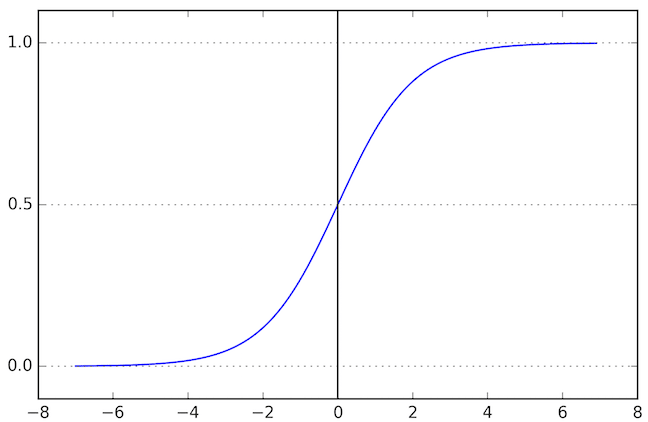
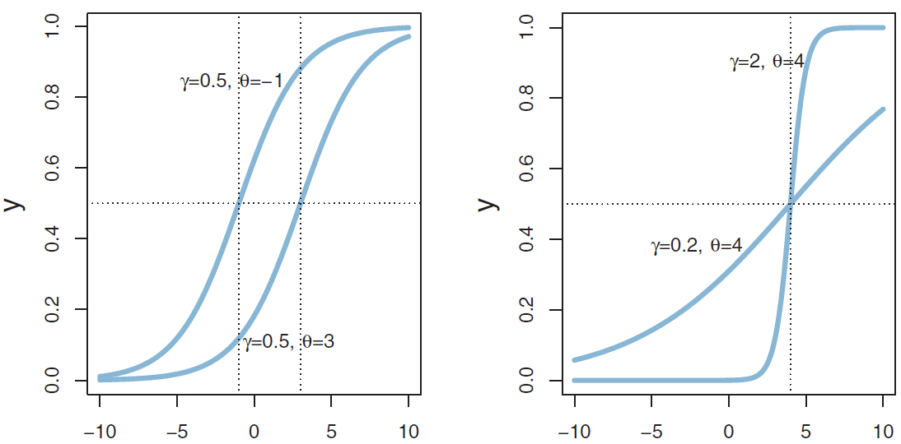
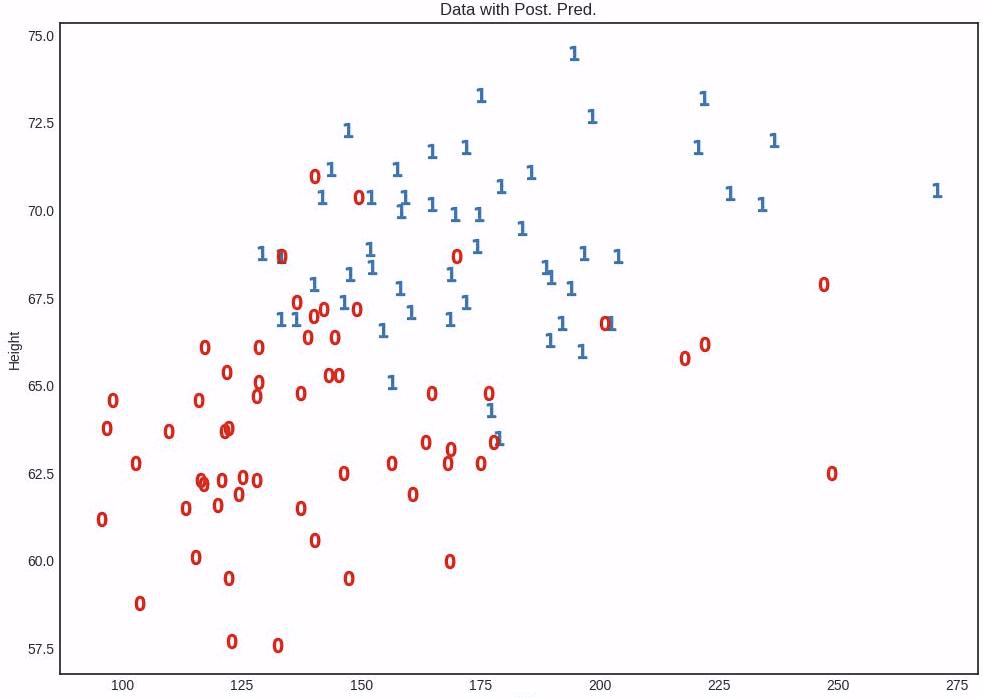
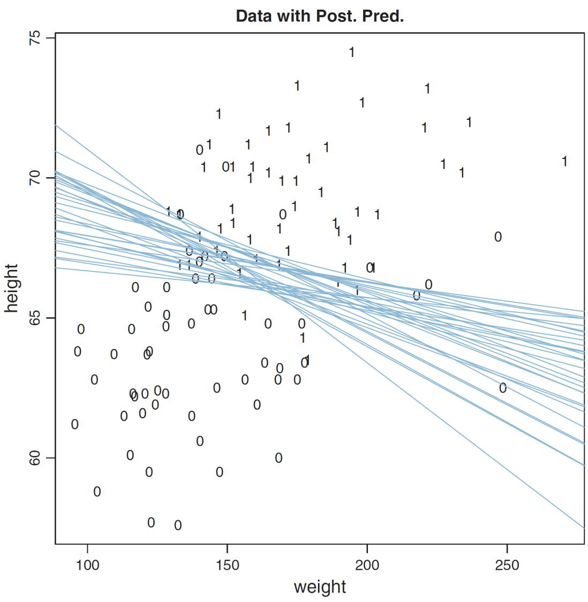
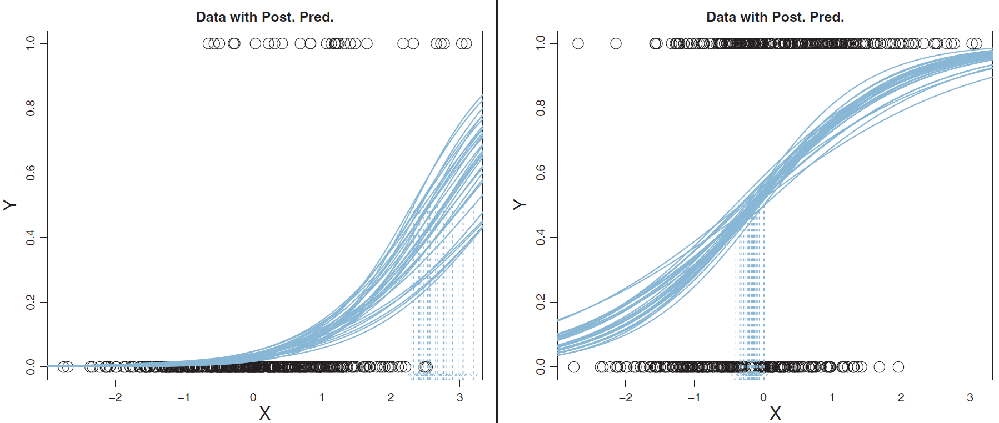
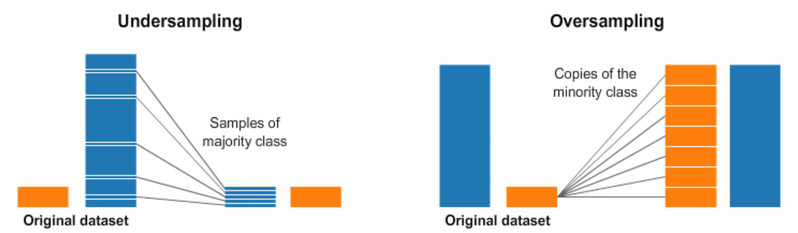
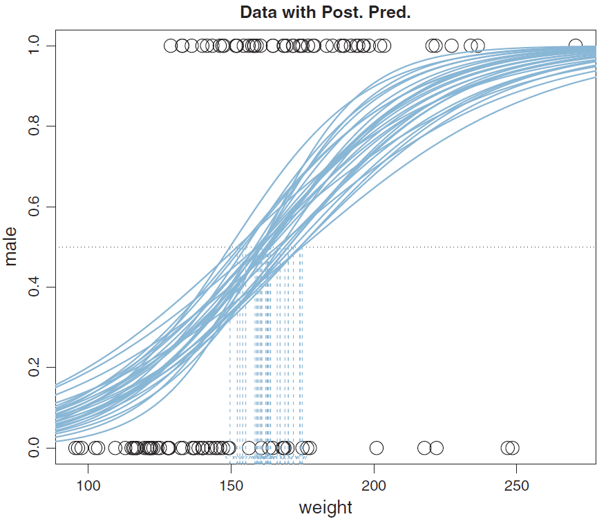
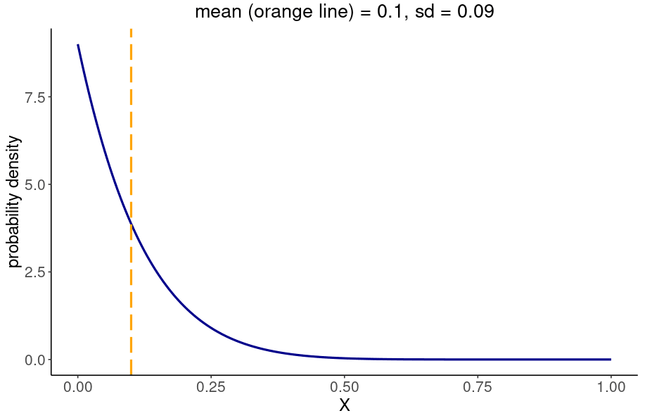
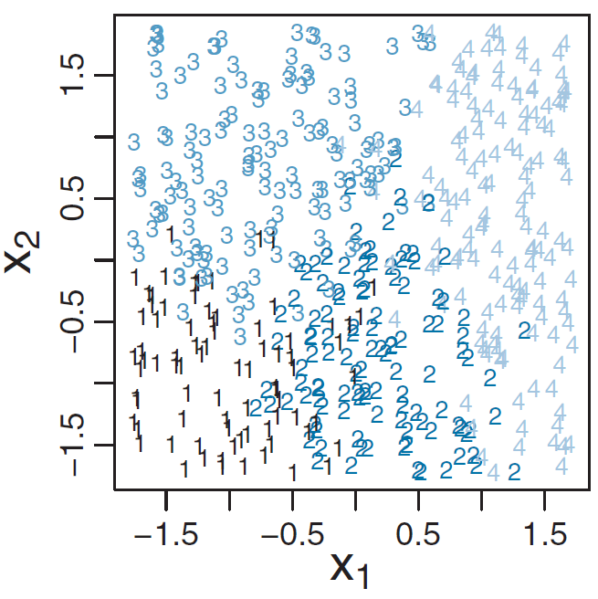
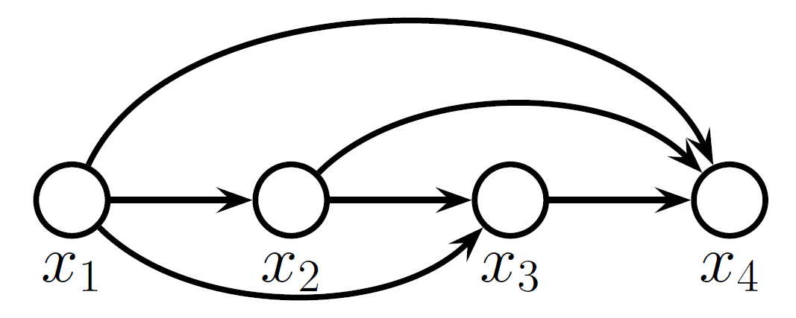

# 第8章 广义线性模型（GLM）：分类

> [!abstract] 本章导览
> 本章把 [[第7章_广义线性模型-回归_笔记|GLM 框架]] 用到**分类**（因变量是类别值）。主线：用**逻辑函数（logistic）**把线性组合压到 $[0,1]$ → **二分类逻辑回归** → 回归系数的 **odds / log odds** 解释 → 三个实战陷阱（**数据不均衡、冗余自变量、异常值**）与 **鲁棒逻辑回归** → MLE 视角下的**交叉熵损失** → 多分类的 **Softmax 回归**与参数不可辨识问题 → 阅读材料：**自回归生成模型**（NADE / RNADE / GPT）。

---

## 1. 从回归到分类：GLM 的统一范式

> [!note] GLM 三段式
> $$\mu=f\big(\mathrm{lin}(x)\big),\qquad y\sim \mathrm{pdf}(\mu,[\text{其他参数}])$$
> - $\mathrm{lin}(\cdot)$ 是自变量的**线性组合**；$f$ 是**反向链接函数（inverse link function）**，把线性组合映射到因变量的**集中趋势** $\mu$。
> - **自变量**可为度量值 / 类别值；**因变量**类型决定问题：度量值→回归，**类别值→分类**，还有顺序值、计数值。

| 问题 | 反向链接函数 $f$ | 分布 | $\mu$ 的含义 |
| --- | --- | --- | --- |
| 回归 | 恒等函数 $f(\mathrm{lin}(x))=\mathrm{lin}(x)$ | 高斯 | 均值 $\mu$ |
| 二分类 | logistic | 伯努利 | 均值 $\mu=\theta=p(y=1)$ |

> [!question] 为什么二分类不能直接用线性回归？
> 伯努利分布的参数 $\mu=\theta\in[0,1]$，而线性组合 $\mathrm{lin}(x)\in(-\infty,+\infty)$。**必须找一个 $f$ 把实数轴压进 $[0,1]$**——这就是逻辑函数。

---

## 2. 逻辑函数与 logit ⭐

### 2.1 逻辑函数（logistic / sigmoid）

$$y=\mathrm{logistic}(x)=\frac{1}{1+e^{-x}},\qquad \mu=\mathrm{logistic}\big(\mathrm{lin}(x)\big)=\frac{1}{1+e^{-\mathrm{lin}(x)}}$$

*逻辑函数是最常用的反向链接函数，又称 sigmoid 函数；输出恰好落在 $[0,1]$，可直接当作 $p(y=1)$。*

### 2.2 两个参数的几何意义

$$y=\mathrm{logistic}(x;\beta_0,\beta_1)=\frac{1}{1+e^{-(\beta_0+\beta_1x)}}=\mathrm{logistic}(x;\gamma,\theta)=\frac{1}{1+e^{-\gamma(x-\theta)}}$$

*$\gamma=\beta_1$ 控制曲线**陡峭程度**；$\theta=-\beta_0/\beta_1$ 控制 **$y=0.5$ 的阈值位置**。*

### 2.3 logit 函数——逻辑函数的反函数

$$\mathrm{logit}(x)=\log\!\Big(\frac{x}{1-x}\Big),\quad 0<x<1,\qquad \mathrm{logit}\big(\mathrm{logistic}(x)\big)=x$$

> [!important] GLM 的两种等价写法
> $$\mu=\mathrm{logistic}\big(\mathrm{lin}(x)\big)\quad\Longleftrightarrow\quad \mathrm{logit}(\mu)=\mathrm{lin}(x)$$
> 名字 logit = "log unit"，这里的 unit 指的就是 **odds**（见 §4）。

---

## 3. 二分类逻辑回归

### 3.1 模型

> [!note] 逻辑回归（Logistic Regression）
> $$\mu=\mathrm{logistic}\Big(\sum_k \beta_k x_k+\beta_0\Big),\qquad y\sim \mathrm{Bernoulli}(\mu)$$
> 参数为 $\beta_k\,(k=1,\dots,K)$ 与截距 $\beta_0$。

### 3.2 数据标准化

> [!tip] 只标准化度量值自变量
> $$z_j=\frac{x_j-\mu_{x_j}}{\sigma_{x_j}},\qquad \mu=\mathrm{logistic}\Big(\sum_j \zeta_j z_j+\zeta_0\Big)$$
> 标准化能缓解斜率与截距的强相关（与 [[第7章_广义线性模型-回归_笔记|回归]]一致），采样更稳定；事后再还原回原始尺度：
> $$\mathrm{logit}(\mu)=\sum_j \frac{\zeta_j}{\sigma_{x_j}}x_j+\Big(\zeta_0-\sum_j\frac{\zeta_j}{\sigma_{x_j}}\mu_{x_j}\Big)$$

### 3.3 例子：用身高、体重预测性别

*二维特征空间中，男女样本部分重叠——不存在能完美分开的硬阈值。*

**只用体重时**（似然 + 先验）：
$$\mu=\mathrm{logistic}(\beta_1 x+\beta_0),\quad p(y\mid\beta_1,\beta_0)=\mathrm{Bernoulli}(y\mid\mu)$$
$$\beta_0\sim\mathrm{normal}(\mu_0,\sigma_0),\quad \beta_1\sim\mathrm{normal}(\mu_1,\sigma_1)$$

> [!example] 结果解读
> - 体重越大 → 是男性的概率越大；$\beta_1$ 的 **HDI 全部大于 0**，方向确定。
> - 曲线**不太陡** → 没有很确定的体重阈值区分男女。

**用身高 + 体重时**：$\mu=\mathrm{logistic}(\beta_2 x_2+\beta_1 x_1+\beta_0)$。

*直线即 $\beta_2x_2+\beta_1x_1+\beta_0=0$（$\mu=0.5$）。**直线越集中→参数越确定**；垂直于直线的方向是**概率变化最快**的方向；身高方向比体重快。*

> [!important] 加入相关自变量后系数会变小
> $\beta_2>\beta_1$ 说明身高方向概率变化更快；而此处 $\beta_1$ 比"只用体重"时**更小**——因为身高与体重相关，身高已包含了体重的部分信息。用"身高+体重"比"只用体重"**更易区分性别**。

---

## 4. 回归系数解释：odds 与 log odds ⭐

$$\mathrm{logit}(\mu)=\beta_2 x_2+\beta_1 x_1+\beta_0$$

> [!note] 核心恒等式
> 在伯努利分布中 $\mu=p(y=1)$，于是
> $$\mathrm{logit}(\mu)=\log\frac{\mu}{1-\mu}=\log\frac{p(y=1)}{p(y=0)}$$
> - $\dfrac{p(y=1)}{p(y=0)}$ 称为**几率 / 概率比值（odds）**；
> - $\log\dfrac{p(y=1)}{p(y=0)}$ 称为**对数几率（log odds）**。

> [!important] 系数的含义
> $x_2$ 每增加 1，右式增加 $\beta_2$ → **log odds 增加 $\beta_2$**（即 $y=1$ 对 $y=0$ 的对数概率比值增加 $\beta_2$）。

> [!example] 数值例子 $\mu=\mathrm{logistic}(0.7x_2+0.02x_1-50)$
> - $x_2=63,x_1=160$：$\mu=0.063$，$\text{log odds}=\log\frac{0.063}{0.937}=-2.7$
> - $x_2=64,x_1=160$：$\mu=0.119$，$\text{log odds}=\log\frac{0.119}{0.881}=-2.0$
> - $x_2$ 增加 1，log odds 恰增加约 $0.7=\beta_2$。✓

---

## 5. 三个实战陷阱

### 5.1 数据不均衡（Class Imbalance）

实际问题中 $y=1$ 与 $y=0$ 的样本常常严重不均衡（如用血压预测心脏病，患病样本极少），分类结果往往不准。

*左图不均衡：$y=0$ 样本多，模型倾向于把 $p(y=0\mid D)$ 抬高，导致阈值右移；右图均衡时阈值居中。*

> [!tip] 解决办法
> 1. **收集阶段**就控制各类别数量均衡；
> 2. **过采样（Over-sampling）**：重复少数类样本；
> 3. **欠采样（Under-sampling）**：删除多数类样本。

*过采样向上补齐少数类，欠采样向下削减多数类。*

### 5.2 冗余自变量（强相关）

> [!warning] 系数不确定性爆炸
> 与回归一致：强相关自变量的系数可互相补偿。例如 $\beta_2 x_2+\beta_1 x_1$ 当 $x_2=x_1$ 时，$\beta_2{+}1$、$\beta_1{-}1$ 结果不变 → $\mu=0.5$ 的分界线非常分散。
> **解决**：建模前先算自变量之间的相关系数，剔除冗余项。

### 5.3 异常值与鲁棒逻辑回归（Robust Logistic Regression）

*异常值（outlier）的存在使曲线**不能太陡**（$\beta_1$ 不能太大，否则这些点的 $p(y=1)$ 会过大），并把**阈值往右拉**。*

> [!note] 鲁棒逻辑回归模型
> 类比[[第7章_广义线性模型-回归_笔记|鲁棒回归]]用学生 t 分布"加尾巴"的思路，这里引入**猜测系数 $\alpha$**：
> $$\mu=\alpha\cdot\tfrac12+(1-\alpha)\,\mathrm{logistic}(\beta_2 x_2+\beta_1 x_1+\beta_0)$$
> 含义：任何样本都有 $\alpha$ 的概率是**随机猜的**（输出 $\tfrac12$）。它把原本接近 0 或 1 的概率往中间拉，从而**容忍异常值**。$\alpha$ 也是待估参数。

*$\alpha\in[0,1]$，用 **Beta 分布**作先验。预期异常值少，故让概率集中在小 $\alpha$ 区，如 $\mathrm{Beta}(\alpha\mid1,9)$，使 $[0.5,1]$ 的概率很小。*

> [!example] 鲁棒回归结果
> - $\alpha$ 峰值接近 0.2 → 数据中确有异常值；曲线**更陡**、阈值**更小**，$\beta_1$ 比普通逻辑回归更大。
> - **相关性**：$\beta_1$ 与 $\alpha$ 强正相关（$\alpha$ 越大曲线可越陡）；$\beta_1$ 与 $\beta_0$ 强负相关（因 $-\beta_0/\beta_1$ 是 $y=0.5$ 的位置）。
> - **另一种思路**：增加其他自变量。模型会自动让含异常值那个自变量的系数变小（如只用体重出问题时，加入身高）。

---

## 6. MLE 视角：交叉熵损失

> [!note] 从似然到损失
> 记 $\hat y=\mathrm{logistic}(\mathrm{lin}(x))$，伯努利似然：
> $$p(D\mid\beta_k)=\prod_i \hat y_i^{\,y_i}(1-\hat y_i)^{1-y_i}$$
> 取负对数似然（NLL）：
> $$-\log p(D\mid\beta_k)=-\sum_i\Big[y_i\log\hat y_i+(1-y_i)\log(1-\hat y_i)\Big]$$

> [!important] 这就是**交叉熵损失（Cross-entropy loss）**——深度学习分类任务的标准损失，本质即逻辑回归的最大似然估计。

---

## 7. 多分类：Softmax 回归 ⭐

### 7.1 模型

> [!note] Softmax 回归（Softmax Regression）
> 每个类别 $k$ 有一组线性组合 $\lambda_k$：
> $$\lambda_k=\sum_j \beta_{j,k}x_j+\beta_{0,k},\qquad \phi_k=\mathrm{softmax}(\lambda_k)=\frac{\exp(\lambda_k)}{\sum_{k^*=1}^{K}\exp(\lambda_{k^*})}$$
> $K$ 为类别数，$\phi_k$ 表示属于第 $k$ 类的概率，即第 $k$ 类的 $\exp(\lambda_k)$ 占比。

### 7.2 为什么是 "soft" 的 max

> [!example] 假设 $\lambda=[1,1,5,3]$，对比三种归一化
>
> | 方法 | 结果 |
> | --- | --- |
> | $\max$（硬）| $[0,0,1,0]$ |
> | 线性占比 $\lambda_k/\sum\lambda$ | $[0.1,0.1,0.5,0.3]$ |
> | **softmax** | $[0.02,0.02,0.85,0.11]$ |
>
> - 相比线性占比，softmax 的 $\exp$ **放大了最大项与其他项的差距**；
> - 相比硬 max，softmax **给非最大项保留一定概率**。
> - 故 softmax 是 **soft 的 max 函数**。

### 7.3 参数不可辨识与参考类别

> [!warning] 平移不变性 → 参数不确定
> 对所有 $k$ 同时令 $\beta'_{j,k}=\beta_{j,k}+\alpha_j$、$\beta'_{0,k}=\beta_{0,k}+\alpha_0$，softmax 输出**完全不变**（分子分母的 $\exp(\sum_j\alpha_j x_j+\alpha_0)$ 约掉）。
> 若不加约束，参数估计不确定性极大。

> [!tip] 解决：设参考类别
> 指定某一参考类别（如第 1 类）令其全部系数为 0：
> $$\lambda_1=\sum_j 0\cdot x_j+0=0$$

### 7.4 Softmax 退化为 Logistic

> [!important] 二分类时 softmax = logistic
> 取类别 0 为参考类别（$\lambda_0=0$）：
> $$\phi_1=\frac{\exp(\lambda_1)}{\exp(\lambda_1)+\exp(\lambda_0)}=\frac{\exp(\lambda_1)}{\exp(\lambda_1)+1}=\frac{1}{1+\exp(-\lambda_1)}=\mathrm{logistic}(\lambda_1)$$
> 逻辑回归是 Softmax 回归在 $K=2$ 时的特例。

### 7.5 多分类例子

*待分类的二维数据：2 个自变量 $x_1,x_2$，4 个类别。*

> [!note] 建模（类别分布 Categorical）
> 类别分布是伯努利分布在 $K$ 类上的推广：$p(y=k\mid\boldsymbol\theta)=\theta_k$，$\sum_k\theta_k=1$。
> $$\phi_k=\mathrm{softmax}(\beta_{2,k}x_2+\beta_{1,k}x_1+\beta_{0,k}),\quad y\sim\mathrm{categorical}(\{\phi_k\})$$
> 先验 $\beta_{0,k}\sim\mathrm{normal}(\mu_0,\sigma_0)$，$\beta_{j,k}\sim\mathrm{normal}(\mu_{j,k},\sigma_{j,k})$；第 1 类的 $\beta$ 全设为 0。

*$\beta_{j,k}$ 的**相对大小**才有意义（绝对值不重要）：$\beta_{j,k}$ 大 → $x_j$ 越大越可能属于第 $k$ 类。例如类别 4 的 $\beta_1$ 最大（$x_1$ 够大就属类别 4）；类别 3 的 $\beta_2$ 最大且 $\beta_1$ 很小（$x_2$ 够大且 $x_1$ 不太大就属类别 3）。*

---

## 8. 阅读材料：自回归生成模型

> [!note] 判别 vs 生成
> 前面是**判别模型**（建模 $p(y\mid x)$）。**生成模型**常以最大化**边缘似然 $p(x)$**（marginal likelihood）为目标——不限定特定模型，找使 $p(x)$ 最大的模型；而普通似然 $p(x\mid\theta)$ 是在固定模型内找最优 $\theta$。

***自回归模型（Auto-regressive models）**：用链式法则 $p(x_{1:T})=\prod_t p(x_t\mid x_{1:t-1})$ 把联合分布拆成逐步条件概率。*

> [!example] 三种自回归密度估计器
> - **NADE**：$p(x_t\mid x_{1:t-1})=\mathrm{Bernoulli}(x_t\mid\theta)$，$\theta=f(x_{1:t-1})$，用于二值图像生成。
> - **RNADE**：实值版本，$p(x_t\mid x_{1:t-1})=\sum_k\pi_{t,k}\,\mathcal N(x_t\mid\mu_{t,k},\sigma_{t,k}^2)$ 为**混合高斯**。
> - **GPT 类序列生成**：用 masked self-attention 得 $z_t=\sum a_t y_t$，经 MLP 得 $h_t$，最终 $p(y_{t+1}\mid y_{1:t})=\mathrm{Cat}(\mathrm{Softmax}(W h_t))$——**注意最后一步正是 Softmax 多分类**。

> [!info] GPT 发展脉络
> GPT(2018) → GPT-2(2019, 15 亿参数) → GPT-3(2020, 1750 亿参数, 3000 亿词) → GPT-3.5(2022, 引入人类反馈 RLHF) → ChatGPT。其核心生成机制即上述自回归 + Softmax。

---

## 本章小结

> [!summary] 一图流
> - **二分类**：$\mathrm{logit}(\mu)=\mathrm{lin}(x)$，即逻辑回归；系数 = **log odds** 的增量。
> - **三大陷阱**：数据不均衡（采样平衡）、冗余自变量（查相关系数）、异常值（鲁棒逻辑回归，引入猜测系数 $\alpha$）。
> - **MLE** 下逻辑回归 = **交叉熵损失**。
> - **多分类**：Softmax 回归；存在平移不变性 → 设参考类别；$K=2$ 时退化为 logistic。
> - **生成模型**：自回归链式分解，GPT 末端用 Softmax 预测下一 token。

> [!question] 自测题
> 1. 为什么二分类要用逻辑函数而非恒等链接？logistic 与 logit 是什么关系？
> 2. $\beta_1=0.7$ 在逻辑回归中如何用 odds / log odds 解释？
> 3. 数据不均衡为什么会让阈值偏移？过采样与欠采样分别怎么做？
> 4. 鲁棒逻辑回归的猜测系数 $\alpha$ 起什么作用？为什么 $\alpha$ 与 $\beta_1$ 正相关、$\beta_0$ 与 $\beta_1$ 负相关？
> 5. 交叉熵损失与逻辑回归的最大似然估计是什么关系？
> 6. Softmax 回归为什么需要设置参考类别？证明 $K=2$ 时它退化为 logistic。
> 7. 自回归模型如何分解联合分布？GPT 生成下一个 token 时用了本章哪个函数？
