# 第4章 处理器

> [!abstract] 本章主线（全书最核心章）
> 从指令的经典 5 段执行出发，先搭建**单周期数据通路 + 控制器**，再演进到**流水线**：流水线概述 → 流水线数据通路与控制 → 三类冒险（结构/数据/控制）→ 前递与停顿 → 分支预测。

## 4.1 引言

> [!important] 性能与实现方式
> CPU 性能由**指令数 × CPI × 时钟周期**决定。指令数由编译器与 ISA 决定；**CPI 与时钟周期由处理器实现方式决定**——这正是本章研究对象。本章实现 RISC-V 核心子集：`ld`/`sd`、`add/sub/and/or`、`beq`。

> [!note] 指令的经典 5 段执行
> **取指 IF → 译码 ID → 执行 EX → 访存 MEM → 写回 WB**
> - MEM 是"访问数据内存"，**仅 load/store 用到**（add 等在 MEM 阶段空操作）。
> - 所有指令前两步相同：① PC 取指；② 读寄存器。之后都用 ALU。

> [!important] 完整的单周期数据通路（含控制单元）
> 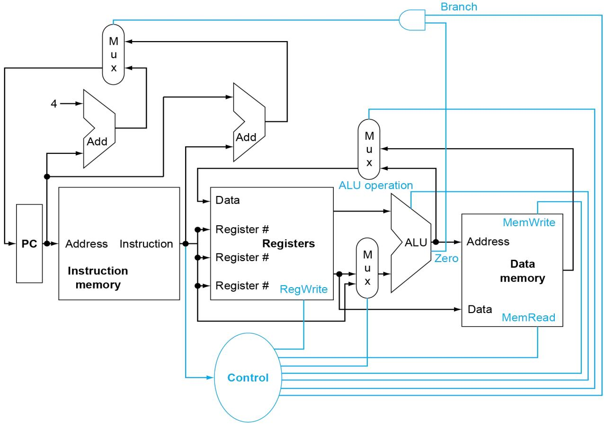
> 基本框图缺两样东西：① **多选器（Mux）**——多个数据源汇入同一单元须选择；② **控制单元 + 控制线**。控制单元以指令为输入，为功能单元和多选器产生控制信号。

## 4.2 逻辑设计的一般方法

> [!note] 组合逻辑 vs 状态单元
> - **组合逻辑**：输出仅依赖当前输入（如 ALU、加法器、多选器、逻辑门）。
> - **状态单元**：有内部存储（指令存储器、数据存储器、寄存器、PC）。

> [!important] 边沿触发时钟同步
> 所有状态单元**只在时钟边沿写入**（Clk 0→1）。一个周期内：先用组合逻辑算新值 → 边沿写入状态单元，**天然读写分离**，避免数据竞争。
> - **写控制信号**：状态单元不是每周期都更新时需要它（如 `ld/add/sub` 写寄存器，`sd/beq` 不写）。仅"边沿到来 **且** 写控制有效"才更新。
> - **约束**：组合逻辑输出须在边沿前稳定；同周期内不能有反馈。

## 4.3 建立数据通路

> [!note] 数据通路单元
> 指令存储器（只读，组合逻辑）、PC（每周期末写、无需写控制）、加法器（ALU 求和）、寄存器堆、数据存储器、立即数生成单元（Imm Gen）。

> [!example] 分模块构建
> - **取指**：PC → 指令存储器取指；同时 PC+4 算下一条地址。
> - **读/写寄存器**：寄存器堆按号读出 Read data 1/2；写需 `RegWrite` 控制。
> - **R 型**：读两寄存器 → ALU 运算 → 写回。
> - **存取**：读寄存器 → ALU 算地址（基址 + 符号扩展的 12 位偏移）→ load 读内存写回 / store 写内存。
> - **分支 beq**：ALU 做减法查 Zero → 目标地址 = PC + (偏移符号扩展后左移 1 位)。

> [!important] 整合的简单数据通路（R 型 / Load / Store / Branch）
> 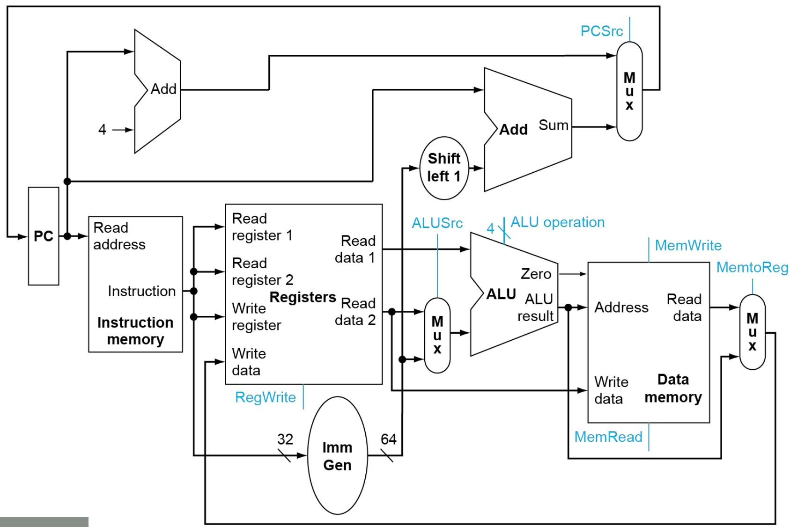
> 三个关键多选器：**ALUSrc**（ALU 第二操作数）、**MemtoReg**（写回数据来源）、**PCSrc**（下一条 PC）。R 型与存取指令共享一套寄存器堆 + ALU。

> [!tip] 分支偏移"左移 1 位"
> 汇编器存储时偏移 ÷2，硬件执行时 ×2 还原（地址按半字对齐），寻址范围扩大到 ±4096 字节。

## 4.4 一个简单的实现方案（控制器）

> [!important] ALU 控制（两级译码）
>
> | ALU 控制 | 功能 |
> |---|---|
> | 0000 | AND |
> | 0001 | OR |
> | 0010 | add（load/store 算地址、R 型加）|
> | 0110 | subtract（beq、R 型减）|
>
> ALU 控制单元的输入 = 主控制单元的 **2 位 ALUOp** + 指令的 **funct7、funct3**。ALUOp：`00`=load/store(加)、`01`=beq(减)、`10`=R 型(看 funct 决定)。

> [!important] 主控制单元：控制信号真值表（必背）
>
> | 指令 | ALUSrc | MemtoReg | RegWrite | MemRead | MemWrite | Branch | ALUOp |
> |---|:--:|:--:|:--:|:--:|:--:|:--:|:--:|
> | **R 型** | 0 | 0 | 1 | 0 | 0 | 0 | 10 |
> | **ld** | 1 | 1 | 1 | 1 | 0 | 0 | 00 |
> | **sd** | 1 | X | 0 | 0 | 1 | 0 | 00 |
> | **beq** | 0 | X | 0 | 0 | 0 | 1 | 01 |
>
> 控制信号含义：ALUSrc（ALU 第二操作数选立即数）、MemtoReg（写回选内存数据）、PCSrc（选分支目标，由 Branch AND Zero 得出）。

> [!example] 带控制信号的完整单周期数据通路
> 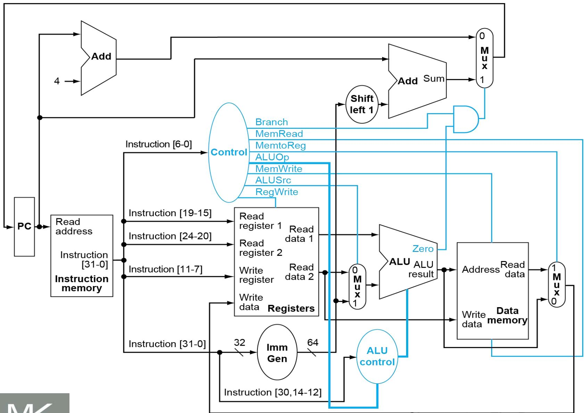
> 指令码取出后**并行**送往：主控制单元(opcode)、寄存器堆(rs1/rs2)、立即数生成单元、ALU 控制单元(funct)。

> [!warning] 单周期实现的致命缺陷 → 引出流水线
> 时钟周期由**最长指令（load：指存→寄存器→ALU→数存→寄存器）**决定，所有指令被迫迁就最慢的，违背"加速经常性事件"。解决方案：**流水线**。

## 4.5 流水线概述

> [!important] 流水线思想与加速比
> 流水线让多条指令**重叠执行**（5 阶段 IF/ID/EX/MEM/WB），阶段间插入**流水线寄存器**。
> $$
> \text{指令执行时间}_{流水线} = \frac{\text{指令执行时间}_{非流水线}}{\text{流水线级数}}
> $$
> 理想条件下加速比≈级数。**流水线提高的是吞吐率，不是单条指令延迟**。
> 例（各阶段：访存 200ps、ALU 200ps、寄存器 100ps）：单周期 ld=800ps；流水线 Tc=200ps（最长阶段决定）。

> [!example] 流水线时空图：5 条指令重叠执行（理解流水线的关键）
> 同一时刻不同指令处于不同阶段，沿对角线推进：
>
> | 指令＼周期 | C1 | C2 | C3 | C4 | C5 | C6 | C7 | C8 | C9 |
> |---|:--:|:--:|:--:|:--:|:--:|:--:|:--:|:--:|:--:|
> | `ld x10,40(x1)`  | IF | ID | EX | MEM | WB |    |    |    |    |
> | `sub x11,x2,x3`  |    | IF | ID | EX | MEM | WB |    |    |    |
> | `add x12,x3,x4`  |    |    | IF | ID | EX | MEM | WB |    |    |
> | `ld x13,48(x1)`  |    |    |    | IF | ID | EX | MEM | WB |    |
> | `add x14,x5,x6`  |    |    |    |    | IF | ID | EX | MEM | WB |
>
> **填满后每个时钟周期完成一条指令**（吞吐率 1 条/周期）。对比：3 条 ld 单周期需 3×800=2400ps；流水线只需 **1400ps**（首条 1000ps，后续每条 +200ps）。

> [!note] RISC-V 为流水线而设计
> ① 指令等长（简化取指/译码）；② 格式少且 rs1/rs2 位置固定；③ 存储器操作数只在 load/store（EX 算地址、MEM 访存分两阶段）。

> [!important] 三类冒险（Hazard）
>
> | 冒险 | 成因 | 解决 |
> |---|---|---|
> | **结构冒险** | 多条指令同周期争用同一硬件 | 资源分离（指令/数据存储器分开）|
> | **数据冒险** | 后条指令需要前条尚未写回的结果 | **前递/旁路（Forwarding）** |
> | **控制冒险** | 分支结果未定就已取后续指令 | 分支预测 / 停顿 |

> [!example] 数据冒险与前递
> `add x19,x0,x1` 后紧跟 `sub x2,x19,x3`：x19 在 add 的 EX 末就算出，可**前递**到 sub 的 EX 输入，无需等写回——省去 2 周期停顿。
> **载入-使用冒险**：load 的数据要到 MEM 末才得到，紧随的使用指令即使前递也必须**停顿 1 周期（气泡）**。编译器可**重排指令**（把无关指令插到 load 后）来消除该气泡。

> [!note] 控制冒险与分支预测
> 分支是否跳转、目标地址常要到 EX 才确定，之前已按顺序取错指令。
> - **方法1（静态）**：总预测"不跳转"，预测错则冲刷。
> - **方法2（静态改进）**：循环底部分支预测"跳转"（回到循环顶部）。
> - **动态预测**：见 4.8。

## 4.6 流水线数据通路与控制

> [!important] 流水线寄存器
> 五阶段之间插入四个流水线寄存器：**IF/ID、ID/EX、EX/MEM、MEM/WB**，保存指令在阶段间流动所需的全部信息（数据 + 控制信号）。WB 阶段无需流水线寄存器（结果直接写回寄存器堆）。
> 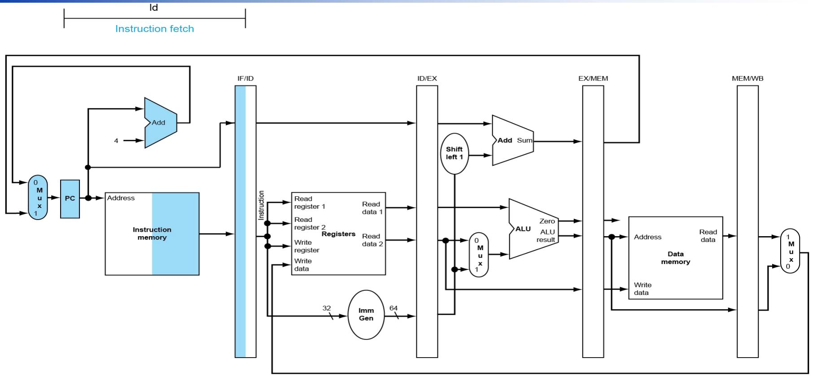

> [!example] 流水线的图形化表示：三种画法
> 教材用三种图来"看见"流水线的重叠执行——前两种看**整体重叠**，第三种看**某一周期的硬件占用**。
>
> **① 多时钟周期流水线图**：每条指令画成 `IM→Reg→ALU→DM→Reg` 的资源序列，逐条向右下错开一格，一眼看出同一时刻各指令处于不同阶段、整体流水重叠。
> 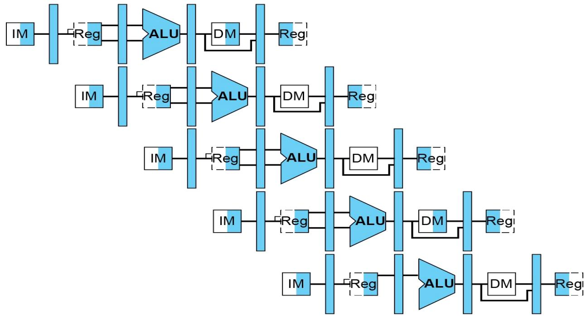
>
> **② 传统画法（指令×周期网格）**：纵轴为程序执行顺序的指令、横轴为时钟周期 CC1–CC9，每格标该指令在该周期所处的阶段。
> 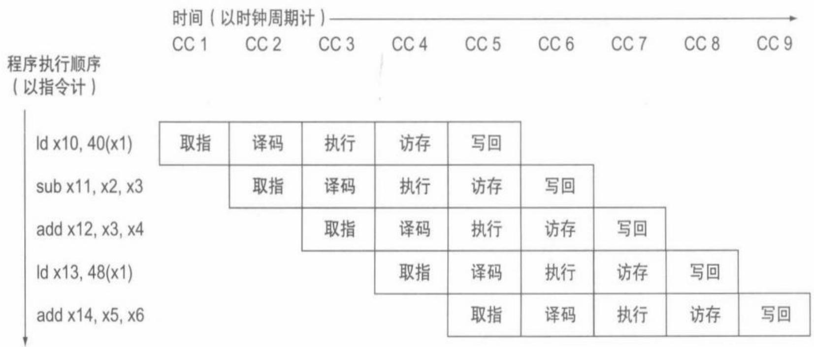
>
> **③ 单时钟周期图**：只画**某一个时钟周期**（如第 5 周期）的快照。此刻 5 条指令同时在流水线中，各占带流水线寄存器的数据通路的一段硬件：
>
> | 当前周期所处阶段 | IF 取指 | ID 译码 | EX 执行 | MEM 访存 | WB 写回 |
> |---|---|---|---|---|---|
> | **正在执行的指令** | `add x14,x5,x6` | `ld x13,48(x1)` | `add x12,x3,x4` | `sub x11,x2,x3` | `ld x10,40(x1)` |
> 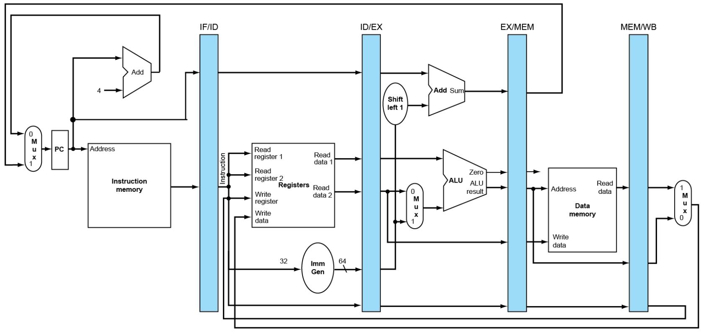

> [!note] 流水线控制：控制线按阶段分组
> 控制信号在 ID 阶段一次生成，放入 ID/EX 流水线寄存器，**逐阶段向下传递**、各取所需：
>
> | 阶段 | 使用的控制线 |
> |---|---|
> | EX | ALUOp、ALUSrc |
> | MEM | Branch、MemRead、MemWrite |
> | WB | RegWrite、MemtoReg |
>
> 7 条控制线：EX 用 2 条，剩 5 条传到 EX/MEM；MEM 用 3 条，剩 2 条传到 MEM/WB 供 WB 用。

## 4.7 数据冒险：前递与停顿

> [!important] 前递条件（命名：流水线寄存器.字段）
> **EX 冒险（EX→EX 旁路）**：
> ```
> if (EX/MEM.RegWrite and EX/MEM.RegisterRd≠0 and EX/MEM.RegisterRd==ID/EX.RegisterRs1) ForwardA=10
> ```（Rs2 → ForwardB=10）
> **MEM 冒险（MEM→EX 旁路）**：
> ```
> if (MEM/WB.RegWrite and MEM/WB.RegisterRd≠0 and MEM/WB.RegisterRd==ID/EX.RegisterRs1) ForwardA=01
> ```（Rs2 → ForwardB=01）
> ForwardA/B：`00`=寄存器堆、`10`=EX/MEM 前递、`01`=MEM/WB 前递。注意 `Rd≠0`（x0 恒 0 不前递），且 EX 冒险优先于 MEM 冒险。寄存器堆本身"前半周期写、后半周期读"提供了一种内部前递。
> 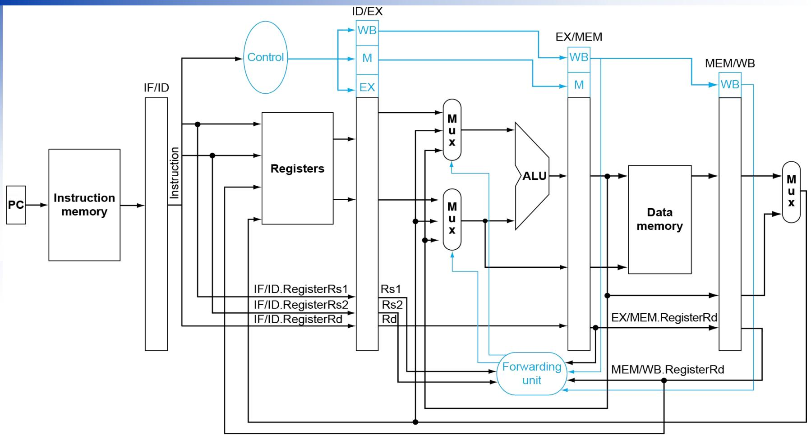

> [!example] 前递时空图（消除数据冒险，无需停顿）
> `sub x2,x1,x3` 算出的 x2 被后续指令立即需要：
>
> | 指令＼周期 | C1 | C2 | C3 | C4 | C5 | C6 |
> |---|:--:|:--:|:--:|:--:|:--:|:--:|
> | `sub x2,x1,x3`  | IF | ID | **EX** | MEM | WB |    |
> | `and x12,x2,x5` |    | IF | ID | **EX** | MEM | WB |
> | `or x13,x6,x2`  |    |    | IF | ID | **EX** | MEM |
>
> - **EX→EX 前递**：sub 在 C3 末（EX/MEM 寄存器）已算出 x2 → 直接送 `and` 的 C4 EX 输入。
> - **MEM→EX 前递**：sub 结果在 C4 末（MEM/WB 寄存器）→ 送 `or` 的 C5 EX 输入。
> 两条前递路径都让流水线**全速运行、零停顿**。
>
> 下图把这段相关序列画成多时钟周期流水线图：`sub` 算出的结果（顶部高亮 Reg）用蓝色箭头前递给后续指令的 EX 输入——箭头**向左下回指**（数据要送给更早阶段）的就是"存在数据冒险"、必须前递的 `and`/`or`；箭头**向右下/同周期**的 `add`/`sd` 则"不存在数据冒险"（寄存器堆前半周期写、后半周期读即可拿到）。
> 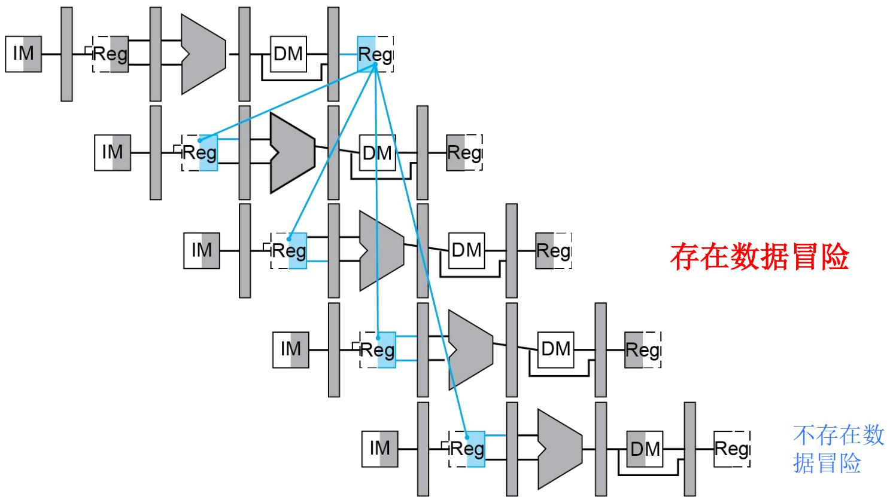

> [!warning] 加载-使用冒险必须停顿
> load 数据要到 MEM 末才得到，紧随的使用指令在 EX 就需要它，前递也救不了 → 必须**停顿 1 周期**。**冒险检测单元**（ID 阶段）：
> ```
> if (ID/EX.MemRead and (ID/EX.RegisterRd==IF/ID.RegisterRs1 or ==IF/ID.RegisterRs2)) 停顿
> ```
> 停顿实现：冻结 PC 和 IF/ID 寄存器（指令重取/重译），并把 ID/EX 的 EX/MEM/WB 控制信号清 0 插入**气泡（nop）**。
>
> | 指令＼周期 | C1 | C2 | C3 | C4 | C5 | C6 | C7 |
> |---|:--:|:--:|:--:|:--:|:--:|:--:|:--:|
> | `ld x2,20(x1)`  | IF | ID | EX | **MEM** | WB |    |    |
> | `and x4,x2,x5`  |    | IF | ID | 🫧气泡 | **EX** | MEM | WB |
>
> ld 的数据在 C4 末（MEM）才取到，而 `and` 原本 C4 就要 EX → 冲突。插入 1 个气泡使 `and` 的 EX 推到 C5，正好接收 ld 的 **MEM→EX 前递**。前递只能省去 1 个停顿，无法完全消除（数据来不及）。
>
> 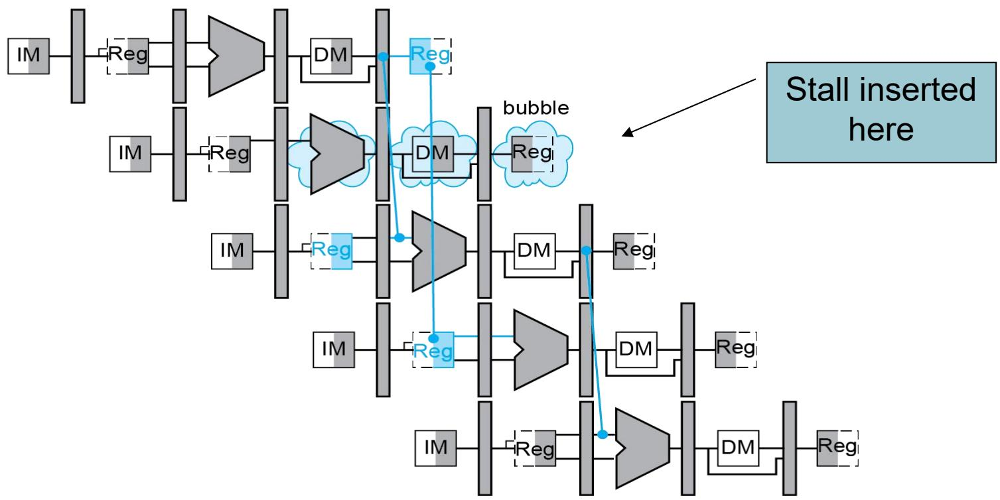

## 4.8 控制冒险与分支预测

> [!note] 控制冒险的代价
> 分支在 **MEM 阶段**才确定是否跳转，其后已取的 **3 条指令**可能要冲刷。两种缓解：
> - **假设分支不发生**：预测不跳，错了就把 IF/ID/EX 三条指令清 0。
> - **缩短分支延迟**：把分支判断和目标地址计算**提前到 ID 阶段** → 只需冲刷 **1 条**（IF 阶段那条），用 **IF.Flush** 将其变 nop。

> [!important] 动态分支预测
>
> | 预测器 | 机制 | 缺点 |
> |---|---|---|
> | **1 位预测器** | 1 位记录上次跳/不跳 | 循环首末各错一次，连续循环"**会错两次**" |
> | **2 位饱和计数器** | 需连续错两次才改变预测 | 解决了 1 位的边界双错问题 |
> | **相关预测器** | 结合"最近 m 条分支历史" + 局部 | 单一历史不够准时 |
> | **锦标赛预测器** | **局部预测器 + 全局预测器 + 选择器**（选择器本身是 2 位饱和计数器，动态选用更准的那个） | 硬件复杂 |

> [!important] 本章最终的数据通路与控制
> 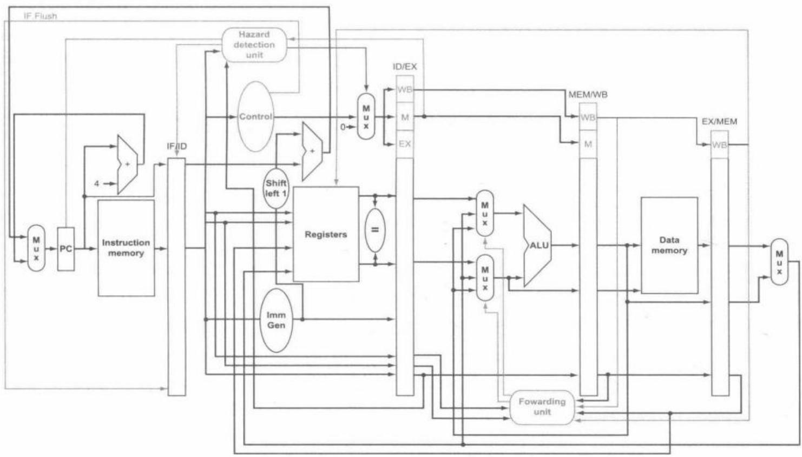
> 集成了前递、冒险检测、分支提前与冲刷——这是支持三类冒险处理的完整流水线处理器。

## 4.14 谬误与陷阱

> [!warning]
> - **谬误**：流水线很简单 —— 实则冒险处理（前递/停顿/冲刷）相当复杂。
> - **谬误**：流水线设计可脱离工艺技术 —— 流水线级数、时钟受工艺制约。
> - **陷阱**：指令集设计不佳会严重拖累流水线（变长指令、复杂寻址都增加冒险与控制难度）——这正是 RISC-V 为流水线而精简设计的原因。

---

> [!summary] 本章小结
> - 单周期数据通路 = 取指 + 寄存器 + ALU + 访存 + 写回，靠**控制单元**按指令产生控制信号（ALUSrc/MemtoReg/RegWrite/MemRead/MemWrite/Branch/ALUOp）。
> - 单周期受最慢指令拖累 → **流水线**重叠执行提高吞吐率（加速比≈级数）。
> - 三类冒险：**结构**（资源分离）、**数据**（前递；加载-使用须停顿）、**控制**（分支提前 + 预测）。
> - 前递靠 ForwardA/B 多选器 + Forwarding unit；停顿靠 Hazard detection unit 插气泡。
> - 动态预测：1 位 → 2 位饱和 → 相关 → 锦标赛。

> [!question] 自测题
> 1. 写出 R 型/ld/sd/beq 四类指令的控制信号真值表。
> 2. 单周期实现为什么受 load 指令制约？流水线如何改善？
> 3. 写出 EX 冒险与 MEM 冒险的前递判定条件，并说明为何要排除 Rd=0。
> 4. 为什么"加载-使用"冒险即使有前递也必须停顿一个周期？冒险检测单元如何插入气泡？
> 5. 分支判断从 MEM 提前到 ID，冲刷指令数如何变化？IF.Flush 起什么作用？
> 6. 1 位预测器为什么在循环边界"会错两次"？2 位饱和计数器如何改进？

> [!info] 关联章节
> 性能公式见 [[Chapter_01_计算机抽象及相关技术_笔记|第1章]]；指令格式（R/I/S/B）见 [[Chapter_02_指令_计算机的语言_笔记|第2章]]；存储层次见 [[Chapter_05_层次化存储_笔记|第5章]]。


