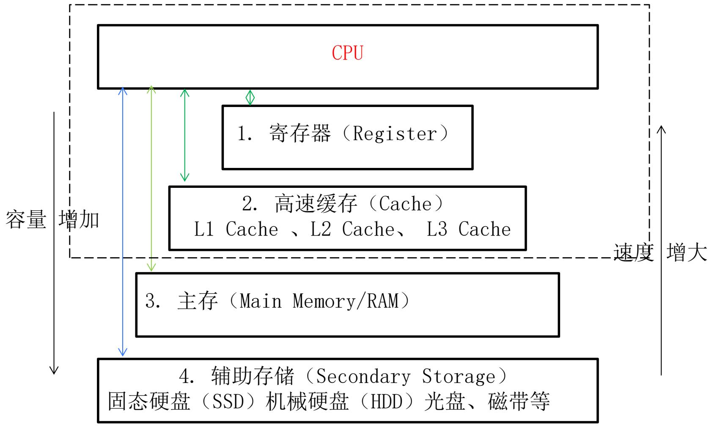
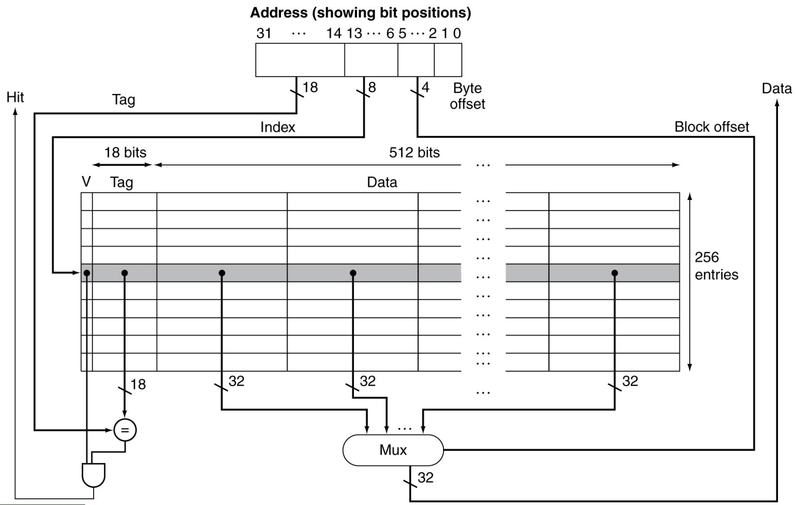
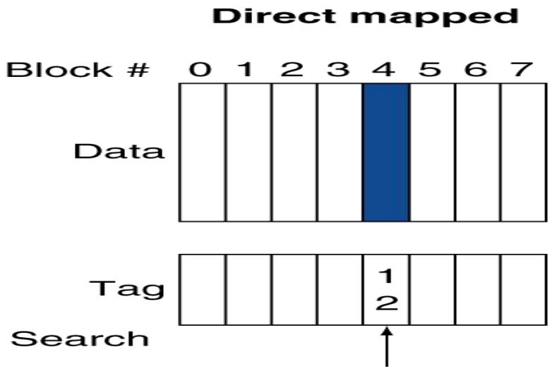
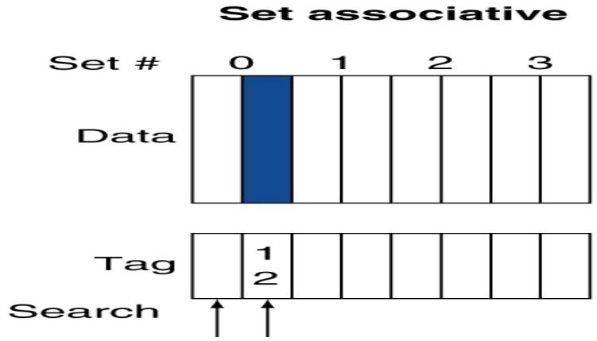
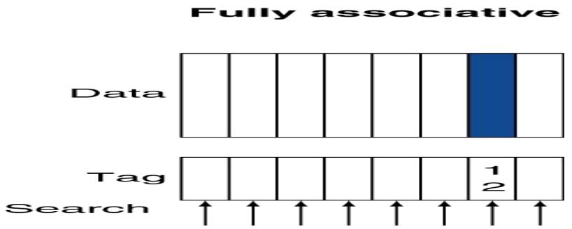
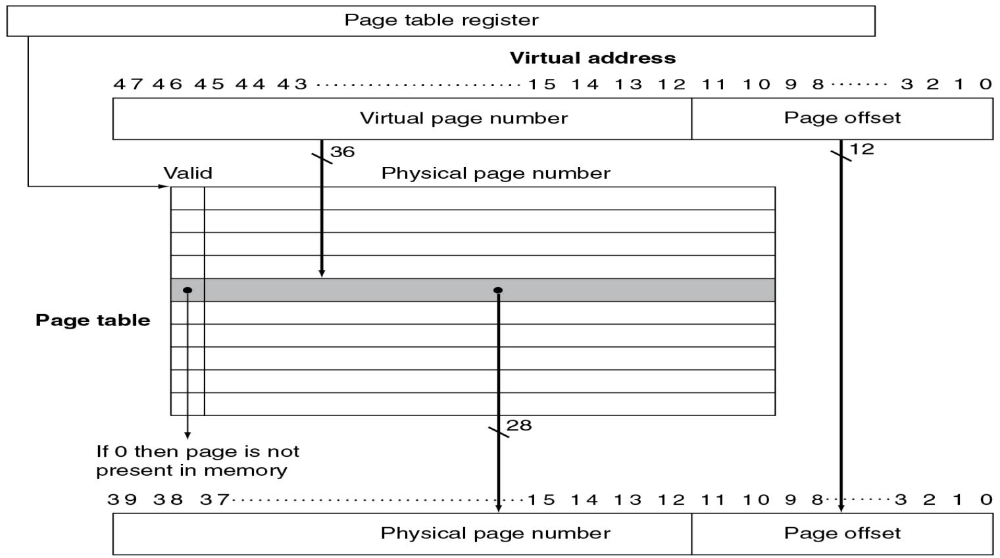
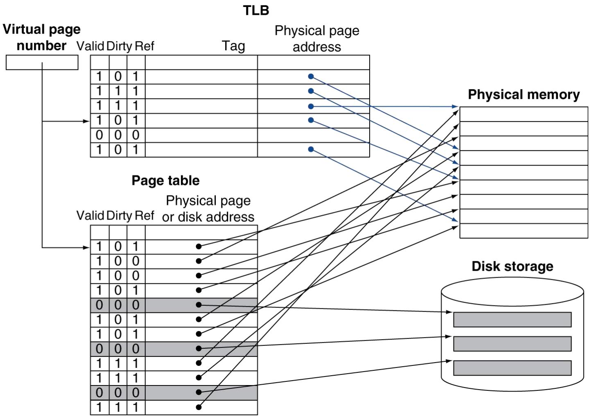

# 第5章 大而快：层次化存储

> [!abstract] 本章主线
> 利用**局部性原理**构建存储层次：从存储技术（SRAM/DRAM/闪存/磁盘）→ **Cache**（映射方式、性能、失效）→ **虚拟存储**（页表、TLB）→ 可靠性（汉明码）。目标：用少量快存储 + 大量慢存储，逼近"又大又快又便宜"。

## 5.1 引言：局部性原理

> [!important] 程序局部性（Locality）
> - **时间局部性（Temporal）**：刚访问的数据/指令很可能**很快再次**访问（如循环变量 sum、控制变量 i、循环体指令）。
> - **空间局部性（Spatial）**：访问某地址后，很可能访问其**邻近**地址（如数组顺序遍历、顺序执行的指令）。

> [!important] 存储层次结构
> 
> 越靠近 CPU：越快、越小、越贵（SRAM）；越远：越慢、越大、越便宜（磁盘）。利用局部性把常用数据放在上层。

> [!note] 核心术语
>
> | 术语 | 含义 |
> |---|---|
> | **块/行(block/line)** | 层次间复制的最小单位 |
> | **命中(hit)** | 要的数据在本层 → 命中率 = 命中次数/访问次数 |
> | **缺失(miss)** | 不在本层，须从下层取 → 缺失率 = 1 − 命中率 |
> | **命中时间** | 访问本层 + 判断命中的时间 |
> | **缺失损失(miss penalty)** | 从下层取块到本层的时间 |

## 5.2 存储技术

> [!note] 四种核心存储技术
>
> | 技术 | 单元结构 | 特点 |
> |---|---|---|
> | **SRAM** | 每比特 6~8 个晶体管 | 快、固定访问时间、待机功耗低、贵、密度低 → 做 **Cache** |
> | **DRAM** | 1 个晶体管 + 1 个电容 | 密度高、便宜、慢、**需定期刷新**（电容漏电）→ 做**主存** |
> | **闪存(Flash)** | 浮栅晶体管 | 非易失、有**写入磨损**（擦写次数有限）→ 做 **SSD** |
> | **磁盘(HDD)** | 磁性盘片 | 容量大、最便宜、最慢、非易失 |

> [!example] 磁盘结构与寻址
> 多盘片：**盘片(platter) → 磁道(track) → 扇区(sector)**；所有盘片同半径磁道构成**柱面(cylinder)**。
> $$
> \text{磁盘访问时间} = \text{寻道时间(seek)} + \text{旋转延迟(rotation)} + \text{传输时间(transfer)} + 控制器开销
> $$
> 旋转延迟平均 = 半圈时间 = $\frac{1}{2} \times \frac{60}{\text{转速 RPM}}$。

## 5.3 Cache 基础

> [!important] 直接映射 Cache（Direct Mapped）
> 
> 地址划分：
> - **Block offset（块内偏移）**：定位块内字节
> - **Index（索引）**：直接定位 Cache 中的行（块号 mod Cache 行数）
> - **Tag（标记）**：与该行存的 Tag 比较，相等且 **Valid=1** 才命中
>
> 内存块地址 = 字节地址 / 每块字节数；映射行 = 块地址 mod 行数。

> [!note] 三种映射方式
>
> | 方式 | 放置规则 | 冲突 | 比较器 |
> |---|---|---|---|
> | **直接映射** | 块只能放固定一行 | 冲突缺失多 | 1 个 |
> | **组相联(n 路)** | 块映射到某组，组内任意路 | 折中 | n 个 |
> | **全相联** | 块可放任意行 | 冲突最少 | 全部（贵）|

> [!example] 三种映射的放置规则对比：主存块 12 能放进 8 块 Cache 的哪里？
> 同一个主存块 12，在三种组织方式下"可放位置"和"查找时要比较几个 Tag"截然不同（图中蓝色块=可放位置、底部箭头=需要并行比较 Tag 的位置）：
>
> **① 直接映射**：只能放唯一位置 `12 mod 8 = 4` 号块，查找**只比 1 个 Tag**——快，但易冲突。
> 
>
> **② 两路组相联**：先定组 `12 mod 4 = 0` 组，再放进组内任意一路，查找**比 2 个 Tag**——速度与冲突折中。
> 
>
> **③ 全相联**：可放任意一块，查找需**并行比 全部 8 个 Tag**——冲突最少，但比较器最多、最贵。
> 

> [!example] 三种映射的命中/缺失对比（4 块 Cache，访问块序列 0,8,0,6,8）
> 同一访问序列，相联度越高失效越少（直接映射块号 mod 4，块 0 与 8 都映射到行 0 反复冲突）：
>
> | 访问块 | 直接映射(4 行) | 两路组相联(2 组) | 全相联(4 块) |
> |:--:|:--:|:--:|:--:|
> | 0 | 缺失 | 缺失 | 缺失 |
> | 8 | 缺失(挤掉0) | 缺失 | 缺失 |
> | 0 | 缺失(挤掉8) | **命中** | **命中** |
> | 6 | 缺失 | 缺失 | 缺失 |
> | 8 | 缺失 | 缺失(LRU挤0) | **命中** |
> | **总失效** | **5** | **4** | **3** |
>
> 直接映射的 0/8 互相挤占（**冲突缺失**）；提高相联度即可消除——这正是相联度降低失效率的直观原因。

> [!warning] 块大小的权衡
> - 块**增大** → 利用空间局部性、缺失率先降；但块过大、行数变少 → 缺失率反**回升**（临界点）。
> - 块增大 → **缺失损失增加**（搬运更多数据）。需在缺失率与缺失损失间折中。

> [!note] Cache 失效处理
> 命中：直接读。缺失：暂停 CPU/流水线 → 从下层取块填入 → 重新访问。写策略见下节（写直达/写回）。

## 5.4 Cache 性能评估与改进

> [!important] 平均访存时间与 CPU 时间
> $$
> \text{AMAT} = \text{命中时间} + \text{缺失率} \times \text{缺失损失}
> $$
> $$
> \text{实际 CPI} = \text{基准 CPI} + \text{每条指令的存储停顿周期数}
> $$

> [!note] 相联度、替换、容量
> - **相联度↑ → 失效率↓**，但收益递减（过 2/4 路后几乎不再改善），且比较器/延迟/功耗上升 → 实际多用 **2 路或 4 路**。
> - **替换策略 LRU**（最近最少使用）：替换最久未用的块。
> - **标签容量例题**：4096 块、块 16 字节、64 位地址（60 位给 index+tag）。直接映射 index=12 位 → tag 容量 (60−12)×4096；相联度翻倍则组数减半、index −1 位、tag +1 位。

> [!example] 多级 Cache 降低缺失损失
> 基准 CPI=1.0、4GHz、主存 100ns（=400 周期）、L1 缺失率 2%：
> - 仅 L1：CPI = 1.0 + 2%×400 = **9.0**
> - 加 L2（5ns=20 周期、全局缺失率降到 0.5%）：CPI = 1.0 + 2%×20 + 0.5%×400 = **3.4**
> - 加速 9.0/3.4 ≈ **2.6 倍**。L1 求快（小块）、L2 求低失效率（大块、高相联）。

## 5.5 可靠的存储器层次

> [!note] 可靠性指标
> - **MTTF**（平均无故障时间）；**AFR**（年失效率，更直观，如 MTTF=100 万小时 → AFR≈0.876%）。
> - **MTTR**（平均修复时间）；**MTBF = MTTF + MTTR**。
> - **可用性** = MTTF /(MTTF+MTTR)，常用"几个 9"表示（5 个 9 = 99.999% ≈ 5.26 分钟/年停机）。

> [!important] 汉明纠错码（SEC-DED）
> - **汉明距离**：两码字不同位的个数。最小距离 2 → 检 1 位错；最小距离 3 → **纠 1 位错**（ECC）；距离 4 → **纠 1 检 2（SEC-DED）**。
> - **校验位放在 2 的幂位置**（1,2,4,8…），校验位 $p_i$ 校验"编号二进制第 i 位为 1"的所有位。译码时各校验位结果组成的二进制数**直接指出出错位的位置**，翻转即纠错。
> - 所需校验位数：$2^p \geq p + d + 1$。如 d=8→p=4、d=16→p=5、d=32→p=6、d=64→p=7。8 字节数据做 SEC-DED 恰需 1 字节 → 许多 DIMM 是 **72 位宽**。

> [!example] 8 位数据的汉明码位布局与校验覆盖
> 位置从 1 编号，2 的幂位放校验位（p1/p2/p4/p8），其余放数据位（d1~d8）：
>
> | 位置 | 1 | 2 | 3 | 4 | 5 | 6 | 7 | 8 | 9 | 10 | 11 | 12 |
> |---|:--:|:--:|:--:|:--:|:--:|:--:|:--:|:--:|:--:|:--:|:--:|:--:|
> | 内容 | **p1** | **p2** | d1 | **p4** | d2 | d3 | d4 | **p8** | d5 | d6 | d7 | d8 |
> | p1 查 | ✓ |  | ✓ |  | ✓ |  | ✓ |  | ✓ |  | ✓ |  |
> | p2 查 |  | ✓ | ✓ |  |  | ✓ | ✓ |  |  | ✓ | ✓ |  |
> | p4 查 |  |  |  | ✓ | ✓ | ✓ | ✓ |  |  |  |  | ✓ |
> | p8 查 |  |  |  |  |  |  |  | ✓ | ✓ | ✓ | ✓ | ✓ |
>
> **纠错原理**：每个校验位对其覆盖位做偶校验。读出时若 (p8 p4 p2 p1) 全 0 则无错；若为 `1010`（二进制=10）→ **第 10 位（d6）出错**，翻转即纠正。妙处：校验结果的二进制值**直接是出错位的位置编号**。

## 5.6 虚拟机

> [!note] 虚拟机与 VMM
> **VMM / Hypervisor** 把物理 CPU/内存/磁盘虚拟成多份，主机(Host) 上跑多个客户机(Guest)。代码小（约 1 万行）、隔离安全。价值：兼容旧系统、隔离测试、服务器合并、动态迁移。
> 硬件需求：至少**系统模式 + 用户模式**两种模式；特权指令在用户模式执行会**陷入 VMM**。客户机与主机 **ISA 相同**时开销最低（多数指令直接跑、仅敏感指令陷入）。

## 5.7 虚拟存储

> [!important] 虚拟存储：主存作磁盘的"Cache"
> 块 = **页(page)**，缺失 = **缺页(page fault)**。两大动机：① 多程序**安全共享内存 + 保护**；② 让程序用**比物理内存更大**的地址空间。
> 
> 虚拟地址 = **虚拟页号(VPN) + 页内偏移**；查**页表**得物理页号(PPN)，偏移不变拼接成物理地址。RISC-V：48 位虚拟（256 TiB）→ 40 位物理（1 TiB）。

> [!warning] 缺页代价与设计决策
> 缺页要访问磁盘（几毫秒，比内存慢约 10 万倍，数百万周期）。故：
> - **页要大**（4~64KiB）：摊薄磁盘寻道延迟。
> - **全相联放置 + LRU**：尽量减少缺页。
> - **缺页用软件处理**（OS 几千周期 ≪ 磁盘几百万周期，划算）。
> - **写回（write-back）而非写直达**：磁盘太慢，攒到换出时一次写回。

> [!important] TLB：页表的 Cache
> 
> 每次访存都要查页表（在内存中，太慢）→ 用 **TLB（Translation Lookaside Buffer）** 缓存最近的 VPN→PPN 映射。TLB 命中则一步得物理地址；TLB 缺失再查页表；页表也无效则缺页。

## 5.8 存储层次的一般框架（四个问题）

> [!note] 统一视角
>
> | 问题 | 答案 |
> |---|---|
> | **块放哪里** | 直接映射 / 组相联 / 全相联（都是组相联的特例：直接=每组1块，全相联=只1组）|
> | **如何找块** | 索引 + 标签比较（相联度越高比较器越多）|
> | **缺失换谁** | LRU / 随机 |
> | **写怎么办** | 写直达 + 写缓冲 / 写回 |
>
> 三种缺失（**3C**）：强制缺失(Compulsory)、容量缺失(Capacity)、冲突缺失(Conflict)。

---

> [!summary] 本章小结
> - **局部性**（时间/空间）是存储层次的基础。
> - 存储技术：SRAM(Cache)、DRAM(主存,需刷新)、闪存(SSD)、磁盘。
> - **Cache**：地址分 Tag/Index/Offset；三种映射；AMAT = 命中时间 + 缺失率×缺失损失；多级 Cache 降缺失损失。
> - **可靠性**：MTTF/AFR/可用性；**汉明码** SEC-DED（$2^p≥p+d+1$）。
> - **虚拟存储**：页/页表/缺页；VPN→PPN；**TLB** 加速地址转换；全相联 + LRU + 写回。

> [!question] 自测题
> 1. 写出 AMAT 公式与含多级 Cache 的实际 CPI 公式，并解释多级 Cache 为何有效。
> 2. 直接映射、组相联、全相联在放置规则、冲突缺失、硬件开销上各有何差异？
> 3. 磁盘访问时间由哪几部分组成？平均旋转延迟如何计算？
> 4. 8 位数据的汉明 SEC 需几位校验位？为什么校验位放在 2 的幂位置？
> 5. 虚拟地址如何经页表转换为物理地址？TLB 的作用是什么？
> 6. 为什么虚拟存储用写回而非写直达？缺页为什么用软件处理？

> [!info] 关联章节
> 局部性与性能见 [[Chapter_01_计算机抽象及相关技术_笔记|第1章]]；存储是 [[Chapter_04_处理器_笔记|第4章]] 数据通路中指令/数据存储器的实际实现。

