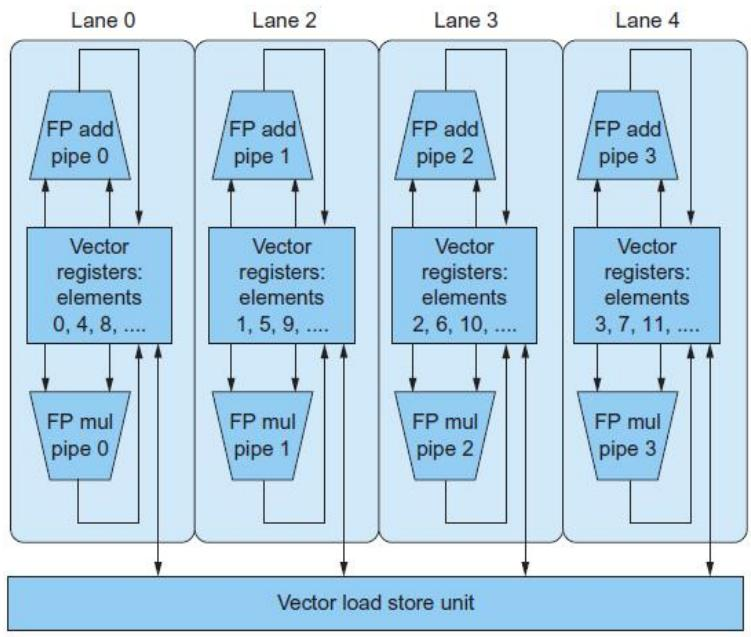

# 第6章 并行处理器：从客户端到云

> [!abstract] 本章主线
> 单核性能因功耗墙终结 → 转向**多核/多处理器**。本章讲：并行的动机与挑战 → **Amdahl 定律**与强/弱扩展 → 并行硬件分类（SISD/MIMD/SIMD）→ **向量机**与多通道并行 → GPU。

## 6.1 引言

> [!note] 为什么需要多核
> 传统靠提频率/降 CPI 的路被**能耗**堵死 → 必须靠**显式硬件并行**。多核优势：**可伸缩性能**（按需加核）、**能效**（小核替大核）、**高可用**（部分故障仍运行）。

> [!important] 两个独立维度：软件 × 硬件
>
> | | 顺序软件 | 并发软件 |
> |---|---|---|
> | **串行硬件(单核)** | 单核串行 MATLAB | 单核跑 OS（时间片伪并行）|
> | **并行硬件(多核)** | 多核跑串行程序 | 多核真并行 OS |
>
> 软件"顺序/并发"与硬件"串行/并行"**可任意组合**。
> - **任务级并行**：多个独立任务同时跑（易实现，提吞吐）。
> - **并行处理程序**：单个程序拆到多核加速（程序员的核心挑战）。

## 6.2 创建并行程序的难点

> [!important] Amdahl 定律（加速比形式）
> $$
> \text{加速比} = \frac{1}{(1 - F) + \dfrac{F}{N}}
> $$
> 其中 F = 可并行比例、N = 处理器数。
> **例**：100 个处理器要 90 倍加速 → 顺序部分最多占 **0.1%**（可并行需达 99.9%）。可见少量串行代码就严重限制加速。

> [!note] 强扩展 vs 弱扩展
>
> | | 定义 | 适用 |
> |---|---|---|
> | **强比例缩放** | 问题规模不变，只加处理器 | 科学计算等固定任务（难，受 Amdahl 限制）|
> | **弱比例缩放** | 处理器与问题规模**同比例增长** | 数据库/Web（业务随用户增长，如 TPC-C）|
>
> **例**：矩阵求和，问题越大、可并行比例越高 → 同样处理器数加速比越高（20×20 比 10×10 加速更接近理想）。

> [!warning] 负载均衡的重要性
> 40 处理器理想加速 20.5，若**一个处理器负载翻倍（5%）**→ 加速降到 14；负载 5 倍（12.5%）→ 加速降到 7。木桶效应：最慢的处理器决定整体。

## 6.3 并行硬件分类

> [!important] Flynn 分类（指令流 × 数据流）
>
> | 分类 | 全称 | 特点 | 实例 |
> |---|---|---|---|
> | **SISD** | 单指令单数据 | 传统单处理器 | Pentium 4 |
> | **MIMD** | 多指令多数据 | 多处理器各执行不同指令 | Core i7 |
> | **SIMD** | 单指令多数据 | 一条指令作用于多组数据（数据级并行）| SSE/AVX、向量机 |
> | **MISD** | 多指令单数据 | 仅理论分类，无通用实例 | — |
>
> **SPMD（单程序多数据）**：MIMD 上最常用编程模型——所有处理器跑**同一程序**，靠条件分支走不同代码段。

> [!note] SIMD 优劣
> - ✅ 编程接近 SISD、硬件成本低（一份程序副本、控制开销小）、对数组运算极佳（一条指令算 64 个数）。
> - ❌ 处理 **case/分支**效率低：不同数据需不同操作时要屏蔽通道，性能降到峰值的 1/n。
> - 现代形态：x86 **多媒体扩展** MMX→SSE→AVX→AVX-512。

> [!example] 向量机与 DAXPY（Y = a·X + Y）
> 向量机（Seymour Cray, 1970s）：从内存批量读入**向量寄存器**（如 32 个，每个 64 × 64 位），用**流水化 ALU** 逐元素运算后批量写回。
> DAXPY 对比：标量 RISC-V 需 **~514 条**指令（含循环开销），向量版仅 **6 条**：
> ```asm
> fld     f0, a(x3)        # 标量 a
> fld.v   v0, 0(x19)       # 向量 X
> fmul.d.vs v0, v0, f0     # a*X（向量×标量）
> fld.v   v1, 0(x20)       # 向量 Y
> fadd.d.v  v1, v1, v0     # a*X + Y（向量+向量）
> fsd.v   v1, 0(x20)       # 存回 Y
> ```

> [!important] 向量相对标量的优势
> ① 指令带宽大降（一条顶一个循环）；② 硬件**无需逐元素检查数据冒险**（向量内元素天然独立）；③ 访存模式确定（连续/步长/索引），主存延迟只发生一次；④ 消除循环控制冒险；⑤ 功耗能耗更优。相比 x86 扩展，向量长度存于独立寄存器（改长度不破坏二进制兼容），且支持步长/聚散访存。

> [!example] 多通道并行（Vector Lane）
> 
> 向量单元分成多个**独立通道**，每通道有完整功能单元 + 寄存器分区，数据元循环分配（通道 0：元素 0,4,8…）。**通道数 = 并行度**：4 通道每周期完成 4 次加法 → 单条向量指令吞吐量 ×4。寄存器按通道分区简化了硬件（避免多端口寄存器堆）。

> [!note] GPU
> GPU 是高度并行的众核 SIMD/SIMT 架构，通过 PCI-Express 与 CPU 相连，拥有大量计算单元与高带宽显存，特别适合数据级并行的图形与 **AI/深度学习**计算（大规模矩阵/向量运算）。

---

> [!summary] 本章小结
> - 单核终结 → **多核/多处理器**是必然；并行分**任务级**与**程序级**。
> - **Amdahl 定律**：加速比受串行部分严格限制（90× 需 99.9% 可并行）。
> - **强扩展**（任务不变加核）vs **弱扩展**（任务随核增长）；**负载均衡**决定实际加速。
> - **Flynn 分类**：SISD/MIMD/SIMD/MISD；MIMD 上常用 **SPMD**。
> - **向量机**：批量向量寄存器 + 流水化 ALU + **多通道并行**，指令带宽与能效远优于标量；GPU 是其大规模延伸。

> [!question] 自测题
> 1. 用 Amdahl 定律：100 处理器要 90 倍加速，串行部分最多占多少？
> 2. 强扩展与弱扩展有何区别？各适合什么场景？
> 3. 一个处理器负载是其余两倍时，40 核加速比为何从 20.5 降到 14？
> 4. SISD/MIMD/SIMD 各是什么？SPMD 与 MIMD 是什么关系？
> 5. DAXPY 的标量版与向量版指令数差异巨大，原因有哪些？
> 6. 向量"多通道(Lane)"如何提升吞吐量？通道数与并行度的关系是什么？

> [!info] 关联章节
> 并行的根源（功耗墙、多核转变）见 [[Chapter_01_计算机抽象及相关技术_笔记|第1章 1.7-1.8]]；流水线（指令级并行）见 [[Chapter_04_处理器_笔记|第4章]]；缓存一致性见 [[Chapter_05_层次化存储_笔记|第5章]]。
