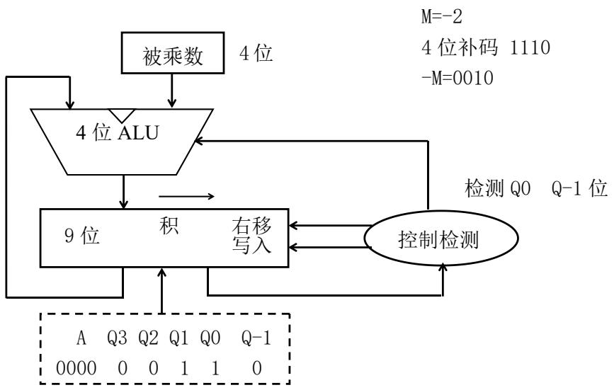

# 测验试卷 A · 期中复习精解

> [!abstract] 本篇定位
> 这是 2026 学年第 2 学期《计算机组成原理》期中测验（A 卷）的**逐题精解 + 知识点串讲**。覆盖范围对应 [[Chapter_01_计算机抽象及相关技术_笔记|第1章 抽象与性能]] 与 [[Chapter_02_指令_计算机的语言_笔记|第2章 RISC-V 指令系统]]（含数据表示、浮点数、过程调用、机器码、布斯乘法器）。
> 题型：单选 15×2=30 分、填空 每空 1 分共 20 分、程序分析 2×10=20 分、综合 4 题共 30 分。
> 全卷答案已核对，**每题给出"答案 + 为什么 + 易错点"**，并对重难点（CPI 计算、机器码编码、jal 跳转范围、布斯算法）配过程图/算例竖式。

---

## 一、单项选择题精解（15 题）

> [!summary] 答案速查
>
> | 题 | 1 | 2 | 3 | 4 | 5 | 6 | 7 | 8 | 9 | 10 | 11 | 12 | 13 | 14 | 15 |
> |---|---|---|---|---|---|---|---|---|---|---|---|---|---|---|---|
> | 答 | A | D | C | D | B | C | D | C | B | B | B | C | B | A | B |

**1. 中国首台千万亿次超算 → A. 天河1号**
2009 研制、2010 登顶 TOP500、峰值 4700 万亿次/秒（即约 4.7 PFlops）。神威·太湖之光是 2016 年的十亿亿次（百 PFlops 级），别混淆。

**2. 不属于 8 个伟大思想的是 → D. 通过串行提高性能**

> [!important] 8 个伟大思想（必背）
> 面向摩尔定律设计、使用**抽象**简化设计、加速**经常性**事件、通过**并行**提高性能、通过**流水线**提高性能、通过**预测**提高性能、存储层次、通过**冗余**提高可靠性。
> ⚠ "通过**串行**提高性能"是杜撰——并行才提性能。

**3. 不属于五大经典部件的是 → C. 操作系统**
五大部件 = **输入、输出、存储器、运算器（数据通路）、控制器**。操作系统是软件，不是硬件部件。

**4. x86/ARM/RISC-V 描述错误的是 → D**
D 说"x86 硬件设计复杂度低、解码难度远小于 ARM/RISC-V"——恰好相反：x86 是 CISC、变长编码，解码**更复杂**。A、B、C 均正确（x86 变长 CISC；ARM/RISC-V 均 RISC + Load/Store；RV32 定长 4 字节）。

**5. jal 说法正确的是 → B**
`jal` 的跳转目标 = **PC + 立即数（符号扩展）**，地址在**编译/链接时即可确定**（直接相对跳转）。
- A、C 描述的是 `jalr`（间接跳转，寄存器+立即数，用于函数指针）。
- D 错，`jal` 正是用于函数调用（把返回地址存入 rd）。

**6. 栈与栈指针描述错误的是 → C**
C 说"压栈增加 sp、弹栈减少 sp"——**反了**。栈从**高地址向低地址增长**：压栈 `addi sp,sp,-n`（sp 减小），弹栈 `addi sp,sp,n`（sp 增大）。A、B、D 正确（先进后出；sp=x2；向低地址增长）。

**7. 寻址方式描述错误的是 → D**
D 说"PC 相对寻址跳转地址仅由立即数决定、与 PC 无关"——错，**PC 相对寻址 = PC + 立即数**，与 PC 直接相关。

**8. `li x9, 23` → C. 汇编器转换为 `addi x9, x0, 23`**
`li`（load immediate）是**伪指令**，不是硬件原生指令。小立即数时汇编器展开为 `addi x9, x0, 23`（x0 恒为 0，故 x9 = 0+23）。注意是 `addi`（带立即数）不是 `add`，故 B 错。

**9. 汇编器的输入/输出 → B. 输入汇编语言程序，输出机器语言目标模块**

> [!note] 编译工具链流水线
> C 源码 →（**编译器**）→ 汇编语言 →（**汇编器**）→ 机器语言目标模块(.o) →（**链接器**）→ 可执行程序 →（**加载器**）→ 内存运行。

**10. Java 跨平台 → B**
Java 先编译成**字节码（bytecode）**，再由各平台的 **JVM** 解释或 JIT 编译执行 → 一次编写到处运行。JIT 编译的是字节码而非源码（C 错），库例程也运行于 JVM 之上（D 错）。

**11. RISC-V 单精度浮点位数分配 → B. 符号 1 + 指数 8 + 尾数 23**

> [!important] IEEE 754 浮点格式（必背）
>
> | 精度 | 符号 | 指数 | 尾数 | 偏移量(bias) |
> |---|---|---|---|---|
> | 单精度(32 位) | 1 | **8** | **23** | 127 |
> | 双精度(64 位) | 1 | 11 | 52 | 1023 |
> $$\text{值} = (-1)^S \times (1.\text{尾数})_2 \times 2^{\,指数-bias}$$

**12. IEEE 754 浮点加法第一步 → C. 比较指数、对小指数的数右移、对阶**

> [!note] 浮点加法四步
> ① **对阶**（比较指数，小指数右移使两者对齐）→ ② 尾数相加 → ③ **规格化** → ④ **舍入**。

**13. 浮点乘法的指数处理 → B. 移码相加后减去偏移量**
真实指数相加即可，但用**移码（biased）**存储时：移码 = 真值 + bias，两移码相加多加了一个 bias，故须**减去一个偏移量**得到结果移码。

**14. 向最近偶数舍入，实际值 1.23（ulp=0.1）→ A. 舍入为 1.2，误差 0.3 ulp**
1.23 落在 1.2 与 1.3 之间，距 1.2 为 0.03、距 1.3 为 0.07，**离 1.2 更近** → 舍为 1.2。
误差 = |1.23 − 1.2| = 0.03，而 1 ulp = 0.1，故误差 = 0.03/0.1 = **0.3 ulp**。

**15. 指数位全 0、尾数非 0 → B. 正负非规格化数（denormal）**

> [!important] IEEE 754 特殊编码
>
> | 指数 | 尾数 | 含义 |
> |---|---|---|
> | 全 0 | 0 | ±0 |
> | 全 0 | ≠0 | **非规格化数（denormal）** |
> | 全 1 | 0 | ±∞ |
> | 全 1 | ≠0 | NaN |

---

## 二、填空题精解（10 题）

> [!summary] 标准答案
> 1.（**性能**）（**成本**） 2.（**功能**）（**可裁剪**） 3.（**ISA**）（**ABI**）
> 4.（**255**）（**127**） 5.（**x6+40**）（**x5**） 6.（**32**）（**64**）
> 7.（**1111 1111 1111 1111**）（**0，1**） 8.（**ab**）（**12**）
> 9.（**0010 1100**）（**44**） 10.（**1111 0010**）（**1111 1111**）

**逐题要点**

1. 摩尔定律：晶体管数约每 18–24 月翻番 → **性能**提升、**成本**下降。
2. 嵌入式系统：体积小、**功能**专一、软硬件**可裁剪**。
3. **ISA（指令集架构）** 规定指令/寄存器/访存/IO/地址/异常中断等全套规范；**ABI（应用二进制接口）** 规定函数调用参数寄存器、栈/堆结构、系统调用编号等。→ 见 [[Chapter_02_指令_计算机的语言_笔记]]。
4. 8 位有符号 −1 的补码 = `1111 1111`，当无符号看 = **255**；8 位有符号最大正数 = `0111 1111` = **127**。
5. `ld x5, 40(x6)`：把内存地址 **x6+40** 处的双字加载到 **x5**。
6. 字 word = **32** 位，双字 doubleword = **64** 位（字节 Byte=8 位）。
7. 补码 `1111 1111` 符号扩展为 16 位 = **`1111 1111 1111 1111`**；规则：正数高位补 **0**、负数高位补 **1**（即"补符号位"）。
8. **小端序**：`0x123456ab` 最低有效字节 `ab` 放最低地址、最高有效字节 `12` 放最高地址。
9. `slli x6, x5, 2`：逻辑左移 2 位 = ×4。`0000 1011`(11) → **`0010 1100`** = **44**。
10. `xori x5, x6, -1`：与全 1 异或 = **按位取反**。`0000 1101` → **`1111 0010`**；−1 的 8 位补码 = **`1111 1111`**。

> [!tip] 易错点串讲
> 第 4 题考"同一二进制串在有/无符号下的两种解读"；第 8 题考**大小端**（小端= 低字节低地址）；第 10 题揭示 `xori reg, reg, -1` 是 RISC-V 取反的惯用法（无专门 NOT 指令）。

---

## 三、程序分析题精解

### 3.1 过程调用代码简化（被调用者保存约定）

> [!important] 调用约定（Caller/Callee-saved）—— 本题核心
>
> | 类别 | 寄存器 | 谁负责保存 | 需要压栈吗 |
> |---|---|---|---|
> | **临时寄存器** | t0–t6（x5–x7, x28–x31） | **调用者(caller)** | 被调用函数内**无需**保存 |
> | **保存寄存器** | s0–s11（x8–x9, x18–x27） | **被调用者(callee)** | 用到就**必须**压栈恢复 |
> | 参数/返回值 | a0–a7（x10–x17） | 调用者 | — |

原代码把 `x5(t0)`、`x6(t1)` 也压了栈——但它们是**临时寄存器，被调用者无需保存**，这两组 `sw/lw` 是冗余的；只有 `x20(s4)` 是保存寄存器，必须保留。

> [!example] 简化前 → 简化后（删除 t 寄存器的保存/恢复）
> ```asm
> leaf_example:
>     addi sp, sp, -4      # 只为 1 个 s 寄存器留 4 字节（原 -12 多了）
>     sw   x20, 0(sp)      # 仅保存 x20(s 寄存器)
>     add  x5,  x10, x11   # t0 = a0 + a1
>     add  x6,  x12, x13   # t1 = a2 + a3
>     sub  x20, x5,  x6    # s4 = t0 - t1
>     addi x10, x20, 0     # 返回值 a0 = s4
>     lw   x20, 0(sp)      # 恢复 x20
>     addi sp,  sp,  4     # 释放栈
>     jalr x0,  0(x1)      # 返回（ret）
> ```
> **删掉的 4 条**：`sw x5,8(sp)`、`sw x6,4(sp)`、`lw x6,4(sp)`、`lw x5,8(sp)`；栈帧从 12 字节缩到 **4 字节**。

> [!warning] 易错点
> ① 误把 t0/t1 当成要保存——记住"**t = 临时 = 不保存**，s = saved = 保存"。
> ② 栈帧大小要随保存寄存器数量同步改（−12 → −4，对应 +12 → +4），否则 sp 不平衡。

### 3.2 RISC-V 代码阅读（求相反数 + 系统调用）

> [!example] 带注释的完整代码
> ```asm
> .data
> num: .dword 10                 # 64 位整数 10
> res: .dword 0                  # 结果槽
> msg: .string "10的相反数是："  # 字符串
> .text
> .globl main
> main:
>     la  x22, num     # 将变量 num 的地址加载到 x22
>     ld  t0, 0(x22)   # 从 x22 处取双字 → t0 = 10
>     sub t1, x0, t0   # t1 = 0 - t0 = -10（用 x0 求相反数）
>     la  x23, res
>     sd  t1, 0(x23)   # 把 -10 存到 res
>     la  a0, msg
>     li  a7, 4        # 系统调用号 4
>     ecall            # 打印字符串 msg
>     ld  a0, 0(x23)
>     li  a7, 1        # 系统调用号 1
>     ecall            # 打印整数 -10
>     li  x17, 93      # x17 即 a7，系统调用号 93
>     ecall            # 程序退出
> ```
> **核心功能**：利用恒为 0 的寄存器 **x0**，计算十进制 10 的相反数 −10，并打印 "10的相反数是：-10"。

> [!note] 三种系统调用（RARS/Venus 风格，号在 a7，参数在 a0）
>
> | 调用号(a7) | 功能 | 参数 |
> |---|---|---|
> | **4** | 打印字符串 | a0 = 字符串首地址 |
> | **1** | 打印有符号整数 | a0 = 要输出的整数 |
> | **93** | 程序正常退出 | 无 |

**`.data` 是什么**：RISC-V 汇编的**数据段伪指令（assembler directive）**，不能汇编成原生机器指令；用于定义程序运行时读写的**静态数据**（变量、常量、数组、字符串），这些数据放在专门的数据内存区，可被加载/修改/存储。

> [!tip] 关键技巧：`sub t1, x0, t0` 求相反数
> RISC-V 无专门取负指令，求相反数靠 `sub rd, x0, rs`（0 − x = −x），与 `xori`+`addi` 求补码的另一条路并存。

---

## 四、综合题精解

### 4.1 代码片段比较（CPI 与执行时间）

题给数据：A/B/C 三类指令 CPI 分别 1/2/3。

> [!example] 两序列指令分布
>
> | | A 类(CPI=1) | B 类(CPI=2) | C 类(CPI=3) | 总指令数 IC |
> |---|---|---|---|---|
> | **序列 1** | 2 | 1 | 2 | **5** |
> | **序列 2** | 4 | 1 | 1 | **6** |

> [!important] CPU 性能基本公式
> $$\text{总时钟周期} = \sum_{i} (\text{CPI}_i \times \text{IC}_i), \qquad \text{平均 CPI} = \frac{\text{总时钟周期}}{\text{总指令数 IC}}$$
> 比"快慢"看**总时钟周期**（越少越快），不是看指令数。→ 同 [[Chapter_01_计算机抽象及相关技术_笔记|CPU 性能公式]]。

**逐问解答**

> [!summary] 答案
> **（1）指令数更多**：序列 2（6 条 > 序列 1 的 5 条）。
> **（2）执行更快**：序列 2。
>
> | | 总时钟周期数 |
> |---|---|
> | 序列 1 | 2×1 + 1×2 + 2×3 = 2+2+6 = **10** |
> | 序列 2 | 4×1 + 1×2 + 1×3 = 4+2+3 = **9** |
> 序列 2 周期更少 → 更快（尽管它多执行了 1 条指令）。
> **（3）平均 CPI**：CPI₁ = 10/5 = **2.0**；CPI₂ = 9/6 = **1.5**。

> [!warning] 易错点
> "指令多 ≠ 慢"。决定速度的是**总时钟周期数**；序列 2 用了更多便宜的 A 类指令（CPI=1），整体反而更快、平均 CPI 更低。

### 4.2 RISC-V 汇编 → 机器码

实现 `A[3] = h + A[3] + 1`：A 是**双字数组**（每元素 8 字节），基址在 x10，h=5 在 x21。

> [!important] 第一步：算 A[3] 的字节偏移量
> 双字 = 8 字节 → A[3] 偏移 = 3 × 8 = **24** 字节。故 `ld x9, 24(x10)`、`sd x9, 24(x10)`。

四条指令逐条编码（字段顺序按题表，结果拼成 32 位）：

> [!example] 机器码编码表（answer 核对版）
>
> | 指令 | 格式 | funct7 / imm | rs2 | rs1 | funct3 | rd / imm | opcode |
> |---|---|---|---|---|---|---|---|
> | `ld x9,24(x10)` | I | imm=`000000011000` (24) | — | `01010`(x10) | `011` | `01001`(x9) | `0000011` |
> | `add x9,x21,x9` | R | `0000000` | `01001`(x9) | `10101`(x21) | `000` | `01001`(x9) | `0110011` |
> | `addi x9,x9,1` | I | imm=`000000000001` (1) | — | `01001`(x9) | `000` | `01001`(x9) | `0010011` |
> | `sd x9,24(x10)` | S | imm[11:5]=`0000000` | `01001`(x9) | `01010`(x10) | `011` | imm[4:0]=`11000` | `0100011` |

> [!note] 编码要点（最易丢分处）
> - **寄存器号→5 位二进制**：x9=`01001`、x10=`01010`、x21=`10101`。
> - **I 型**：立即数占高 12 位 imm[11:0]，无 rs2。
> - **S 型（store）**：立即数被**拆成两段**——imm[11:5] 放高位（funct7 位置）、imm[4:0] 放 rd 位置。24 = `0000000_11000` → 高 7 位 `0000000`、低 5 位 `11000`。
> - opcode 区分指令族：load `0000011`、store `0100011`、I 运算 `0010011`、R 运算 `0110011`。

### 4.3 jal 可达地址范围

> [!important] jal 跳转规则
> - 立即数为 **21 位有符号**（imm[20:1]），最低位强制 0（保证 4 字节对齐）。
> - 跳转公式：**新 PC = 当前 PC + 符号扩展(立即数)**（立即数已含 ×2 的移位，覆盖 ±1 MB）。
> - 偏移范围：$-2^{20} \sim +2^{20}-1$ 字节，即约 **±1 MB**。

> [!example] 代入 PC = 0x2000_0000 计算
> $2^{20} = \text{0x10\,0000} = 1{,}048{,}576$
>
> | 边界 | 计算 | 结果 |
> |---|---|---|
> | 最小地址 | 0x2000_0000 − 0x10_0000 | **0x1FF0_0000** |
> | 最大地址 | 0x2000_0000 + (0x10_0000 − 2) = +0xF_FFFE | **0x200F_FFFE** |
>
> **可达范围：0x1FF0_0000 ～ 0x200F_FFFE**（均为偶地址/2 字节对齐，因最低位为 0）。

> [!warning] 易错点
> ① 立即数是 21 位（不是 20），但最低位固定 0，实际编码 20 位。② 上界用 `+2^20 − 2`（最大偶偏移），不是 `+2^20`。

### 4.4 布斯算法（Booth）乘法器 ⭐重难点



> [!important] （1）布斯算法核心思想
> **通过减少乘法中的加法次数来加速**。观察乘数：遇到**连续的 1** 时，只需在这串 1 的**开头做一次减法、结尾做一次加法**，中间的 1 全部**跳过**（不再逐位加），从而把多次加法压成两次。判据是看相邻两位 **Q0 Q-1**：
>
> | Q0 Q-1 | 操作 | 含义 |
> |---|---|---|
> | 1 0 | A = A − M | 1 串开头 |
> | 0 1 | A = A + M | 1 串结尾 |
> | 0 0 / 1 1 | 不加减 | 串内/串外，仅右移 |
> 每步末做**整体算术右移 1 位**（保留符号）。

> [!example] （2）算例：−2 × 3 = −6（4 位）
> M（被乘数）= −2 = 补码 `1110`，−M = `0010`；Q（乘数）= 3 = `0011`。初始 A=`0000`，Q-1=0。
> 寄存器记法：**A(4) | Q(4) | Q-1(1)**，每轮先按 Q0Q-1 加减、再算术右移。
>
> | 轮 | Q0 Q-1 | 操作 | 第1步后(A Q Q-1) | 第2步后(右移) |
> |---|---|---|---|---|
> | 初始 | — | — | — | `0000 0011 0` |
> | 1 | 1 0 | A=A−M=A+(−M)=0000+0010 | **`0010 0011 0`** | **`0001 0001 1`** |
> | 2 | 1 1 | 跳过加，直接右移 | `0001 0001 1` | `0000 1000 1` |
> | 3 | 0 1 | A=A+M=0000+1110 | **`1110 1000 1`** | **`1111 0100 0`** |
> | 4 | 0 0 | 跳过加，直接右移 | `1111 0100 0` | **`1111 1010 0`** |
>
> 最终积 = A 与 Q 拼接（去掉 Q-1）= `1111 1010` = 补码 **−6** ✓。（题中括号待填即上表加粗项。）

> [!tip] 看懂这道算例的关键
> - **"第1步"= 按 Q0Q-1 决定的加/减后的中间值**；**"第2步"= 整体算术右移 1 位**（最高位补符号位，最低的旧 Q0 移入 Q-1）。
> - 第 1、3 轮发生加减（1 串的头和尾），第 2、4 轮只右移——正体现"连续 1 只在两端动手"。
> - 验算：`1111 1010` 取反加一 = `0000 0110` = 6，故原值 = −6。

---

## 本章小结

> [!summary] 期中高频考点地图
>
> | 模块 | 必拿分点 | 易错/难点 |
> |---|---|---|
> | 抽象与性能 | 8 大思想、五大部件、**CPI/性能公式** | "指令多≠慢"，看总周期 |
> | 数据表示 | 补码、符号扩展、大小端、移位=×/÷2ⁿ | 有/无符号双解读、小端低字节低地址 |
> | 浮点数 | 1+8+23 格式、加法对阶四步、特殊编码 | denormal(指数全0尾数≠0)、就近偶舍入 |
> | RISC-V 指令 | `li/la` 伪指令、`sub x0` 求负、`xori -1` 取反 | jal vs jalr、栈向低增长 |
> | 过程调用 | t=不保存 / s=保存、栈帧平衡 | 多压 t 寄存器、sp 偏移不同步 |
> | 机器码 | I/R/S 字段、寄存器→5位、S 型立即数拆段 | S 型 imm 高低位分置 |
> | jal 范围 | PC±1MB、21位含对齐位 | 上界 +2²⁰−2、2字节对齐 |
> | 布斯算法 | Q0Q-1 判加减、整体算术右移 | 加减发生在 1 串两端、符号位右移 |

## 自测题（盖住答案做一遍）

> [!question] 概念
> 1. 为什么"通过串行提高性能"不是 8 大思想之一？真正的两条相关思想是什么？
> 2. `li x9, 23` 与 `add x9, x0, 23` 有何区别？为什么后者是错的？
> 3. denormal（非规格化数）在 IEEE 754 中如何编码？它解决了什么问题？

> [!question] 计算（动手算）
> 4. 某程序 A/B/C 三类指令各 100/50/30 条，CPI 各 1/3/4，求总周期与平均 CPI。
> 5. 把 `sd x5, 16(x8)` 编成 32 位机器码（funct3=011, opcode=0100011）。提示：先把 16 拆成 imm[11:5] 与 imm[4:0]。
> 6. PC=0x8000_0000 时，jal 可达的最小、最大地址各是多少？
> 7. 用布斯算法计算 **3 × −3**（M=3=`0011`、Q=−3=`1101`），列出每轮 A Q Q-1 的变化，验证结果为 −9。

> [!question] 改错
> 8. 下列函数压栈了 t0、t1、s0，请指出哪些 sw/lw 是冗余的，并写出最小栈帧大小。

---

> [!info] 关联章节
> [[Chapter_01_计算机抽象及相关技术_笔记]] · [[Chapter_02_指令_计算机的语言_笔记]] · [[00_课程总览_MOC]]
