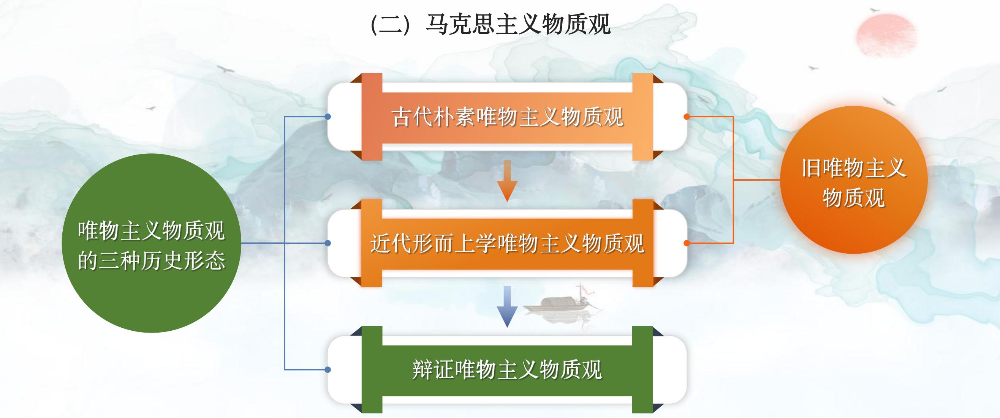
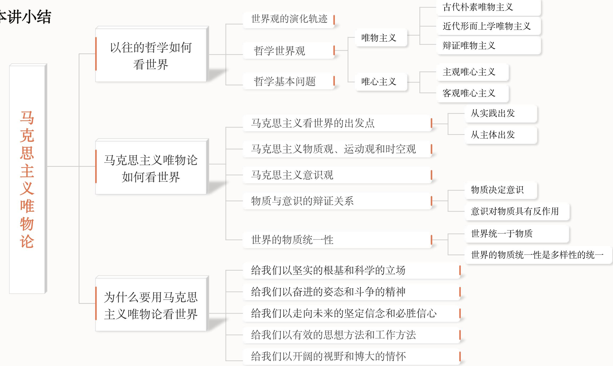
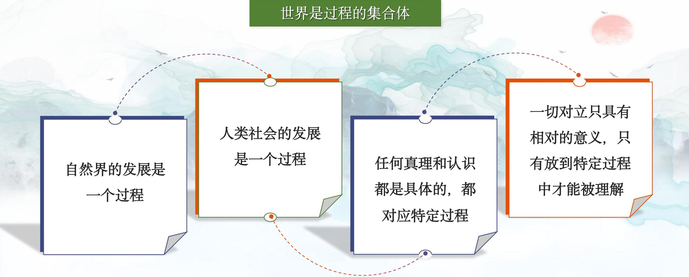
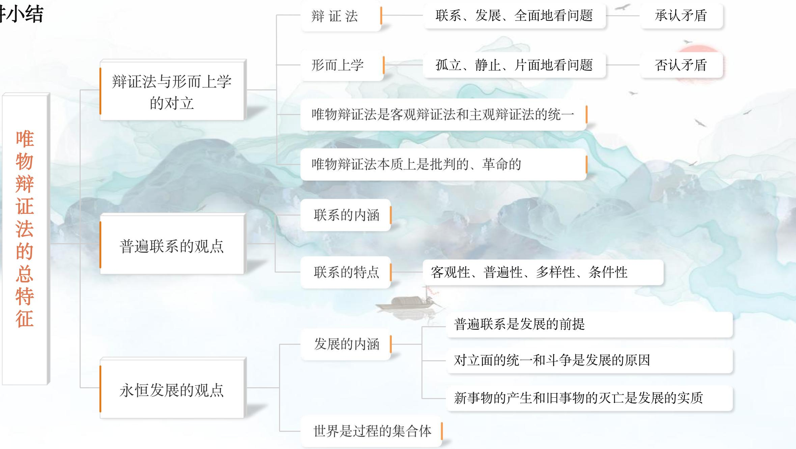
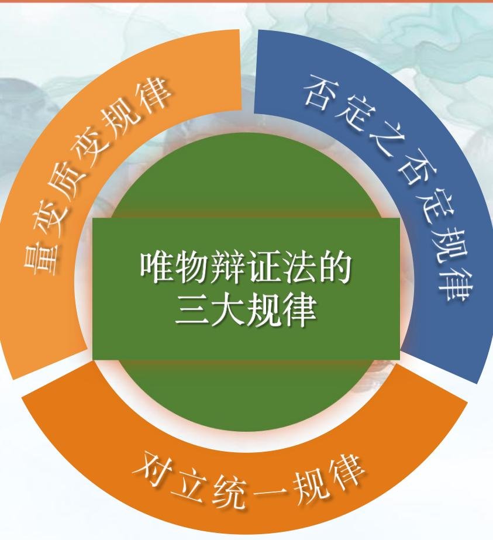
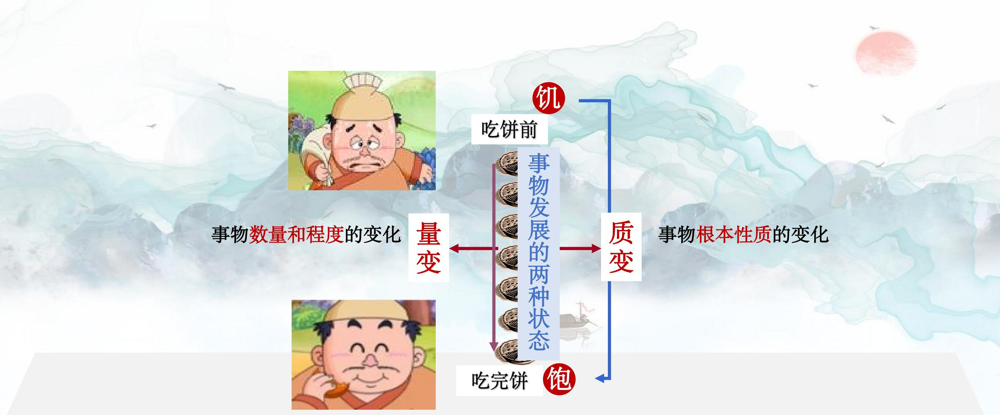
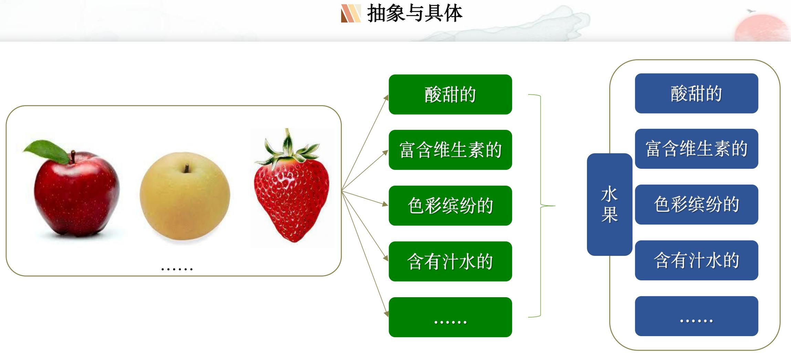

# 专题一 世界的物质性及发展规律

> [!abstract] 本专题导览
> 本专题即第一章「世界的物质性及发展规律」，是**辩证唯物主义世界观**的总纲，回答三个根本问题：
> 1. **何为世界本原？**（世界的多样性与物质统一性）
> 2. **世界如何运行？**（事物的普遍联系与变化发展）
> 3. **如何把握世界？**（唯物辩证法是认识世界和改造世界的根本方法）
>
> 围绕这三问展开四讲：
> - **第一讲 马克思主义唯物论**——世界的本质是物质，意识是物质的派生物。
> - **第二讲 唯物辩证法的总特征**——联系的观点与发展的观点。
> - **第三讲 唯物辩证法的基本规律**——对立统一、质量互变、否定之否定三大规律。
> - **第四讲 辩证思维方法**——基本范畴 + 辩证思维方法 + 六大思维能力。
>
> 一条主线贯穿全章：**本体论（本原是什么）→ 认识论（能否认识）→ 方法论/辩证法（状态如何）**，对应马克思主义的 **物质 → 可知论 → 辩证法**。

---

## 第一讲 马克思主义唯物论

> [!question] 三问
> 一、以往的哲学如何看世界？ 二、马克思主义唯物论如何看世界？ 三、为什么要用马克思主义唯物论看世界？

### 一、以往的哲学如何看世界？

#### 世界观、方法论与哲学

- **世界观**：人们对世界的总的看法和根本观点（世界是什么、世界怎么样）。
- **方法论**：人们认识世界和改造世界的根本原则和根本方法。
- **哲学**：系统化、理论化的世界观，世界观与方法论的统一。

> [!note] 哲学与具体科学的区别与联系
>
> | 比较 | 哲学 | 具体科学 |
> |---|---|---|
> | 研究对象 | 整个世界的本质、发展规律以及人与现实世界的关系 | 世界某一具体领域、某一类别事物的规律 |
> | 性质 | 理论思维 | 经验思维 / 实证思维 |
> | 作用 | 提供世界观与方法论指导 | 提供某些知识与具体方法指导 |
> | 联系 | 都是人们把握现实世界的基本方式 | 同左 |

「世界」一词本指时空总称：《尸子》「上下四方曰宇，往古来今曰宙」；《楞严经》「世为迁流，界为方位」。

#### 世界观的演化轨迹：神话 → 宗教 → 哲学

- **神话世界观**：人在幻想中对自然力的改造（盘古开天、女娲造人、后羿射日等），是根植于现实土壤的艺术创造，为宗教提供了思想材料。
- **宗教世界观**：人们按自己的需要和想象创造出来的，是意识对统治着他们的自然力量和社会力量**虚幻、颠倒的反映**（佛教、基督教、伊斯兰教三大宗教）。
- **哲学世界观**：**系统化、理论化**的世界观，起源于人类在生活实践中对宇宙人生的追问（老子、孔子、苏格拉底、柏拉图等）。雅斯贝尔斯「轴心时代」理论指出，公元前 800—200 年间，中国、印度、希腊等地几乎同时产生了奠基性的哲学思想。

#### 哲学的基本问题（重点）

> [!important] 思维和存在的关系问题
> 恩格斯：「全部哲学，特别是近代哲学的重大的基本问题，是**思维和存在的关系问题**。」——《路德维希·费尔巴哈和德国古典哲学的终结》
>
> 哲学基本问题包含**两个方面**：
>
> | 方面 | 内容（争论） | 划分出的派别 |
> |---|---|---|
> | ①第一性问题 | 思维和存在**何者为本原**、谁决定谁（本体论之争） | 存在决定思维 → **唯物主义**；思维决定存在 → **唯心主义** |
> | ②同一性问题 | 思维和存在**有无同一性**，即思维能否正确认识存在（认识论之争） | 能 → **可知论**；不能 → **不可知论** |
>
> 第一个方面是划分唯物主义与唯心主义的**唯一标准**。

#### 唯物主义的三种历史形态、唯心主义的两种基本形式

> [!note] 两大派别及其形态
>
> | 派别 | 历史形态 / 基本形式 | 核心主张 |
> |---|---|---|
> | **唯物主义**（三种历史形态） | 古代朴素唯物主义 | 世界本原是某一种或几种**具体物质形态**（五行说、阴阳说、活火说、气理说） |
> | | 近代形而上学唯物主义 | 物质 = **原子**；机械的、孤立的、不彻底（一进社会历史就陷入唯心主义） |
> | | 辩证唯物主义和历史唯物主义 | 抽象出哲学的物质概念，用辩证眼光看待物质世界 |
> | **唯心主义**（两种基本形式） | 主观唯心主义 | 把人的**主观精神**（意识、观念）作为本原（笛卡尔「我思故我在」、贝克莱「存在就是被感知」） |
> | | 客观唯心主义 | 把某种**客观精神**作为本原（黑格尔「绝对精神」、朱熹「理在事先」、柏拉图「理念世界」） |

> [!tip] 如何看待唯心主义
> 唯心主义不是「没有根基」的，列宁称其为生长在人类认识之树上的「一朵不结果实的花」。其产生有两大根源：
> - **社会阶级根源**：统治阶级为维护统治而颠倒精神与物质的关系；
> - **认识论根源**：把认识的能动性片面夸大为绝对。

#### 辩证法与形而上学

「形而上学」在哲学史上有两种含义：①「哲学」意义上指研究超感觉、超经验对象的学问；②与辩证法相对立意义上，指**孤立、静止、片面、否认矛盾**地观察世界的思维方式（黑格尔第一次在此意义上使用）。「辩证法」原指辩论中揭露并克服对方矛盾以求真理的方法，经赫拉克利特奠基、黑格尔系统化，最终由马克思恩格斯批判继承其「合理内核」创立**唯物辩证法**。

### 二、马克思主义唯物论如何看世界？

马克思 1845 年《关于费尔巴哈的提纲》是新世界观的**奠基性文献**，以**实践**为基础，批判了一切旧哲学，开启哲学史上的革命性变革。

#### （一）认识和把握世界的两个出发点：从实践出发、从主体出发

> [!important] 两个界限、两种片面、一个超越
> 新唯物主义必须划清两个界限：同唯心主义的根本对立、同旧唯物主义的原则区别。
>
> | 立场 | 缺陷 |
> |---|---|
> | **旧唯物主义（纯客体性原则）** | 只从客体或直观形式理解对象，看不到人的实践活动是对象性活动，消解了人的主体能动性 |
> | **唯心主义（纯主体性原则）** | 抽象地发展了主体能动性，只承认意识的能动性，否认人对对象的受动性、依赖性，停留于观念改造而非现实改变 |
>
> 马克思的做法是**把受动性和能动性辩证统一起来**——从实践出发、从主体出发，把物质世界理解为进入主体实践活动范围的、被打上人的意志烙印的**现实世界**。新唯物主义是对旧唯物主义和能动唯心主义的**双重超越**，充分体现了**改变世界**的价值追求：「哲学家们只是用不同的方式解释世界，而问题在于改变世界。」

#### （二）马克思主义物质观

唯物主义物质观经历了**三种历史形态**，从「具体物质形态」到「原子」再到「客观实在」，是认识不断深化的过程。



> [!note] 物质观三阶段对照表（重难点）
>
> | 形态 | 物质 = | 进步性 | 局限性 |
> |---|---|---|---|
> | 古代朴素唯物主义 | 一种或数种**具体物质形态**（金木水火土、原子、四大元素） | 符合从世界自身寻求解释的科学精神 | 基于经验直观，难以说明纷繁复杂的世界 |
> | 近代形而上学唯物主义 | **原子**（自然科学物质概念） | 力图概括自然科学最新成果 | 混淆哲学物质范畴与自然科学物质结构；把原子层次当作最终认识；割裂自然界与人类社会，社会历史观陷入唯心 |
> | 辩证唯物主义 | **客观实在** | 抽象出哲学物质概念，唯物论与辩证法统一 | —— |

> [!quote] 列宁的物质定义
> 「物质是标志**客观实在**的哲学范畴，这种客观实在是人通过感觉感知的，它不依赖于我们的感觉而存在，为我们的感觉所复写、摄影、反映。」——《唯物主义和经验批判主义》

> [!summary] 马克思主义物质范畴的理论意义
> - 坚持了**唯物主义一元论**，同唯心主义和二元论划清界限；
> - 坚持了**能动的反映论和可知论**，批判了不可知论；
> - 体现了**唯物论和辩证法的统一**，克服了形而上学唯物主义的缺陷；
> - 体现了**唯物主义自然观和历史观的统一**，为彻底的唯物主义奠定理论基础。
>
> > 19 世纪末 20 世纪初物理学新发现导致「物质消失」恐慌，列宁指出：消失的只是「我们认识物质所达到的那个界限」，而非物质本身——这正捍卫了哲学物质范畴的客观实在性。

#### （三）马克思主义运动观和时空观

> [!note] 运动与物质、运动与静止
> - **运动是物质的根本属性和存在方式**：凡是物质都是运动的（柳宗元《非国语》「自动自休，自峙自流」）。
> - **运动是物质的运动，物质是运动的载体**：《六祖坛经》「不是风动，不是幡动，仁者心动」属唯心主义错误——把运动归于心。
> - **运动是绝对的，静止是相对的**：静止是运动的一种特殊状态。设想不运动的物质 → 形而上学；设想无物质的运动 → 唯心主义。

> [!note] 时间和空间是物质运动的存在形式
> - **空间**：运动着的物质的**广延性**（三维）。
> - **时间**：物质运动过程的**持续性**（一维、不可逆）。
> - **特性随物质运动性质变化**：物体接近光速时长度缩短、时间变慢（狭义相对论）；质量越大分布越密集，空间「曲率」越大、时间流逝越慢（广义相对论）。
> - **时空与物质运动不可分离**：离开物质运动的时空、离开时空的物质运动都不存在。

#### （四）马克思主义意识观

> [!important] 意识的起源、本质与能动作用
> **起源（双重来源）**：
> - 意识是**自然界长期发展**的产物，经历三个关键环节：一切物质的反应特性 → 低等生物的刺激感应性 → 高等动物的感觉和心理 → 人的意识。
> - 意识是**社会的产物**：在劳动和语言的推动下，猿脑进化成人脑（古猿使用工具劳动、狩猎呐喊协调动作）。
>
> **本质**：
> - 意识是**人脑的机能**（第一信号系统 / 第二信号系统——语言文字）。
> - 意识是**物质世界的主观映象**：「观念的东西不外是移入人的头脑并在人的头脑中改造过的物质的东西而已」（马克思《资本论》）。意识是知、情、意的统一。

> [!note] 物质决定意识，意识对物质具有反作用——意识的能动性
> - 意识活动的**目的性和计划性**；
> - 意识活动的**能动性和创造性**；
> - 意识具有**变革客观世界**的作用（马克思「最蹩脚的建筑师从一开始就比最灵巧的蜜蜂高明」——蜂房先在头脑中观念地建成）；
> - 意识具有**调控人的行为活动和生理活动**的作用。
>
> **客观规律性与主观能动性的辩证统一**：尊重客观规律性是**前提**，发挥主观能动性要通过**实践**，二者统一于实践。

> [!example] 讨论：意识与人工智能——AI 能否具有主体自我意识？
> 课件梳理了 AI 发展史（1950 图灵测试 → 1956 达特茅斯会议提出 AI → 2016 AlphaGo 胜李世石 → 2023 GPT-4 → 2024 Sora），并提出问题：**未来人工智能能否具有主体自我意识？**
>
> > [!success] 课件给出的分析
> > AI 的出现说明人类已把意识活动**部分地从人脑中分化出来、物化为机器**，但**暂时不能取代或超越人类智能**，原因：
> > 1. 人类意识是**知情意的统一体**，现阶段人的情感、信念、意志还不能被完全还原为数据和算法；
> > 2. AI 不可能具备人的意识所固有的**社会属性**；
> > 3. AI 难以完全具备**理解自然语言真实意义**的能力。
> >
> > 结论：AI 只是「模仿性趋近」人类思维，应以开放、客观态度引导其向有利于人类的方向发展。

#### （五）世界的物质统一性（原理核心）

> [!important] 世界物质统一性原理
> 世界统一于物质，**世界的真正统一性在于它的物质性**：
> - 自然界是物质的，具有客观实在性；
> - 人类社会是物质的，具有客观实在性；
> - 意识是物质的产物和机能，从属于物质。
>
> 这种统一是**多样性的统一**，是**在运动、变化、发展中的统一**。
>
> > 恩格斯：「世界的真正的统一性在于它的物质性，而这种物质性……是由哲学和自然科学的长期的和持续的发展所证明的。」——《反杜林论》

> [!summary] 原理的重要意义
> - **理论意义**：推翻了唯心主义一元论和多元论，为坚持唯物主义、无神论奠定理论基石。
> - **实践意义**：奠定了一切工作的出发点——**一切从实际出发，实事求是，按客观规律办事**。

### 三、为什么要用马克思主义唯物论看世界？

> [!summary] 第一讲小结——马克思主义唯物论的四重价值
> - 强调世界和规律的**客观存在**，给我们以坚实的根基和科学的立场；
> - 强调人在世界面前的**能动性**，给我们以奋进的姿态和斗争的精神；
> - 强调物质运动的**前进性和上升性**，给我们以走向未来的信念和必胜信心；
> - 强调**客观规律性和主观能动性相统一**，给我们以有效的思想方法和工作方法（实事求是、解放思想、守正创新、钉钉子精神）。



---

## 第二讲 唯物辩证法的总特征

> [!question] 三问
> 一、如何理解两种思维方法：辩证法与形而上学的对立？ 二、万物互联何以可能（物质世界的普遍联系）？ 三、「沧海」何以成「桑田」（物质世界的永恒发展）？

### 一、辩证法与形而上学的对立

> [!important] 两种思维方法的根本对立
>
> | | 唯物辩证法 | 形而上学 |
> |---|---|---|
> | 观点 | 用**联系的、发展的、全面的**观点看问题 | 用**孤立的、静止的、片面的**观点看问题 |
> | 对矛盾 | 承认矛盾是事物发展的源泉和动力 | 否认矛盾 |
>
> **对立的焦点**：是否承认矛盾是事物「自己运动」「自己发展」的动力和源泉。恩格斯讽刺形而上学者「在绝对不相容的对立中思维：是就是，不是就不是；除此以外，都是鬼话」。

**辩证法思想的演进**：古代朴素辩证法（赫拉克利特「人不能两次踏进同一条河流」「万物皆流」；中国阴阳学说、老子《道德经》）→ 黑格尔为代表的唯心辩证法 → 马克思主义唯物辩证法。

> [!note] 黑格尔辩证法的贡献与缺陷
> - **主要贡献**：阐述自然、社会、思维都处于联系和发展中；提出联系、发展的**三大规律及基本范畴**；提出辩证法、逻辑学、认识论相一致。
> - **严重缺陷**：①与唯心主义结合（绝对精神先于物质世界存在）；②没有把辩证法贯彻到底（认为认识有终点、真理有顶峰、历史有终点，否定矛盾的普遍性）。

> [!quote] 马克思主义关于辩证法的定义
> 「辩证法是关于**普遍联系**的科学。」「辩证法是关于外部世界和人类思维的**运动的一般规律**的科学。」——恩格斯
>
> 客观辩证法（物质世界本身的联系和发展）与主观辩证法（辩证的思维）通过**实践**相统一。唯物辩证法**按其本质来说是批判的和革命的**，「不崇拜任何东西」。

### 二、万物互联何以可能：物质世界的普遍联系（重点）

**联系**是不同事物、现象、过程之间及其内部各要素之间的相互影响、相互制约、相互作用。

> [!important] 联系的四大特点（核心考点）
>
> | 特点 | 含义 | 方法论要求 |
> |---|---|---|
> | **客观性** | 联系是事物本身固有的，不是人主观臆想强加的 | 从客观事物本身固有的联系出发认识事物 |
> | **普遍性** | 事物内部各要素相互联系；事物之间相互联系；世界是相互联系的统一整体 | 确立整体性、系统性、开放性观念 |
> | **多样性** | 直接/间接、内部/外部、本质/非本质、必然/偶然等 | 善于分析和把握事物的具体联系 |
> | **条件性** | 任何联系都是在一定条件下的联系（条件 = 影响事物生灭的诸要素总和） | 以时间、地点、条件为转移；注重分析各种条件 |
>
> 例：1963 年洛伦兹提出的**蝴蝶效应**（亚马孙蝴蝶扇翅可能引发得州龙卷风）说明联系的普遍性；「六人定律」说明世界并不大；2008 年国际金融危机从美国向全球、从虚拟经济向实体经济蔓延，说明经济全球化下的普遍联系。

### 三、「沧海」何以成「桑田」：物质世界的永恒发展（重点）

> [!important] 发展的实质
> **发展是新事物的产生和旧事物的灭亡**，实质是前进的、上升的运动，由**对立面的统一和斗争**推动。
> - 新事物**「在旧事物中成熟」**，并**「扬弃」**旧事物（继承旧事物中合理的因素并添加新内容）；
> - 新事物符合人民群众的根本利益和要求，故新事物**必然战胜**旧事物。
>
> 区分发展与一般运动/变化：发展特指**上升的、前进的、由低级到高级**的运动，是质的飞跃，而非单纯的数量增减或场所变更。

> [!note] 世界是过程的集合体
> 恩格斯：「世界不是既成事物的集合体，而是**过程的集合体**。」认识事物既要当作系统整体，又要当作动态过程来理解；要旗帜鲜明反对「永恒真理观」等错误认识。



> [!summary] 第二讲小结——唯物辩证法的总特征
> 普遍联系的观点 + 永恒发展的观点，是唯物辩证法的两大总特征；二者的核心都指向「是否承认矛盾」，由此引出第三讲三大基本规律。



---

## 第三讲 唯物辩证法的基本规律

> [!question] 三问
> 一、相反者何以能够相成（世界发展的源泉和动力）？ 二、「谷粒」何以成为「谷堆」（世界存在的状态与发展的形式）？ 三、前进性与曲折性何以统一（世界发展的方向和道路）？

**规律**：事物发展中本身所固有的、本质的、必然的、稳定的联系（《荀子·天论》「天行有常，不为尧存，不为桀亡」）。恩格斯归纳出辩证法的**三大规律**。



> [!note] 三大规律分工
>
> | 规律 | 揭示 |
> |---|---|
> | **对立统一规律** | 事物发展的**源泉和动力**（实质与核心） |
> | **质量互变规律** | 事物发展的**形式和状态** |
> | **否定之否定规律** | 事物发展的**方向和道路** |

### 一、相反者何以能够相成：对立统一规律（实质和核心）

> [!important] 为何是「实质和核心」
> 对立统一规律——①揭示了事物普遍联系的根本内容和变化发展的内在动力；②是理解唯物辩证法其他规律和范畴的「一把钥匙」；③提供了认识世界和改造世界的根本方法——**矛盾分析法**。列宁：「可以把辩证法简要地规定为关于对立面的统一的学说。」

先区分两种「矛盾」：**形式逻辑的矛盾律**（非此即彼，A 不能既是 A 又是非 A）≠ **辩证法的矛盾规律**（亦此亦彼，承认对立面在一定条件下相互联系、转化）。

#### （一）矛盾的同一性和斗争性及其在事物发展中的作用

**矛盾**指事物内部和事物之间的对立统一（中国古语「物生有两」「一分为二，合二而一」）。矛盾有两个基本属性：

> [!important] 矛盾同一性 vs 斗争性对照表（重难点）
>
> | | 同一性（统一属性） | 斗争性（对立属性） |
> |---|---|---|
> | 含义 | 对立面**相互依存、互为前提**；**相互贯通**，一定条件下**相互转化** | 对立面**相互排斥、相互分离**的性质和趋势 |
> | 特性 | **有条件的、相对的** | **无条件的、绝对的** |
> | 例 | 有无相生，难易相成；祸福相倚（塞翁失马） | 生死、上下、资产阶级与无产阶级的对立排斥 |
> | 相互关系 | 同一以差别和对立为内容，不能脱离斗争性；斗争性寓于同一性之中，以同一性为前提 | 同左（相辅相成） |
>
> 毛泽东：「『相反相成』……『相反』就是两个矛盾方面互相排斥、互相斗争，『相成』就是在一定条件下互相联结获得同一性。而斗争性即寓于同一性之中。」

> [!note] 二者在事物发展中的作用
> **同一性的作用**：①是事物存在和发展的前提（在矛盾统一体中发展）；②使矛盾双方相互吸取有利于自身的因素而发展；③规定着事物转化的可能和发展的趋势。
> **斗争性的作用**：①促使矛盾双方力量变化，为对立面转化、事物质变创造条件；②是一种矛盾统一体向另一种矛盾统一体过渡的**决定性力量**（如社会形态更替：奴隶→封建→资本主义→共产主义社会）。
>
> 毛泽东：「**有条件的相对的同一性和无条件的绝对的斗争性相结合，构成了一切事物的矛盾运动**。」
>
> **方法论**：在斗争性中把握同一性，在同一性中把握斗争性。**和谐**是矛盾的一种特殊表现形式，体现矛盾双方的相互依存、相互促进、共同发展（《国语》「和实生物，同则不继」）。

#### （二）矛盾的普遍性和特殊性及其相互关系

> [!important] 普遍性与特殊性
> - **矛盾的普遍性（共性，无条件的、绝对的）**：①矛盾存在于一切事物中——**事事有矛盾**；②矛盾存在于一切事物发展过程的始终——**时时有矛盾**。方法论：承认矛盾的普遍性、客观性，坚持**问题意识、问题导向**。
> - **矛盾的特殊性（个性，有条件的、相对的）**：各个具体事物的矛盾及其各方面在不同发展阶段各有其特点。三种情形：
>   - 矛盾**性质**的特殊性：根本矛盾与非根本矛盾；
>   - 矛盾**地位**的特殊性：主要矛盾与次要矛盾、矛盾的主要方面与次要方面；
>   - 矛盾**解决方法**的特殊性：一方克服另一方、双方同归于尽、双方「融合」等。

> [!example] 我国社会主要矛盾的变化
> - 旧表述：人民日益增长的**物质文化需要**同**落后的社会生产**之间的矛盾；
> - 新时代表述（党的十九大，2017）：「我国社会主要矛盾已经转化为人民日益增长的**美好生活需要**和**不平衡不充分的发展**之间的矛盾。」

> [!important] 两点论与重点论的统一（方法论核心）
> 矛盾地位和作用的不平衡性，要求**两点论与重点论相结合**：
> - **两点论**：既看到主要矛盾，又看到次要矛盾；既看到矛盾的主要方面，又看到次要方面。
> - **重点论**：着重把握**主要矛盾**和**矛盾的主要方面**（「牵住牛鼻子」「秉纲而目自张」）。
> - 二者统一，反对「一点论」和「均衡论」。

> [!note] 普遍性与特殊性的辩证关系
> 普遍性即存在于特殊性之中，特殊性又与普遍性相联结、包含普遍性。这一原理是**马克思主义基本原理同各国具体实际相结合**的哲学基础，也是中国特色社会主义的哲学依据（「物之不齐，物之情也」「社会主义没有定于一尊、一成不变的套路」）。

---

### 二、「谷粒」何以成为「谷堆」：质量互变规律

> [!example] 谷堆论证（古希腊哲学家欧布利德）
> 欧布利德年轻时在一贵族家做事。一天快下雨了，贵族吩咐他把晒谷场上的谷堆搬回粮仓，他却没照办，结果谷子被淋湿。贵族质问，欧布利德辩解：「**一粒谷子不能称作谷堆吧？再加一粒呢？也不是谷堆，再加一粒仍然不是。这样每加一粒谷子，每次都形不成谷堆，因此，谷堆根本就不存在，让我搬什么呢？**」
>
> **思考：欧布利德主张谷子无法形成谷堆的内在逻辑是什么？**
>
> > [!success] 解答
> > 欧布利德只承认**量变**（一粒一粒地增加）而**否认量变积累到一定程度会引起质变**（由「非谷堆」到「谷堆」的飞跃）。他割裂了量变与质变的辩证统一，是一种**否认质变的形而上学诡辩**。正确的看法是：量的积累超过一定的**度**（关节点），就会引起质变，形成谷堆。

#### （一）事物是质、量、度三种规定性的统一

> [!important] 质、量、度（重难点）
>
> | 规定性 | 定义 | 认识意义 |
> |---|---|---|
> | **质** | 一事物区别于其他事物的内在规定性 | 认识事物的起点和基础；质与事物直接同一 |
> | **量** | 事物的规模、程度、速度等可用数量关系表示的规定性 | 认识的深化和精确化 |
> | **度** | 保持事物质的稳定性的**数量界限**（限度、幅度、范围） | 把握「分寸」，坚持**适度原则**（过犹不及、适可而止、恰到好处） |
>
> 量和质的统一在**度**中得到体现。度的两端是**关节点（临界点）**，超过关节点，量变就引起质变（恩格斯：水在 0℃ 结冰、100℃ 沸腾，每种金属有自己的熔点，「量转化为质」）。

> [!note] 度的临界点示意（自绘）
> ```
>          量变（保持质的稳定）            量变
>   ├───────────────────────────────┤
>   │                               │
> 关节点                          关节点（临界点）
> (下限)                          (上限)
>   │←──────────  度  ───────────→│
>   │                               │
>   ▼                               ▼
> 质变 ←─────  超过关节点  ─────→ 质变（飞跃到新质）
>
> 例：水的液态  0℃ ────────── 100℃   超 100℃→气态(质变)
>                低于 0℃→固态(质变)
> ```

#### （二）量变与质变

> [!important] 量变与质变的辩证关系（核心考点）
>
> | | 量变 | 质变 |
> |---|---|---|
> | 定义 | 事物数量的增减和组成要素排列次序的变动，是**不显著**的变化 | 事物性质的**根本变化**，是由一种质态向另一种质态的**飞跃** |
> | 状态 | 渐进性、连续性、相对静止 | 间断性、飞跃、显著突变 |
>
> **辩证关系**：
> 1. **量变是质变的必要准备**（不积跬步无以至千里——《荀子·劝学》）；
> 2. **质变是量变的必然结果**（单纯的量变到一定点就转变为质的区别——马克思《资本论》）；
> 3. 量变和质变**相互渗透**。
>
> 量变→质变→新的量变→新的质变，交替循环，构成事物的**无限发展过程**。



> [!example] 中国共产党与中华民族的「三个伟大飞跃」（量变质变的实例）
> - **站起来**：建立中华人民共和国和社会主义基本制度（新民主主义革命、社会主义革命）；
> - **富起来**：改革开放，建设中国特色社会主义；
> - **强起来**：党的十八大以来，迎来从站起来、富起来到强起来的伟大飞跃。

> [!summary] 量变质变规律的方法论意义
> - 量变阶段：**踏踏实实做好日常工作**，重视积累，为重大改变作准备；
> - 质变来临：**果断抓住机遇**，不失时机促成质变，使工作迈上新台阶；
> - 坚持量变与质变的辩证统一，反对：只讲量变的**庸俗进化论**（斯宾塞，导致改良主义）和只讲质变的**激变论**（居维叶，导致冒险主义）。

### 三、前进性和曲折性何以统一：否定之否定规律

> [!question] 引子
> 「反者道之动」（《道德经》）、「穷则变，变则通，通则久」（《周易》）、「分久必合，合久必分」（《三国演义》）——世界发展是否有规律可循？

#### （一）肯定与否定的相互作用

事物内部都包含**肯定因素**（维持现存事物存在的因素）与**否定因素**（促使现存事物灭亡的因素）。二者**对立又统一**：当肯定方面居支配地位时事物保持原有性质；一旦否定方面取得支配地位，就实现对事物自身的否定。

> [!important] 唯物辩证法的否定观（辩证否定）
> - 否定是事物的**自我否定、自我发展**，是事物内部矛盾运动的结果；
> - 否定是事物发展的**环节**（旧质到新质的飞跃）；
> - 否定是新旧事物**联系的环节**；
> - 辩证否定的实质是**「扬弃」——既批判又继承，既克服又保留**（恩格斯论「扬弃」黑格尔哲学：批判地消灭其形式，救出其新内容）。
>
> 反对形而上学的否定观（外力强加的、抛弃一切的「全盘否定」）。

#### （二）辩证否定观：否定之否定（重难点）

> [!important] 两次否定、三个阶段
> 事物经过**肯定 → 否定 → 否定之否定**两次否定、三个阶段，完成一个发展周期：
> - 第一次否定使矛盾得到**初步解决**，但处于否定阶段的事物仍有**片面性**；
> - 第二次否定（否定之否定）实现**对立面的统一**，使矛盾得到**根本解决**，仿佛「回到」出发点，但已是**更高阶段的肯定**。
>
> 发展轨迹：**波浪式前进、螺旋式上升**——既有前进性，又有曲折性。

> [!example] 麦粒论证（恩格斯《自然辩证法》）
> 「如果一颗大麦粒得到它所需要的正常条件，落到适宜的土壤里，那么它在温度和湿度的影响下就发生特有的变化：**发芽**；而麦粒本身就消失了，被否定了，代替它的是从它生长起来的**植物**，即麦粒的否定。而这种植物……生长，开花，结实，最后又产生大麦粒，大麦粒一成熟，植株就渐渐死去，它本身被否定了。作为这一**否定的否定**的结果，我们又有了原来的大麦粒，但不是一粒，而是加了 10 倍、20 倍、30 倍。」
>
> > [!success] 解析
> > 麦粒（肯定）→ 植株（否定，麦粒消失）→ 新麦粒（否定之否定）。新麦粒并非原麦粒的简单重复，而是**数量倍增、更高阶段的回复**，生动体现了否定之否定规律的前进性与回复性的统一。

> [!note] 否定之否定的更多实例（自绘对照）
>
> | 领域 | 肯定 | 否定 | 否定之否定 |
> |---|---|---|---|
> | 农业麦粒 | 麦粒 | 植株 | 新麦粒（倍增） |
> | 社会所有制 | 原始公有制 | 私有制 | 共产主义公有制 |
> | 政治经济学 | 个人劳动私有制 | 资本主义私有制 | 重建个人所有制 |
> | 物理学光理论 | 微粒说 | 波动说 | 波粒二象性 |

> [!important] 否定之否定规律的方法论意义
> - 揭示了事物发展是**前进性与曲折性的统一**：前进性体现在每一次否定都是质变、把事物推进到新阶段；曲折性体现在回复性上（有暂时的停顿甚至倒退）。
> - 树立辩证的否定观，**反对形而上学地肯定一切或否定一切**；
> - 正确看待事物发展过程，**既要看到道路的曲折，更要看到前途的光明**（如英国资产阶级革命的反复、中国新民主主义革命的曲折、世界社会主义发展的起伏）。

> [!summary] 第三讲小结——唯物辩证法的基本规律
> - **对立统一规律**：源泉和动力（同一性与斗争性、普遍性与特殊性、两点论与重点论）；
> - **质量互变规律**：状态和形式（质量度、量变与质变）；
> - **否定之否定规律**：方向和道路（肯定与否定、辩证否定观、前进性与曲折性统一）。

---

## 第四讲 辩证思维方法

> [!question] 三问
> 一、如何抓住世界的「网上纽结」（基本范畴）？ 二、如何运用辩证思维方法？ 三、如何增强我们的思维能力？

掌握唯物辩证法的根本方法，要掌握**基本规律 + 基本范畴 + 辩证思维方法**，并在实践中不断**增强思维能力**。

### 一、唯物辩证法的五对基本范畴

> [!note] 「范畴」的由来
> 「范畴」（category）源于古希腊，原为法律用语（告发、归类之意），亚里士多德用它分析句子表达形式、对事物进行归类（十类范畴：实体、数量、性质、关系等）。中文「范畴」出自《尚书·洪范》「洪范九畴」。列宁：范畴是「帮助我们认识和掌握自然现象之网的**网上纽结**」。

> [!important] 五对基本范畴对照表（重难点）
>
> | 范畴 | 内涵 | 对立 | 统一 | 方法论 |
> |---|---|---|---|---|
> | **内容与形式** | 内容=构成事物一切要素的总和；形式=诸要素的结构或表现方式 | 同一内容可有多种形式（形式相对独立） | 内容决定形式，形式反作用于内容 | 注重内容，反对**形式主义**（买椟还珠）；变更陈旧形式 |
> | **本质与现象** | 本质=内在联系和根本性质；现象=外部联系和表面特征 | 本质一般、稳定、深藏；现象个别、多变、表露 | 本质决定现象，现象表现本质（真象正面、假象反面表现本质） | **透过现象把握本质**，去粗取精、去伪存真（九方皋相马） |
> | **原因与结果** | 原因=引起某现象的现象；结果=被引起的现象 | 原因在先、结果在后，不能颠倒 | 相互依存、一定条件下相互转化 | 正确把握因果关系，凡事预则立（种瓜得瓜、千里之堤溃于蚁穴） |
> | **必然与偶然** | 必然=确定不移的趋势；偶然=不确定的趋势 | 必然由内在本质原因引起；偶然由非本质原因引起 | 必然通过偶然表现，偶然背后有必然，一定条件下相互转化 | 重视必然规律，又善于把握机遇（屠呦呦发现青蒿素：偶然背后是必然；黑天鹅 vs 灰犀牛） |
> | **现实与可能** | 现实=实际存在事物的综合；可能=预示发展前途的种种趋势 | 现实是当下存在；可能是潜在趋势 | 发展是现实与可能相互转化的过程 | **既立足现实，又着眼长远**（《星星之火，可以燎原》） |



> [!note] 五对范畴的比较
> - **相同点**：都是客观事物矛盾关系的具体展开；都是对立统一规律的普遍表现形态；都是认识深化的产物；都是认识世界和改造世界必不可少的逻辑工具。
> - **不同点**：内容与形式（结构关系）、本质与现象（表里关系）、原因与结果（逻辑依据）、必然与偶然（基本趋势）、现实与可能（实现形式）。
> - **相互关系**：各对范畴相互联系、相互渗透，共同构成对客观事物普遍本质的概括。

### 二、如何运用辩证思维方法

辩证思维方法是客观辩证法在主观思维过程中的具体化，是人们正确认识世界和改造世界的科学方法。

> [!important] 四对辩证思维方法
>
> | 方法 | 含义 | 关系要点 |
> |---|---|---|
> | **归纳与演绎** | 归纳：从个别事实概括出一般结论；演绎：由一般原则推导出个别结论 | 互为前提、相互补充；涉及个别与一般的**外部关系**（如「金属都能导电」的归纳；「苏格拉底会死」的演绎） |
> | **分析与综合** | 分析：把对象分解为各部分分别研究；综合：把各部分按内在联系结合成整体研究 | 实质是矛盾分析方法；分析是综合的基础，综合是分析的完成；涉及整体与部分的**内部关系** |
> | **抽象与具体** | 抽象：抽取对象某方面本质属性；具体：在抽象基础上综合为统一体 | 「具体—抽象—具体」的否定之否定过程；**从抽象上升到具体**是科学上正确的方法（马克思《政治经济学批判》导言） |
> | **逻辑与历史相统一** | 逻辑=理论体系的内在逻辑结构；历史=客观实在自身的历史及认识史 | 历史是逻辑的基础，逻辑是历史在思维中的再现；逻辑必须与历史相一致 |
>
> 辩证思维方法是**现代科学思维方法**（控制方法、信息方法、系统方法、模型方法、理想化方法）的基础和原则，二者相互联系、相互补充。

### 三、如何增强我们的思维能力：六大思维能力

> [!important] 六大思维能力对照表
>
> | 思维能力 | 内涵 / 定位 |
> |---|---|
> | **辩证思维能力** | 以唯物辩证法为指导发现、分析、解决矛盾——科学思维能力的根本要求和集中体现 |
> | **历史思维能力** | 辩证思维与历史眼光的结合，以史为鉴、知古鉴今（《论持久战》） |
> | **系统思维能力** | 唯物辩证法普遍联系观点的应有之义，从整体上把握事物、优化结构与功能 |
> | **战略思维能力** | 高瞻远瞩、统揽全局，把握发展总体趋势和方向（「四个全面」战略布局） |
> | **底线思维能力** | 对量变引起质变的「度」的把握，客观设定最低目标、立足最低点争取最大期望值 |
> | **创新思维能力** | 唯物辩证法批判性和革命性本质的要求，破除迷信、超越陈规 |
>
> 这六大思维能力是中国共产党将辩证思维运用于治国理政形成的思维新形态，是对唯物辩证法的丰富和发展。

> [!summary] 第四讲小结
> 掌握**基本范畴**（内容与形式、本质与现象、原因与结果、必然与偶然、现实与可能）+ 运用**辩证思维方法**（归纳演绎、分析综合、抽象具体、逻辑历史相统一）+ 不断增强**六大思维能力**，是把唯物辩证法转化为实际工作本领的关键。

---

## 本章小结

> [!summary] 世界的物质性及发展规律——一张图记住全章
> **三问主线**：世界何为（本原）→ 世界如何运行（规律）→ 如何把握世界（方法）。
> **哲学骨架**：本体论 → 认识论 → 方法论，对应马克思主义的 **唯物论 → 可知论 → 辩证法**。
>
> | 讲 | 核心 | 关键词 |
> |---|---|---|
> | 第一讲 唯物论 | 世界统一于物质 | 哲学基本问题、物质观三阶段、运动时空观、意识观、世界物质统一性 |
> | 第二讲 总特征 | 联系 + 发展 | 联系四特点（客观/普遍/多样/条件）、发展即新事物战胜旧事物、过程论 |
> | 第三讲 基本规律 | 三大规律 | 对立统一（源泉动力）、质量互变（状态形式）、否定之否定（方向道路） |
> | 第四讲 辩证思维 | 范畴+方法+能力 | 五对范畴、四对思维方法、六大思维能力 |
>
> 落脚点：真正的、彻底的唯物辩证法不止于「解释世界」，而是对客观现实进行**批判和改造的实践**——「问题在于改变世界」。

## 自测题

> [!question] 自测题（每题均为可独立作答的完整题目）
> 1. **如何理解马克思主义的物质观及其理论与现实意义？**（提示：列宁「客观实在」定义；与古代朴素、近代形而上学物质观的区别；四点理论意义；现实意义在于坚持一切从实际出发、实事求是。）
> 2. **如何认识物质与意识的辩证关系？如何发挥意识的反作用？**（提示：物质决定意识；意识的能动性四点表现；客观规律性与主观能动性辩证统一，以尊重规律为前提、通过实践发挥能动性。）
> 3. **运用矛盾的普遍性和特殊性辩证关系原理，说明中国式现代化的内涵和意义。**（提示：现代化是共性/普遍性，中国式是个性/特殊性；普遍性寓于特殊性之中；是马克思主义同中国具体实际相结合的哲学依据。）
> 4. **结合党的二十大报告关于系统观念的论述，深入思考系统观念的丰富内涵和意义。**（提示：联系的普遍性、客观性、多样性、条件性；系统思维能力；整体性、结构性、层次性、开放性原则。）
> 5. **请你谈谈培养和提高创新思维能力的重要性以及如何提高自己的创新思维能力。**（提示：创新思维是唯物辩证法批判性、革命性本质的要求；破除迷信经验/本本/权威，勇于开拓变革。）
> 6. **欧布利德「谷堆论证」错在哪里？请用质量互变规律加以驳斥。**（提示：只承认量变、否认量变积累到一定度会引起质变，是否认质变的形而上学诡辩。）
> 7. **运用否定之否定规律，分析「事物发展是前进性与曲折性的统一」。**（提示：肯定—否定—否定之否定两次否定三阶段；波浪式前进、螺旋式上升；既看到曲折，更要看到光明前途。）

## 相关章节

- 上承 [[马原理-导论_笔记]]：马克思主义是科学的世界观和方法论，本专题展开其辩证唯物主义世界观。
- 下接 [[马原理-专题二_笔记]]：在世界物质统一性与辩证法的基础上，进一步考察实践与认识、真理的辩证运动。

