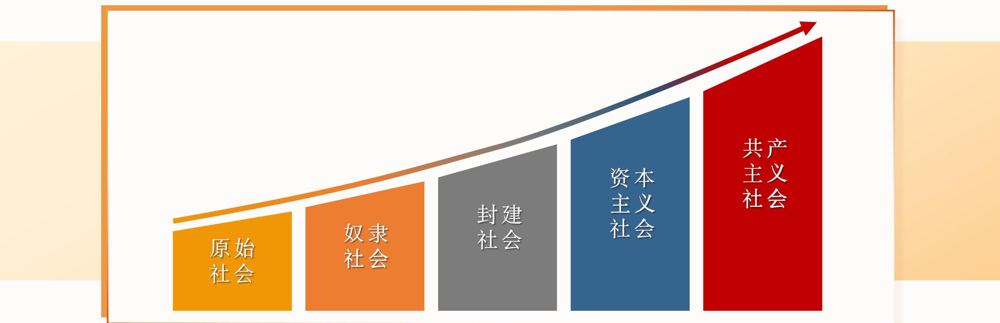
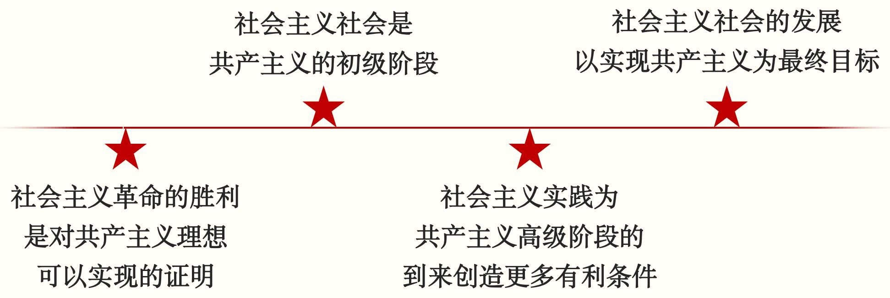
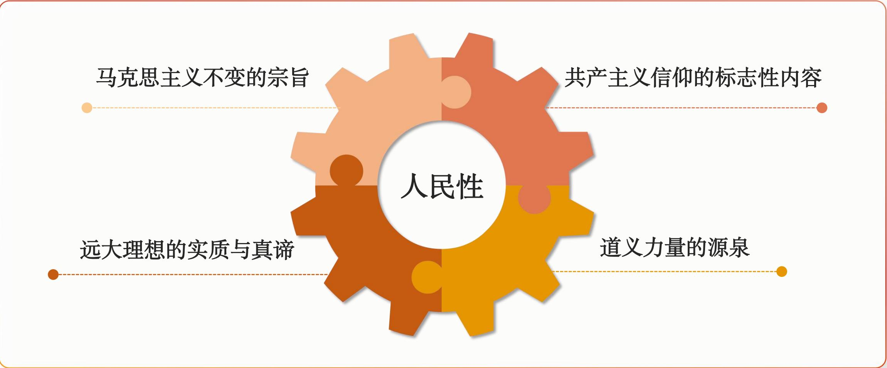

# 专题七 共产主义论

> [!abstract] 本专题导览
> 本专题是全课程的"压轴"与归宿——在论证了资本主义必然为社会主义所代替、社会主义又是共产主义初级阶段之后，正面回答**共产主义是什么、能不能实现、何时实现、青年应如何对待**。分三讲：
> - **第一讲 共产主义社会的基本特征**：何谓共产主义（三层含义）、如何科学预见未来社会（四大方法论原则）、共产主义的三大基本特征。
> - **第二讲 实现共产主义的历史必然性与长期性**：共产主义理想能实现吗（必然性）、能自动实现吗（自觉性）、能速成吗（长期性）。
> - **第三讲 坚定共产主义理想信念**：远大理想与共同理想的辩证关系、新时代青年为什么要坚定理想信念。
>
> 一句话主线：**共产主义的实现，是历史规律的必然 + 人们的自觉追求 + 长期的历史过程**。

---

# 第一讲 共产主义社会的基本特征

> [!question] 本讲三问
> 一、何谓共产主义？
> 二、如何科学预见未来社会？
> 三、共产主义社会何以引人向往？

## 一、何谓共产主义？——三层含义

> [!important] 共产主义的三层含义（重点）
>
> | 含义 | 内涵 |
> |---|---|
> | **作为思想体系**（共产主义理论） | 马克思恩格斯创立的关于无产阶级解放的性质、条件和一般目的的学说，具有科学性和阶级性，又称马克思主义或科学社会主义 |
> | **作为社会运动**（共产主义运动） | 由无产阶级领导的、为实现共产主义而进行的现实的社会革命运动——"共产主义……是那种**消灭现存状况的现实的运动**"（《德意志意识形态》） |
> | **作为社会制度/社会形态**（共产主义制度） | 共产主义运动的**必然结果和最终归宿**：共同占有社会资源、共同劳动、共同分享劳动成果的公有制社会 |

> [!note] "社会主义"与"共产主义"两个阶段的命名
> - 马克思在**《哥达纲领批判》**中讲共产主义有"**第一阶段**"和"**高级阶段**"，但未明确命名；
> - **列宁在《国家与革命》中第一次**把这两个阶段分别称为"**社会主义**"和"**共产主义**"。
> - 共产主义既是社会主义发展的高级阶段，也是人类社会发展的最高社会形态。

## 二、如何科学预见未来社会？

> [!note] 马克思之前的设想为何陷入空想？
> 中国古代的"大同"、"桃花源"，西方古代的"理想国"，近代的"乌托邦"（莫尔）、"太阳城"（康帕内拉）、"基督城"（安德里亚）、"实业制度"（圣西门）、"法郎吉"（傅立叶）、"新协和公社"（欧文）——都含天才闪光，但带根本的虚幻性质。
> **陷入空想的原因**：① **客观历史条件的限制**；② **主观预测方式的失误**（凭主观愿望、神秘直觉、文学想象，热衷细节描绘）。

> [!important] 马克思主义预见未来社会的四大方法论原则（核心考点）
> 马克思"丝毫不想制造乌托邦"，而是立足唯物立场、运用科学方法：
> 1. **方法之一**：在揭示**人类社会一般发展规律**的基础上，指明社会发展的方向；
> 2. **方法之二**：在**剖析资本主义旧世界**的过程中，阐发未来新世界的特点（"通过批判旧世界发现新世界"）；
> 3. **方法之三**：立足于揭示未来社会的**一般特征**，而**不对各种细节作具体描述**（"细节描绘越具体，就越陷入幻想"）；
> 4. **方法之四**：在**社会主义社会发展中**不断深化对未来共产主义社会的认识（从现实社会主义中寻找启示，而非只从资本主义找灵感）。

> [!tip] 方法论原则对个人成长的启示
> 这四条原则不仅用于预见社会，也指导个人人生规划：把握**规律与方向**、立足**现实批判**、抓住**大方向而非空想细节**、在**实践中不断深化**对理想的认识。

## 三、共产主义社会的基本特征

> [!important] 三大基本特征（重点）
> 我们不应沉溺于细节描绘，但完全可以从生产力、生产关系、社会与精神生活把握其基本特征：
> 1. **物质财富极大丰富，消费资料按需分配**；
> 2. **社会关系高度和谐，人们精神境界极大提高**；
> 3. **每个人自由而全面的发展，人类从必然王国向自由王国飞跃**。

### （一）物质财富极大丰富，消费资料按需分配

> [!note] 三个条件
> ① 社会生产力高度发展，产品极大丰富；② 实现普遍的生产资料公有制；③ 个人消费品实行"**各尽所能，按需分配**"。
> 马克思《哥达纲领批判》：「只有在……劳动已经不仅仅是谋生的手段，而且本身成了生活的第一需要之后……集体财富的一切源泉都充分涌流之后——只有在那个时候，才能……在自己的旗帜上写上：**各尽所能，按需分配**！」

### （二）社会关系高度和谐，人们精神境界极大提高

> [!summary] 四个表现
> - **阶级消灭，国家消亡**：随着阶级消失，作为阶级压迫工具的军队、警察、监狱等失去作用——国家机器将被"放到古物陈列馆去，同纺车和青铜斧陈列在一起"（恩格斯《家庭、私有制和国家的起源》）。
> - **"三大差别"消失**：工业与农业的差别、城市与乡村的差别、脑力劳动与体力劳动的差别。
> - **社会关系高度和谐**：每个人的自由发展是一切人自由发展的条件，人与人互相协作帮助。
> - **社会与自然达成和谐**：人是自然界的一部分，应与自然和谐共存（《1844 年经济学哲学手稿》：共产主义是"人和自然界之间、人和人之间矛盾的真正解决"）。

### （三）实现每个人自由而全面的发展，人类从必然王国向自由王国飞跃

> [!note] 新式分工代替旧式分工
> 共产主义社会消除了"奴隶般地服从于分工"的僵化旧式分工，代之以**自觉的新式分工**——"任何人都没有特殊的活动范围……上午打猎，下午捕鱼，傍晚从事畜牧，晚饭后从事批判"（《德意志意识形态》）。劳动不再是单纯谋生手段，而成为"**生活的第一需要**"。

> [!important] 从必然王国向自由王国的飞跃
> 共产主义实现了**人类解放**：人们第一次成为自然界、社会和自身的**自觉的主人**，"至今一直统治着历史的客观的异己的力量，现在处于人们自己的控制之下"。这是**从必然王国进入自由王国的飞跃**。
> ⚠ 注意：共产主义"不是人类历史的终结，而是人类自由自觉历史的开端"——它是一个在更高基础上不断发展前进的社会。

---

# 第二讲 实现共产主义的历史必然性与长期性

> [!question] 本讲三问（层层递进）
> 一、共产主义理想能够实现吗？——**必然性**
> 二、共产主义可以自动实现吗？——**自觉能动性**
> 三、共产主义社会能够速成吗？——**长期性**

## 一、共产主义理想能够实现吗？（必然性）

> [!important] 实现共产主义的三大依据
> 1. **是人类社会发展的必然要求**：人类社会从低级到高级、社会形态发展交替，由人类社会发展规律决定。
> 2. **是资本主义基本矛盾发展的必然结果**：马克思主义基于对资本主义内在矛盾（生产社会化与生产资料私人占有）的剖析，论证了资本主义的历史暂时性和自我否定趋势，揭示了工人阶级"推翻旧世界、建设新世界"的历史使命。
> 3. **是社会主义发展的历史趋势**：社会主义运动的实践，特别是社会主义国家的兴起和发展，用事实证明了共产主义理想实现的必然性。

> [!quote] "两个必然"没有过时
> 习近平：「马克思、恩格斯关于资本主义必然消亡、社会主义必然胜利的历史唯物主义观点也没有过时。这是社会历史发展不可逆转的总趋势，但**道路是曲折的**。」
> 邓小平：「社会主义经历一个长过程发展后必然代替资本主义……一些国家出现严重曲折，社会主义好像被削弱了，但人民经受锻炼，从中吸收教训，将促使社会主义向着更加健康的方向发展。」——所谓"历史终结论"已不攻自破。

## 二、共产主义可以自动实现吗？（自觉能动性）

> [!warning] 不能"自动实现"——离不开人的自觉活动
> 社会发展规律是**人们社会活动的规律**，它的实现离不开人们**自觉创造历史**的活动。社会主义代替资本主义、最终实现共产主义的历史进程：
> - 离不开**无产阶级的奋斗**；
> - 离不开**无产阶级政党的领导**；
> - 离不开**社会主义国家建设事业的推进**；
> - 离不开**国际共产主义运动的发展**。
>
> 习近平：「只要人民成为自己的主人、社会的主人、人类社会发展的主人，共产主义理想就一定能够在不断改变现存状况的现实运动中一步一步实现。」

## 三、共产主义社会能够速成吗？（长期性）

> [!important] 实现共产主义是长期的历史过程（两层）
> - **（一）资本主义的灭亡和向社会主义的转变是一个长期过程**：① 革命需要具备主客观条件；② 资本主义何时灭亡无人能未卜先知；③ 从资本主义向社会主义的**转变时期不以人的意志为转移、不能省略、不可随意缩短**。
> - **（二）社会主义社会的充分发展和最终向共产主义过渡需要很长历史时期**：社会主义是共产主义的初级阶段、是实现共产主义的必由之路；它要经历从低级到高级的发展阶段。
>
> 邓小平：「我们搞社会主义才几十年，还处在初级阶段……还需要我们几代人、十几代人，甚至几十代人坚持不懈地努力奋斗。」
> 习近平：「共产主义决不是'土豆烧牛肉'那么简单，不可能唾手可得、一蹴而就……革命理想高于天……我们现在坚持和发展中国特色社会主义，就是向着最高理想所进行的实实在在努力。」

> [!note] 中国特色社会主义道路是中华民族走向共产主义的必由之路
> 它同时是**中华民族复兴之路、科学社会主义之路、通向共产主义之路**。现实社会主义的每一个进步，都意味着向共产主义的接近。

> [!question] 讨论
> 有人说："我的人生这么短，共产主义那么远，还要为之奋斗吗？"——这种观点的要害在于**历史唯物主义观点不牢固**。共产主义虽是漫长过程，但绝非虚无缥缈的海市蜃楼，它由"一个一个阶段性目标逐步达成"，需要一代又一代人接力奋斗。

---

# 第三讲 坚定共产主义理想信念

> [!question] 本讲两问
> 一、如何理解远大理想与共同理想的关系？
> 二、新时代青年为什么要坚定理想信念？

## 一、远大理想与共同理想的辩证关系

> [!important] 共产主义远大理想的"四大力量"（突出优势与实践价值）
>
> | 力量 | 内涵 |
> |---|---|
> | **历史力量** | 具有漫长的历史积淀——共产主义信仰因素在马克思主义产生之前就已零星出现，马克思把它奠定在科学基础上 |
> | **真理力量** | 具有坚实的科学论证——坚实理论基础（从空想到科学）、优秀文化基础、科学思想内容 |
> | **道义力量** | 具有广泛的群众基础——核心是"**人民性**"（马克思主义不变的宗旨、共产主义信仰的标志性内容） |
> | **实践力量** | 具有强烈的现实追求——"哲学家们只是用不同的方式解释世界，而问题在于**改变世界**"（《关于费尔巴哈的提纲》） |

> [!important] 远大理想 vs 共同理想（最高纲领与最低纲领）
> - **共产主义远大理想** = **最终理想 / 最高纲领**：党的最高理想和最终目标是实现共产主义。
> - **中国特色社会主义共同理想** = **阶段性理想 / 最低纲领**：是我们在追求实现远大理想过程中当前着力追求的阶段性理想，是远大理想的**现实基础**。
> - **辩证关系**：「没有远大理想的指引，就不会有共同理想的确立和坚持；没有共同理想的实现，远大理想就没有现实的基础。」
>
> ⚠ 思考题辨析："只能讲共同理想、不应提远大理想，否则脱离实际"——**错误**。二者必须统一起来，最高纲领与最低纲领相统一，正是党的成熟与坚定的体现。

## 二、新时代青年为什么要坚定理想信念？

> [!summary] 信仰、信念、信心，任何时候都至关重要
> 习近平：「无论过去、现在还是将来，对**马克思主义的信仰**，对**中国特色社会主义的信念**，对**实现中华民族伟大复兴中国梦的信心**，都是指引和支撑中国人民站起来、富起来、强起来的强大精神力量。」
> 三者递进关系：**没有对马克思主义的信仰、对中国特色社会主义的信念，就不会有实现中国梦的坚定信心。**

> [!note] 怎么做？——三个"坚定"
> - 坚定对**马克思主义的信仰**，在真懂真信真用上下功夫；
> - 坚定对**中国特色社会主义的信念**，旗帜鲜明地批判历史虚无主义、"宪政民主"、新自由主义等各种错误思潮；
> - 坚定对**实现中华民族伟大复兴中国梦的信心**，坚定不移听党话、跟党走。

> [!example] 榜样：「时代楷模」黄文秀的无悔青春
> 百坭村第一书记黄文秀与群众日夜相伴、倾注心血于脱贫攻坚。她在入党申请书中写道：「只有把个人的追求融入党的理想之中，理想才会更远大……要用自己的力量为国家、为民族、为社会作出贡献。」她用短暂而优秀的一生，诠释了当代青年的担当与人生价值。
> 习近平：「青年一代有理想、有本领、有担当，国家就有前途，民族就有希望……我们不能因现实复杂而放弃梦想，不能因理想遥远而放弃追求。」

---

# 本章小结

> [!summary] 一图读懂专题七
> 共产主义有**思想体系、社会运动、社会制度**三层含义。马克思以**四大方法论原则**科学预见未来社会，揭示其三大基本特征：**物质财富极大丰富按需分配、社会关系高度和谐、每个人自由而全面发展（从必然王国向自由王国飞跃）**。共产主义的实现是**历史必然**（人类社会发展规律 + 资本主义基本矛盾 + 社会主义历史趋势），但不能**自动实现**（离不开人的自觉奋斗），更不能**速成**（是长期历史过程）。新时代青年应把远大理想与共同理想统一起来，坚定**信仰、信念、信心**，做共同理想的坚定信仰者和忠实践行者。

> [!question] 自测题
> 1. 共产主义的三层含义是什么？谁第一次把共产主义的两个阶段明确命名为"社会主义"和"共产主义"？
> 2. 马克思主义预见未来社会的四大方法论原则是什么？为什么不对未来社会作细节描绘？
> 3. 共产主义社会的三大基本特征是什么？如何理解"三大差别消失"和"从必然王国向自由王国的飞跃"？
> 4. 实现共产主义为什么是历史的必然（三大依据）？
> 5. 为什么说共产主义不能"自动实现"、也不能"速成"？
> 6. 辨析共产主义远大理想与中国特色社会主义共同理想的关系（最高纲领与最低纲领）。
> 7. 如何理解"信仰、信念、信心"三者的关系？新时代青年应如何坚定理想信念？

> [!note] 相关章节
> - 紧承 [[马原理-专题六_笔记]]（社会主义论：科学社会主义基本原则、社会主义向共产主义过渡）
> - "两个必然"与资本主义基本矛盾参见 [[马原理-专题五_笔记]]
> - 人类社会发展规律、必然王国与自由王国的哲学基础参见 [[马原理-专题三_笔记]]
