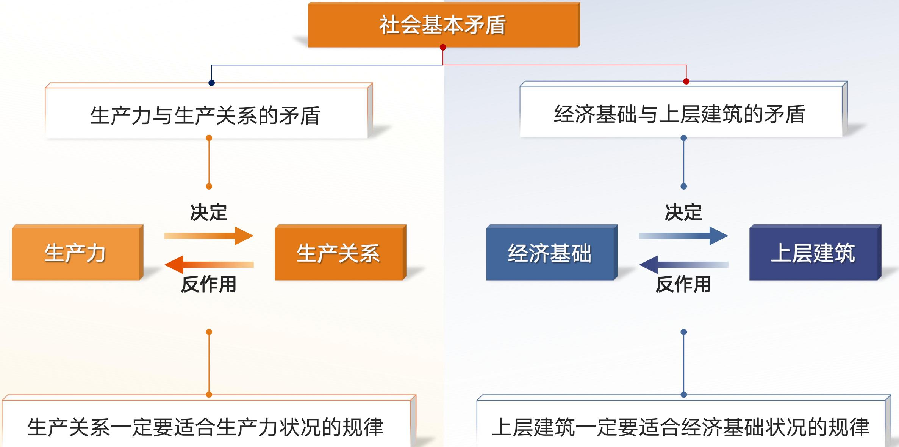

# 专题三 唯物史观——人类社会及其发展规律

> [!abstract] 本专题导览
> 唯物史观（历史唯物主义）是马克思的两大发现之一，它把唯物辩证法贯彻到社会历史领域，第一次科学回答了"社会历史观的基本问题"。本专题对应教材第三章，分三讲层层递进：
> - **第一讲 人类历史之谜何解？**——确立基本问题（社会存在与社会意识），揭示两对社会基本矛盾运动规律，阐明世界历史与社会形态更替。
> - **第二讲 撬动历史的杠杆何在？**——社会发展的动力系统：社会基本矛盾（根本动力）→ 阶级斗争（阶级社会直接动力）→ 社会革命 → 改革 → 科学技术 → 文化。
> - **第三讲 社会历史发展的主体力量**——人民群众是历史的创造者，辨析群众史观与英雄史观，厘清群众、阶级、政党、领袖的关系。
>
> 全章基本问题：**社会存在与社会意识的关系问题，是社会历史观的基本问题。**

---

## 第一讲：人类历史之谜何解？

### 一、为什么说唯物史观是"唯一科学的历史观"？

> 历史观（社会历史观）是人们对社会的起源、本质和发展等一般问题的总的看法和根本观点。在对待社会历史规律问题上，存在两种根本对立的历史观：**唯物史观**与**唯心史观**。

#### 唯心史观与唯物史观的根本对立

> [!warning] 唯心史观的实质与缺陷
> **实质**：主张**社会意识决定社会存在**——把社会本质归结为人的意志、意识或心理活动的产物（用神灵意志、"绝对精神"、绝对理性说明社会产生，或把少数英雄意志当作社会发展的决定力量）。
> 黑格尔即认为"历史是精神的发展"，伟大历史人物是"世界精神的代理人"。
>
> **两大缺陷**：
> 1. 至多考察了人的活动的**思想动机**，没有进一步考究思想动机背后的**物质动因和经济根源**；
> 2. 把社会历史看成精神发展史，**不懂社会历史的客观规律**，也**不懂人民群众的决定作用**。

> [!important] 马克思的科学解决
> 马克思科学地解决了社会存在与社会意识的关系问题，创立了唯物史观：始终站在现实历史基础上，"不是从观念出发来解释实践，而是从物质实践出发来解释各种观念形态"（《德意志意识形态》）。
> $$\text{唯物史观：社会存在} \xrightarrow{\text{决定}} \text{社会意识}\qquad\text{唯心史观：社会意识} \xrightarrow{\text{决定}} \text{社会存在}$$

### 二、社会存在与社会意识及其辩证关系（重点）

> [!note] 社会存在
> 指**社会物质生活条件**，是社会生活的物质方面，包括三要素：
> - **自然地理环境**——人类生存的自然条件；
> - **人口因素**——人口数量、质量、结构等；
> - **物质生产方式**（最重要）——即"物质生活的生产方式"，是人们为获取物质生活资料而进行的生产活动的方式，是**生产力和生产关系的统一体**。

> [!important] 物质生产方式是社会存在和发展的基础及决定力量
> 1. 物质生产活动及生产方式是人类社会**赖以存在和发展的基础**；
> 2. 决定社会的**结构、性质与面貌**；
> 3. 其变化发展**决定整个社会历史的变化发展**。

> [!note] 社会意识
> 是社会存在的反映，是社会生活的精神方面。按不同标准划分：
>
> | 划分角度 | 类别 | 含义 |
> |---|---|---|
> | 主体范围 | 个体意识 | 个人生活经历和社会地位等在自己头脑中的反映 |
> | 主体范围 | 群体意识 | 群体成员在群体实践中形成的共同意识 |
> | 层次高低 | 社会心理 | 低层次、自发、不系统、不定型；表现为感知、情绪、情感、心态、习俗 |
> | 层次高低 | 社会意识形式 | 高层次、自觉、系统、相对稳定；有**意识形态**与**非意识形态**之分 |
>
> **意识形态**（有阶级性）：政治法律思想、道德、艺术、宗教、哲学等；**非意识形态**：自然科学、语言学、逻辑学等。

#### 社会存在决定社会意识

> 1. 社会存在是社会意识**内容的客观来源**；
> 2. 社会意识是人们进行社会**物质交往的产物**；
> 3. 社会意识是**具体的、历史的**。

> [!example] 鲁迅之喻（社会意识的具体历史性）
> 鲁迅在《"硬译"与"文学的阶级性"》中指出："自然，喜怒哀乐，人之情也，然而穷人决无开交易所折本的懊恼，煤油大王哪会知道北京捡煤渣老婆子身受的酸辛，饥区的灾民，大约总不去种兰花。"
> ——说明不同社会地位的人，其情感意识由其社会存在所决定。

#### 社会意识的相对独立性

> 1. 社会意识与社会存在的发展具有**不完全同步性和不平衡性**（可超前、可滞后）；
> 2. 社会意识内部各种形式之间**相互影响**，且各自具有**历史继承性**；
> 3. 社会意识对社会存在具有**能动的反作用**（先进的促进、落后的阻碍）——这是其相对独立性最突出的表现。

> [!summary] 社会存在 vs 社会意识 对照表（自绘）
>
> | 对照项 | 社会存在 | 社会意识 |
> |---|---|---|
> | 地位 | 第一性，决定者 | 第二性，被决定者 |
> | 含义 | 社会物质生活条件（物质方面） | 社会存在的反映（精神方面） |
> | 构成 | 自然地理环境、人口因素、物质生产方式 | 个体/群体意识；社会心理/社会意识形式 |
> | 关系核心 | 社会存在**决定**社会意识的内容与变化 | 社会意识具有**相对独立性**，能动反作用于社会存在 |
> | 错误倾向 | —— | 夸大其独立性即陷入唯心史观 |

> [!success] 原理的重要意义
> - **理论意义**：在人类思想史上第一次正确回答了社会历史观的基本问题，**宣告唯心史观的彻底破产**。
> - **实践意义**：我国社会改革和发展的顶层设计、方针政策等，都必须**从现实的社会存在出发**。

### 三、社会基本矛盾及其运动规律（重点）

> [!quote] 马克思《〈政治经济学批判〉序言》（社会基本矛盾的经典表述）
> "人们在自己生活的社会生产中发生一定的、必然的、不以他们的意志为转移的关系，即同他们的物质生产力的一定发展阶段相适合的生产关系……物质生活的生产方式制约着整个社会生活、政治生活和精神生活的过程。……社会的物质生产力发展到一定阶段，便同……现存生产关系……发生矛盾……那时社会革命的时代就到来了。随着经济基础的变更，全部庞大的上层建筑也或慢或快地发生变革。"

#### （一）生产力与生产关系的矛盾运动及其规律

> [!note] 概念与构成
>
> | | 生产力 | 生产关系 |
> |---|---|---|
> | 含义 | 人类在生产实践中形成的改造和影响自然以使其适合社会需要的**物质力量** | 人们在物质生产过程中形成的**不以人的意志为转移的经济关系** |
> | 构成 | 劳动资料、劳动对象、**劳动者**（最活跃因素） | 生产资料所有制关系（**决定性**）、生产中人与人的关系、产品分配关系 |

> [!important] 矛盾运动规律：生产关系一定要适合生产力发展要求
> **① 生产力决定生产关系**：
> - 生产力状况**决定生产关系的性质**——"手推磨产生的是封建主的社会，蒸汽磨产生的是工业资本家的社会"（马克思《哲学的贫困》）；
> - 生产力的发展**决定生产关系的变化**。
>
> **② 生产关系对生产力具有能动的反作用**：
> - 适合时——**推动**生产力发展；
> - 不适合时——**阻碍**生产力发展。

```text
生产力与生产关系的矛盾运动（ASCII 结构图）

        ┌──────────────── 决定 ────────────────┐
        │  （性质 + 变化发展）                  ▼
   ┌─────────┐                            ┌──────────┐
   │ 生产力  │                            │ 生产关系 │
   │(劳动者/ │ ◀───────── 反作用 ─────────│(所有制/  │
   │ 资料/   │   适合→推动  不适合→阻碍   │ 人与人/  │
   │ 对象)   │                            │ 分配)    │
   └─────────┘                            └──────────┘
        └──► 规律：生产关系一定要适合生产力状况 ◄──┘
```

> [!success] 原理意义
> - **理论意义**：第一次科学确立生产力发展是"**社会进步的最高标准**"，为认识社会历史提供基本观点和方法。
> - **实践意义**：社会主义的**根本任务是解放和发展社会生产力**，为政党制定路线方针政策提供依据。

#### （二）经济基础与上层建筑的矛盾运动及其规律

> [!note] 概念与构成
>
> | | 经济基础 | 上层建筑 |
> |---|---|---|
> | 含义 | 由社会一定发展阶段的生产力所决定的**生产关系的总和**（占支配地位的生产关系决定社会性质） | 建立在一定经济基础之上的**意识形态以及与之相适应的制度、组织和设施** |
> | 构成 | 占统治地位的生产关系各方面的总和 | **观念上层建筑**（意识形态：政治法律思想、道德、艺术、宗教、哲学）+ **政治上层建筑**（国家政权机构、政党、军队、法庭、监狱等政治制度与设施） |
>
> 注：**经济基础 ≠ 经济体制**。经济体制是基本经济制度所采取的组织形式和管理形式，是生产关系的**具体实现形式**。

> [!important] 矛盾运动规律：上层建筑一定要适合经济基础状况
> - **经济基础决定上层建筑**（性质、变化）；
> - **上层建筑对经济基础具有反作用**：当其为适合生产力发展要求的经济基础服务时，成为**推动社会发展的进步力量**；为落后经济基础服务时，成为**阻碍社会发展的消极力量**。

```text
经济基础与上层建筑的矛盾运动（ASCII 结构图）

   ┌────────────┐   决定（性质/变化）   ┌────────────┐
   │ 经济基础   │ ────────────────────► │ 上层建筑   │
   │(生产关系   │                       │(观念上层建筑│
   │ 的总和)    │ ◀──────────────────── │ +政治上层  │
   └────────────┘   反作用              │  建筑)     │
        │           进步↔消极           └────────────┘
        └──► 规律：上层建筑一定要适合经济基础状况 ◄──┘
```

> [!tip] 两对基本矛盾合观
> 生产力 → 生产关系（= 经济基础）→ 上层建筑，构成"**生产力—生产关系/经济基础—上层建筑**"的纵向链条。下文第二讲会把这两对矛盾作为**一个整体**（社会基本矛盾）来考察，并附完整结构图。

### 四、世界历史如何形成和发展？

#### （一）交往及其作用

> [!note] 交往的内涵与类型
> **交往**指一定历史条件下现实的个人、群体、阶级、民族、国家之间在**物质上和精神上**相互往来、相互作用、彼此联系的活动。
>
> | 类型 | 含义 |
> |---|---|
> | 物质交往 | 人们在物质生产实践中发生的交往，物质产品是其交往内容 |
> | 精神交往 | 在思想、意识、观念、情感等精神领域进行的交往（当今：信息交往、文化交往） |
>
> **二者关系**：物质交往是精神交往的**基础和根源**；精神交往是物质交往的产物，渗透于物质交往之中。
>
> **交往是一种实践活动**，具备实践的基本特征：客观实在性、自觉能动性、社会历史性。
>
> **交往对社会生活的影响**：促进生产力发展、促进社会关系进步、促进文化发展与传播、促进人的全面发展。

#### （二）世界历史的形成与发展

> [!note] 世界历史的内涵与基础
> 唯物史观视域中的"**世界历史**"指各民族、国家通过普遍交往，打破孤立隔绝状态，进入相互依存、相互联系的**世界整体化**的历史（非编年史意义上的"全部历史"）。
> - **形成发展的基础**：**生产方式的发展变革**——大工业"首次开创了世界历史"（《德意志意识形态》）；
> - **基本特征**：**普遍交往**——任何民族、国家都摆脱不了世界市场的运行机制；
> - **意义指向**：为共产主义的实现提供条件与路径——共产主义"是以生产力的普遍发展和与此相联系的世界交往为前提的"。

> [!tip] 现实关照：人类命运共同体
> "万物并育而不相害，道并行而不相悖。"要站在世界历史的高度审视当今世界，坚持和平发展，推动构建**人类命运共同体**——这是世界历史理论的当代发展。

### 五、社会形态如何更替？

> [!note] 社会形态的内涵
> 社会形态是关于社会运动的具体形式、发展阶段和不同质态的范畴，是**同生产力发展一定阶段相适应的经济基础与上层建筑的统一体**。包括经济形态、政治形态、意识形态三者的统一，其中**经济形态是基础**，生产资料所有制关系具有决定性意义。
>
> 依据经济基础特别是生产关系的不同性质，社会历史可划分为**五种社会形态**：
> $$\text{原始社会} \to \text{奴隶社会} \to \text{封建社会} \to \text{资本主义社会} \to \text{共产主义社会}$$
> （社会主义社会是共产主义社会的**第一阶段 / 初级阶段**。）

> [!important] 社会形态更替的四个辩证特性
>
> | 特性 | 内涵 |
> |---|---|
> | 统一性 | 五种社会形态依次更替，是社会历史运动的**一般过程和一般规律** |
> | 多样性 | 就某一国家民族而言：有的典型依次更替，有的**跨越**一个甚至几个形态，有的交叉渗透或长期停滞——"世界历史发展的一般规律……不仅丝毫不排斥个别发展阶段……表现出特殊性，反而是以此为前提的"（列宁《论我国革命》） |
> | 必然性 | 更替的过程和规律是**客观**的，基本趋势确定不移；归根结底是**社会基本矛盾运动**的结果，生产力发展具有最终决定意义 |
> | 历史选择性 | ① 客观必然性提供选择的基础、范围和空间；② 是主观能动性与客观规律性相统一的过程；③ 归根结底是**人民群众的选择性** |
>
> 此外还表现为**前进性与曲折性**的统一：总体从低级到高级前进，但每一次社会变革无不经过曲折反复的斗争。

> [!tip] 文明及其多样性
> **文明**是人类创造的物质、精神和制度成果的总和，是标志社会进步程度的范畴。
> - **文明形态**可从三个维度概括：科技水平（农耕→工业→信息文明）、社会形态（奴隶/封建/资本主义/社会主义文明）、民族地域（西方/中华/印度/阿拉伯文明）；
> - **人类文明具有多样性**："人类文明多样性是世界的基本特征，也是人类进步的源泉。"

---

## 第二讲：撬动历史的杠杆何在？——社会历史发展的动力系统

> [!abstract] 动力系统总览
> 唯心史观把动力归结为思想动机或精神力量；唯物史观透过历史表象，从物质生产活动中发现"**动力的动力**"，揭示出层层递进的动力体系：
> $$\text{社会基本矛盾（根本动力）} \supset \text{阶级斗争} \to \text{社会革命} \to \text{社会改革} \to \text{科学技术} \to \text{文化}$$

### 一、社会基本矛盾是历史发展的根本动力

> [!note] 社会基本矛盾的定义
> **社会基本矛盾**指贯穿社会发展过程始终、规定社会发展过程的基本性质和基本趋势、并对社会历史发展起根本推动作用的矛盾。它由两对矛盾**共同构成**：
> - 生产力和生产关系的矛盾；
> - 经济基础和上层建筑的矛盾。



> [!important] 社会基本矛盾是根本动力的三点理由
> 1. **生产力**是社会基本矛盾运动中**最基本的动力因素**，是人类社会发展和进步的**最终决定力量**——"制造蒸汽机的人……所制作的工具，比其他任何东西都更能使全世界的社会状态发生革命"（恩格斯《自然辩证法》）；
> 2. 社会基本矛盾特别是**生产力和生产关系的矛盾**，决定着社会中其他矛盾的存在和发展——"一切历史冲突都根源于生产力和交往形式之间的矛盾"；
> 3. 社会基本矛盾具有不同的表现形式和解决方式，**从根本上影响和促进社会形态的变化和发展**（如资本主义生产方式萌芽 → 资产阶级革命 → 封建社会变革为资本主义社会）。

### 二、在实践中具体把握社会主要矛盾及其转化

> [!note] 社会主要矛盾
> 社会主要矛盾是**社会基本矛盾的具体体现**。在矛盾系统中各矛盾地位作用不平衡，主要矛盾处于支配地位、起主导作用，规定或影响着非主要矛盾。**社会主要矛盾不是一成不变的，在一定条件下会发生转化。**

> [!example] 毛泽东论旧中国社会主要矛盾的三种情形
> 半殖民地半封建的旧中国，社会主要矛盾随条件变化：
> - 帝国主义发动战争威胁民族生存时 → **中华民族与帝国主义的民族矛盾**成为主要矛盾；
> - 帝国主义"比较温和"地压迫中国时 → **国内阶级矛盾**重新成为主要矛盾；
> - 国内革命威胁帝国主义和国内反动势力时 → 二者联合与人民大众为敌，**共同成为主要矛盾的一方面**。

> [!important] 新时代中国社会主要矛盾的转化（党的十九大重大判断）
> **判断**：我国社会主要矛盾已转化为"**人民日益增长的美好生活需要和不平衡不充分的发展之间的矛盾**"。
> **依据**：
> - 一方面，**人民美好生活需要日益广泛**——不仅对物质文化生活提出更高要求，且在民主、法治、公平、正义、安全、环境等方面的要求日益增长；
> - 另一方面，**社会生产力水平总体显著提高**，更突出的问题是**发展不平衡不充分**。

### 三、如何理解阶级斗争的历史作用？

> [!note] 阶级与阶级斗争
> - **阶级**："所谓阶级，就是这样一些集团，由于它们在一定社会经济结构中所处的**地位不同**，其中一个集团能够**占有另一个集团的劳动**"（列宁《伟大的创举》）——划分阶级的根本标准是**对生产资料的占有关系（经济地位）**。
> - **阶级斗争**：阶级利益根本冲突的阶级之间的对立和斗争。
> - 阶级和阶级斗争是人类社会发展到**一定阶段**（生产力有所发展但发展不足、出现私有制和剩余产品）才出现的社会现象。

> [!important] 阶级斗争是阶级社会发展的直接动力
> 在阶级社会中，两对社会基本矛盾**必然通过阶级斗争表现出来**，社会发展的经济动因与阶级斗争联系在一起。其推动作用突出表现在**社会形态的更替**中（如法国大革命、巴黎公社、十月革命）。
> 但**阶级斗争及其作用受一定社会历史条件制约**——"社会主义社会中的阶级斗争是一个客观存在，不应该缩小，也不应该夸大"（邓小平）。

> [!tip] 马克思主义阶级分析方法
> 运用阶级和阶级斗争观点观察认识阶级社会现象，"在……扑朔迷离、一团混乱的状态中发现规律性"。它是马克思主义政党制定正确路线、方针、政策的重要依据。

### 四、社会革命的实质和作用

> [!note] 社会革命
> **实质**：革命阶级推翻反动阶级的统治，用**新的社会制度代替旧的社会制度**，解放生产力，推动社会发展。
> **作用**：
> - 是推动社会发展特别是**社会形态更替的重要动力**——"革命是历史的火车头"（马克思）；
> - 能充分发挥人民群众创造历史的积极性和伟大作用——"革命是被压迫者和被剥削者的盛大节日"（列宁）。

### 五、为什么说改革是推动社会进步的"法宝"？

> [!note] 改革的地位
> 改革是在一定程度上**解决社会基本矛盾**、促进生产力发展、推动社会进步的有效途径和手段。中外历史上的商鞅变法、古希腊伯利克里改革、俄国农奴制改革等均属此列。

> [!important] 改革 vs 革命 对比表（自绘）
>
> | 对比项 | 社会革命 | 改革 |
> |---|---|---|
> | 解决对象 | 现存社会**基本制度**问题 | 现存社会**体制**存在的问题 |
> | 是否改变社会基本制度 | **改变**（一种社会形态代替另一种） | **不改变**前提下，对生产关系和上层建筑某些方面环节进行变革 |
> | 性质 | 阶级推翻阶级的根本质变 | 同一社会制度的自我完善与发展 |
> | 力度 | 根本性、整体性变革 | 有局部浅层，也有全局深层 |
>
> 注：对于**全局性、深层次**的改革（对社会关系和上层建筑有深层触动），人们有时也称其为"革命"或"社会革命"——这是就其**深刻性和深远影响**而言，并非社会形态更替本来含义。

> [!success] 改革是推动中国社会进步的"法宝"
> 中国的社会主义改革，从性质上看是**社会主义制度的自我完善和自我发展**，但从其广泛性、深刻性和深远影响而言，可以说是"**一场伟大的革命**"。改革开放40多年成就（浦东、深圳、粤港澳大湾区巨变）有力证明了改革对社会进步的巨大作用，必须**一以贯之进行下去**。

### 六、为什么说"科学技术是第一生产力"？

> [!note] 科学技术的内涵
>
> | 概念 | 含义 |
> |---|---|
> | 科学 | 对自然、社会和人类思维的正确认识，是反映客观事实和客观规律的**知识体系及其相关活动** |
> | 技术 | 有广义（生产技术+非生产技术）和狭义之分；狭义即**生产技术**——人类改造自然、进行生产的方法和手段 |
> | 科技革命 | 科学与技术日益融为一体（科学技术化、技术科学化），融合科学革命和技术革命为主要内容 |

> [!important] 科学技术是推动经济和社会发展的强大杠杆
> 科技革命对社会生活产生深刻影响，集中表现在三方面：
> 1. **对生产方式**：改变社会生产力的构成要素、改变人们的劳动形式、改变社会经济结构（如智能制造）；
> 2. **对生活方式**：把人们带入信息时代，提供处理、存储、传递信息的手段，增多闲暇时间，为人的全面发展创造条件；
> 3. **对思维方式**：促进思维方式变革（如相对论诞生使人们放弃牛顿"绝对时空观"）。

> [!warning] 正确把握科学技术的社会作用（技术的"雅努斯双面"）
> 科学技术能通过促进经济社会发展**造福人类**，但其作用既受客观条件（社会制度、利益关系）影响，也受主观条件（观念、认识水平）影响，在一定条件下可能带来不利影响：
> - **资本主义条件下**：科技常被资产阶级用作剥削压迫人民的工具，"表现为异己的、敌对的和统治的权力"（如亚马逊用 AI 监控员工、霸权主义凭科技优势转嫁危机）；
> - **对自然规律认识不够、缺乏有效控制**：工业污染、生态破坏、生命科学伦理问题、互联网国家安全问题（如福岛核污水排海）。
>
> **解决之道**：要有**合理的社会制度**保障科技的正确运用，始终坚持科学技术为人类社会的健康发展服务，让科技为人类造福。

### 七、文化在社会发展中的作用

> [!note] 文化的广义与狭义
> - **广义文化**：人类的社会实践活动及其产物（物质、政治、精神文明），此意义上文化与文明相通；
> - **狭义文化**：人类精神生产活动及其结果，是与经济、政治相对应的观念形态文化，是一个国家、民族的**灵魂**。
>
> **文化对社会发展的作用**（性质上促进或阻碍，程度上加快或延缓）：
> 为社会发展提供 ① **思想引领** ② **精神动力** ③ **智力支持** ④ **凝聚力量**。

---

## 第三讲：社会历史发展的主体力量

> [!question] 引入：如何看待福山的"历史终结论"？
> 20世纪80年代末90年代初，苏东剧变、世界社会主义陷入低潮。1989年美国学者福山在《历史的终结》中提出"历史终结论"，认为冷战结束标志共产主义终结、历史只剩西方市场经济与民主政治一条路。
> 唯物史观对此的回应：社会形态更替由社会基本矛盾运动决定，历史不会"终结"于资本主义。回答的关键在于**坚持群众史观**——"人民是历史的创造者，是真正的英雄"。

### 一、究竟谁是历史的创造者？

#### 英雄史观和群众史观的对立

> [!note] 两种历史观
> - **英雄史观**：从社会意识决定社会存在的前提出发，否认物质生产方式是社会发展的决定力量，抹杀人民群众的历史作用，**宣扬少数英雄人物创造历史**（如"历史者，英雄之舞台也，舍英雄几无历史""无天才即无历史"）。
> - **群众史观**：把社会存在决定社会意识的观点贯彻到底而得出的科学论断——**人民群众是历史的创造者**。
>
> 英雄史观产生有三大根源：**认识根源**（夸大英雄作用、无视群众）、**社会历史根源**（群众在私有制社会处于被支配地位）、**阶级根源**（剥削阶级思想家为维护本阶级利益）。

> [!important] 群众史观 vs 英雄史观 对比表（源自课件）
>
> | 具体区别 | 群众史观 | 英雄史观 |
> |---|---|---|
> | 理论出发点不同 | 从物质生产活动出发 | 从人的思想动机出发 |
> | 分析问题的方法不同 | 探寻人的思想动机背后的物质根源 | 停留于人的思想动机层面 |
> | 阶级立场不同 | 站在广大人民群众的立场上 | 站在少数统治者的立场上 |

> [!tip] 唯物史观考察"谁是历史创造者"坚持的四项原则
> 1. 立足于**现实的人及其本质**——"人的本质……是一切社会关系的总和"（人的本质属性是社会属性，表现在各种社会关系中，是变化发展的）；
> 2. 立足于**整体的社会历史过程**（区分创造个体历史与创造社会历史）；
> 3. 从社会历史发展的**必然性**入手（只有代表推动历史前进力量的人才属于历史的创造者）；
> 4. 从人与历史关系的**不同层次**考察（类—群体—个体）：
>
> | 层次 | 历史作用 |
> |---|---|
> | 类 | 人们自己创造自己的历史 |
> | 群体 | 人民群众是历史的真正创造者 |
> | 个体 | 个人尤其是杰出人物在历史上起重大作用 |

#### 人民群众及其历史创造作用

> [!note] 人民群众的内涵
> - **质**：一切对社会历史发展起**推动作用**的人；**量**：社会人口的**绝大多数**。
> - 人民群众是一个**历史范畴**，最稳定的主体始终是**从事物质资料生产的劳动群众**。
> - 当代中国：全体社会主义劳动者、社会主义事业的建设者、拥护社会主义的爱国者、拥护祖国统一和致力于中华民族伟大复兴的爱国者。

> [!important] 人民群众历史创造作用的三大体现
> 1. 人民群众是**社会物质财富**的创造者；
> 2. 人民群众是**社会精神财富**的创造者；
> 3. 人民群众是**社会变革**的决定力量——"淮海战役的胜利，是人民群众用小车推出来的！"
>
> 但人民群众创造历史的活动**受一定社会历史条件制约**，大体分为**经济条件、政治条件、精神文化条件**三方面——"人们自己创造自己的历史，但是……是在直接碰到的、既定的、从过去承继下来的条件下创造"（马克思《路易·波拿巴的雾月十八日》）。

> [!success] 无产阶级政党的群众观点与群众路线
> - **群众观点**：坚信人民群众自己解放自己；全心全意为人民服务；一切向人民群众负责；虚心向群众学习。
> - **群众路线**：一切为了群众，一切依靠群众，**从群众中来，到群众中去**。
> - "人民，只有人民，才是创造世界历史的动力"（毛泽东）；"江山就是人民，人民就是江山"（习近平）。

### 二、"时势造英雄"还是"英雄造时势"？

> [!note] 个人在社会历史中的作用
> 唯物史观既明确人民群众是历史的创造者，**也不否认个人在历史上的作用**。"历史是这样创造的：最终的结果总是从许多单个意志的相互冲突中产生……由此就产生出一个合力，即历史结果"（恩格斯）。
> - **历史人物**：一定历史事件的主要倡导者、组织领导者或思想理论、科学文化的重要代表人物；
> - **杰出人物**：历史人物中对推动历史发展作出重要贡献的人。他们比一般人**站得高、看得远**，但**终究不能改变历史发展的基本方向**——其作用性质取决于其思想行为是否符合社会发展规律、是否符合人民群众意愿。

> [!important] 如何正确评价历史人物——两种方法相统一
>
> | 方法 | 内涵 |
> |---|---|
> | 历史分析法 | 从特定历史背景出发，根据当时的历史条件，对历史人物的是非功过进行具体、全面的考察（"不能用今天的……水平去衡量和要求前人"） |
> | 阶级分析法 | 把历史人物置于一定的阶级关系中，同其所属阶级联系起来加以考察评价 |
>
> 在阶级社会中，贯彻历史分析方法与坚持阶级分析方法是**一致的**——离开一定阶级背景，就难以理解历史人物的产生、作用及其性质。
> **结论**：任何历史人物的出现都体现了偶然性背后的必然性，这表明是"**时势造英雄**"而不是"英雄造时势"。

### 三、谁才是人民群众利益的忠实代表？——群众、阶级、政党、领袖的关系

> [!quote] 列宁《共产主义运动中的"左派"幼稚病》
> "群众是划分为阶级的……阶级是由政党来领导的；政党通常是由……被选出担任最重要职务而称为领袖的人们所组成的比较稳定的集团来主持的。"

```text
群众、阶级、政党、领袖的关系（ASCII 层级图）

   ┌──────────────────────────────────────────┐
   │ 群 众  ── 划分为 ──► 阶 级                │
   │ (绝大多数)         (按生产关系中的地位划分)│
   │                       │ 由…领导            │
   │                       ▼                    │
   │                     政 党                  │
   │                  (最先进阶级的           │
   │                   有组织的代表)            │
   │                       │ 由…主持            │
   │                       ▼                    │
   │                     领 袖                  │
   │            (在长期群众斗争中产生，         │
   │             是群众利益的忠实代表)          │
   └──────────────────────────────────────────┘
   关系实质：领袖代表政党 → 政党代表阶级 → 阶级中最先进者
            （无产阶级）代表人民群众的根本利益
```

> [!important] 四者关系要点
> - **群众是划分为阶级的**：阶级在社会生活中的地位，主要取决于其在生产关系中的地位；
> - **阶级通常是由政党领导的**：无产阶级只有组织成政党，才能作为一个阶级来行动；
> - **政党是由领袖来主持的**："任何一个领导集体都要有一个核心，没有核心的领导是靠不住的"（邓小平）；
> - **无产阶级革命领袖**是在长期群众斗争、群众实践中产生的，是无产阶级和人民群众利益的**忠实代表**——"我将无我，不负人民"（习近平）。

---

## 本章小结

> [!summary] 唯物史观核心线索
> 1. **基本问题**：社会存在与社会意识的关系——社会存在决定社会意识，社会意识具有相对独立性并能动反作用。
> 2. **两对基本矛盾及其规律**：生产力↔生产关系（生产关系一定要适合生产力状况）、经济基础↔上层建筑（上层建筑一定要适合经济基础状况），共同构成社会基本矛盾，是社会发展的**根本动力**。
> 3. **动力系统**：社会基本矛盾 → 阶级斗争（阶级社会直接动力）→ 社会革命（火车头）→ 改革（法宝）→ 科学技术（第一生产力、强大杠杆）→ 文化。
> 4. **主体力量**：人民群众是历史的创造者（物质财富、精神财富、社会变革三大体现）；坚持群众观点和群众路线；辩证评价个人作用，坚持历史分析法与阶级分析法；正确处理群众、阶级、政党、领袖的关系。
> 5. **社会形态更替**：统一性与多样性、必然性与历史选择性、前进性与曲折性的辩证统一。

## 自测题

> [!question] 自测题 1
> 唯物史观何以超越唯心史观？（提示：从社会历史观基本问题的科学回答、思想动机背后的物质动因和经济根源、人民群众的决定作用三方面作答。）

> [!question] 自测题 2
> 为什么说"手推磨产生的是封建主的社会，蒸汽磨产生的是工业资本家的社会"？（提示：运用"生产力决定生产关系——生产力状况决定生产关系的性质"原理分析。）

> [!question] 自测题 3
> 试用社会基本矛盾运动规律说明：为什么"生产关系一定要适合生产力状况、上层建筑一定要适合经济基础状况"是人类社会发展的一般规律？

> [!question] 自测题 4
> 改革与革命有何区别与联系？为什么说中国的社会主义改革"是一场伟大的革命"？

> [!question] 自测题 5
> "时势造英雄"还是"英雄造时势"？请运用唯物史观关于人民群众和个人历史作用的原理加以辨析，并说明评价历史人物应坚持的两种方法。

> [!question] 自测题 6
> 为什么说群众路线是党的生命线和根本工作路线？如何正确认识和处理群众、阶级、政党、领袖的关系？

---

## 相关章节

- 上承 [[马原理-专题二_笔记]]：唯物辩证法（矛盾分析法、否定之否定、质量互变等）为本专题"社会基本矛盾运动""社会形态更替的前进性与曲折性"提供方法论基础。
- 下启 [[马原理-专题四_笔记]]：在唯物史观揭示的社会基本矛盾基础上，进一步剖析资本主义生产方式及其内在矛盾。
