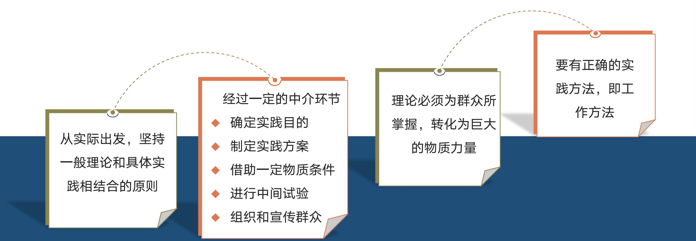
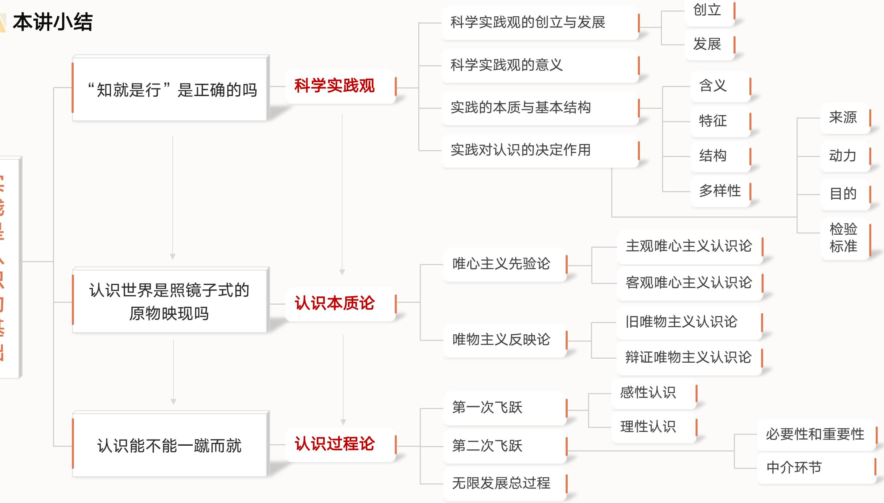
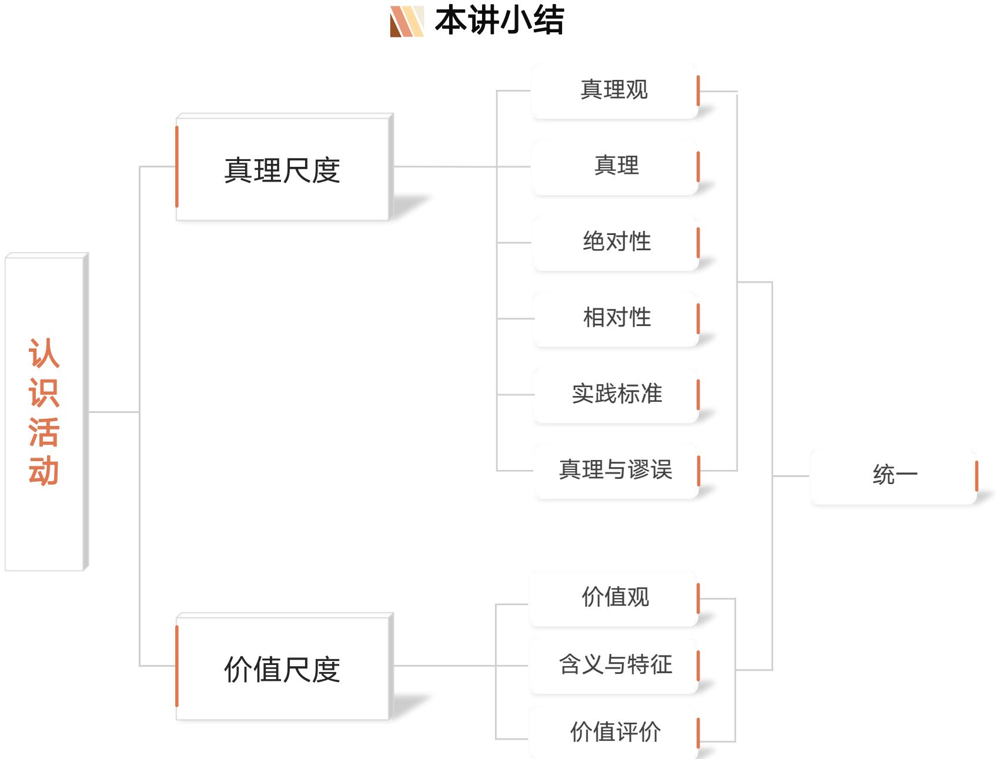
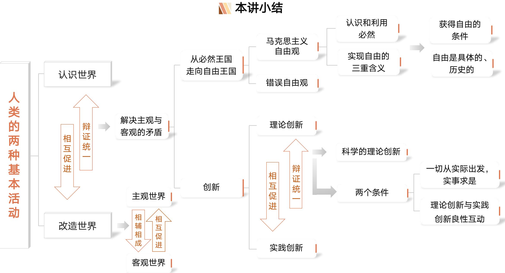

# 专题二　实践与认识及其发展规律

> [!abstract] 本专题定位
> 本专题即第二章，讲的是**辩证唯物主义认识论**——回答"如何认识世界、真理与价值为何值得追求、如何改造世界"三大问题。它承接 [[马原理-专题一_笔记]]（世界的物质性及发展规律，辩证唯物论与唯物辩证法），把唯物论与辩证法贯彻到**认识领域**；并为 [[马原理-专题三_笔记]]（人类社会及其发展规律，历史唯物主义）奠定方法论基础。
>
> 全篇围绕**三条主线**展开：
> - **第一讲　实践是认识的基础**：科学实践观 → 认识的本质（能动反映论）→ 认识的辩证运动（两次飞跃）。
> - **第二讲　真理与价值是人类活动的两大尺度**：真理的客观性/绝对性与相对性、真理与谬误、实践是检验真理的唯一标准；价值及其特性、真理与价值的辩证统一。
> - **第三讲　认识世界是为了改造世界**：认识世界与改造世界的关系、自由与必然、理论创新与实践创新的良性互动。

---

# 第一讲　实践是认识的基础

> [!question] 三个总问题（贯穿第一讲）
> 1. "知就是行"是正确的吗？ → **科学实践观**
> 2. 认识世界是照镜子式的原物映现吗？ → **认识本质论**
> 3. 认识能不能一蹴而就？ → **认识过程论**

## 一、"知就是行"是正确的吗？——科学实践观

### （一）知行关系的思想史背景

> [!example] 问题导入：王阳明的"知行合一"
> "今人学问，只因知行分作两件……我今说个知行合一，正要人晓得一念发动处，便即是行了。"——王阳明《传习录》
>
> 明代王阳明从**道德良知**意义上主张"知"即是"行"。这一观点是否正确？什么是"知"、什么是"行"？谁先谁后、谁是基础？

中外哲学家对"知行（实践）"的认识各有局限：

> [!note] 中国哲学中的知行关系
>
> | 哲学家 | 核心主张 | 评价 |
> |---|---|---|
> | 朱熹 | 致知为先、力行为重；知在先，行在后 | 割裂知行先后 |
> | 王阳明 | 知行合一，"知是行之始，行是知之成" | 夸大"知"，混淆知行，趋向主观唯心主义 |
> | 王夫之 | "行先知后，知源于行"，知对行有反作用 | 较接近唯物，但把"行"局限于个人行为 |

> [!note] 西方哲学：亚里士多德"三分法"及其后续
> 亚里士多德把人的活动分为**理论（沉思）、实践、制作（创制）**三类：
> - **理论 vs 实践**：同为非生产性、有内在目的；但理论求知、本性是沉思，实践求善、本性是行动。
> - **实践 vs 创制**：对象都是"可变、不确定的事物"；但实践=伦理与政治行为（目的在活动本身的好），创制=生产与技艺（目的在产品的好）。
>
> 后世康德（实践=理性先天的道德活动）、黑格尔（实践=主体自我实现的精神活动）、费尔巴哈（实践=日常生活活动，等同于生物适应环境）**都没有真正理解人类实践的本质**，没有看到实践在社会生活和认识中的决定意义。

### （二）科学实践观的创立——《关于费尔巴哈的提纲》

> [!important] 旧唯物主义的根本缺陷（《提纲》第1条）
> "从前的一切唯物主义（包括费尔巴哈的唯物主义）的主要缺点是：对对象、现实、感性，只是从客体的或者直观的形式去理解，而不是把它们当做感性的人的活动，当做实践去理解，不是从主体方面去理解。"
>
> 即：旧唯物主义只从**客体/直观**看世界，唯心主义却抽象地发展了**能动**的方面——马克思用"**感性的、对象性的人的活动（实践）**"统一了二者。

《提纲》中马克思的四个核心论断：

| 条目 | 论断 | 意义 |
|---|---|---|
| 第1条 | 指出从前一切唯物主义的主要缺点 | 引入实践，超越直观唯物主义 |
| 第2条 | 提出**检验真理的实践标准**——"人的思维是否具有客观真理性……是一个实践的问题" | 真理标准论 |
| 第8条 | **全部社会生活在本质上是实践的** | 唯物史观萌芽 |
| 第11条 | "哲学家们只是用不同的方式**解释世界**，问题在于**改变世界**" | 明确哲学根本任务 |

> [!summary] 《提纲》的地位
> 恩格斯称其为"包含着新世界观的天才萌芽的第一个文献"。它标志着：① 马克思主义哲学第一次同所有旧唯物主义划清界限；② 马克思与费尔巴哈彻底决裂；③ 为完备、彻底的唯物主义世界观奠定基础。

**科学实践观的丰富发展**：列宁——"生活、实践的观点，应该是认识论的首要的和基本的观点"；毛泽东——实践是"主观见之于客观的东西"（《实践论》）；邓小平——"实践是检验真理的唯一标准"，支持真理标准大讨论。

> [!note] 科学实践观创立的四大意义
> 1. 克服旧唯物主义根本缺陷，为**辩证唯物主义**奠定科学理论基础（在实践基础上统一唯物论与辩证法）。
> 2. 建立科学的、能动的、革命的**反映论**，实现认识史变革（驳倒唯心主义先验论与不可知论，克服直观反映论）。
> 3. 第一次揭示**社会生活的实践本质**，为科学历史观（历史唯物主义）奠基。
> 4. 为人们能动地认识世界和改造世界提供基本的**思想方法和工作方法**。

### （三）实践的本质、特征与基本结构

> [!important] 实践的科学含义
> **实践是人类能动地改造世界的社会性的物质活动。**
> 它是：人类生存发展最基本的活动、人类社会生活的本质、人的认识产生和发展的基础、真理与价值统一的基础。

> [!note] 实践的三个基本特征
>
> | 基本特征 | 内涵要点 |
> |---|---|
> | **客观实在性** | ① 实践三要素（主体、客体、中介）都是可感知的客观实在；② 实践的水平、广度、深度受客观条件制约和客观规律支配；③ 能引起客观世界变化，把观念存在变为现实存在 |
> | **自觉能动性** | 实践是有意识、有目的的活动（目的性是能动性的主要表现）；区别于动物本能的、被动的适应性活动 |
> | **社会历史性** | 实践从一开始就是社会性活动（主体处于一定社会关系中）；社会性决定历史性——实践的内容、性质、范围、水平、方式随社会历史条件变化而变化 |

> [!question] 讨论：鲁滨逊孤岛求生是实践吗？有社会历史性吗？
> 是实践。虽然他独自生活，但其工具、技能、语言、知识都来自社会，活动方式受一定社会历史条件制约——**社会历史性不以当下是否有他人在场为标准**，而以是否处于社会关系、依赖社会条件为标准。

#### 实践的基本结构（三要素）

实践由**主体、客体、中介**三要素有机统一构成。其结构可示意如下：

```
                ┌──────────── 实践中介 ────────────┐
                │  工具/手段 + 操作程序与方法        │
                │  ① 物质性工具系统                  │
                │  ② 语言符号工具系统                │
                └───────────────┬──────────────────┘
                                │（借助）
   实践主体  ───────改造（实践关系）──────►  实践客体
  有主体能力、从事现实社会实践的人          实践活动所指向的对象
  · 个体主体 / 群体主体 / 人类主体          · 天然客体 / 人工客体
                                          · 自然客体 / 社会客体
                                          · 物质性客体 / 精神性客体
```

> [!note] 主体与客体的三重关系
>
> | 关系 | 内涵 | 地位 |
> |---|---|---|
> | 实践关系 | 改造与被改造 | **最根本的关系** |
> | 认识关系 | 认识与被认识 | 以实践关系为基础 |
> | 价值关系 | 客体满足主体需要 | 由前两者派生 |
>
> 实践的主客体与认识的主客体**本质上一致**：主体认识客体的过程，也是改造客体的过程；改造与认识说到底是为满足主体需要，从而构成价值关系。

> [!note] 结构的历史变化：双向运动
> - **主体客体化**：人通过实践把本质力量物化为对象物（如制造出原先不存在的机器人）。
> - **客体主体化**：客体失去客体性形式，变成主体的一部分（如实践中磨练了意志、体魄，对象的力量融入主体）。
> - 二者双向运动，不断解决现实世界的矛盾。

#### 实践形式的多样性

> [!note] 三种基本实践形式 + 派生形式
>
> | 基本形式 | 地位与特点 |
> |---|---|
> | **物质生产实践** | 人类**最基本**的实践活动，决定社会的基本性质和面貌，是全部社会生活的基础 |
> | **社会政治实践** | 处理各种政治关系（阶级斗争、制度变革、政治参与等），与国家权力相联系 |
> | **科学文化实践** | 创造精神文化产品（科学实验、艺术创作、教育等），以物质生产实践为基础但有相对独立性；探索性、理想性、思想性是其特征 |
>
> 三者各具功能又密切联系：后两者在物质生产实践基础上产生、受其制约，又对其能动反作用。
>
> **虚拟实践**：现代信息技术催生的**派生形式**——主体与客体通过数字化中介系统在虚拟空间进行双向对象化活动，具交互性、开放性、间接性；提升了人的自主性创造性，但带来新问题需法律监管与道德约束。

### （四）实践对认识的决定作用

> [!important] 实践是认识的基础，在认识中起决定性作用——四个方面
>
> | 作用 | 内涵 | 经典论述 |
> |---|---|---|
> | **认识的来源** | 认识内容在实践基础上产生；一切真知都源于直接经验 | "你要知道梨子的滋味，你就得变革梨子，亲口吃一吃"（毛泽东） |
> | **认识发展的动力** | ① 实践需要推动认识产生发展；② 提供手段和条件；③ 锻炼提高人的认识能力 | "社会一旦有技术上的需要，这种需要就会比十所大学更能把科学推向前进"（恩格斯） |
> | **认识的目的** | 获得认识不为"猎奇""雅兴"，最终是为实践服务、指导实践 | —— |
> | **检验真理性的唯一标准** | 真理性不能从认识本身或对象中得到回答，只有在实践中验证 | "真理的标准只能是社会的实践"（毛泽东） |

> [!note] 直接经验与间接经验
> - **直接经验**：经亲身实践获得的感性经验。
> - **间接经验**：从书本和传授中学习得来的别人的感性经验。
> - 二者是"**源**"与"**流**"的关系——"在我为间接经验者，在人则仍为直接经验"（毛泽东）。

> [!success] 问题解答："知就是行"是正确的吗？
> 认识（"知"）和实践（"行"）是人与世界关系的两个基本方面，既不能把认识等同于实践，也不能把实践等同于认识。王阳明"知就是行"夸大了"知"、混淆了知行，根源在于没有从现实的生产实践和社会交往实践去把握"行"的本质和决定作用，必然导致**主观唯心主义**。

---

## 二、认识世界是照镜子式的原物映现吗？——认识本质论

> [!example] 问题导入："心灵之镜"的比喻
> 古今中外不少哲学家把心灵的认识能力理解为镜子式映现外物——庄子"用心若镜"、王阳明"圣人之心如明镜"、孔狄亚克"镜子准确表达对象"、罗蒂批判"作为一面巨镜的心的图画"。心灵真的是一面映照万物的镜子吗？

### （一）两条不同的认识路线

> [!important] 唯物主义反映论 vs 唯心主义先验论
>
> | 路线 | 方向 | 代表 |
> |---|---|---|
> | **唯心主义先验论** | 从思想和感觉到物（认识先于/超越经验） | 主观唯心（孟子"良知良能"、惠能"仁者心动"、柏拉图"灵魂回忆说"、笛卡尔"天赋观念说"）；客观唯心（认识是上帝启示或客观精神产物） |
> | **唯物主义反映论** | 从物到感觉和思想 | 认识是主体对客体的反映，一切认识来自外部世界，不承认"生而知之" |

> [!warning] 旧唯物主义反映论（直观反映论）的两点缺陷
> 旧唯物主义以**感性直观**为基础，把认识看成消极、被动地反映外界（亚里士多德"蜡块说"——感觉如蜡块接受指环印文；洛克"白板说"——心灵是白板，知识全来自经验）。其缺陷：
> 1. **离开实践**考察认识，不了解实践对认识的决定作用；
> 2. **不了解认识是一个辩证发展的过程**。

> [!note] 辩证唯物主义认识论的两个突出特点
> 1. 把**实践**的观点引入认识论（实践是整个认识论的基础）；
> 2. 把**辩证法**应用于考察认识过程（认识是充满矛盾的发展过程）。

### （二）辩证唯物主义对认识本质的科学回答

> [!important] 认识的本质
> **认识是主体在实践基础上对客体的能动反映，具有反映性和创造性两个基本特征。**

> [!note] 反映性与创造性的辩证统一
>
> | 特征 | 内涵 | 例证 |
> |---|---|---|
> | **反映性**（基本规定性） | 认识必以客观事物为原型和摹本，再现/摹写其状态、属性、本质；反映的摹写性表明反映的客观性 | 龙的形象——角似鹿、头似牛、眼似虾……仍是对现实事物的拼合，非凭空捏造 |
> | **创造性** | 认识是思维中能动的、创造性活动，不是照镜子式的原物反映；探寻把握本质的抽象活动鲜明体现能动性 | 几何"三角形"无体积、边无宽厚——现实没有，是思维抽象的产物；维特根斯坦"兔鸭图" |
>
> 反映和创造**不是两种本质，而是同一本质的两种功能**（如硬币两面）：创造离不开反映、存在于反映之中；反映离不开创造、在创造过程中实现。屠呦呦从《肘后备急方》获启发提取青蒿素，正是**创造性反映**与无数次实践的结合。

> [!success] 问题解答：认识是照镜子式的原物映现吗？
> 不是。认识是主体在实践基础上对客体的**能动反映**，既有反映特性又有创造性特征。"心灵镜子"比喻仅揭示了反映特性，却没有揭示创造性，更没有看到认识的实践基础，因而没有真正理解认识的本质。

> [!question] 讨论：智能机器人能否通过自主学习而拥有知识？
> 不能（不是真正的认识主体）。人工智能在本质上是对人脑组织结构与思维机制的**模仿**，是人类智能的**物化**；机器人不能在实践基础上能动地反映客观事物及其规律，尤其不能通过抽象活动把握事物的本质。

---

## 三、认识能不能一蹴而就？——认识过程论

> [!example] 问题导入
> 阿基米德洗澡时悟出浮力定律、牛顿见苹果落地想到万有引力——这两个例子似乎表明正确认识是"一蹴而就"的。究竟认识能不能一蹴而就？

认识的辩证运动包含**两次飞跃**，并循环往复、无限发展。

### （一）第一次飞跃：从实践到认识（感性认识 → 理性认识）

> [!important] 感性认识 vs 理性认识对照表
>
> | 维度 | 感性认识 | 理性认识 |
> |---|---|---|
> | **含义** | 由感觉器官直接感受到的关于事物**现象、外部联系、各个方面**的认识 | 对事物的**本质、全体、内部联系和规律性**的认识 |
> | **三种形式** | 感觉（个别属性）→ 知觉（外部特征整体）→ 表象（对过去感知的回忆，感性高级形式） | 概念（一般特性/本质属性的概括）→ 判断（展开的概念，断定是否具有某属性）→ 推理（由已知合乎逻辑推出未知） |
> | **内容** | 事物的表面现象和外部联系 | 事物的本质、全体、内部联系和规律性 |
> | **特征** | 直接性、形象性（局限：表面性、肤浅性） | 抽象性、间接性 |
> | **地位** | 认识的**初级阶段**，是达成理性认识的基础 | 认识的**高级阶段** |
>
> 举例：从苹果、梨概括出"水果"的**概念** → "苹果是一种水果"的**判断** → "水果有营养、苹果是水果，所以苹果有营养"的**推理**。

> [!note] 感性认识与理性认识的辩证关系
> 1. 感性认识**有待于发展深化**为理性认识；
> 2. 理性认识**依赖于**感性认识（"感觉经验是第一的东西"）；
> 3. 二者**相互渗透、相互包含**——"你中有我、我中有你"，在实践基础上统一。"感觉到了的东西，我们不能立刻理解它，只有理解了的东西才更深刻地感觉它"（毛泽东）。

> [!warning] 割裂二者的两种错误倾向
>
> | 倾向 | 表现 | 实际工作中的错误 |
> |---|---|---|
> | **唯理论** | 轻视感性、片面夸大理性 | 教条主义 |
> | **经验论** | 轻视理性、片面夸大感性 | 经验主义 |
>
> 近代西方"唯理论 vs 经验论"之争：经验论认为知识来源于感官经验、以感官经验为真理标准、强调归纳法；唯理论认为知识来源于"天赋观念"、以"清楚自明"为真理标准、崇尚演绎法。

> [!note] 感性认识向理性认识飞跃的两个条件
> 1. **投身实践、深入调查**，获取丰富而合乎实际的感性材料（前提）；
> 2. 经过**理论思维和科学抽象**，对感性材料进行"去粗取精、去伪存真、由此及彼、由表及里"的改造制作，形成系统的概念和理论。
>
> 马克思的"两条道路"：第一条道路——从**感性具体**到**思维抽象**；第二条道路——从思维抽象上升为**思维具体**（"抽象的规定在思维行程中导致具体的再现"）。

> [!note] 认识中非理性因素的作用
> 非理性因素主要指认识主体的**情感和意志**，广义还包括联想、想象、猜测、直觉、顿悟、灵感等。人是知、情、意的统一整体，认识是**理性因素与非理性因素协同作用**的结果。例：凯库勒在半梦半醒间见碳链如蛇衔尾旋转，由此获灵感提出**苯的环状结构**。

### （二）第二次飞跃：从认识到实践

> [!important] 为什么第二次飞跃更重要？
> 1. **认识世界的目的是改造世界**——"重要的不在于解释世界，而在于能动地改造世界"（毛泽东）。
> 2. **认识的真理性只有在实践中才能检验和发展**。



> [!note] 实现第二次飞跃的条件
> - 从实际出发，坚持一般理论和具体实践相结合的原则；
> - 经过一定的**中介环节**：确定实践目的 → 制定实践方案 → 借助物质条件 → 进行中间试验 → 组织和宣传群众；
> - 理论必须为**群众所掌握**，转化为巨大的物质力量；
> - 要有正确的**实践方法**（工作方法）。

### （三）认识无限发展的总过程

> [!question] 经历两次飞跃，运动就完成了吗？——既完成了，又没有完成
> - 说"**完成了**"：针对**具体事物**的认识而言；
> - 说"**没有完成**"：针对实践和认识运动**向前发展**而言。
> - "没完成"的原因：事物复杂多变、客观过程的发展及表现的限制、技术条件限制、实践不断向前发展。

> [!important] 认识运动的总规律（ASCII 流程）
> ```
>   实践 ──第一次飞跃──► 认识 ──第二次飞跃──► 再实践 ──► 再认识 ──► …
>  （感性→理性）            （理性→实践，检验发展）
>     └──────────── 循环往复，以至无穷 ────────────┘
>          每一循环的内容都进到了高一级的程度
> ```
> "实践、认识、再实践、再认识，循环往复以至无穷，而实践和认识之每一循环的内容，都比较地进到了高一级的程度。"——毛泽东《实践论》

> [!success] 问题解答：正确的认识是一蹴而就的吗？
> 不是。认识是"实践、认识、再实践、再认识，循环往复以至无穷"的辩证发展过程。"实践没有止境，理论创新也没有止境"。



> [!summary] 第一讲小结
> "实践是认识的基础"：① 科学实践观（创立与发展、意义、本质与结构、对认识的决定作用）；② 认识本质论（两条认识路线、能动反映论）；③ 认识过程论（两次飞跃、无限发展总过程）。

---

# 第二讲　真理与价值是人类活动的两大尺度

> [!question] 三个总问题（贯穿第二讲）
> 1. 世界上有永恒不变的绝对真理吗？
> 2. 价值及其评价是纯粹主观的吗？
> 3. 真理和价值的统一是人类的永恒追求吗？

## 一、世界上有永恒不变的绝对真理吗？

> [!example] 问题导入：马克思反对什么样的真理观？
> 马克思反对把他"关于西欧资本主义起源的历史概述"硬变成"一般发展道路的历史哲学理论"、强加于一切民族。讨论：马克思在此反对的是一种**抽象的、超历史的、绝对化的教条主义真理观**。

> [!note] 历史上的几种真理观
>
> | 真理观 | 主张 | 评价 |
> |---|---|---|
> | 符合论真理观 | 主观符合客观 | 接近科学（但旧唯物主义未引入实践） |
> | 实用主义真理观 | "有用即是真理" | 主观真理标准论，错误 |
> | 融贯论真理观 | 真理是自洽的 | 在主观范围绕圈 |
>
> 唯心主义真理观举例：休谟"观念与主体感觉相符合"、贝克莱"真理存在于观念之中"、柏拉图"真理是超验永恒的理念"、康德"真理是思维与其先验形式相一致"、黑格尔"真理是绝对理念的自我显现"。

### 真理的客观性

> [!important] 真理的含义与客观性
> **真理**是标志主观与客观相符合的哲学范畴，是对客观事物及其规律的**正确反映**。
> - **客观性**：真理的内容是对客观事物及其规律的正确反映，包含着不依赖于人和人的意识的客观内容。**客观性是真理的本质属性**。凡真理都是客观真理（真理问题上的唯物论）。
> - 真理的客观性决定真理的**一元性**：真理是内容上的一元性与形式上的多样性的统一。

> [!example] 案例：三角形内角和定理的演化
> 欧几里得几何中"三角形内角和=180°"曾被当作任何条件下都适用的真理；后罗巴切夫斯基提出凹曲面上内角和<180°，黎曼提出球形凸面上内角和>180°。**说明**：真理都是有条件的、具体的，真理在认识深化中不断发展。

### 真理的绝对性与相对性

> [!important] 真理绝对性与相对性辩证关系表
>
> | 项目 | 真理的绝对性 | 真理的相对性 |
> |---|---|---|
> | **定义** | 真理主客观统一的**确定性**和发展的**无限性** | 一定条件下对客观事物的正确认识总是**有限度、不完善**的 |
> | **含义一** | 任何真理都标志主客观符合、含客观内容、与谬误有原则界限 | 从广度看：任何真理只是对世界**某一部分/阶段**的正确认识（认识有待扩展） |
> | **含义二** | 人类认识本性上能正确认识无限发展的物质世界，每前进一步都是接近 | 从深度看：任何真理只是对对象**一定层次/程度**的正确认识（认识有待深化） |
> | **根源** | 人认识世界能力的**无限性、绝对性**（思维按本性能认识无限世界） | 人认识能力的**有限性、相对性**（受客观显露程度、实践水平、生命有限等限制） |
>
> **辩证统一关系**：
> - **相互依存**：同一认识在一定条件下是相对的、有局限的，但在此范围内又是对客观对象的正确反映，因而又是绝对的。
> - **相互包含**：绝对性**寓于**相对性之中，相对性**包含并表现着**绝对性。
> - **发展规律**：真理永远处在由相对向绝对的转化发展中——任何真理性认识都是这一转化过程中的一个环节。

> [!warning] 割裂二者的两种错误：绝对主义与相对主义
>
> | 错误 | 表现 | 实例 |
> |---|---|---|
> | **绝对主义**（独断论） | 夸大绝对性、否认相对性 | 董仲舒"道之大原出于天，天不变，道亦不变" |
> | **相对主义**（怀疑论/诡辩论） | 夸大相对性、否认绝对性 | 克拉底鲁"万物只是不可名状的旋风"，认识不可靠 |
>
> **马克思主义是绝对性与相对性的统一**：它正确反映社会发展规律，故有绝对性；又没有穷尽真理、随实践发展而发展，故有相对性。

### （三）真理与谬误

> [!note] 真理与谬误既对立又统一
> - **谬误**：同客观事物及其规律相违背、对其歪曲反映的认识。
> - **对立是绝对的**：在确定的对象和范围内，符合对象的认识是真理，不符合的是谬误。
> - **对立又是相对的**：二者在一定条件下相互转化，真理与谬误相斗争而发展。
> - 例：牛顿第三定律作为真理只适用于相互接触的物体（实物），对两个运动的带电粒子间相互作用则不适用——**超出适用条件，真理就转化为谬误**。
> - 案例：地心说（谬误）与日心说（真理）的更替。

### （四）真理的检验标准——实践是检验真理的唯一标准

> [!warning] 错误的真理标准
> - **主观真理标准论**：以圣人/权威意见（"以孔子的是非为是非"）、自己的"良知"、多数人的感觉（贝克莱"集体的知觉"）、"有用/效果"（实用主义"有用即真理"）为标准——共同点是在主观范围绕圈，用认识检验认识，无法划清真理与谬误界限。
> - **旧唯物主义标准**：费尔巴哈虽诉诸"实践"，但其反映论消极直观、未科学解释实践，也没解决真理标准问题。

> [!important] 为什么实践是检验真理的唯一标准？
> 由**真理的本性**和**实践的特点**共同决定：
> - **从真理的本性看**：真理的本性在于主观和客观相符合——而主观认识本身、客观对象本身都无法做"裁判"。
> - **从实践的特点看**：实践是改造世界的客观物质性活动，具有**直接现实性**——能把理论命题转化为可观察的现实结果来对照检验。
>
> 复杂理论的检验路径：(a) 理论命题转化为可观察命题 → (b) 由实践活动得到观察命题 → (c) 预计与实际的观察命题对比。

> [!note] 逻辑证明的补充作用
> 在实践检验真理的过程中，**逻辑证明可起重要补充作用**（如哥德巴赫猜想无法逐一实践验证，需逻辑证明）。但逻辑证明只回答"前提与结论是否合逻辑"，不能回答"结论是否符合客观实际"；已被逻辑证明的东西仍须经实践检验。**逻辑证明不能取代实践成为检验真理的标准。**

> [!important] 实践标准的确定性与不确定性（绝对性与相对性的统一）
>
> | 属性 | 别称 | 含义 |
> |---|---|---|
> | **确定性** | 绝对性 | 实践作为检验标准的**唯一性、归根到底性、最终性**——离开实践再无其他公正合理的标准 |
> | **不确定性** | 相对性 | 实践检验的**条件性**——任何实践受主客观条件制约，不可能完全证实或驳倒一切认识；实践对真理的检验是一个永无止境的过程 |
>
> "实践标准……这样的'不确定'，以便不让人的知识变成'绝对'，同时它又是这样的确定，以便同唯心主义和不可知论作斗争"（列宁）。
> **方法论**：既要看到确定性，反对唯心主义、怀疑主义、相对主义；又要看到不确定性，反对教条主义和独断论。

---

## 二、价值及其评价是纯粹主观的吗？

> [!example] 问题导入
> "一千个人有一千个哈姆雷特""情人眼里出西施""两害相形，则取其轻"——价值判断似乎因人而异。价值及其评价果真是纯粹主观的吗？

### （一）价值及其基本特征

> [!important] 价值的含义与本质
> - **含义**：作为哲学范畴，价值是指在实践基础上形成的**主体和客体之间的意义关系**，是客体对个人、群体乃至整个社会的生活和活动所具有的**积极意义**。
> - **本质**：价值体现主客体之间的特定关系——既离不开主体的需要，也离不开客体的特性。**价值既具有主体性特征，又具有客观性基础**（既非客观主义价值论所说"客体本身固有"，也非主观主义价值论所说"纯主体欲望情感"）。

> [!note] 价值的四个基本特征
>
> | 特征 | 内涵 |
> |---|---|
> | **主体性** | 价值直接同主体相联系，始终以主体为中心 |
> | **客观性** | 一定条件下客体对主体的意义不依赖于主体的主观意识而存在 |
> | **多维性** | 同一客体相对于主体的不同需要会产生不同的价值 |
> | **社会历史性** | 主体和客体的不断变化决定了价值的社会历史性 |

### （二）价值评价及其特点

> [!note] 价值评价（价值判断）
> **价值评价**是主体对客体的价值及其大小所作的评判，是对客观价值关系的**主观反映**。其特点：
> 1. 评价以**主客体的价值关系**为认识对象；
> 2. 评价结果与**评价主体**直接相关；
> 3. 评价结果正确与否，依赖于对**客体状况**和**主体需要**的认识。
>
> → 故价值评价**不是纯粹主观的**：它有客观的价值关系作对象、有客观标准可循。

### （三）真理与价值的辩证统一

> [!important] 实践的两大尺度：真理尺度与价值尺度
>
> | 尺度 | 内涵 | 体现 |
> |---|---|---|
> | **真理尺度** | 实践必须遵循正确反映客观事物本质和规律的真理（按真理办事才能成功） | 合**规律性** |
> | **价值尺度** | 实践按照主体自己的尺度和需要去认识和改造世界 | 合**目的性** |
>
> **辩证统一**：
> - 任何成功的实践都是真理尺度与价值尺度的统一，即**合规律性与合目的性的统一**；
> - 价值尺度必须**以真理为前提**；人类自身需要的内在尺度，又推动着人们不断发现新真理；
> - 二者的统一是**具体的、历史的**，随实践发展而发展到更高级程度。

---

## 三、真理和价值的统一是人类永恒的追求吗？

> [!note] 康德"三大批判"：真、善、美的统一
>
> | 批判 | 指向 |
> |---|---|
> | 纯粹理性批判 | 认知之"**真**" |
> | 实践理性批判 | 行动之"**善**" |
> | 判断力批判 | 生命之"**美**" |

> [!important] 马克思主义的"真理"与"价值"之统一
> "动物只是按照它所属的那个种的尺度和需要来构造，而人却懂得按照任何一个种的尺度来进行生产……因此，人也按照**美的规律**来构造。"——马克思《1844年经济学哲学手稿》
>
> 真理与价值统一于人类具体的、历史的认识与实践之中：在扬弃"异化生活"中实现真理与价值的具体统一，从"共同体"走向"联合体"，从"异化"到"自由、解放和幸福"。落实到"美好生活"中，真理与价值统一于中华民族伟大复兴的中国梦——"我们所做的一切都是为人民谋幸福，为民族谋复兴，为世界谋大同"。



> [!summary] 第二讲小结
> 真理和价值是人类活动的两大尺度。**真理**是客观的，是绝对性与相对性的统一；**实践是检验真理的唯一标准**（确定性与不确定性的统一）。**价值**是主客体间的意义关系，具主体性、客观性、多维性、社会历史性。真理尺度与价值尺度（合规律性与合目的性）辩证统一于人类具体的、历史的实践中。

---

# 第三讲　认识世界是为了改造世界

> [!question] 三个总问题（贯穿第三讲）
> 1. 客观世界能不能自动满足人类需要？
> 2. 随心所欲是真正的自由吗？
> 3. 理论创新为什么不能异想天开？

## 一、客观世界能不能自动满足人类需要？

> [!note] 人类需要与客观世界的矛盾
> - 从客观世界看：它是人之外的、自在的、按固有规律运行的存在，**不可能自动满足**人类的愿望和需要。
> - 从人类存在状态看：人是有意识、受目的性和能动性驱使的主体，需要多样多元、随实践不断变化，**不会满足于世界的现存形式**。
> - 故人类需要与客观世界始终处于矛盾中，要满足需要就必须进行**认识世界和改造世界**的活动。

> [!important] 认识世界与改造世界的关系
> - **认识世界**：主体能动地反映客体，获得关于事物本质和规律的科学知识，探索掌握真理。
> - **改造世界**：按有利于自己生存发展的需要，改变事物的现存形式，创造理想世界和生活方式。
> - 二者是**相互依赖、相互制约的辩证统一**：正确认识世界是有效改造世界的必要前提；人们只有在改造世界的实践中才能深化、拓展正确认识。"没有理论指导的实践是盲目的实践，不与实践相结合的理论是空洞的理论。"

> [!note] 改造客观世界与改造主观世界
> 改造世界包括**改造客观世界**（物质的、可感知的世界：自然存在+社会存在）和**改造主观世界**（人的意识、观念世界，知情意的统一体）。
> - 二者**对立**：存在方式不同、发展不完全同步；
> - 二者又**统一**：在反映与被反映意义上具有同构性，运动规律具有同一性；一定条件下相互转化。
> - 意义：有助于做到主观符合客观、提高思想修养和精神境界、重视并实现人自身的改造。

> [!success] 回应：客观世界能不能自动满足人类需要？
> 不能。人类要发挥主观能动性，积极进行认识世界和改造世界的活动，特别要注重改造自己的主观世界；只有将二者密切结合，需要才能不断得到满足。

## 二、随心所欲是真正的自由吗？

> [!warning] "随心所欲"是错误的自由观
> 随心所欲＝完全按自己意愿、想怎么做就怎么做。现实中一味随心所欲必"四处碰壁"，其思想基础是**主观唯心主义**。两种错误自由观：① **宿命论**（消极顺应自然、抹杀自由可能性）；② **唯意志论**（夸大意志/精神的绝对自由、否定客观必然性）。

> [!important] 马克思主义的自由观：自由是对必然的认识与改造
> - 自由是表示人的活动状态的范畴，指人在活动中通过**认识和利用必然**所表现出的一种**自觉自主**的状态。
> - 人不能摆脱必然性的制约，**只有在认识必然性的基础上才有自由的活动**——这就是自由的限度，也是自由和必然的辩证规律。
> - "自由不在于幻想中摆脱自然规律而独立，而在于认识这些规律，从而能够有计划地使自然规律为一定的目的服务"（恩格斯《反杜林论》）。

> [!note] 实现自由的三重含义 + 两个条件
> **三重含义**：① 人与自然关系中的自由（尊重把握自然规律，人与自然和谐）；② 人与社会关系中的自由（把握社会规律，以真理为根据、以人民利益为根本）；③ 人与自身关系中的自由（摆脱自我束缚，身心和谐）。
>
> **两个条件**：
> - **认识条件**（前提）：对客观规律性、必然性的正确认识；
> - **实践条件**（真正实现）：将规律性认识运用于指导实践、改造世界。
>
> 自由是**具体的、历史的、相对的**，不存在绝对自由；随实践深入，自由不断扩大。"人类的历史，就是一个不断地从必然王国向自由王国发展的历史。"（毛泽东）

## 三、理论创新为什么不能异想天开？

> [!important] 创新与理论创新、实践创新
> - **创新**：破除与客观事物进程不相符合的旧观念、旧理论、旧模式、旧做法，在继承历史成果基础上发现运用事物的新联系、新属性、新规律。
> - **理论创新与实践创新的关系**：实践创新为理论创新提供**不竭动力源泉**，理论创新为实践创新提供**科学行动指南**；二者相互促进、辩证统一。
> - **实践创新具有基础性意义**：理论创新不是空穴来风、主观任意，而应建立在实践创新基础之上——这正是"不能异想天开"的根本原因。

> [!note] 实现科学理论创新的两个条件
> 1. **必须坚持一切从实际出发、实事求是**（辩证唯物主义世界观和方法论在实际工作中的应用）；
> 2. **必须努力实现理论创新与实践创新的良性互动**——把发挥主观能动性与尊重客观规律性、把革命热情与科学精神有机统一。"新时代提出新课题 → 新课题催生新理论 → 新理论引领新实践"。



> [!summary] 第三讲小结
> 认识世界和改造世界是人类创造历史的两种基本活动。认识活动不仅要解释世界，更要为改造世界提供理论指导，实现主观与客观、认识与实践的统一。自由是对必然的认识和对客观世界的改造，是具体的、历史的。坚持一切从实际出发、实事求是，实现理论创新与实践创新的良性互动，是认识世界和改造世界的基本遵循。

---

# 本专题小结

> [!summary] 核心知识地图
>
> | 板块 | 核心命题 |
> |---|---|
> | **实践观** | 实践是人类能动地改造世界的社会性物质活动；具客观实在性、自觉能动性、社会历史性；由主体、客体、中介三要素构成 |
> | **认识论** | 实践是认识的基础（来源、动力、目的、检验标准）；认识的本质是主体在实践基础上对客体的能动反映（反映性+创造性） |
> | **认识过程** | 两次飞跃（感性→理性、理性→实践）+ 循环往复、无限发展 |
> | **真理论** | 真理是客观的，是绝对性与相对性的统一；实践是检验真理的唯一标准（确定性+不确定性） |
> | **价值论** | 价值是主客体间的意义关系；真理尺度与价值尺度（合规律性与合目的性）辩证统一 |
> | **改造世界** | 认识世界为了改造世界；自由是对必然的认识与改造；理论创新与实践创新良性互动 |

> [!question] 自测题
> 1. 毛泽东指出："我们要建筑中国革命这个房屋，也须先有中国革命的图样……而这些图样不是别的，就是我们在中国革命实践中所得来的关于客观实际情况的能动的反映。"请根据这段论述，谈谈如何理解实践与认识的辩证关系。
> 2. 为什么说真理既是绝对的又是相对的？把握这一观点对于坚持和发展马克思主义有什么重要意义？
> 3. 习近平指出："世界上没有纯而又纯的哲学社会科学……研究什么，主张什么，都会打下社会烙印。"请谈谈这段论述对于理解真理与价值的辩证统一关系有什么帮助和启示。
> 4. 对于同一事物，不同的人会有不同的价值判断。那么，面对纷繁的社会现象、复杂的价值世界，到底有没有统一的价值评价标准？如果有，这一评价标准是什么？
> 5. 毛泽东指出："必然王国之变为自由王国，是必须经过认识与改造两个过程的……马克思的贡献……是在承认这个真理之后补充了它的不足，加上了根据对必然的认识而'改造世界'这个真理。"请根据这段论述，谈谈如何理解自由是对必然的认识和对客观世界的改造。

> [!note] 相关章节
> - 上承 [[马原理-专题一_笔记]]（世界的物质性及发展规律）——把唯物论与辩证法贯彻到认识领域。
> - 下接 [[马原理-专题三_笔记]]（人类社会及其发展规律）——把实践观点贯彻到社会历史领域，创立历史唯物主义。
