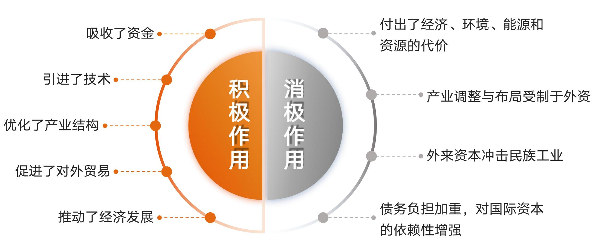
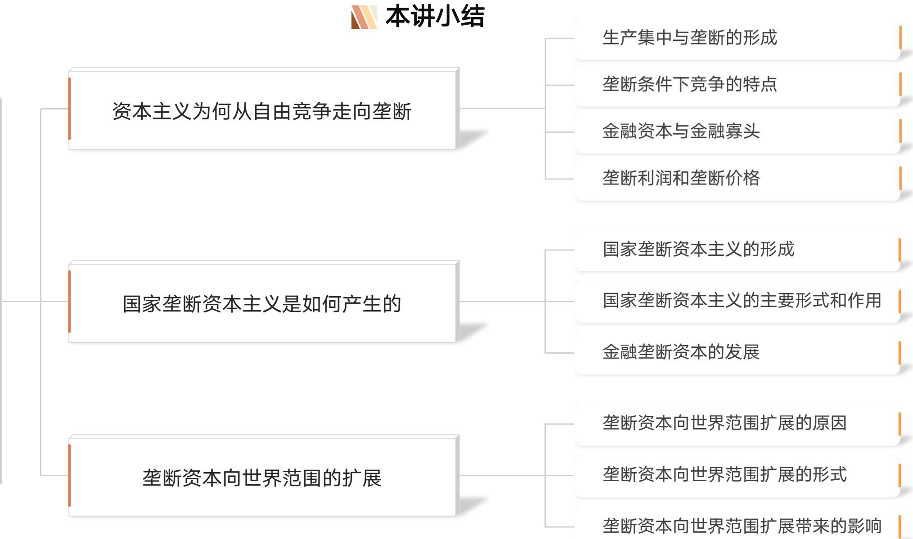

# 专题五 资本主义的发展及其趋势（资本主义论·下）

> [!abstract] 本专题导览
> 专题四讲清了资本主义的"本质与规律"（自由竞争阶段），本专题接着讲资本主义"由低到高的演变与历史命运"。沿 **自由竞争 → 私人垄断 → 国家垄断 → 金融垄断 → 经济全球化 → 当代新变化 → 历史趋势** 的链条，分三讲：
> - **第一讲 垄断资本主义的形成及发展**：自由竞争为何走向垄断？金融资本与金融寡头、垄断利润与垄断价格、国家垄断资本主义、金融垄断资本、垄断资本向世界扩展。
> - **第二讲 资本主义与经济全球化**：经济全球化的兴起、表现、原因，为何是"双刃剑"，如何看待"逆全球化"。
> - **第三讲 当代资本主义的变化与发展趋势**：二战后资本主义的六大变化及其实质、2008 金融危机后的乱象与根源、资本主义必然为社会主义所代替。
>
> **六大重点**：① 私人垄断资本主义的形成及特点 ② 国家垄断资本主义的特点和实质 ③ 经济全球化的表现及其影响 ④ 二战后资本主义变化及其实质 ⑤ 2008 危机以来的矛盾与冲突 ⑥ 资本主义的历史地位与发展趋势。

---

# 第一讲 垄断资本主义的形成及发展

> [!question] 本讲三问
> 一、资本主义为何从自由竞争走向垄断？
> 二、国家垄断资本主义是如何产生的？
> 三、垄断资本是如何向世界范围扩展的？

## 一、资本主义为何从自由竞争走向垄断？

### （一）生产集中与垄断的形成

**逻辑链**：自由竞争 → 生产集中 + 资本集中 → 垄断。

- **生产集中**：生产资料、劳动力、产品的生产日益集中于少数大企业。
- **资本集中**：通过竞争吞并或股份公司形式，资本日益集中于少数大资本家手中。
- **垄断（Monopoly）**：少数资本主义大企业为获得高额利润，通过相互协议或联合，对一个或几个部门商品的**生产、销售和价格**进行操纵和控制。

> [!note] 时代背景：第二次工业革命
> 19 世纪末"以科学为大脑、煤炭为粮食、钢铁为肌体、石油为血液、交通为动脉、电能和内燃机为神经、机器制造为心脏"的新工业社会形成，进入**电气时代**；人口与城市规模激增（1881—1911 年德国人口由 4520 万增到 6490 万），资本积累规模空前扩大。

> [!important] 为什么生产和资本集中"必然"产生垄断？
> ① **大企业战胜中小企业**——马克思：「竞争斗争是通过使商品便宜来进行的……商品的便宜取决于劳动生产率，而劳动生产率又取决于生产规模。」规模越大成本越低，集中是竞争的必然结果。
> ② 集中发展到一定程度，少数大企业之间**势均力敌、竞争代价过高**，于是达成妥协、联合起来操纵市场——垄断就产生了。

> [!example] 20 世纪初各主要资本主义国家生产和资本集中状况（史料）
> - **美国**（1905）：约 2.4 万家大企业（仅占企业数的 11%）控制了资本总额的 81%、工人的 72%、工业总产值的 79%。
> - **法国**（1906）：雇用 100 人以上大企业的工人占比，冶金 97.29%、煤炭 98.5%。
> - **德国**（1907）：占大企业 0.99% 的企业，雇用了 39.4% 的工人、用了 77.2% 的电力。
> - **日本**（1914）：资本 100 万日元以上大公司占公司总数 21%，却占资本总额的 63%。

> [!summary] 垄断组织的四种形式（重点辨析）
> 垄断组织 = 在一个或几个部门占垄断地位的大企业联合。按结合紧密程度由松到紧：
>
> | 形式 | 联合主体 | 紧密程度（独立性丧失程度） | 代表国 |
> |---|---|---|---|
> | **卡特尔** Cartel | 生产同类商品的企业 | 在生产、法律、商业、财务上**都各自独立**（仅就价格/产量/市场达成协议，最松散） | 德国 |
> | **辛迪加** Syndicate | 生产同类商品的企业 | 生产、法律上仍独立，但**商业上失去独立性**（统一购销） | 法国 |
> | **托拉斯** Trust | 生产上有密切联系的企业 | 生产、法律、商业上**都丧失独立性**（合为一个大企业） | 美国 |
> | **康采恩** Konzern | 不同经济部门的企业 | 形式上保持独立，实际受统治集团控制（跨部门最高级形式） | 日本 |
>
> 二战后又出现了**混合联合公司**（跨多个无关行业的大型集团）。

### （二）垄断条件下竞争的特点

> [!warning] 垄断没有、也不可能消除竞争
> 垄断是作为竞争的对立面而产生的，但垄断形成后反而使竞争**更复杂、更激烈**：
> - 没有消除产生竞争的经济条件（私有制、商品经济仍在）；
> - 垄断必须通过竞争来维持，不存在"绝对的垄断"。
>
> 列宁：「从自由竞争中生长起来的垄断并不消除自由竞争，而是凌驾于这种竞争之上，与之并存，因而产生许多特别尖锐特别剧烈的矛盾、摩擦和冲突。」

> [!summary] 垄断竞争 vs 自由竞争（三点新特点）
>
> | 比较 | 自由竞争时期 | 垄断条件下 |
> |---|---|---|
> | **目的** | 获得更多利润和超额利润，扩大积累 | 获取**高额垄断利润**，巩固扩大垄断地位 |
> | **手段** | 部门间靠资本转移、部门内靠技术进步降成本 | 除经济手段外，还采用**非经济手段乃至暴力** |
> | **范围** | 主要在国内市场、经济领域 | 扩展到**国外市场**，扩展到政治、军事等领域 |
>
> 总之：规模更大、时间更长、手段更残酷、破坏性更强。

### （三）金融资本与金融寡头

> [!note] 金融资本（Finance Capital）的形成
> **工业垄断资本** + **银行垄断资本** 相互渗透、融合 → **金融资本**。
> - 工业部门集中 → 工业垄断资本；
> - 银行业自由竞争 → 银行集中 → 银行垄断资本；
> - 两者通过**资本的相互参与**（互相购买股票、参与创办合并）与**人事的相互参与**（互兼对方要职）融合为金融资本。

**金融寡头（Financial Oligarchy）**：掌握金融资本、操纵国民经济命脉、并实际控制国家政权的少数垄断资本家或集团（如摩根、洛克菲勒等八大/十大财团）。

> [!important] 金融寡头如何实现统治？
> - **在经济上——"参与制"**：通过掌握一定数量股票，以"母公司→子公司→孙公司"**层层控股**来控制庞大资产。（如 J.P. 摩根 20 世纪 30 年代控制资产超 200 亿美元。）
> - **在政治上——"个人联合"**：① 直接把代理人送进政府/议会；② 收买政府高官或议员；③ 聘former 高官任公司要职；④ 通过政策咨询机构、掌控新闻出版广电教育等，左右国家内政外交。

### （四）垄断利润和垄断价格

> [!note] 垄断利润（核心概念）
> **垄断利润** = 垄断资本家凭借其在生产和流通中的**垄断地位**而获得的、**超过平均利润**的高额利润。
> - **为何能长期获得？** 垄断造成进入/退出壁垒，限制了资本在部门间自由转移，使自由竞争阶段的**利润率平均化规律难以发挥作用**，垄断资本家得以长期攫取超额利润。

> [!important] 垄断高额利润从何而来？——归根到底来自剩余价值
> ① 加强对本国无产阶级及劳动人民的剥削；② 占有非垄断企业的部分利润；③ 加强对其他国家劳动人民的剥削掠夺；④ 通过国家政权进行有利于垄断资本的再分配。
> **本质：归根到底来自无产阶级及其他劳动人民所创造的剩余价值。**

> [!summary] 垄断价格 = 垄断地位规定的、保证最大利润的市场价格
> - **垄断高价**：出售商品时规定的**高于**生产价格的价格；
> - **垄断低价**：购买非垄断企业原材料等时规定的**低于**生产价格的价格。
> - 结果：抑制价格自由波动，垄断价格长期背离价值。

> [!example] 案例：苹果公司如何维持垄断价格？
> iPhone 13 Pro 硬件成本约 ¥3674（2021 年 TechInsights 拆解），售价却近万元（¥8799）。
> - **控制议价权**：零部件由多个供应商供货，把硬件成本压到很低（代工厂富士康毛利率仅 6%）。
> - **"苹果税"**：App Store 内购、虚拟货币打赏均被视为应用内购买，苹果抽成 **30%** 且必须走苹果支付渠道。

> [!warning] 垄断价格没有否定价值规律
> 从全社会看：① 商品价值仍由社会必要劳动时间决定，垄断价格既不能增加也不能减少社会价值总量；② 价格总额仍等于价值总额，只是价值和剩余价值作了**有利于垄断资本的再分配**。

## 二、国家垄断资本主义是如何产生的？

> [!note] 国家垄断资本主义（State Monopoly Capitalism）
> = **国家政权**和**私人垄断资本**融合在一起的垄断资本主义。
> 它的产生是垄断资本主义生产关系在自身范围内的**部分质变**，标志资本主义进入新阶段。
> **根源**：私人垄断资本与社会化大生产的矛盾日益尖锐，严重阻碍生产力发展，客观上推动私人垄断资本与国家政权相结合。

> [!summary] 国家垄断资本主义产生发展的三个阶段
>
> | 阶段 | 时间 | 标志 |
> |---|---|---|
> | **开始形成** | 一战期间 | 交战国推行国民经济军事化，加强国家对经济的统制 |
> | **进一步发展** | 20 世纪 30 年代 | 经济大危机 + 凯恩斯主义，推动其迅速发展（罗斯福新政） |
> | **最终确立** | 二战后 | 国家干预深入资本主义各个环节 |

> [!example] 凯恩斯革命与罗斯福新政（史料）
> - **"凯恩斯革命"**：1936 年凯恩斯《就业、利息和货币通论》提出，经济危机源于**有效需求不足**，主张国家通过赤字预算、公共投资、调节利率等**干预经济**以实现充分就业。这为国家垄断资本主义提供了理论依据。
> - **罗斯福新政**：1933 年罗斯福就任美国第 32 届总统，"百日新政"颁布 70 个紧急法令，中心是解决金融、财政、农业、工业、劳资问题（《紧急银行法》《农业调整法》《工业复兴法》《社会保险法》）。

> [!note] 产生原因（三条）
> ① 现代科技发展、生产社会化程度提高（客观基础）；② 经济波动和危机深化，要求借助国家力量；③ 缓和社会矛盾、协调利益，要求国家出面调节再分配。

> [!summary] 主要形式与作用
> - **主要形式**：① 国家所有并直接经营；② 国家与私人共有、合营；③ 国家参与私人垄断资本再生产过程（含**宏观调节**——财政货币政策调节总供求；**微观规制**——立法限制垄断、保护竞争）。
> - **积极作用**：有利于社会生产力发展、突破私人垄断资本狭隘界限、改善劳动人民生活、加快现代化（1950—1970 年是资本主义经济"黄金时代"）。
> - **实质**：国家垄断资本主义并**没有根本改变**垄断资本主义性质——它是资产阶级国家力量同垄断组织力量的结合，更好地保证了垄断资产阶级的高额利润、更有利于维护资本主义制度。

### 金融垄断资本的发展

> [!note] 布雷顿森林体系（Bretton Woods System）
> 二战后在美国主导下建立的国际货币制度（依 1944 年《国际货币基金组织协定》）。**两大支柱（"双挂钩"）**：
> - **美元与黄金挂钩**：35 美元 = 1 盎司黄金，美国承担兑换义务；
> - **各国货币与美元挂钩**：固定比价，波动幅度不超过 ±1%。
>
> 意义：确立**美元的主导地位和美国金融霸权**，取代英镑。

> [!warning] 布雷顿森林体系崩溃（20 世纪 70 年代初）
> **原因**：① 战后西欧、日本复苏，美国军费开支大、国际收支逆差、美元外流、黄金储备锐减；② 美国长期赤字 + 廉价货币政策 → 高通胀；③ 70 年代石油危机，石油美元抢购黄金 → 金价暴涨。
> **后果**：货币脱离金本位，从"双重锚"变为依靠政府信誉的**"单一锚"**，为**金融自由化与金融创新**打开制度空间。

> [!important] 金融自由化、金融创新与"脱实向虚"
> - **金融自由化**：放松利率管制、实行浮动汇率、取消外汇管制、金融市场相互开放。
> - **金融创新**：远期、期货、期权、掉期等不断推出，融资方式证券化。
> - 二者是金融垄断资本形成壮大的**制度条件**，却导致资本主义经济越来越**"脱实向虚"**：金融业地位大幅上升（美国金融业占 GDP 约 70%，制造业占比由 1990 年 24% 降到 2007 年 18%），虚拟经济越来越脱离实体经济，金融危机频发（2008 年次贷危机即由此而来）。

## 三、垄断资本向世界范围的扩展

> [!note] 扩展的原因与形式
> **原因**：输出过剩资本谋求高额利润、转移部分技术获取垄断优势、争夺商品销售市场、确保原材料和能源来源。
> **形式**：
> - 按**输出形式**：借贷资本输出 / 生产资本输出（直接投资设厂）/ 商品资本输出；
> - 按**输出主体**：私人资本输出 / 国家资本输出（政府贷款、对外援助、对国际机构投资）。

> [!summary] 跨国公司国际化生产的三种类型
>
> | 类型 | 公司内企业的联系 | 例 |
> |---|---|---|
> | **独立存在型** | 各企业生产相同产品、各自独立经营，无直接联系 | 联合利华、雀巢 |
> | **简单一体化型** | 仅某些环节联系（如国外供零件、东道国廉价劳力装配） | 苹果 |
> | **国际一体化生产型** | 设区域总部统一部署，纳入同一价值链 | 微软 |

> [!important] 扩展带来的影响（双重）
> **对资本输出国**：带来巨额利润、加速资本积累、带动商品输出、改善国际收支；但也可能造成**产业空心化**，并加深与输入国及其他发达国家的矛盾。
>
> **对资本输入国（主要是发展中国家）——一把双刃剑**：

> [!summary] 第一讲小结
> 沿"生产集中 → 垄断 → 金融资本/金融寡头 → 垄断利润/垄断价格 → 国家垄断 → 金融垄断 → 向世界扩展"一条主线，把握**私人垄断**与**国家垄断**两种形态的特点与实质。

---

# 第二讲 资本主义与经济全球化

> [!question] 本讲三问
> 一、如何认识经济全球化的兴起与发展？
> 二、经济全球化为什么是一把"双刃剑"？
> 三、如何看待经济全球化进程中的"逆全球化"？

## 一、经济全球化的兴起与发展

> [!note] 经济全球化（Economic Globalization）
> 在生产发展、科技进步、社会分工和国际分工不断深化的情况下，世界各国各地区的经济活动越来越超出一国一地范围而**相互联系、相互依赖**的过程。

> [!summary] 世界市场开拓的三阶段
>
> | 阶段 | 时间 | 特征 |
> |---|---|---|
> | 殖民扩张与世界市场形成 | 二战前 | 西方靠殖民扩张瓜分世界，各民族被卷入资本主义世界体系 |
> | 两个平行世界市场 | 二战后 | 资/社两大阵营对立，"巴黎统筹委员会（巴统）"对社会主义国家禁运 |
> | 经济全球化 | 20 世纪 80 年代后 | 冷战结束，技术、资本、商品真正全球流动 |

> [!note] 经济全球化的三大表现
> - **生产全球化**：以跨国公司为核心，全球成为"一个大工厂"，各国成为价值链的一个环节。
> - **贸易全球化**：通信运输条件改善、贸易政策开放，全球贸易高速发展。
> - **金融全球化**：各国金融业务、政策相互协调渗透，金融市场更开放、更自由。

> [!important] 经济全球化的原因（四层）
> ① **根本动力**：科学技术进步和生产力发展（AI、大数据、量子信息、生物技术等新科技革命）；
> ② **内在动因**：跨国公司追求利润 + 国内劳动力成本上升，推动在全球配置生产；
> ③ **体制保障**：各国经济体制变革 + 国际经济组织（WTO、OPEC、APEC、OECD 等）发展；
> ④ **国际环境**：冷战结束打破世界经济体系的分割。
>
> 习近平：「经济全球化是社会生产力发展的客观要求和科技进步的必然结果……世界经济的大海，你要还是不要，都在那儿，是回避不了的。」

## 二、经济全球化为什么是一把"双刃剑"？

> [!summary] 对发展中国家的双重影响
>
> | 积极作用 | 负面影响 |
> |---|---|
> | 提供先进技术和管理经验 | 发达国家主导，地位与收益**不平等、不平衡**（发达国家是主要受益者） |
> | 提供更多就业机会 | 加剧发展中国家**资源短缺与环境污染**（产业迁移、高能耗转移） |
> | 推动国际贸易发展 | 一定程度**增加经济风险**（外债、金融冲击，如东南亚金融危机） |
> | 促进跨国公司发展 | —— |
>
> 习近平：「经济全球化确实带来了新问题，但我们不能就此把经济全球化一棍子打死，而是要适应和引导好经济全球化，消解其负面影响，让它更好惠及每个国家、每个民族。」

## 三、如何看待"逆全球化"？

> [!note] "逆全球化"（De-globalization）
> = 经济全球化进程中的逆流，是**贸易保护主义**以新形式向全球蔓延的趋势，阻碍国家间分工合作、提高国际贸易交易成本。

> [!summary] "逆全球化"的三方面表现
> - **经济上**：贸易保护主义增强（加征关税、设贸易壁垒）；
> - **政治上**：极端保守主义、极端政治倾向加强；
> - **社会政策上**：反移民、排外主义盛行。
> 典型事件：英国脱欧、美国"退群"。

> [!question] 讨论：为何会产生"逆全球化"？它能成为未来主流吗？
> **根源**：全球化中收入分配不平等、发展空间不平衡的矛盾激化，发达国家内部利益受损群体反弹。
> **判断**：经济全球化是**时代潮流**——"大江奔腾向海，总会遇到逆流，但任何逆流都阻挡不了大江东去"。逆全球化阻挡不了全球化的总方向。应对之道：以**人类命运共同体**理念为引领，推动全球化朝开放、包容、普惠、平衡、共赢方向发展。

---

# 第三讲 当代资本主义的变化与发展趋势

> [!question] 本讲三问
> 一、如何看待二战后资本主义的变化？
> 二、如何认识 2008 年国际金融危机以来资本主义的矛盾与冲突？
> 三、如何理解资本主义必然为社会主义所代替？

## 一、二战后资本主义的变化

> [!summary] 变化之一：生产资料所有制形式的变化（三阶段）
>
> | 阶段 | 资本主义初期 | 19 世纪末 20 世纪初 | 二战后 |
> |---|---|---|---|
> | **主导形式** | 私人资本 | 私人股份资本 | **法人资本** |
> | **占有主体** | 个体资本家 | 多元股东 | 法人 |
> | **特点** | 所有权与控制权统一 | 所有权与控制权**分离** | 所有权与控制权（在法人层面再度）统一 |

> [!note] 二战后资本主义的六大变化
> 1. **生产资料所有制**：私人资本 → 股份资本 → 法人资本（见上表）。
> 2. **垄断资本形式**：实体经济停滞驱使资本依赖金融，引发 70 年代以来**金融垄断资本主义**空前发展（交易膨胀、债券化、金融投机盛行、衍生品繁多）。
> 3. **劳资关系和分配关系**：推行**职工持股、终身雇佣、社会福利**等，缓和劳资矛盾（如西门子 80% 员工持股）。
> 4. **社会阶层和阶级结构**：资本家地位作用变化，**高级职业经理人**成为大公司实际控制者，知识型、服务型劳动者增多。
> 5. **经济调节机制和经济危机形态**：国家干预下危机形态有所变化。
> 6. **政治制度**：政治多元化、公民权利扩大、加强法制建设、改良主义政党影响扩大。

> [!important] 变化的原因（四条）
> ① **根本推动力量**：科技革命和生产力发展；② **重要力量**：工人阶级争取权利的斗争（如 1981 美国航管员大罢工、1984—85 英国煤矿工人罢工）；③ **重要影响**：社会主义制度初显优越性；④ **重要作用**：改良主义政党对资本主义制度的改革。

> [!warning] 变化的实质——三个"并没有"
> 二战后资本主义新变化，从根本上说是人类社会发展一般规律和资本主义经济规律作用的结果，是资本主义生产方式为适应生产力发展而**自我调节**的结果。但：
> - 仍是在资本主义制度**基本框架内**的变化；
> - **并没有改变**资本主义生产关系的剥削性质、**并没有改变**资本主义制度的不合理本质、**并没有解决**资本主义基本矛盾；
> - 它是资产阶级为维护自身利益而进行的自我调节与改良。

## 二、2008 年国际金融危机以来的矛盾与冲突

> [!summary] 危机以来的资本主义乱象
> - **经济发展失调**：长期低迷，债务负担沉重（美国总债务约 67 万亿美元，约 GDP 的 357%），**虚拟经济与实体经济失衡**（外汇交易超过国际贸易和实际投资 60 倍以上）。
> - **福利风险增加**："从摇篮到坟墓"的高福利体系遭遇财政赤字与人口老龄化，福利改革进退两难。
> - **政治体制失灵**：西式选举难以选贤、政党利益凌驾国家利益、"民主陷阱"阻碍治理、精英政治衰落（2016 年美国大选、英国脱欧公投乱象）。
> - **社会融合机制失效**：极端思潮抬头、阶层矛盾凸显、社会动荡（伦敦骚乱、法国"黄马甲"、占领华尔街、欧洲难民危机、冲击美国国会）。

> [!important] 乱象的深层根源——资本主义制度本身、资本主义基本矛盾
>
> | 领域 | "没有变"的根本属性 |
> |---|---|
> | **经济领域** | 经济制度服务于资本剥削雇佣劳动的本质没有变，资本追逐剩余价值的本性没有变 → 周期性危机与金融危机叠加 |
> | **政治领域** | 政治制度服务于资产阶级统治和剥削的工具属性没有变 → 大众政治与精英政治对立 |
> | **社会领域** | 社会制度制约社会流动、固化阶级关系的属性没有变 → 贫富分化与阶级对立日趋严重 |

> [!example] 拓展：数字资本主义 vs 数字社会主义
> - **数字劳动**：以数字技术为支撑、互联网为劳动场所、网民为劳动主体的新兴劳动模式（特拉诺瓦的"免费劳动"、福克斯把数字劳动界定为物质性劳动）。
> - **数字资本主义**（丹·希勒 1999）：依托数字技术提高周转率、降低成本实现资本增值，是**资本逻辑的数字形态**。其特征：深度异化（产消者）、隐秘剥削（相对剩余价值榨取）、数据私有（平台资本主义）、阶层分化（知识鸿沟、信息帝国主义）。
> - **数字社会主义**（凯文·凯利 2009）：互联网"分享、合作、协作、开放、免费、透明"的社会主义力量；核心是数据信息生产、分配中的**共有与共享**。
> - 讨论：谁在生产剩余价值？如何摆脱隐秘的剥削？知识、信息、数据共享何以可能？

## 三、资本主义必然为社会主义所代替

> [!summary] 资本主义的历史进步性 与 自身局限性
>
> | 历史进步性 | 自身局限性 |
> |---|---|
> | 把科学技术转变为强大生产力 | 资本主义基本矛盾阻碍生产力发展 |
> | 追求剩余价值的动力 + 竞争压力推动生产力迅速发展 | 财富占有两极分化，引发经济危机 |
> | 上层建筑保护、促进、完善资本主义生产方式 | 资产阶级支配经济政治，不断激化社会矛盾 |
>
> 《共产党宣言》：「资产阶级在它的不到一百年的阶级统治中所创造的生产力，比过去一切世代创造的全部生产力还要多，还要大。」

> [!important] 内在矛盾决定其必然被社会主义代替
> - 资本主义基本矛盾"包含着现代的一切冲突的萌芽"；
> - 资本积累推动基本矛盾不断激化，并最终**否定资本主义自身**；
> - **国家垄断资本主义是资本社会化的更高形式，将成为社会主义的前奏**（列宁：「国家垄断资本主义是社会主义的最充分的物质准备，是社会主义的前阶」）；
> - 无产阶级与资产阶级的矛盾斗争，推动资本主义向社会主义转变。

> [!warning] 但代替是一个长期的历史过程
> ① 资本主义发展的不平衡性决定过渡的长期性；② 任何社会形态从产生到灭亡都要经过相当长时间；③ 当代资本主义仍有自我调节空间、仍具一定生命力。
> 习近平：「马克思、恩格斯关于资本主义必然消亡、社会主义必然胜利的历史唯物主义观点没有过时……资本主义最终消亡、社会主义最终胜利，必然是一个很长的历史过程……要认真做好两种社会制度长期合作和斗争的各方面准备。」

---

# 本章小结

> [!summary] 一图读懂专题五
> 资本主义经历**自由竞争**与**垄断**两大时期；垄断资本主义的实质是垄断资本凭借垄断地位获取**高额垄断利润**。其演进：私人垄断 → 国家垄断 → 金融垄断；20 世纪 80 年代以来**经济全球化**迅速发展，是一把"双刃剑"。二战后资本主义发生六大变化，但均未改变其剥削本质、未解决基本矛盾；2008 危机以来的乱象根源仍在资本主义制度本身。**社会主义必将取代资本主义，这是历史发展的必然趋势，但道路曲折、过程长期。**

> [!question] 自测题
> 1. 什么是垄断？资本主义发展为什么会产生垄断？为什么说垄断并没有消除竞争？
> 2. 辨析卡特尔、辛迪加、托拉斯、康采恩四种垄断组织形式的区别（按独立性丧失程度）。
> 3. 金融寡头如何在经济上（参与制）和政治上（个人联合）实现其统治？
> 4. 什么是国家垄断资本主义？为什么说它体现了资本主义生产关系的"部分质变"？其实质是什么？
> 5. 布雷顿森林体系的"双挂钩"内容是什么？它为何崩溃？崩溃后为何出现金融自由化与金融创新？
> 6. 有人说"经济全球化就是全球资本主义化""全球化就是美国化"，试用所学原理评析。
> 7. 二战后资本主义有哪六大变化？如何认识这些变化的资本主义性质（三个"并没有"）？
> 8. 如何理解资本主义的历史地位及其为社会主义所代替的历史必然性与长期性？

> [!note] 相关章节
> - 上承 [[马原理-专题四_笔记]]（资本主义的本质及规律·上：劳动价值论与剩余价值论）
> - 政治经济学方法论参见 [[马原理-导论_笔记]]
