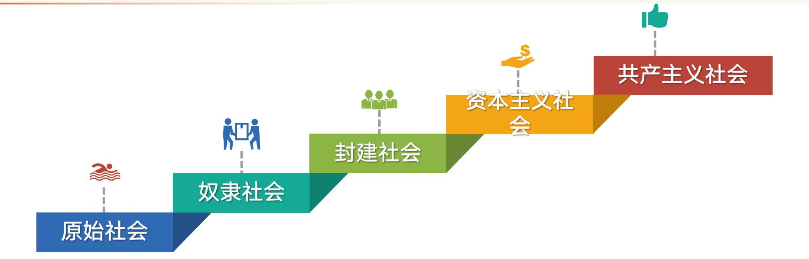

# 专题六 社会主义论

> [!abstract] 本专题导览
> 专题四、五讲清了"资本主义必然为社会主义所代替"，本专题正面回答**社会主义是什么、从哪里来、向哪里去**。沿"**从空想到科学、从理论到实践、从理想到现实、从一国到多国、从单一模式到多样道路**"的历史画卷，分三讲：
> - **第一讲 社会主义五百年的历史进程**：理想社会观 → 空想社会主义 → 科学社会主义创立 → 十月革命与苏联模式 → 中国的探索与中国特色社会主义。
> - **第二讲 认识和把握科学社会主义基本原则**：科学社会主义的十条基本原则、如何正确把握、中国特色社会主义对它的继承发展。
> - **第三讲 在实践中探索现实社会主义的发展规律**：经济文化落后国家建设社会主义的必然性与长期性、社会主义道路的多样性、社会主义在曲折中前进。

---

# 第一讲 社会主义五百年的历史进程

> [!question] 本讲两问
> 一、人类社会为什么会出现社会主义思想？
> 二、社会主义五百年经历了哪些历史阶段？

## 一、为什么会出现社会主义思想？

向往美好生活、追求理想社会是人类自古以来的愿望。古人描绘了不同形态的理想社会，但**受时代局限，没有找到实现理想的可行方案**：
- **孔子的"大同社会"**：「大道之行也，天下为公……老有所终，壮有所用，幼有所长，矜寡孤独废疾者皆有所养」（《礼记·礼运》）。
- **柏拉图的"理想国"**：哲学家治国，私有制是争端动乱的根源，主张财产均等；好国家应具备**智慧、勇敢、自制、正义**四德。

> [!note] 社会主义思想出现的现实土壤
> 14 世纪末地中海沿岸出现资本主义萌芽，16 世纪后资本主义生产方式在欧洲发展。**资本主义原始积累**造成的剥削压迫与悲惨现象，加上启蒙运动"自由、民主、平等"思想的传播，促成了早期社会主义思想的出现。

## 二、社会主义五百年的六个发展阶段

> [!summary] 六阶段时间轴（核心框架）
>
> | 节点 | 标志事件 | 阶段 |
> |---|---|---|
> | **1516 年** | 莫尔《乌托邦》出版 | ① 空想社会主义的产生和发展 |
> | **1848 年** | 《共产党宣言》发表 | ② 马克思恩格斯创立科学社会主义理论体系 |
> | **1917 年** | 十月社会主义革命胜利 | ③ 列宁领导十月革命并实践社会主义 |
> | **1936 年** | 苏联宣布建成社会主义 | ④ 苏联社会主义制度建立和苏联模式的兴衰 |
> | **1949 年** | 新中国成立 | ⑤ 新中国成立后中国共产党对社会主义的探索和实践 |
> | **1978 年** | 党的十一届三中全会召开 | ⑥ 中国特色社会主义的开创和发展 |

### （一）空想社会主义的产生和发展

> [!summary] 空想社会主义三阶段（与生产方式发展相对应）
>
> | 阶段 | 时期 | 对应生产方式 | 代表人物 |
> |---|---|---|---|
> | 早期空想社会主义 | 16—17 世纪 | 家庭手工业 | 托马斯·莫尔、康帕内拉、闵采尔、温斯坦莱 |
> | 空想平均共产主义 | 18 世纪 | 工场手工业 | 摩莱里、马布利、巴贝夫 |
> | 批判的空想社会主义 | 19 世纪初 | 机器大工业 | **圣西门、傅立叶、欧文**（"空想三大家"） |

> [!example] 代表人物与代表作（史料）
>
> | 代表人物 | 主张 | 代表作 |
> |---|---|---|
> | 托马斯·莫尔 | 没有私有财产和剥削，实行按需分配；把圈地运动称为"羊吃人" | 《乌托邦》 |
> | 康帕内拉 | 财产共有、共同劳动、人人平等 | 《太阳城》 |
> | 摩莱里 | 消灭私有制，建立符合自然精神的制度 | 《自然法典》 |
> | 马布利 | 私有制是人类一切不幸的根源 | 《论法制或法律的原则》 |
> | 圣西门 | "实业制度"，实业家和学者管理社会 | 《一个日内瓦居民给当代人的信》 |
> | 傅立叶 | "和谐社会"（基本单位"法郎吉"） | 《新的工业世界》 |
> | 欧文 | "新和谐公社"（生产资料公有、缩短工时、禁用童工） | 《新社会观》 |

> [!important] 空想社会主义的进步性、局限性与根本原因
> - **历史进步性**：对资本主义旧制度的辛辣批判（击中要害），对新制度的描绘（闪烁天才火花）。
> - **历史局限性**：① 陷入"理性支配世界"的**唯心史观**；② 没有找到破旧立新的**社会力量**（无产阶级）和现实道路；③ 不是科学的、成熟的理论。
> - **根本原因**（恩格斯）：「不成熟的理论，是同不成熟的资本主义生产状况、不成熟的阶级状况相适应的……这种新的社会制度一开始就注定要成为空想的。」
> - **历史价值**：空想社会主义是**科学社会主义的直接理论来源**。

### （二）马克思恩格斯创立科学社会主义理论体系

> [!note] 历史背景与理论基础
> **背景**：社会化大生产发展、资本主义基本矛盾激化、无产阶级从自发走向自觉；德国古典哲学、英国古典政治经济学、英法空想社会主义提供了理论借鉴。
> **两大理论基石（科学社会主义由空想变为科学的关键）**：
> - **唯物史观**：揭示历史发展一般规律、人民群众的历史主体作用、阶级斗争的作用；
> - **剩余价值学说**：揭示资本家剥削工人的秘密、两大阶级利益的根本对立。
>
> 恩格斯：「这两个伟大的发现——唯物史观和剩余价值学说——使社会主义变成了科学。」

> [!important] 《共产党宣言》（1848）的发表 = 科学社会主义诞生的标志
> - 科学论证了**资本主义必然灭亡、共产主义必然胜利**的规律：「资产阶级的灭亡和无产阶级的胜利是同样不可避免的。」
> - 阐明无产阶级的**历史使命**和解放的根本道路；
> - 系统制定了**无产阶级政党学说**；
> - 提出"**全世界无产者，联合起来！**"的口号；
> - **实现了社会主义从空想到科学的伟大飞跃。**

> [!example] 国际工人运动实践（史料）
> - 1847 年建立第一个以科学社会主义为指导的国际无产阶级政党——**共产主义者同盟**；
> - 1864 年建立**第一国际**（国际工人协会）；
> - 1871 年**巴黎公社**——人类历史上第一个无产阶级政权（坚持 72 天）：取消常备军、实行公职人员普选制和撤换制、取消高薪制（薪金不超过熟练工人工资）。经验教训：**必须打碎旧国家机器、建立无产阶级新型国家、建立无产阶级政党**；
> - 1889 年成立**第二国际**（后因伯恩施坦修正主义而解体）。

### （三）列宁领导十月革命并实践社会主义

> [!note] 列宁的"一国或数国胜利论"
> 针对"无产阶级革命至少将在几个主要资本主义国家同时发生"（马恩设想），列宁结合俄国实际提出：「资本主义发展在各国是极不平衡的……社会主义不能在所有国家内同时获得胜利。它将首先在一个或几个国家内获得胜利。」
> **十月革命的胜利**实现了社会主义从**理想到现实**的伟大飞跃，建立了世界上第一个社会主义国家。

> [!summary] 战时共产主义政策 vs 新经济政策（重点对比）
>
> | 比较 | 战时共产主义政策 | 新经济政策 |
> |---|---|---|
> | **背景** | 苏维埃政权面临严重考验（国内外战争） | 经济政治面临严重困难 |
> | **主要内容** | 余粮收集制、取消自由贸易、实物配给制、普遍义务劳动、企业国有化 | **粮食税制**、允许自由贸易、取消实物配给、允许私人小工业、采取国家资本主义形式 |
> | **实质** | 按军事共产主义原则调节生产分配 | **无产阶级同农民的联盟** |
> | **评价** | 对赢得国内战争胜利起重要作用 | 加强了苏维埃政权的社会主义经济基础 |

### （四）苏联社会主义制度的建立和苏联模式的兴衰

> [!summary] 苏联模式的主要特征（五方面）
>
> | 领域 | 特征 |
> |---|---|
> | **发展战略** | 以高速发展国民经济为首要任务，以**重工业**为重点，实现农业国到工业国的飞跃 |
> | **所有制** | 单一的生产资料公有制形式 |
> | **经济体制** | 排斥市场机制，完全用行政手段，**过度集中的指令性计划经济** |
> | **政治领域** | 过度集权的党和国家领导体制、自上而下的干部任命制、软弱低效的监督 |
> | **思想文化** | 僵化对待马克思主义、搞个人崇拜 |
>
> **历史功绩**：1913 年工业居欧洲第五、世界第五，到 1937 年跃居欧洲第一、世界第二；为反法西斯战争胜利提供了物质和人员保障。
> **弊端**：高度集中僵化，最终在新科技革命挑战和"和平演变"压力下回天无力。

> [!warning] 苏东剧变的最根本原因——政治方向出了问题
> 20 世纪 80 年代末 90 年代初苏联解体、东欧剧变，根本在于：**放弃社会主义道路、放弃无产阶级专政、放弃共产党领导、放弃马列主义**，从根本上动摇了对社会主义的理想信念。
> **教训（"四个不能"）**：① 正确总结历史经验而不能全盘否定历史；② 坚持改革而不能迷失方向；③ 发展民主政治而不能否定党的领导；④ 对外开放而不能放松对西化、分化的警觉。

### （五）（六）中国共产党对社会主义的探索

> [!note] 从探索到中国特色社会主义
> - **从新民主主义到社会主义**：1949 新中国成立 → 1956 完成社会主义改造，确立社会主义制度。
> - **独立自主探索**：1956 毛泽东《论十大关系》"**以苏为鉴**"；1957《关于正确处理人民内部矛盾的问题》区分**敌我矛盾**（对抗性，专政解决）与**人民内部矛盾**（非对抗性，民主解决）。
> - **改革开放的历史性抉择**：1978 党的十一届三中全会重新确立解放思想、实事求是的思想路线，开创社会主义建设新时期。邓小平提出搞清"**什么是社会主义、怎样建设社会主义**"，作出"建设有中国特色的社会主义"的基本结论。
> - **接续发展**：邓小平理论 →"三个代表"重要思想 → 科学发展观 → 习近平新时代中国特色社会主义思想。

---

# 第二讲 认识和把握科学社会主义基本原则

> [!question] 本讲三问
> 一、科学社会主义基本原则有哪些？
> 二、如何正确把握科学社会主义基本原则？
> 三、为什么说中国特色社会主义继承和发展了科学社会主义基本原则？

## 一、科学社会主义基本原则的十条内容（核心考点）

> [!important] 十条基本原则速记
> 1. **资本主义必然灭亡，社会主义必然胜利**（"两个必然"）。
> 2. **无产阶级**是最先进最革命的阶级，肩负推翻旧世界、建立新世界的**历史使命**。
> 3. **无产阶级革命**是斗争的最高形式，以建立**无产阶级专政**为目的。
> 4. 在**生产资料公有制**基础上组织生产，以满足**全体社会成员需要**为根本目的。
> 5. 对社会生产进行**有计划的指导和调节**，实行**按劳分配**。
> 6. 合乎自然规律地改造利用自然，实现**人与自然和谐共生**。
> 7. 坚持**科学理论（马克思主义）指导**，发展社会主义先进文化。
> 8. **无产阶级政党**是先锋队，社会主义事业必须坚持党的领导。
> 9. 大力**解放和发展生产力**，逐步消灭剥削、消除两极分化，实现**共同富裕**，最终向共产主义过渡。
> 10. **共产主义是人类最美好的社会**，实现共产主义是共产党人的最高理想。

> [!note] 重点辨析："两个必然" 与 "两个决不会"
> - **两个必然**（《共产党宣言》）：「资产阶级的灭亡和无产阶级的胜利是同样不可避免的。」——揭示资本主义向社会主义转变的**历史必然性**。根本依据是**人类社会发展规律**（生产力发展具有最终决定意义）。
> - **两个决不会**（《〈政治经济学批判〉序言》）：「无论哪一个社会形态，在它所能容纳的全部生产力发挥出来以前，是决不会灭亡的；而新的更高的生产关系，在它的物质存在条件成熟以前，是决不会出现的。」——揭示资本主义被替代的**长期性**。
> - **二者必须联系起来全面把握**："两个必然"是历史规律的必然指向，"两个决不会"解释了为何资本主义至今未消亡、社会主义会有苏东剧变那样的曲折。学懂它，方能"坚定理想的主心骨、筑牢信念的压舱石、保持强大的战略定力"。

> [!example] 五种社会形态与共产主义
> 依据经济基础（生产关系）的不同性质，社会历史可划分为**五种社会形态**：原始社会 → 奴隶社会 → 封建社会 → 资本主义社会 → 共产主义社会。**社会主义社会是共产主义社会的第一阶段（初级/低级阶段）。**

> [!summary] 共产主义社会的基本特征
> ① 物质财富极大丰富，消费资料**按需分配**；② 社会关系高度和谐，人们精神境界极大提高；③ 每个人**自由而全面的发展**，人类实现从**必然王国向自由王国**的飞跃。
> 邓小平："**社会主义的本质，是解放生产力，发展生产力，消灭剥削，消除两极分化，最终达到共同富裕。**"

## 二、如何正确把握科学社会主义基本原则？

> [!important] 科学态度：既坚持、又不当教条（三条）
> 1. **必须始终坚持**科学社会主义基本原则，反对任何背离它的错误倾向（如伯恩施坦修正主义——"为一时利益牺牲无产阶级根本利益"）。
> 2. **善于与本国实际相结合**，创造性回答社会主义革命、建设、改革中的重大问题（原则揭示的是一般性规律，不提供解决特殊问题的具体方案）。
> 3. **紧跟时代和实践发展**，在总结新经验中丰富发展它（"绝不能要求马克思为他去世之后上百年产生的问题提供现成答案"）。

## 三、中国特色社会主义对科学社会主义的继承与发展

> [!note] "老祖宗不能丢" + "两个有机结合"
> - 习近平：「中国特色社会主义是社会主义而不是其他什么主义，**科学社会主义基本原则不能丢，丢了就不是社会主义**。」
> - **"两个有机结合"**：把科学社会主义基本原则同**当代中国实际**有机结合（最大客观实际＝我国仍处于并将长期处于**社会主义初级阶段**），同**中华优秀传统文化**有机结合。
> - **"四个不是"**：当代中国的伟大社会变革，不是简单延续历史文化的母版、不是简单套用经典作家设想的模板、不是其他国家社会主义实践的再版、也不是国外现代化发展的翻版。

> [!summary] 既坚持原则、又有民族特色和时代特色（举例）
>
> | 坚持的科学社会主义原则 | 中国特色 |
> |---|---|
> | "两个必然"原则 | 始终践行党的初心使命 |
> | 无产阶级革命和专政原则 | 建立**人民民主专政**，发展社会主义民主政治 |
> | 公有制和社会主义生产目的 | **以公有制为主体、多种所有制共同发展**，以人民为中心 |
> | 计划调节和按劳分配 | 发挥**市场在资源配置中的决定性作用**，以按劳分配为主体的多种分配方式 |
> | 党的领导原则 | 加强党的全面领导，党总揽全局、协调各方 |
>
> **习近平新时代中国特色社会主义思想**标志着党在自觉把科学社会主义基本原则与中国实际、时代特征相结合上达到了新境界，实现了马克思主义中国化新的飞跃。

---

# 第三讲 在实践中探索现实社会主义的发展规律

> [!question] 本讲三问
> 一、为什么说经济文化相对落后国家建设社会主义是长期的历史过程？
> 二、社会主义发展道路为什么是多样性的？
> 三、为什么说社会主义是在实践中开拓前进的？

## 一、落后国家建设社会主义的必然性与长期性

> [!note] 为何社会主义首先在经济文化落后国家胜利？（并不违背历史规律）
> - **反动统治阶级力量的脆弱性**：腐朽的封建半封建经济 + 专制统治，遇到危机即土崩瓦解；
> - **无产阶级力量不断壮大**：受多重剥削、革命性强，且有农民和小资产阶级作为最广大可靠的同盟者。
> - **跨越"卡夫丁峡谷"理论**：东方落后国家可根据自身国情，**超越资本主义生产发展的整个阶段**，由前资本主义生产方式直接进入以公有制为基础的社会主义。（"卡夫丁峡谷"原指古罗马"耻辱之谷"，喻灾难性历史经历。）列宁："世界历史发展的一般规律，不仅丝毫不排斥个别发展阶段在形式或顺序上的特殊性，反而以此为前提。"

> [!warning] 建设的长期性——四重制约
> ① **生产力发展状况的制约**：长期落后于发达资本主义国家，赶超需很长时间；
> ② **经济基础和上层建筑发展状况的制约**：建立巩固完善社会主义经济基础、发展社会主义民主政治和先进文化都很艰巨；
> ③ **国际环境的严峻挑战**：西方"**和平演变**"——通过军事政治压力、舆论攻势（"自由欧洲电台"）、经贸渗透（"哈佛计划"）、互联网（"意识形态斗争的最前沿"）颠覆社会主义国家；
> ④ **道路探索和规律认识的长期性**：问题根源不在制度本身，而在于尚未认识掌握社会主义建设规律。

> [!example] 中国共产党对我国社会主要矛盾认识的深化
>
> | 时间 | 会议 | 主要矛盾表述 |
> |---|---|---|
> | 1956 | 党的八大 | 人民对建立先进工业国的要求 同 落后农业国现实之间的矛盾 |
> | 1981 | 十一届六中全会 | 人民日益增长的物质文化需要 同 落后的社会生产 之间的矛盾 |
> | 2017 | 党的十九大 | 人民日益增长的**美好生活需要** 和 **不平衡不充分的发展** 之间的矛盾 |

## 二、社会主义发展道路为什么是多样性的？

> [!summary] 多样性的表现（以苏、中对比为例）
>
> | 方面 | 苏联 | 中国 |
> |---|---|---|
> | **革命道路** | 工人武装起义夺取中心城市，由城市走向农村 | **农村包围城市**，武装夺取政权 |
> | **政权建设** | 高度集权、自上而下委派、缺民主监督 | 民主化、制度化、法治化（根本政治制度 + 三项基本政治制度） |
> | **社会主义改造** | 暴力剥夺、强行没收，一步到位变国有 | 逐步过渡，对民族资本实行**赎买** |
>
> 各社会主义国家改革也各具特色：越南"革新开放"、古巴"更新社会主义模式"、朝鲜"先军→先经"、老挝"革新开放"。

> [!important] 多样性的三大原因
> ① 各国**生产力发展状况和社会发展阶段**不同（决定不同特点）；② **历史文化传统的差异性**（"人们自己创造自己的历史，但……是在从过去承继下来的条件下创造"——《路易·波拿巴的雾月十八日》）；③ **时代和实践的不断发展**（现实原因）。
> **探索本国道路的要求**：以科学态度对待马克思主义、从当时当地历史条件出发、吸收借鉴人类一切文明成果。

## 三、社会主义在实践中开拓前进

> [!note] 在实践中开拓前进是必然要求
> ① 社会主义是**亿万人民群众的伟大实践**（不能仅看作思想理论，更不能归于个人）；② 是一个**不断探索**的过程（没有现成路可走）；③ 是在**曲折中发展**的（列宁："设想世界历史一帆风顺……是不辩证、不科学的"；苏东剧变即"万花纷谢一时稀"）；④ 必须有**开拓奋进的精神状态**。

> [!summary] 必须遵循三大客观规律
>
> | 三大规律 | 内涵 |
> |---|---|
> | **人类社会发展规律** | 生产力与生产关系、经济基础与上层建筑矛盾运动的基本规律；要区分**社会基本矛盾**（一切社会矛盾的根源）与**社会主要矛盾**（处于支配地位、起主导作用） |
> | **社会主义建设规律** | 共产党对"什么是社会主义、怎样建设社会主义"的认识规律 |
> | **共产党执政规律** | 执政地位与优势（党的全面领导是最本质特征）、执政基础与宗旨（以人民为中心）、自身建设与自我革命（全面从严治党） |

> [!important] 以自信担当走向社会主义光明未来
> "百年未有之大变局"下，西方资本主义陷入制度性困境，而**中国特色社会主义在 21 世纪焕发强大生机活力，成为振兴世界社会主义的中流砥柱**。中国特色社会主义的成功表明：社会主义没有灭亡，也不会灭亡。——走过"雄关漫道真如铁"的昨天，走到"人间正道是沧桑"的今天，正走向"长风破浪会有时"的明天。

---

# 本章小结

> [!summary] 一图读懂专题六
> 社会主义五百年，是一幅"**从空想到科学、从理论到实践、从理想到现实、从一国到多国、从单一模式到多样道路**"的历史画卷。科学社会主义由**唯物史观**和**剩余价值学说**两大基石支撑，《共产党宣言》是其诞生标志。把握科学社会主义要做到"在坚持中发展、在发展中坚持"。社会主义发展道路具有**多样性**，固定模式不可能成功；社会主义在曲折中前进，但人类社会发展的总趋势不会改变。**中国特色社会主义是扎根于当代中国的科学社会主义**，是理论逻辑与历史逻辑的辩证统一。

> [!question] 自测题
> 1. 空想社会主义经历了哪三个阶段？其历史进步性、局限性及具有局限的根本原因是什么？
> 2. 为什么说唯物史观和剩余价值学说使社会主义从空想变成了科学？《共产党宣言》的历史意义是什么？
> 3. 比较战时共产主义政策与新经济政策的背景、内容、实质。
> 4. 苏联模式的五方面主要特征是什么？苏东剧变最根本的原因和教训是什么？
> 5. 完整列举科学社会主义的十条基本原则。
> 6. 辨析"两个必然"与"两个决不会"，说明为何必须联系起来全面把握。
> 7. 中国特色社会主义如何通过"两个有机结合"继承和发展科学社会主义基本原则？
> 8. 为什么说经济文化相对落后国家建设社会主义是长期的历史过程（四重制约）？
> 9. 结合苏、中对比，说明社会主义发展道路多样性的表现与原因。

> [!note] 相关章节
> - 紧承 [[马原理-专题五_笔记]]（资本主义必然为社会主义所代替）
> - 唯物史观、社会基本矛盾原理参见 [[马原理-专题二_笔记]]、[[马原理-专题三_笔记]]
> - 剩余价值学说参见 [[马原理-专题四_笔记]]
