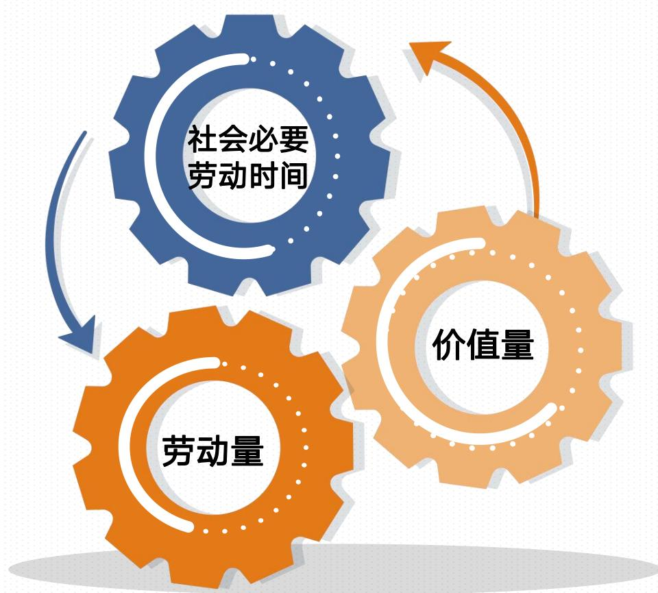
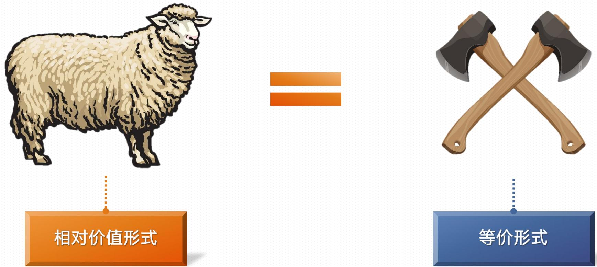
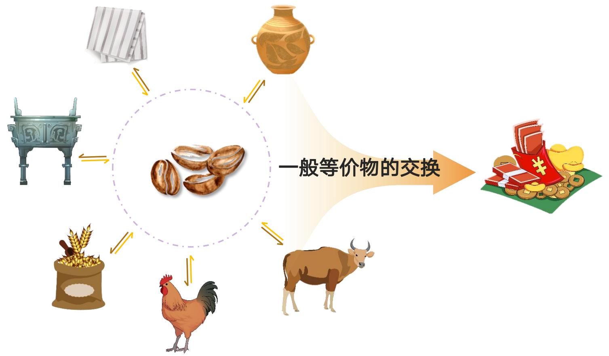
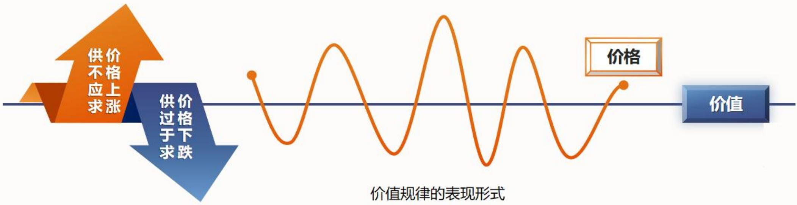
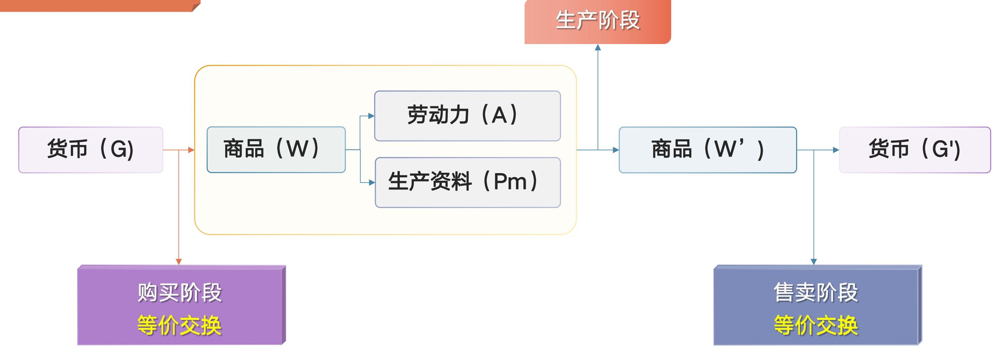
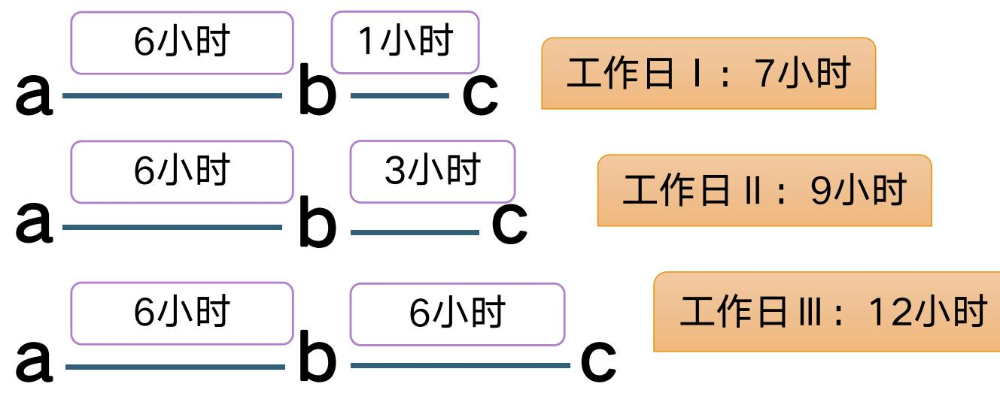
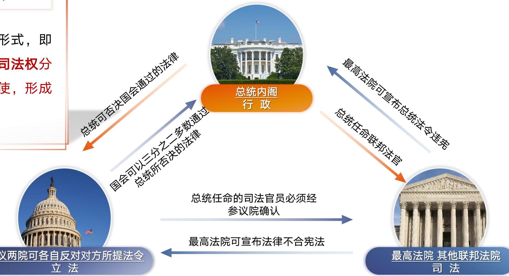
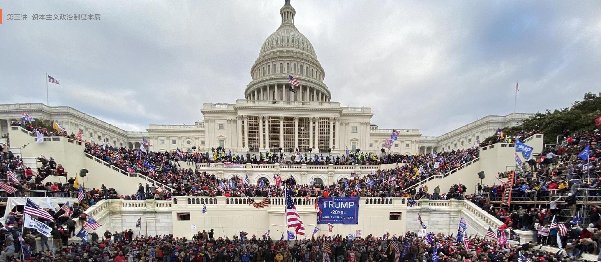

# 专题四 资本主义的本质及规律（资本主义论·上）

> [!abstract] 本专题导览
> 本专题对应教材"资本主义的本质及规律"，是马克思主义政治经济学的核心。沿着 **商品 → 货币 → 资本 → 剩余价值 → 经济危机 → 政治制度** 的逻辑链层层展开，分三讲：
> - **第一讲 马克思劳动价值论及其当代价值**：从商品入手，揭示商品二因素、劳动二重性、价值量、价值形式与货币、价值规律，落脚于私有制商品经济的基本矛盾。
> - **第二讲 马克思剩余价值理论与经济危机**：揭示资本增殖（剥削）的秘密——剩余价值，剖析不变/可变资本、剩余价值率、绝对/相对剩余价值、资本积累与有机构成，直至经济危机的根源。
> - **第三讲 资本主义政治制度本质**：资本主义国家、民主制度、意识形态——"经济基础决定上层建筑"在政治领域的展开。
>
> 重点：① 商品经济 ② 价值规律 ③ 剩余价值规律 ④ 资本主义经济危机 ⑤ 资本主义政治制度 ⑥ 资本主义意识形态。

---

# 第一讲 马克思劳动价值论及其当代价值

> [!question] 本讲四问
> 一、马克思是怎样分析劳动创造价值的？
> 二、如何理解"金银天然不是货币，但货币天然是金银"？
> 三、为什么说价值规律是商品经济的基本规律？
> 四、马克思劳动价值论过时了吗？

## 一、马克思是怎样分析劳动创造价值的？

劳动创造价值的观点并非马克思首创：英国古典政治经济学家 **威廉·配第** 提出"劳动是价值的源泉"，**亚当·斯密** 提出劳动创造价值——它们是马克思劳动价值论的思想来源，但都不科学：

- 配第：只承认 **生产金银的劳动** 创造价值，把价值源泉局限于一个生产部门。
- 斯密：虽扩展到所有部门，却认为只有简单商品经济中"劳动创造价值"才成立；到了资本主义社会，价值源泉变成 **工资+利润+地租**，陷入两种自相矛盾的价值理论。

> [!important] 资产阶级经济学家不能形成科学劳动价值论的两大原因
> 1. **认识局限**：不能对劳动作科学认识。马克思的 **劳动二重性** 学说彻底解决了劳动本质问题。
> 2. **阶级立场**：代表资产阶级利益，不可能承认劳动是价值的唯一源泉。马克思站在无产阶级立场，把"劳动创造价值"的真理坚持到底。

马克思分析价值，**从分析商品入手**——因为资本主义社会的财富表现为"庞大的商品堆积"，单个商品是其元素形式。

### （一）商品和商品经济

| 概念 | 含义 |
| --- | --- |
| **商品** | 用来交换、能满足人某种需要的劳动产品（不以交换为目的的劳动产品不是商品） |
| **商品经济** | 以交换为目的而进行生产的经济形式；与之对立的是自然经济（自给自足） |

> [!note] 商品经济产生的两个历史条件
> 1. **社会分工**——生产力发展的产物，为商品生产和交换提供前提。
> 2. **生产资料和劳动产品属于不同的所有者**——私有制下要得到别人产品只能通过交换。
>
> 商品经济发展经历 **简单商品经济 → 发达商品经济**，资本主义商品经济属于发达商品经济。

### （二）使用价值和价值（商品二因素）

> [!important] 商品二因素
> - **使用价值**：商品能满足人某种需要的有用性。是商品的 **自然属性**，反映人与自然的物质关系，是一切劳动产品共有的属性。
> - **价值**：凝结在商品中的 **无差别的一般人类劳动**（人的脑力和体力的耗费）。是商品 **特有的社会属性**。
> - **交换价值**：两种使用价值相交换时量的比例关系（如 1 只绵羊 = 2 把斧头，2 把斧头是 1 只绵羊的交换价值）。价值是交换价值的基础，交换价值是价值的表现形式。

> [!example] 价值的本质
> 商品的价值是劳动创造的，商品交换实际上是商品生产者之间的 **劳动互换**，本质上体现生产者之间一定的 **社会关系（物质利益关系）**。

**使用价值与价值是对立统一的关系：**

- **对立**：对同一商品所有者，二者不可兼得——要获得价值就必须让渡使用价值，要得到使用价值就不能占有价值。
- **统一**：商品必须同时具有二因素；**使用价值是价值的物质承担者**，没有使用价值，付出再多劳动也没有价值。

> [!note] 讨论：哲学上的价值 vs 经济学上的价值
> 
> | 角度 | 哲学上的价值 | 经济学上的价值 |
> | --- | --- | --- |
> | 涵盖范围 | 最普遍的主客体关系（主体是人，客体可为任何事物） | 撇开劳动具体形式的无差别人类劳动，表示人与人交换劳动的经济关系 |
> | 评判标准 | 依赖主体的需要和利益，具一定 **主观性** | 由社会必要劳动时间决定，较为 **客观** |

### （三）具体劳动和抽象劳动（劳动二重性）

> [!important] 劳动二重性
> 生产商品的劳动既是 **具体劳动过程**，又凝结 **抽象劳动**——同一劳动的两个方面。
> - **具体劳动**：生产一定使用价值的具体形式的劳动，形成商品的 **使用价值**，是劳动的 **自然属性**。
> - **抽象劳动**：撇开一切具体形式的无差别一般人类劳动（脑力体力耗费），创造商品的 **价值实体**，是劳动的 **社会属性**。

> [!summary] 商品二因素 ↔ 劳动二重性 对应表（核心重难点·自绘）
> 
> | 劳动二重性 | 决定 | 商品二因素 | 属性 | 反映的关系 | 范畴性质 |
> | --- | :---: | --- | --- | --- | --- |
> | **具体劳动**（特定具体形式） | → | **使用价值** | 自然属性 | 人与自然 | 永恒范畴 |
> | **抽象劳动**（无差别人类劳动） | → | **价值** | 社会属性 | 人与人（社会经济关系） | 历史范畴 |
>
> 一句话记忆：**具体劳动创造使用价值，抽象劳动形成价值**；商品二因素由劳动二重性决定。

**二者对立统一**：
- 对立性：反映劳动不同属性——具体劳动是永恒范畴，抽象劳动是历史范畴。
- 统一性：不是两种劳动或两次劳动，在时间和空间上统一，是同一劳动过程不可分割的两个方面。

> [!quote] 马克思《资本论》第一卷
> "一切劳动，一方面是人类劳动力在生理学意义上的耗费；就相同的或抽象的人类劳动这个属性来说，它形成商品价值。一切劳动，另一方面是人类劳动力在特殊的有一定目的的形式上的耗费；就具体的有用的劳动这个属性来说，它生产使用价值。"

### （四）商品价值量的决定、变动和比较


*图：三个咬合齿轮示意——"社会必要劳动时间"驱动"劳动量"、进而驱动"价值量"，三者环环相扣，形象表达价值量由社会必要劳动时间决定。*

> [!important] 价值量的决定：社会必要劳动时间
> 商品价值量由 **劳动量** 决定，劳动量由 **劳动时间** 计量。但不是个别生产者耗费的个别劳动时间，而是社会认可的 **社会必要劳动时间**。
>
> **社会必要劳动时间**＝在 *现有社会正常生产条件下*，*社会平均劳动熟练程度和劳动强度下*，制造某种使用价值所需要的劳动时间。

> [!important] 价值量的变动：与劳动生产率成反比
> **劳动生产率** = 劳动者生产使用价值的效率（可用"单位时间产量"或"单位商品耗时"衡量）。
> $$\text{单位商品价值量} \propto \text{社会必要劳动时间} \propto \frac{1}{\text{劳动生产率}}$$
> 即：**单位商品的价值量与社会必要劳动时间成正比，与劳动生产率成反比。**
>
> 影响劳动生产率的因素：劳动者平均熟练程度、科技发展水平及其应用、生产过程的社会结合、生产资料的规模和效能、自然条件。

> [!note] 价值量的比较：简单劳动与复杂劳动
> - **简单劳动**：不需专门训练，一般劳动者都能从事。
> - **复杂劳动**：需经专门训练、具一定文化知识和技术专长的劳动者所从事。
> 
> 相同劳动时间里，**复杂劳动创造的价值 > 简单劳动**；复杂劳动等于"自乘的或多倍的简单劳动"，这一换算在商品交换中自发实现。

## 二、如何理解"金银天然不是货币，但货币天然是金银"？

### （一）价值形式的发展（四阶段）

> [!summary] 价值形式发展的四个阶段（自绘）
> 
> | 阶段 | 形式 | 举例 / 特征 |
> | --- | --- | --- |
> | ① | **简单的或偶然的价值形式** | 1 只绵羊 = 2 把斧头；一种商品价值偶然地由另一种商品表现（相对价值形式↔等价形式） |
> | ② | **总和的或扩大的价值形式** | 1 只绵羊 = 2 把斧头/1 件…/60 斤…/1 块…；价值表现在一系列商品中，更趋合理 |
> | ③ | **一般价值形式** | 各种商品都用 *同一种* 一般等价物表现价值，实现质的飞跃 |
> | ④ | **货币形式** | 一般等价物固定在金、银上，这个一般等价物就是货币 |


*图：1 只绵羊 = 2 把斧头。绵羊处于"相对价值形式"（主动表现自己的价值），斧头处于"等价形式"（充当价值的表现材料）。*

> [!important] 一般等价物与货币
> - **一般等价物**：人们在交换中都愿意接受的某种商品，成为交换媒介。
> - **货币**：当一般等价物的职能 **固定在金、银** 上时，这个一般等价物就是货币。即——**货币是从商品中分离出来、固定充当一般等价物的商品**，是商品经济内在矛盾发展的产物，其本质体现一种 **社会关系**。


*图：货币演变史——绵羊/贝壳等"一般等价物"先固定为黄金，再发展出铸币（金币/银币/铜币），进而出现纸币，最终发展到电子货币。*

> [!quote] 马克思《资本论》第一卷
> "金银天然不是货币，但货币天然是金银。"
> 
> 解读：金银不是天生就是货币（货币是社会历史产物，本质是社会关系）；但金银凭其特殊物理化学性质最适合充当货币，所以货币天然由金银充当。

> [!warning] 货币产生的后果
> 货币产生后，整个商品世界分化为两极：一极是各种具体商品（代表使用价值），另一极是货币（只代表价值）。**使用价值和价值的矛盾，转化为商品和货币的矛盾。** 货币没有从根本上消除商品经济矛盾，反而可能使其进一步扩大和加深。

### （二）货币的职能

> [!important] 货币的五种职能（自绘）
> 
> | 职能 | 含义 | 要点 |
> | --- | --- | --- |
> | **价值尺度** | 计量其他一切商品价值量大小的尺度 | 价值外化为 **价格**；只需 *观念* 货币，不需现实货币 |
> | **流通手段** | 充当商品交换的媒介 | 必须是 *现实* 货币（一手交钱一手交货） |
> | **贮藏手段** | 退出流通、作为社会财富一般代表被保存 | 必须是 *足值的* 金银货币；可自发调节流通中货币量；**纸币不具备此职能** |
> | **支付手段** | 清偿债务、支付赋税/租金/工资等 | 由赊购赊销产生（先取货后付款） |
> | **世界货币** | 在国际市场发挥一般等价物作用 | 本应是黄金白银；经济强国纸币（如美元）也具某种世界货币职能 |

> [!example] 案例：作为世界货币的美元
> 二战后金本位制被放弃，纸币开始充当世界货币，美元是典型代表。**1944 年 7 月布雷顿森林会议** 规定：美元与黄金挂钩（35 美元 = 1 盎司黄金），各国货币按含金量与美元挂钩，确立以美元为中心的固定汇率制度。
> 
> 战后美国推行侵略战争、海外军费庞大，国际收支恶化、黄金储备锐减、频发黄金挤兑潮。**1971 年 8 月 15 日尼克松宣布美元与黄金脱钩**；1973 年起主要西方国家实行浮动汇率制，**布雷顿森林体系瓦解**。如今美国动辄将美元"武器化"实施制裁，越来越多国家采用本币结算，"去美元化"进程开启，推动美元霸权走向终结。

## 三、为什么说价值规律是商品经济的基本规律？

### （一）什么是价值规律

> [!important] 价值规律（商品生产和商品交换的基本规律）
> 1. **价值决定**：商品的价值由生产商品的 **社会必要劳动时间** 决定。
> 2. **价值实现**：商品交换以价值量为基础，按 **等价交换** 原则进行。

### （二）为什么是基本规律

价值规律贯穿商品经济全过程，是 **价值决定规律与价值实现规律的统一**：

- **价值决定规律支配商品生产**：价值量不由生产者主观意志决定，而通过市场交换和竞争形成，社会只承认社会必要劳动时间。
- **价值实现规律支配商品流通**：交换以价值量为基础、实行等价交换。实际交换中价格符合价值是偶然的、不符合是经常的（供过于求或供不应求），但价格总围绕 **价值** 这个中心上下波动。

### （三）价值规律的表现形式


*图：价值规律表现形式示意——价格曲线（橙色波浪）围绕"价值"这条水平中心线上下波动；"供不应求"推价格上升、"供过于求"压价格下跌，长期价格总量等于价值总量。*

> [!note] 表现形式
> 商品价格围绕商品价值 **自发波动**。价格以价值为基础，从长期看，高于和低于价值的部分相互抵消，**价格总量 = 价值总量**。

### （四）价值规律的作用机制（自绘 ASCII）

```text
              价值规律：价格围绕价值上下波动（自发的"看不见的手"）
                                │
        ┌───────────────────────┴───────────────────────┐
        ▼                                                 ▼
   ┌─ 积极作用（配置资源）─┐                      ┌─ 消极作用（自发盲目）─┐
   │ ① 自发调节生产资料和  │                      │ ① 可能导致垄断，      │
   │    劳动力在各部门的    │   价格↑→获利→扩产    │    阻碍技术进步        │
   │    分配比例           │   价格↓→亏损→减产    │ ② 引起商品生产者       │
   │ ② 自发刺激生产力发展  │ ◀──── 供求 ────▶    │    两极分化            │
   │ ③ 自发调节社会收入分配 │                      │ ③ 资源配置失调，浪费   │
   └──────────────────────┘                      └──────────────────────┘
```

> [!quote] 马克思《资本论》
> "在私人劳动产品的偶然的不断变动的交换比例中，生产这些产品的社会必要劳动时间作为起调节作用的自然规律 *强制地为自己开辟道路*，就像房屋倒在人的头上时重力定律强制地为自己开辟道路一样。"

## 四、马克思劳动价值论过时了吗？

### （一）理论和实践意义

1. **扬弃英国古典政治经济学，为剩余价值论奠基**：斯密认识到商品二因素和劳动创造价值，李嘉图认识到价值量由社会必要劳动量决定；但他们没区分劳动二重性、混淆价值与交换价值、不理解社会必要劳动量如何决定价值量。马克思创立 **劳动二重性理论**，第一次说清"什么劳动、为什么、怎样"形成价值，成为"理解政治经济学的枢纽"。
2. **揭示私有制商品经济的基本矛盾**：从物与物关系背后揭示人与人关系，批判商品拜物教。
3. **揭示商品经济的一般规律**：对理解社会主义市场经济具有指导意义。

> [!note] 讨论：要素价值论、供求价值论、效用价值论错在哪？
> 
> | 错误理论 | 主张 | 错误所在 |
> | --- | --- | --- |
> | **要素价值论** | 价值由土地、劳动、资本等要素共同创造 | 用价值 *分配* 解释价值 *创造*，混淆价值源泉与价值形成条件 |
> | **供求价值论** | 价值由供求关系决定 | 混淆价值源泉与影响价格的因素；供求相等时无法解释价值由何决定 |
> | **效用价值论** | 价值由使用价值（效用）大小决定 | 使用价值无同质性，无法进行量的比较 |

### （二）为什么没有过时

> [!important] 当代劳动新变化与认识深化
> - 当代劳动形式变化：脑力劳动比例上升、非物质生产领域劳动重要性上升、价值实现领域劳动日益融入价值生产。
> - 新认识：科技劳动和管理劳动作用突出，部分服务劳动和精神劳动参与价值创造，劳动价值论适用范围拓展、解释力增强。

> [!example] 讨论：自动化生产创造价值吗？（人工智能·无人工厂）
> **原题**：调查显示全球采纳人工智能技术的企业从 2015 年的 10% 增长至 2019 年的 37%（增长率 270%），我国上海通用金桥工厂、京东"亚洲一号"无人仓等无人工厂加速落地。机器人广泛替代人力、商品生产所需活劳动大大减少——商品价值的主体部分是由机器人创造的吗？
> 
> **解答**：**机器人本身并不创造价值。** 现代自动化、信息化技术的应用以科技人员的劳动为前提；研发、材料研制、维护保养、编程、生产控制等一系列 **科技劳动** 才参与价值创造。自动化生产创造的价值，实体上仍是凝结在科技产品中的科技劳动者的 **抽象劳动**——是劳动者掌握先进科技而创造出的更大价值。

> [!example] 讨论："知识价值论"正确吗？
> **原题**：有观点认为，人类步入知识信息时代后，劳动价值论已不适用于信息社会，只适用于工业社会初期；在信息社会里，价值增殖主要通过知识来实现。你认为正确吗？为什么？
> 
> **解答**：**不正确。** 知识本身不能直接创造新价值——科学知识虽是劳动的结晶，但潜在于人脑中，只有通过人类劳动才能表现出来。**产生知识和运用知识的活劳动才创造新价值。** 知识的作用在于增加了复杂劳动的比例，使劳动者在单位时间付出"倍加"的简单劳动。

> [!summary] 第一讲小结
> 商品经济（根源：社会分工 + 生产资料和劳动产品分属不同所有者）→ 商品二因素（使用价值/价值）由劳动二重性（具体/抽象劳动）决定 → 价值量（决定：社会必要劳动时间；变动：劳动生产率；比较：简单/复杂劳动）→ 价值形式发展（简单→扩大→一般→货币）→ 价值规律 → 以私有制为基础的商品经济的基本矛盾。

---

# 第二讲 马克思剩余价值理论与经济危机

> [!question] 本讲五问
> 一、如何认识资本家和劳动者的对立？
> 二、如何认识资本增殖的秘密？
> 三、如何看待人工智能时代剩余价值的源泉？
> 四、如何理解资本是在运动中增殖的？
> 五、为什么说资本主义基本矛盾是资本主义经济危机的根源？

## 一、如何认识资本家和劳动者的对立？

> [!quote] 马克思《资本论》第一卷
> "资本来到世间，从头到脚，每个毛孔都滴着血和肮脏的东西。"

- **（一）原始资本的来源依靠对劳动者的野蛮掠夺**：原始积累绝非"田园诗"。15 世纪末至 16 世纪初英国"羊吃人"的圈地运动，把农民强行赶离土地、夺去公有地，"把耕地转化为牧羊场"；"清扫领地"（Clearing of Estates）把人从领地清扫出去。萨瑟兰公爵夫人 1811—1820 年驱逐约 3000 户、15000 名居民，到 1820 年这 15000 个盖尔人被 131000 只羊所代替。
- **（二）资本的存在以劳动者的贫困为条件**：资本家是主观劳动条件（生活资料）和客观劳动条件（生产资料）的所有者；劳动者只是劳动力的所有者，除劳动力外一无所有。"资本不是物，而是一定的、社会的、属于一定历史社会形态的 **生产关系**。"
- **（三）资本的发展加剧劳动者的贫困**：资本通过 **资本积累**（将剩余价值转化为资本）壮大自身；资本规模扩大→资本有机构成提高→可变资本相对减少→过剩人口增多→贫困人口规模扩大。"在一极是财富的积累，同时在另一极……是贫困、劳动折磨、受奴役、无知、粗野和道德堕落的积累。"
- **（四）资本的生产方式漠视劳动者的生命消耗**：资本"像狼一般地贪求剩余劳动"，突破工作日的道德极限和身体极限，"靠缩短劳动力的寿命"来最大限度使用劳动力。

## 二、如何认识资本增殖的秘密？

> [!important] 剩余价值学说——马克思主义政治经济学的基石
> 恩格斯在马克思墓前的讲话指出：剩余价值学说是马克思主义政治经济学的基石。它揭示了资本家"致富"的秘密。

### （一）流通领域的等价交换使资本增殖成为"秘密"


*图：资本总公式流程图。货币 G →（购买阶段·等价交换）→ 商品 W（劳动力 A + 生产资料 Pm）→ 生产阶段 → 新商品 W' →（售卖阶段·等价交换）→ 货币 G'。两端的买与卖都遵循等价交换，但 G' > G，增殖之谜由此而生。*

> [!important] 资本总公式及其矛盾
> 资本流通公式：$G - W - G'$，其中 $G' = G + \Delta G$，$\Delta G$ 即 **剩余价值**。
> - 资本家在流通领域 **按等价交换** 支付货币购买劳动力和生产资料；在生产领域结合生产出新商品；再 **按等价交换** 出售新商品换回更多货币。
> - 买卖都遵循等价交换，最终货币却增殖了——在等价交换的掩盖下，"致富"成了秘密。
> - **结论**：价值增殖 **不来源于流通领域，只能来源于生产领域**。

### （二）—（四）资本增殖的秘密：劳动力成为商品

> [!important] 劳动力商品的特殊性
> **劳动力商品价值的特殊构成**（维持劳动力生产再生产所需）：
> 1. 维持劳动者自身生存的生活必需品价值；
> 2. 维持劳动者家庭成员生存的生活必需品价值；
> 3. 劳动者接受教育和训练的费用。
> 
> **劳动力商品使用价值的特殊性**：劳动力在使用时表现为劳动，劳动不仅创造价值，而且能创造 **超过劳动力自身价值** 的价值。

> [!success] 资本增殖的秘密
> 资本家支付的是 **劳动力的价值**，得到的是 **劳动创造的价值**；后者大于前者，二者的差额被资本家 **无偿占有**，这个差额即增殖的价值——**剩余价值**。
> 
> > **剩余价值** = 由雇佣工人创造的、被资本家无偿占有的、超过劳动力价值的价值。

### 不变资本、可变资本与剩余价值率（核心算例·自绘）

> [!important] 资本两部分的划分（按价值增殖中的不同作用）
> 
> | 资本 | 符号 | 内容 | 在生产中的作用 |
> | --- | :---: | --- | --- |
> | **不变资本** | $c$ | 机器、厂房、原料等生产资料的价值 | 由具体劳动 *转移*，价值量 **不变** |
> | **可变资本** | $v$ | 用于购买劳动力的资本 | 由抽象劳动创造出 *大于自身* 的价值，发生 **增殖** |
> | **剩余价值** | $m$ | 雇佣工人创造的、被无偿占有的超额价值 | 由可变资本带来 |
> 
> 商品价值构成：$W = c + v + m$
> 
> **剩余价值率**（反映资本家对工人剥削的程度）：
> $$m' = \frac{m}{v} = \frac{\text{剩余劳动时间}}{\text{必要劳动时间}}\times 100\%$$

> [!example] 剩余价值率算例
> **题面**：某资本家投入不变资本 $c=1500$ 元（机器、厂房、原料），可变资本 $v=500$ 元（购买劳动力），生产结束后商品总价值为 $2500$ 元。求剩余价值 $m$ 与剩余价值率 $m'$。
> 
> > [!success] 解答
> > 商品价值 $W = c + v + m$，故剩余价值：
> > $$m = W - (c+v) = 2500 - (1500+500) = 500 \text{ 元}$$
> > 剩余价值率：
> > $$m' = \frac{m}{v} = \frac{500}{500} \times 100\% = 100\%$$
> > 含义：工人一个工作日中，一半时间（必要劳动）为自己创造劳动力价值，另一半时间（剩余劳动）无偿为资本家创造剩余价值。

### （五）剩余价值的两种生产方法


*图：三条工作日线段 a—b—c。ab 段为必要劳动时间，固定为 6 小时；bc 段为剩余劳动时间，自上而下依次为 1、3、6 小时；ac 段为整个工作日，依次为 7、9、12 小时。工作日随剩余劳动时间延长而延长——这就是绝对剩余价值的生产。*

> [!summary] 绝对剩余价值 vs 相对剩余价值（核心对比表·自绘）
> 
> | 对比项 | 绝对剩余价值 | 相对剩余价值 |
> | --- | --- | --- |
> | **定义** | 通过 **延长工作日** 从而延长剩余劳动时间生产剩余价值 | 在 **工作日不变** 前提下，通过 **缩短必要劳动时间** 相对延长剩余劳动时间 |
> | **前提** | 必要劳动时间不变（如 6 小时） | 工作日长度不变（如 12 小时） |
> | **手段** | 加长工作日总长度（ac 延长） | 提高社会劳动生产率→降低劳动力价值→缩短必要劳动时间 |
> | **图示** | 6h 必要 + 1/3/6h 剩余 → 工作日 7/9/12h | 12h 工作日：必要 10h+剩余 2h → 必要 6h+剩余 6h |

## 三、如何看待人工智能时代剩余价值的源泉？

> [!important] 资本有机构成 C∶V
> **资本有机构成**＝由资本的技术构成决定、并反映技术构成变化的资本的价值构成，通常用 **$C∶V$** 表示：
> - $C$ = 不变资本（机器、厂房、原料等生产资料的价值）
> - $V$ = 可变资本（劳动力的价值）
> 
> 人工智能的应用意味着 **资本有机构成提高**（机器占比上升），是社会生产力进步的表现。

> [!note] 四点结论
> 1. **人工智能是社会生产力进步的表现**：机器大工业发展到自动化阶段的产物；在资本主义生产方式下仍作为 **资本** 存在。
> 2. **人工智能没有改变"劳动是价值的唯一源泉"**：人工智能本质是物的劳动条件（机器）。若它完全替代人类劳动生产新商品，新商品价值在量上 *只等于所消耗生产资料转移的价值*，**不会产生任何新价值，更不会产生剩余价值**——因为没有活劳动加入。
> 3. **人工智能行业获得平均利润**：根据平均利润率（= 全社会剩余价值总额 ÷ 全社会预付资本总额）获得平均利润，是全社会剩余价值在各资本间平均分配的结果。
> 4. **人工智能的普遍化会加剧资本主义危机**：意味着生产剩余价值的源泉逐步不复存在，资本主义生产方式会加速走向尽头，被更高级的生产方式取代。

## 四、如何理解资本是在运动中增殖的？

> [!important] 资本的循环运动
> 资本不是静止的而是 **运动的**——通过运动不断变换使用价值形态，在运动中实现保值和增殖。"它只能理解为运动，而不能理解为静止物。"

> [!summary] 资本运动的三阶段、三形态（自绘）
> 
> | 阶段 | 公式片段 | 资本形态 | 职能 |
> | --- | --- | --- | --- |
> | ① 购买阶段 | $G - W\,(A+Pm)$ | **货币资本** | 购买劳动力 A 和生产资料 Pm |
> | ② 生产阶段 | $W \cdots P \cdots W'$ | **生产资本** | 生产并使价值增殖 |
> | ③ 售卖阶段 | $W' - G'$ | **商品资本** | 出售新商品、实现剩余价值 |
> 
> 完整循环：$G - W\,(A+Pm) \cdots P \cdots W' - G'$

> [!note] 在空间上并存、在时间上继起
> 资本运动要求三种资本（货币资本、生产资本、商品资本）**在空间上并存、在时间上继起**。例如预付总资本 900 单位：货币资本 300 + 生产资本 300 + 商品资本 300，各部分同时处在不同阶段，又依次过渡到下一阶段，从而连续不断地增殖。

## 五、为什么说资本主义基本矛盾是经济危机的根源？

> [!example] 大萧条的荒诞景象
> 1929—1933 年资本主义世界经济大萧条期间，一方面大量劳动者忍饥挨饿，另一方面资本家阶级却将大量过剩商品销毁。

> [!important] 经济危机的根源链条（自绘）
> 
> | 环节 | 范畴 | 内容 |
> | --- | --- | --- |
> | **社会化大生产** | 生产力 | 众多人分工协作的"机器和大工业"生产，生产存在不断扩大的可能（生产可能性界限） |
> | **生产资料资本主义私人占有** | 生产关系 | 劳动者只能分到劳动力价值（部分），支付能力有限（需求能力界限） |
> | **资本主义基本矛盾** | 矛盾 | 生产 *无限扩大* 趋势 与 劳动人民有支付能力的需求 *相对缩小* 的矛盾 → 生产数量超过需求能力 |
> | **经济危机** | 结果 | 大量商品转化不了货币 → **生产相对过剩** 的危机 |
> 
> **资本主义基本矛盾 = 生产社会化与生产资料资本主义私人占有之间的矛盾**，实质是生产力和生产关系矛盾在资本主义社会的具体表现。

> [!warning] 经济危机的实质——"相对过剩"
> 经济危机的实质是 **生产相对于有支付能力的需求过剩** 的危机（不是绝对过剩，而是相对于劳动者贫困的购买力而言过剩）。
> 
> 主要资本主义国家经济危机 **平均每 10 年爆发一次**，已经常态化，破坏力越来越强。各国改革不能从根本上解决资本主义基本矛盾，因而不能根除经济危机。

> [!quote] 马克思《资本论》第三卷
> "危机永远只是现有矛盾的暂时的暴力的解决，永远只是使已经破坏的平衡得到瞬间恢复的暴力的爆发。"

> [!summary] 第二讲小结
> 剩余价值理论（资本总公式矛盾 → 劳动力成为商品 → 剩余价值的生产：绝对/相对 → 资本积累与有机构成）→ 人工智能时代价值的源泉（活劳动仍是唯一源泉，AI 行业获平均利润）→ 经济危机理论（根源：资本主义基本矛盾；实质：生产相对过剩）。

---

# 第三讲 资本主义政治制度本质

> [!question] 本讲三问
> 一、如何理解现代资本主义国家是"理想的总资本家"？
> 二、如何理解资本主义民主是囿于"钱主"的民主？
> 三、如何用辩证的观点分析资本主义意识形态？

## 一、现代资本主义国家是"理想的总资本家"

> [!quote] 恩格斯《反杜林论》
> "现代国家，不管它的形式如何，本质上都是资本主义的机器，资本家的国家，**理想的总资本家**。它越是把更多的生产力据为己有，就越是成为真正的总资本家，越是剥削更多的公民。"

> [!important] 资本主义国家的本质与职能
> - **本质**：资产阶级进行 **阶级统治的工具**；根本内容是服务于资本主义制度和资产阶级利益。
> - **对内职能**：① **政治统治**——运用政府机构、警察、法庭、监狱等国家机器对被统治阶级进行压迫控制；② **社会管理**——对邮政、交通、文教、卫生、社会福利等事业进行管理。
> - **对外职能**：国际交往、维护国家安全及利益，是对内政治统治职能的延伸（经济上的"美式债务陷阱"、政治上输出"美式民主"、军事上"以战养战"等）。

> [!note] 资本主义国家本质的两面性
> - **进步性**：经济上自由竞争、等价交换，政治上自由、民主、平等、人权——与奴隶制、封建制相比是人类政治生活的一大进步。
> - **局限性**：并没有改变资本主义国家作为剥削阶级对人民群众进行阶级统治和压迫的 **工具性质**。"美国政治体系呵护的是资本利益"，所标榜的民主、人权、平等早已被金钱异化。

## 二、资本主义民主是囿于"钱主"的民主

民主本意为"人民统治""主权在民"。资本主义民主的政党制、代议制、一人一票、三权分立等，是对欧洲封建专制的否定与革新，有其历史进步性；但建立在私有制基础上，常被金钱、媒体、财团操纵，金钱政治、政治极化、社会撕裂等乱象丛生。

> [!important] 资本主义民主制度的主要内容
> 1. **资本主义法制**：宪法是核心；基本原则——私有制原则、"主权在民"原则、分权与制衡原则、人权原则。（列宁：一切宪法"精神和基本内容都归结在所有制这一点上"）
> 2. **资本主义国家政权**：分权制衡的组织形式（三权分立）。
> 3. **选举制度**：公民通过竞选参与政治。
> 4. **资产阶级政党制度**：两党制（英、美）、多党制（德、意、加）等。


*图：三权分立制衡关系——总统内阁（行政）、国会两院（立法）、最高法院及其他联邦法院（司法）三者互相制约。如：国会可否决总统的法令，总统可否决国会通过的法律；总统任命的司法官员须经参议院确认；最高法院可宣布法律不合宪法、可宣布总统法令违宪。*

> [!warning] "金钱政治"下的四大异化
> 金钱政治链条：**民主要靠选票 → 选票来自竞选 → 竞选需要金钱**，于是金钱操纵政治。
> - 使民主 **流于形式、迷于"游戏"**：民主→竞选程序→政治营销，比拼资源、公关、表演，"作秀""煽情""哗众取宠"成制胜法宝。
> - 使民主 **困于"低效"**：党争极化，权力制衡变成"为了反对而反对"的"否决政治"。
> - 使民主 **止于"选举"**：民主被简化为选举、选举简化为投票，而对决策、管理、监督是否民主毫不关心。


*图：金字塔自上而下为"民主—竞选—金钱"三层，底层的金钱（钱袋）支撑着中层的竞选投票（VOTE）、进而支撑顶层的"民主"——形象揭示资本主义民主被金钱托举和操纵的实质。*

> [!example] "杰利蝾螈"（Gerrymandering）——不公平的选区划分
> **题面**：1812 年美国马萨诸塞州州长杰利为谋求本党利益，签署法案将州内一个选区划成类似蝾螈的极不规则形状，这种做法后被称为"杰利蝾螈"。美国宪法规定各州立法机构有权划分选区。请说明其操作手法及实质。
> 
> > [!success] 解答
> > "杰利蝾螈"即通过不公平的选区划分帮助本党获得选举优势，靠两种操作：① **"集中"**——尽可能将反对党选民集中划入少数特定选区，牺牲这些选区以保其他选区绝对安全；② **"打散"**——将反对党选民相对集中的地区拆分划入周边不同选区，从而稀释反对党选票。无论民主党还是共和党都习惯利用它操弄选举，是"美式民主"虚伪性的典型体现。

> [!quote] 列宁《无产阶级革命和叛徒考茨基》
> "资产阶级民主同中世纪制度比较起来，在历史上是一大进步，但它始终是而且在资本主义制度下不能不是狭隘的、残缺不全的、虚伪的、骗人的民主，**对富人是天堂，对被剥削者、对穷人是陷阱和骗局**。"

## 三、用辩证的观点分析资本主义意识形态

> [!important] 一分为二地看资本主义意识形态
> - **一方面（进步性）**：在反对封建主义和宗教神学、推动资本主义发展过程中曾起过积极作用（文艺复兴、启蒙运动）。
> - **另一方面（欺骗性和虚伪性）**："资产者的假仁假义的虚伪的意识形态用歪曲的形式把自己的特殊利益冒充为普遍的利益"，也是资产阶级剥削和压迫的工具（如美国以民主、自由、人权之名包装殖民、掠夺、屠杀，构建世界霸权体系）。

> [!important] 资本主义意识形态的本质
> 1. 资本主义意识形态是资本主义社会的 **观念上层建筑**，为资本主义 **经济基础** 服务，因而也为 **政治上层建筑** 服务。（经济基础 ← 政治上层建筑 ← 意识形态/观念上层建筑）
> 2. 资本主义意识形态是 **资产阶级阶级意识** 的集中体现。

> [!quote] 列宁《第二国际的破产》——刽子手与牧师
> "所有一切压迫阶级，为了维持自己的统治，都需要两种社会职能：一种是 **刽子手** 的职能（镇压反抗），另一种是 **牧师** 的职能（安慰被压迫者，使他们顺从统治、放弃革命）。" 意识形态正是"牧师"职能的体现。

> [!summary] 第三讲小结
> 资本主义国家（本质：阶级统治工具；职能：对内政治统治+社会管理、对外国际交往+维护国家利益）→ 资本主义民主制度（内容：法制/政权/选举/政党；进步作用+历史局限；本质：金钱操纵下的民主）→ 资本主义意识形态（进步作用+欺骗虚伪；本质：服务于经济基础的观念上层建筑、资产阶级阶级意识的集中体现）。

---

## 结语

从人类历史大视野看，资本主义生产方式代替封建制生产方式无疑是历史进步；但资产阶级的发家史就是一部罪恶的掠夺史，资本主义生产方式的存在具有 **历史的暂时性**。马克思的 **劳动价值论** 揭示了资本主义商品生产、交换的内在矛盾，**剩余价值理论** 揭示了资本主义剥削的秘密，**经济危机理论** 表明资本主义社会具有自身无法克服的内在矛盾。经济基础决定上层建筑——资本主义民主制度作为反对封建专制的产物有历史进步性，但本质上是资产阶级进行统治和压迫的政治工具，具有历史局限性。

---

## 本专题小结

> [!summary] 一图串讲（逻辑主线）
> **商品**（二因素 ← 劳动二重性）→ **货币**（价值形式四阶段的产物，五职能）→ **价值规律**（基本规律）→ **资本**（总公式 G-W-G' 的矛盾）→ **剩余价值**（劳动力成为商品；绝对/相对；$m'=m/v$）→ **资本积累与有机构成 C∶V** → **经济危机**（根源：资本主义基本矛盾；实质：相对过剩）→ **政治制度与意识形态**（经济基础决定的上层建筑，本质是阶级统治工具）。

## 自测题

> [!question] 思考题（教材原题）
> 1. 为什么说"资本来到世间，从头到脚，每个毛孔都滴着血和肮脏的东西"？
> 2. 马克思说："最初一看，商品好像是一种简单而平凡的东西。对商品的分析表明，它却是一种很古怪的东西，充满形而上学的微妙和神学的怪诞。"如何从价值规律出发理解这一论述？如何把握商品背后隐藏的人与人之间的经济关系？如何理解商品二因素与劳动二重性？
> 3. 如何理解"资本是带来剩余价值的价值"？
> 4. 运用历史和现实的事实说明经济危机是资本主义基本矛盾的集中体现。
> 5. 有人认为，资本主义民主是囿于"钱主"的民主、迷于"游戏"的民主、止于"选举"的民主。你如何看待这种说法，为什么？
> 6. 在商品经济高度发达的今天，在生产社会化程度日益提高、劳动种类和价值存在形式日益多样化、劳动力要素日益复杂化的情况下，如何深化对马克思劳动价值论的认识？
> 7. 通过本专题所学内容对美国 2008 年金融危机发生的根本原因进行阐释。
> 8. 运用本专题所学内容，如何认识世界百年未有之大变局下的资本主义政治制度和意识形态？

> [!question] 补充自测（自命题，含计算）
> 1. **概念辨析**：使用价值、交换价值、价值三者有何区别与联系？为什么说价值是交换价值的基础？
> 2. **填表默写**：默写"商品二因素 ↔ 劳动二重性"对应表，并说明二者的决定关系。
> 3. **计算题**：某企业不变资本 $c=2400$ 元，可变资本 $v=600$ 元，剩余价值率 $m'=150\%$。求剩余价值 $m$ 与该批商品的总价值 $W$。
>    （提示：$m = m' \times v = 150\% \times 600 = 900$ 元；$W = c+v+m = 2400+600+900 = 3900$ 元。）
> 4. **对比题**：绝对剩余价值生产与相对剩余价值生产，在前提、手段上有何不同？为什么相对剩余价值的生产以全社会劳动生产率的提高为基础？
> 5. **论述题**：人工智能/无人工厂是否改变了"劳动是价值的唯一源泉"？人工智能行业的利润从何而来？

---

## 相关章节

- 上承 [[马原理-专题三_笔记]]（科学社会主义与人类社会发展规律）
- 下启 [[马原理-专题五_笔记]]（资本主义的发展及其趋势 / 资本主义论·下）

[[马原理-导论_笔记]]｜[[马原理-专题一_笔记]]｜[[马原理-专题二_笔记]]｜[[马原理-专题三_笔记]]｜[[马原理-专题五_笔记]]｜[[马原理-专题六_笔记]]｜[[马原理-专题七_笔记]]
