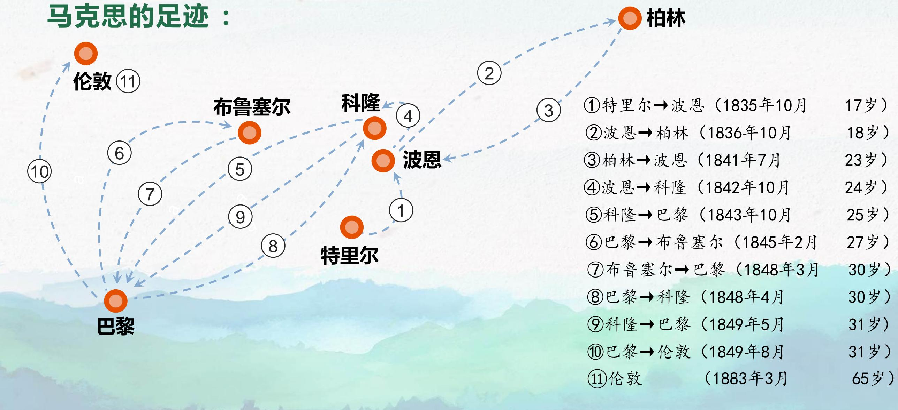
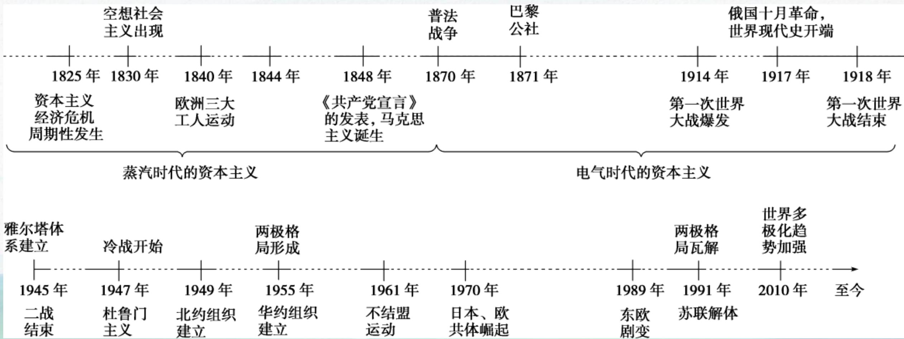
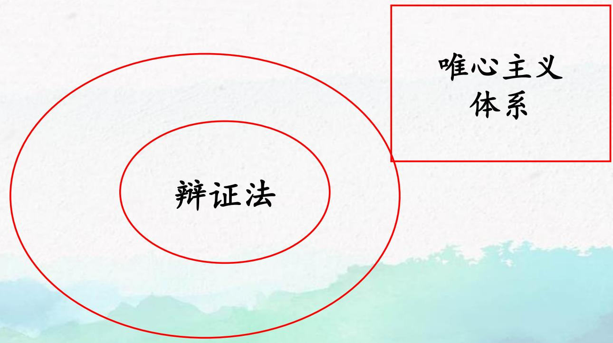
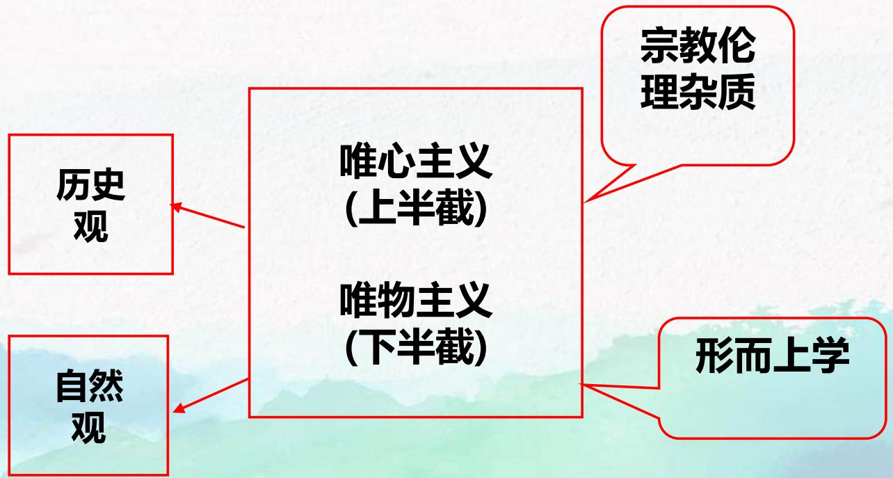
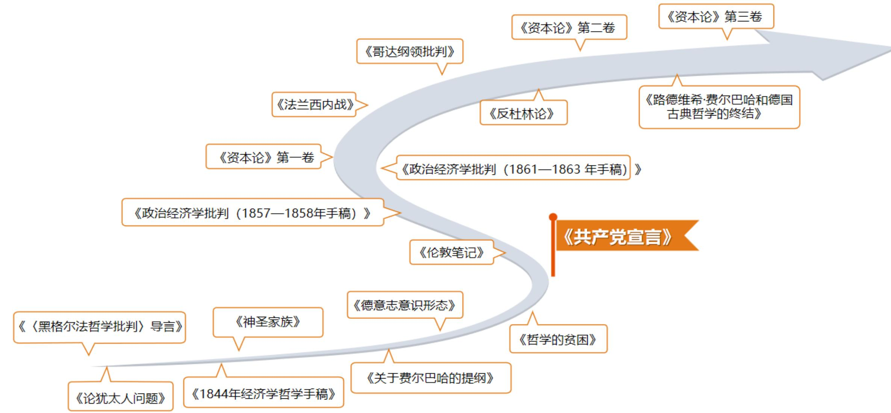
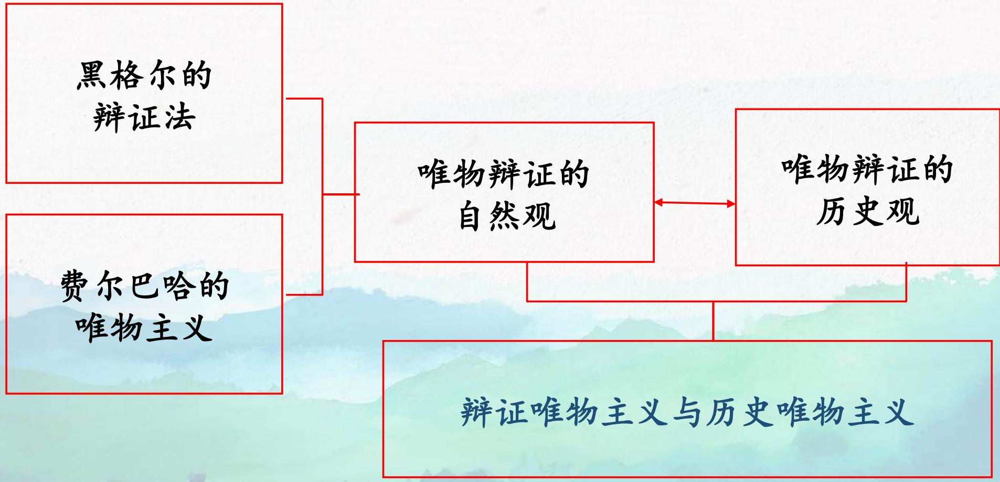

# 导论 马克思主义观

> [!abstract] 本章导览
> 导论是全课程的引论，回答两个总问题——**一、什么是马克思主义？二、为什么是马克思主义？** 围绕五节展开：
> 1. **什么是马克思主义**（狭义/广义、四维度、理论体系、基本原理）
> 2. **马克思主义的创立与发展**（社会根源/阶级基础/思想渊源/个人条件、《共产党宣言》、列宁主义、西方马克思主义、中国化）
> 3. **马克思主义的基本特征**（科学性、人民性、实践性、发展性 → 科学性与革命性的统一）
> 4. **马克思主义的当代价值**（认识工具、行动指南、科学真理）
> 5. **自觉学习和运用马克思主义**
>
> 后续辩证唯物主义世界观见 [[马原理-专题一_笔记]]。

---

## 第一节 什么是马克思主义

### 一、马克思与马克思主义的关系

> [!note] 三组关系（导论核心辨析）
> - **马克思**：个人。卡尔·海因里希·马克思（Karl Heinrich Marx，1818.5.5—1883.3.14），生于普鲁士莱茵省特利尔城，德国思想家、哲学家、政治经济学家、革命理论家、历史学家和社会学家。
> - **马克思主义**：由马克思、恩格斯共同创立、并由后继者不断发展的**科学理论体系**，并不等于马克思本人的全部言论。
> - **马克思主义基本原理**：是对马克思主义立场、观点、方法的集中概括，是经实践反复检验、具有**普遍真理性**的理论。

恩格斯曾尖锐批评学风浮躁、自诩"马克思主义"的人，并引马克思的话："**我只知道我自己不是马克思主义者**"，又转引海涅："我播下的是龙种，而收获的却是跳蚤。"（《马克思恩格斯选集》第4卷，第603页）——说明马克思主义是**严肃的方法与世界观**，而非贴标签的教条。1893年恩格斯也告诫俄国马克思主义者："不要生搬马克思和我的话，而是要根据自己的情况**像马克思那样去思考问题**。"

> [!example] 马克思生平速记
> - **职业**：新闻从业者（《莱茵报》撰稿、编辑）。
> - **经济状况**：贫困潦倒，主要靠继承和亲友（恩格斯）接济。
> - **家庭**：犹太血统、律师家庭，早年丧父、中年丧子。
> - **思想演进**：法律 → 法哲学 → 德国古典哲学 → 社会主义 → 政治经济学 → 历史社会。
> - **关键词**：黝黑、好斗、浪漫主义、犀利、批判到底。
> - **自白**：喜爱的格言"人所具有的我都具有"，喜爱的箴言"怀疑一切"，对幸福的理解"斗争"，喜爱的颜色"红色"。

### 二、为什么以"马克思"命名？

> [!question] 思考：马克思、恩格斯共同创立了马克思主义，为什么以马克思的名字命名？
> 恩格斯本人作出了回答：
> - "绝大部分基本指导思想（特别是在经济和历史领域内）……都是属于马克思的。我所提供的，马克思没有我也能够做到……**马克思比我们大家都站得高些，看得远些**……马克思是天才，我们至多是能手。没有马克思，我们的理论远不会是现在这个样子。所以，这个理论用他的名字命名是理所当然的。"
> - "我一生所做的……就是拉**第二小提琴**……我很高兴我有像马克思这样出色的**第一小提琴手**。"（《恩格斯致约翰·菲力浦·贝克尔》1884.10.15）
>
> 体现了恩格斯的谦逊与马克思的主导贡献。

### 三、西方社会与学者对马克思的评价

> [!example] 四次西方评选（说明马克思主义并未过时）
>
> | 时间 | 主办方/活动 | 结果 |
> |---|---|---|
> | 1999 | 英国 BBC "千年思想家"网上评选 | 马克思**高居榜首**（高于爱因斯坦、牛顿、达尔文） |
> | 1999 | 英国路透社"千年风云人物" | 马克思以一分之差**名列第二**（第一爱因斯坦） |
> | 2005 | BBC《在我们这个时代》评选最伟大哲学家 | 马克思以 27.93% **荣登榜首**（第二休谟 12.6%） |
> | 2005 | 德国《图片报》+ 国家二台 | 马克思获评"**德国最伟大人物**" |

西方学者的评价同样耐人寻味：**德里达**（《马克思的幽灵》）主张"现在该维护马克思的幽灵们了"；**哈贝马斯**与马克思主义保持"肯定性的批评关系"；**吉登斯**（《第三条道路》）承认"社会主义和共产主义的幽灵仍然缠绕着我们"。**卢卡奇**则指出："正统马克思主义……仅仅是指**方法**。"

> [!summary] 这些评价说明什么？
> 1. 西方人对马克思和马克思主义有了进一步认识：其对资本主义本质的揭露和批判是科学的、能征服人心，**马克思主义并没有过时**。
> 2. 评选结果既彰显了马克思主义真理的力量，又表征当今时代仍然需要马克思主义。

### 四、马克思主义的定义：狭义与广义

> [!important] 狭义 vs 广义
> - **狭义**：马克思、恩格斯所创立的、并由他们自己叙说出来的基本理论、基本观点和理论体系，由**马克思主义哲学、马克思主义政治经济学、科学社会主义**三部分组成。
> - **广义**：由马克思和恩格斯创立、并为后继者不断发展的**科学理论体系**——是关于自然、社会和人类思维发展一般规律的学说；是关于社会主义必然代替资本主义、最终实现共产主义的学说；是关于无产阶级解放、全人类解放和每个人自由而全面发展的学说；是无产阶级政党和社会主义国家的指导思想。

**定义的四个维度**：①理论主体（马恩创立、后继者发展）；②阶级属性（无产阶级争取自身与全人类解放的科学理论）；③研究对象（无产阶级的科学世界观和方法论，自然/社会/思维一般规律）；④主要内容（哲学、政治经济学、科学社会主义三部分）。

### 五、马克思主义理论体系：三大组成部分

> [!note] 三大组成部分有机统一（理论的"整钢"）
>
> | 组成部分 | 在体系中的地位 | 核心作用 |
> |---|---|---|
> | **马克思主义哲学** | 理论的基础 | 科学的世界观和方法论，最根本的理论特征 |
> | **马克思主义政治经济学** | 理论的论证 | 揭示资本主义生产方式本质和剥削秘密，最深刻最全面的证明 |
> | **科学社会主义**（科学共产主义） | 理论的归宿 | 指明无产阶级彻底解放的历史条件和历史使命，最崇高的社会理想 |
>
> 三者**有机统一、不可分割**：哲学是理论基础，政治经济学是主要内容，科学社会主义是核心、纲领。**必须反对破坏、割裂和肢解马克思主义的错误做法**。正如列宁所说，它由三个部分组成，但同时又是一块"**整钢**"。

### 六、马克思主义基本原理

**马克思主义基本原理**是对马克思主义立场、观点、方法的集中概括，是在形成、发展和运用过程中经实践反复检验而确立的、具有普遍真理性的理论。它体现马克思主义的根本性质和整体特征，体现**科学性与革命性的统一**。

> [!summary] 立场·观点·方法
> - **基本立场**：以无产阶级解放和全人类解放为己任，以人的自由全面发展为目标，**以人民为中心**，一切为了人民、一切依靠人民。
> - **基本观点**：世界统一于物质、物质决定意识；事物矛盾运动规律；实践和认识辩证关系等关于自然、社会、思维发展一般规律的科学认识。
> - **基本方法**：建立在辩证唯物主义和历史唯物主义基础上——实事求是、辩证分析、社会基本矛盾和主要矛盾分析等方法。

> [!warning] 研究基本原理需把握的四条原则
> 1. **坚持与发展相统一**："老祖宗不能丢"，但又要讲"新话"（邓小平）。脱离基本原理不是马克思主义，不讲发展也不是马克思主义。
> 2. **理论结合实际**：着眼当前社会实践，既反对**教条主义**，又反对**实用主义**。
> 3. **整体与部分相统一**：三个部分又是"一块整钢"，应强调从整体意义上研究。
> 4. **科学性与意识形态性相统一**：哲学社会科学同样具有客观真理性。

---

## 第二节 马克思主义的创立与发展

> [!question] 资本主义的"时代之问"
> 马克思和恩格斯在 19 世纪中叶的欧洲遇到了什么时代问题？马克思主义产生于 **19 世纪 40 年代**自由竞争资本主义时代，更精确说产生于**机器大工业的社会化生产**新阶段。

下面这张历史时间轴，把马克思主义诞生置于资本主义两百年演进的坐标中，便于把握"创立背景"与"后续发展"的全局：

### 一、马克思主义创立的条件

> [!important] 创立的四大条件（高频考点）
>
> | 条件 | 核心内容 |
> |---|---|
> | **社会根源** | 资本主义生产方式既促进生产力大发展，又造成深重社会灾难（经济危机、两极分化） |
> | **阶级基础** | 无产阶级作为独立政治力量登上历史舞台，三大工人运动 |
> | **思想渊源** | 德国古典哲学、英国古典政治经济学、英法空想社会主义（三大直接来源）+ 自然科学三大发现 |
> | **个人条件** | 马克思、恩格斯的天才、勤奋、革命实践与崇高品格 |

#### （1）社会根源

**① 资本主义生产方式促进生产力大发展。** 工业革命（工具：珍妮纺纱机；动力：蒸汽机）极大提高劳动生产率。《共产党宣言》名言："资产阶级在它不到一百年的阶级统治中所创造的生产力，比过去一切世代创造的全部生产力还要多，还要大。"

**② 资本主义生产方式造成深重社会灾难。** 一是**周期性经济危机频繁爆发**，二是**社会两极分化、工人生活困苦**（恶劣的工作条件、被压榨的童工）。

> [!example] 19 世纪英国及欧美周期性经济危机
>
> | 时间 | 危机概况 |
> |---|---|
> | 1825 年 | 英国第一次全国性经济危机 |
> | 1836—1843 年 | 银行业收缩，工业需求萎缩，企业亏损破产 |
> | 1847—1850 年 | 始于铁路危机，波及英法美，造成工业危机 |
> | 1857—1858 年 | 棉产品价格上涨，银行破产，波及其他工业 |
> | 1867—1868 年 | 铁路、造船业等工业生产下降，粮食再次歉收 |

**③ 无产阶级反对资产阶级的斗争日趋激化**，对科学理论指导提出强烈需求。1830 年法国七月革命、1832 年英国议会改革后，资产阶级战胜封建势力，工人阶级与资产阶级的矛盾上升为**首要矛盾**。

#### （2）阶级基础：三大工人运动

工人阶级斗争经历了**捣毁机器 → 经济斗争 → 政治斗争 → 联合行动 → 武装起义**的发展过程，现代无产阶级作为独立政治力量登上历史舞台。

> [!important] 欧洲三大工人运动（标志无产阶级独立登场）
>
> | 工人运动 | 时间 | 地点 |
> |---|---|---|
> | 法国里昂工人起义 | 1831 年、1834 年 | 法国里昂 |
> | "宪章运动"（争取政治权利） | 1836 年起 | 英国 |
> | 西里西亚工人起义 | 1844 年 | 德国 |

> [!question] 讨论：欧洲三大工人运动有何历史意义？失败的教训是什么？
> - **意义**：标志无产阶级作为独立政治力量登上历史舞台，无产阶级与资产阶级的矛盾上升为社会主要矛盾。
> - **教训**：缺乏**科学理论**指导。无产阶级迫切需要总结、升华自身斗争经验，形成**科学的革命理论**——这正是马克思主义产生的直接现实需要。

#### （3）思想渊源

> [!note] 三大直接理论来源 + 自然科学前提
>
> | 来源 | 代表人物 | 马恩批判吸收的内容 |
> |---|---|---|
> | **德国古典哲学** | 黑格尔、费尔巴哈 | 黑格尔辩证法的"合理内核" + 费尔巴哈唯物论的"基本内核" |
> | **英国古典政治经济学** | 亚当·斯密、大卫·李嘉图 | 劳动价值论 → 创立剩余价值理论 |
> | **英法空想社会主义** | 圣西门、傅立叶、欧文 | 对资本主义的批判、对未来新社会的展望 |
>
> 更广泛来源：古希腊罗马哲学、文艺复兴思想成果、法国复辟时期历史学家的进步思想等。

**德国古典哲学**是直接理论来源。黑格尔哲学的体系是唯心主义的，但具有丰富的辩证法思想（"合理内核"），其保守体系却"闷死了革命的辩证法"：

费尔巴哈哲学是唯物主义的，但不彻底——具有形而上学性质，且在历史观上仍是唯心主义：

> [!example] 空想社会主义者的名言
> - 圣西门："现代社会是黑白颠倒的社会""经济上的无政府状态是一切灾难中最严重的灾难"。
> - 欧文："私有制使人变成魔鬼，使世界变成地狱。"
> - 傅立叶："文明制度是社会地狱。"
> - 未来理想社会构想："实业制度"（圣西门）、"和谐制度/新和谐公社"（傅立叶/欧文）。

> [!note] 自然科学三大发现（自然科学前提）
>
> | 发现 | 提出者 | 时间 |
> |---|---|---|
> | 细胞学说 | 施莱登、施旺 | 1839 年 |
> | 能量守恒和转化定律 | 焦耳等 | 1837、1841 年 |
> | 生物进化论 | 达尔文 | 1859 年 |
>
> 三大发现揭示了自然界的**联系与发展**，为辩证唯物主义自然观提供了科学基础。

#### （4）个人主观条件

马克思（律师家庭、博士学位、《莱茵报》编辑，为穷苦农民辩护）与恩格斯（工厂主家庭、自学成才、在英国深入考察工人阶级状况）都将渊博学识与**革命实践**相结合，具备创立科学理论的主客观条件。

### 二、马克思主义产生的标志：《共产党宣言》

> [!important] 《共产党宣言》（1848）
> - 1848 年 2 月 21 日在伦敦以单行本问世，2 月 24 日正式出版；又译《共产主义宣言》。
> - 它的发表**标志着马克思主义的正式诞生**。
> - 1920 年由**陈望道**（1891—1977）首次译出中文全译本——《共产党宣言》翻译成中文的第一人。目前已译为 200 多种文字。

下图把通向《共产党宣言》的著作脉络及其后续发展串成一条线，便于把握马恩理论的演进：

### 三、马克思主义的发展

> [!summary] 发展脉络（四个阶段）
> 1. **马恩自身的发展**：马克思、恩格斯在世时从未停止丰富和发展自己的理论（如《反杜林论》《家庭、私有制和国家的起源》）。
> 2. **列宁主义**：19 世纪末 20 世纪初资本主义由自由竞争向**垄断（帝国主义）**过渡。列宁在帝国主义经济政治发展不平衡条件下，提出"**一国或数国首先胜利**"理论，领导十月社会主义革命，使科学社会主义由理论变为现实。**列宁主义是帝国主义和无产阶级革命时代的马克思主义**。
> 3. **西方马克思主义**：一战后欧洲先进地区无产阶级革命失败的产物。1923 年卢卡奇《历史与阶级意识》、柯尔施《马克思主义和哲学》及稍后葛兰西《狱中札记》共同标志其形成。主题：批判资本主义，反思、批评、重释马克思主义。
> 4. **马克思主义中国化时代化**：通过"两个结合"不断丰富发展。

> [!note] 马克思主义中国化时代化——"两个结合"
> 马克思主义基本原理同**中国具体实际**相结合、同**中华优秀传统文化**相结合，形成系列理论成果：
> - **毛泽东思想** → **邓小平理论** → **"三个代表"重要思想** → **科学发展观** → **习近平新时代中国特色社会主义思想**（当代中国马克思主义、二十一世纪马克思主义）。

---

## 第三节 马克思主义的基本特征

> [!important] 四大基本特征（核心考点）
>
> | 特征 | 一句话把握 | 关键论断 |
> |---|---|---|
> | **科学性** | 对自然、社会、思维发展本质和规律的正确反映 | 实现了辩证唯物主义与历史唯物主义的统一 |
> | **人民性** | 人民至上，来自人民、为了人民、造福人民 | 人民性以**阶级性**为深刻基础，是无产阶级先进性的体现 |
> | **实践性** | 不仅"解释世界"，更要"改变世界" | **实践性是马克思主义最根本的特征** |
> | **发展性** | 与时俱进、开放的理论体系 | 永葆"美妙之青春" |
>
> **一句话概括四大特征：科学性与革命性的统一。**

### （一）科学性——科学的理论

马克思主义是对自然、社会和人类思维发展本质和规律的**正确反映**，以事实为依据、以规律为对象、以实践为检验标准。其科学性的重要体现是具有科学的世界观和方法论基础——**辩证唯物主义和历史唯物主义**：

> [!quote] 邓小平论科学性
> "我坚信，世界上赞成马克思主义的人会多起来的，因为**马克思主义是科学**。""马克思主义是打不倒的……是因为马克思主义的真理颠扑不破。"（《邓小平文选》）

### （二）人民性——人民的理论

**人民性是马克思主义的本质属性，人民至上是马克思主义的政治立场。** 马克思主义植根人民，是来自人民、为了人民、造福人民的理论。其人民性以**阶级性**为深刻基础，是无产阶级先进性的体现：无产阶级解放和全人类解放完全一致——无产阶级只有解放全人类，才能最终解放自己。

### （三）实践性——实践的理论

> [!quote] 改变世界
> "哲学家们只是用不同的方式**解释世界**，而问题在于**改变世界**。"（《关于费尔巴哈的提纲》，《马克思恩格斯选集》第1卷，第140页）

马克思主义是从实践中来、到实践中去、在实践中接受检验、随实践不断发展的学说。**实践观点是马克思主义首要的和基本的观点**，贯穿全部思想内容。

> [!warning] 实践性是马克思主义的最根本特征
> 包含三层：①实践观点的**基础与核心**作用；②是经过实践检验、随实践发展的科学真理；③强调其**改造世界**的实践功能。世界社会主义运动本身就是马克思主义的实践形态。

### （四）发展性——发展的理论

马克思主义是不断发展的学说，具有**与时俱进**的理论品质；其理论体系是**开放**的，不断吸取人类最新文明成果。习近平："一部马克思主义发展史就是……不断根据时代、实践、认识发展而发展的历史……因此，马克思主义能够永葆其美妙之青春。"

> [!note] 马克思主义中国化的三次飞跃（发展性的中国例证）
> 1. **第一次飞跃**：**毛泽东思想**——马列主义在中国的创造性运用和发展，关于中国革命和建设的正确理论原则与经验总结。
> 2. **新的飞跃**：**中国特色社会主义理论体系**——从真理标准大讨论出发，科学回答建设中国特色社会主义一系列基本问题。
> 3. **新的飞跃**：**习近平新时代中国特色社会主义思想**——当代中国马克思主义、二十一世纪马克思主义、中华文化和中国精神的时代精华。

---

## 第四节 马克思主义的当代价值

> [!question] "过时论"三种质疑及回应
> 社会主义运动低潮时期，马克思主义受到质疑：
> - 有人说它"**过时**"了（170 多年前的理论）；
> - 有人说它"**无用**"了（资本主义基本矛盾已缓和）；
> - 有人说它"**失灵**"了（无法应对信息革命）。
>
> **回应**：从世界社会主义 500 年大视野看，我们依然处在马克思主义所指明的历史时代。2008 年国际金融危机、2011 年"占领华尔街"、贫富差距、生态恶化、恐怖主义、2022 年乌克兰危机等，恰恰印证"资本主义向何处去？人类社会向何处去？"仍需马克思主义解答。

> [!important] 当代价值三重维度
>
> | 维度 | 内涵 |
> |---|---|
> | **观察当代世界变化的认识工具** | 给予宏大视野、锐利目光、长远眼光和战略定力 |
> | **指引当代中国发展的行动指南** | 是精神旗帜、精神动力、行动指南；是我们的"看家本领" |
> | **引领人类社会进步的科学真理** | 世界仍处于从资本主义走向社会主义的大时代 |

习近平："马克思给我们留下的最有价值、最具影响力的精神财富，就是以他名字命名的科学理论——马克思主义。这一理论犹如壮丽的日出，照亮了人类探索历史规律和寻求自身解放的道路。""中国共产党为什么能，中国特色社会主义为什么好，归根到底是因为**马克思主义行**！"

---

## 第五节 自觉学习和运用马克思主义

> [!summary] 怎样学、学什么、如何用
> 1. **努力学习和掌握马克思主义的基本立场、观点、方法**——这是最根本的，具有穿越时空的普遍意义和永恒价值（经典作家个别提法可能过时，但立场观点方法不过时）。
> 2. **努力学习和掌握马克思主义中国化的理论成果**，特别是习近平新时代中国特色社会主义思想。
> 3. **坚持理论联系实际的马克思主义学风**——既联系我国社会和新时代实际，又联系自身实际，改造主观世界。
> 4. **自觉将马克思主义内化于心、外化于行**——内化为信念、外化为行动，"扣好人生第一粒扣子"。

---

## 本章小结

> [!summary] 一图把握导论
> - **是什么**：马克思主义 = 哲学（基础）+ 政治经济学（论证）+ 科学社会主义（归宿），三位一体的"整钢"。
> - **为什么产生**：社会根源（资本主义双重后果）+ 阶级基础（三大工人运动）+ 思想渊源（三大直接来源 + 自然科学三大发现）+ 个人条件 → 《共产党宣言》（1848）为诞生标志。
> - **怎样发展**：马恩自身发展 → 列宁主义 → 西方马克思主义 → 中国化时代化（"两个结合"、三次飞跃）。
> - **有何特征**：科学性、人民性、实践性（最根本）、发展性 → 归结为**科学性与革命性的统一**。
> - **何种价值**：认识工具、行动指南、科学真理。

---

## 自测题

> [!question] 思考题（课件原题）
> 1. 什么是马克思主义？马克思主义产生的时代背景、阶级基础、思想来源？具有哪些基本特征？
> 2. 1999 年，由英国剑桥大学文理学院的教授们发起，就"谁是人类纪元第二个千年第一思想家"进行了校内征询和推选。投票结果是：马克思第一，爱因斯坦第二。随后，英国广播公司以同一问题在全球互联网上公开征询。一个月下来，汇集全球投票结果，仍然是马克思第一，爱因斯坦第二，牛顿和达尔文分别位列第三和第四。这些评选结果对你有何触动和启发？请详细了解评选情况，从与其他上榜思想家的比较中深入认识马克思。
> 3. 恩格斯指出："马克思的整个世界观不是教义，而是方法。它提供的不是现成的教条，而是进一步研究的出发点和供这种研究使用的方法。"恩格斯还指出，我们的理论"是一种历史的产物，它在不同的时代具有完全不同的形式，同时具有完全不同的内容"。请结合这一论断，谈谈坚持和发展马克思主义应该秉持什么样的态度。
> 4. 阅读一篇马克思主义经典论著，并谈谈你的阅读感受和收获。

> [!success]- 答题要点提示
> - **第1题**：参见本篇第一、二、三节——背景（19世纪40年代自由竞争资本主义、经济危机与两极分化）、阶级基础（三大工人运动）、思想来源（德国古典哲学/英国古典政治经济学/英法空想社会主义 + 自然科学三大发现）、四大基本特征（科学性/人民性/实践性/发展性 → 科学性与革命性统一）。
> - **第2题**：结合四次西方评选与德里达、哈贝马斯、吉登斯等学者评价，说明马克思主义真理的力量并未过时，时代仍需要马克思主义。
> - **第3题**：抓住"世界观不是教义而是方法""历史的产物"——坚持"坚持与发展相统一"原则，"老祖宗不能丢"又要讲"新话"，反对教条主义与实用主义。
> - **第4题**：可选《共产党宣言》《在马克思墓前的讲话》等（见阅读文献），结合文本谈感受。

> [!example] 阅读文献
> 1. 马克思、恩格斯：《共产党宣言》，《马克思恩格斯选集》第一卷。
> 2. 恩格斯：《在马克思墓前的讲话》，《马克思恩格斯选集》第三卷。
> 3. 列宁：《马克思主义的三个来源和三个组成部分》，《列宁选集》第二卷。
> 4. 毛泽东：《改造我们的学习》，《毛泽东选集》第三卷。
> 5. 习近平：《在纪念马克思诞辰 200 周年大会上的讲话》（2018）。
> 6. 习近平：《在庆祝中国共产党成立 100 周年大会上的讲话》（2021）。

---

## 相关章节

- 下一章：[[马原理-专题一_笔记]]（世界的物质性及发展规律——辩证唯物主义世界观）
